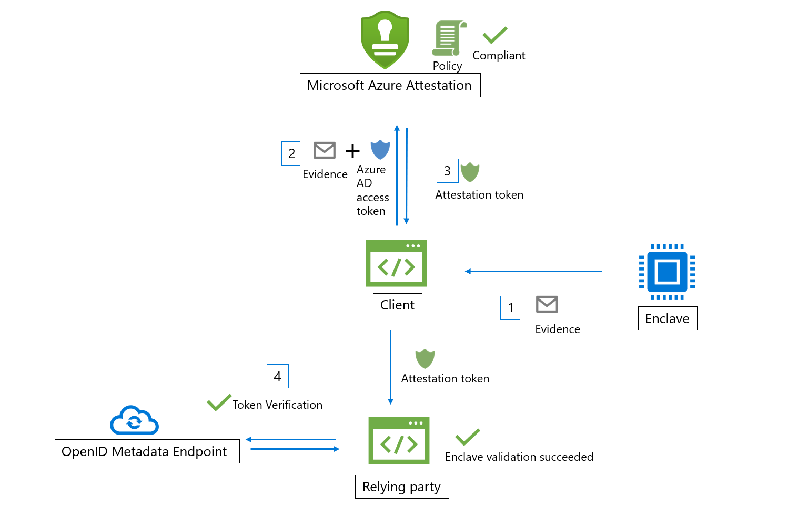
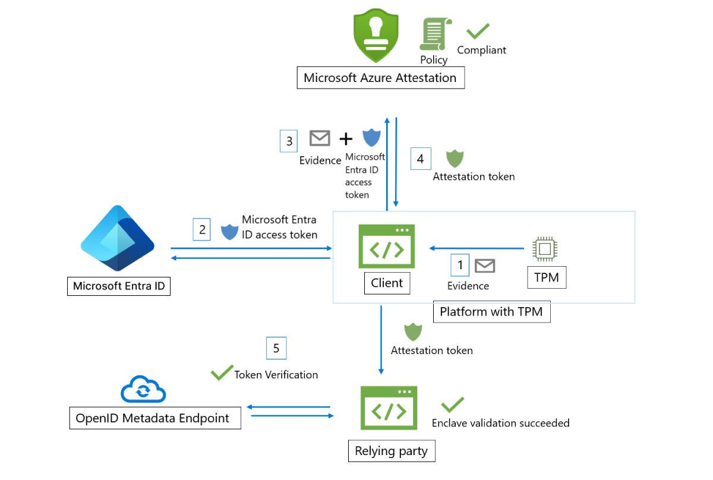

# Workflow

Microsoft Azure Attestation receives evidence from enclaves and evaluates the evidence against Azure security baseline and configurable policies. Upon successful verification, Azure Attestation generates an attestation token to confirm trustworthiness of the enclave.

The following actors are involved in an Azure Attestation work flow:

- **Relying party**: The component that relies on Azure Attestation to verify enclave validity. 
- **Client**: The component that collects information from an enclave and sends requests to Azure Attestation. 
- **Azure Attestation**: The component that accepts enclave evidence from client, validates it and returns attestation token to the client

## Intel® Software Guard Extensions (SGX) enclave validation work flow

Here are the general steps in a typical SGX enclave attestation workflow (using Azure Attestation):

1. Client collects evidence from an enclave. Evidence is information about the enclave environment and the client library running inside the enclave
1. The client has an URI that refers to an instance of Azure Attestation. The client sends evidence to Azure Attestation. Exact information submitted to the provider depends on the enclave type
1. Azure Attestation validates the submitted information and evaluates it against a configured policy. If the verification succeeds, Azure Attestation issues an attestation token and returns it to the client. If this step fails, Azure Attestation reports an error to the client
1. The client sends the attestation token to relying party. The relying party calls public key metadata endpoint of Azure Attestation to retrieve signing certificates. The relying party then verifies the signature of the attestation token and ensures the enclave trustworthiness

> [!Note]
> When you send attestation requests in the [2018-09-01-preview](https://github.com/Azure/azure-rest-api-specs/tree/master/specification/attestation/data-plane/Microsoft.Attestation/stable/2018-09-01-preview) API version, the client needs to send evidence to Azure Attestation along with the Microsoft Entra access token.

## Trusted Platform Module (TPM) enclave validation work flow

Here are the general steps in a typical TPM enclave attestation workflow (using Azure Attestation):

1.	On device/platform boot, various boot loaders and boot services measure events backed by TPM and securely store them as TCG logs. Client collects the TCG logs from the device and TPM quote, which acts evidence for attestation.
2.	The client authenticates to Microsoft Entra ID and obtains an access token.
3.	The client has an URI, which refers to an instance of Azure Attestation. The client sends the evidence and the Microsoft Entra access token to Azure Attestation. Exact information submitted to the provider depends on the platform.
4.	Azure Attestation validates the submitted information and evaluates it against a configured policy. If the verification succeeds, Azure Attestation issues an attestation token and returns it to the client. If this step fails, Azure Attestation reports an error to the client. The communication between the client and attestation service is dictated by the Azure attestation TPM protocol.
5.	The client then sends the attestation token to relying party. The relying party calls public key metadata endpoint of Azure Attestation to retrieve signing certificates. The relying party then verifies the signature of the attestation token and ensures the platform's trustworthiness.

## Next steps
- [How to author and sign an attestation policy](author-sign-policy.md)
- [Set up Azure Attestation using PowerShell](quickstart-powershell.md)
