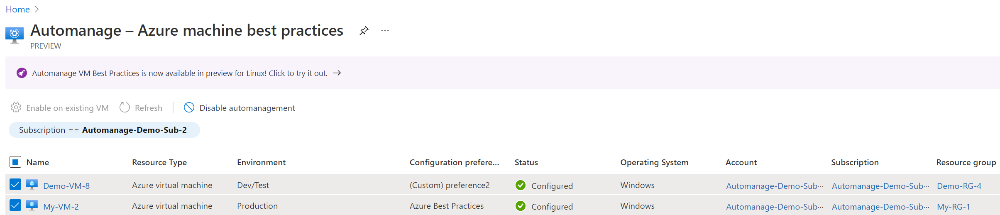
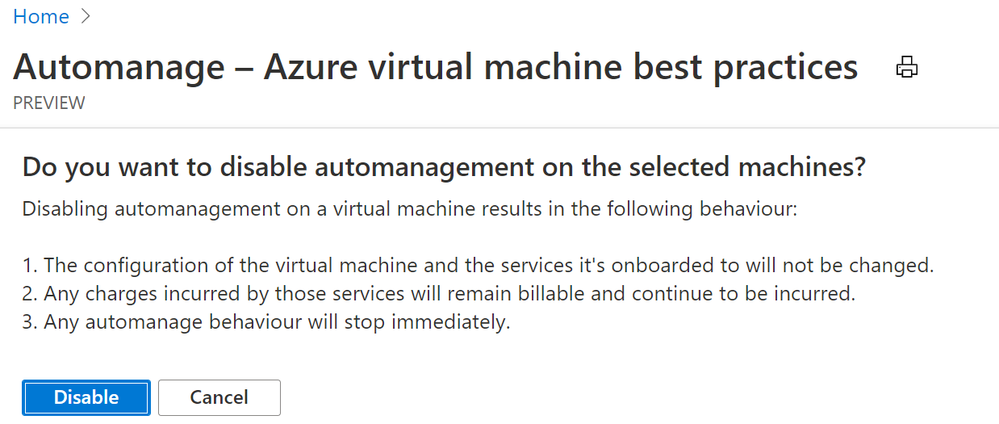

# Disabling Automanage for VMs

> [!CAUTION]
> On September 30, 2027, the Azure Automanage Best Practices service will be retired. As a result, attempting to create a new configuration profile or onboarding a new subscription to the service will result in an error. Learn more [here](https://aka.ms/automanagemigration/) about how to migrate to Azure Policy before that date. 

> [!CAUTION]
> Starting February 1st 2025, Azure Automanage will begin rolling out changes to halt support and enforcement for all services dependent on the deprecated Microsoft Monitoring Agent (MMA). To continue using Change Tracking and Management, VM Insights, Update Management, and Azure Automation, [migrate to the new Azure Monitor Agent (AMA)](https://aka.ms/mma-to-ama/).

You may decide one day to disable Automanage on certain VMs. For instance, your machine is running some super sensitive secure workload and you need to lock it down even further than Azure would have done naturally, so you need to configure the machine outside of Azure best practices.

## How to disable Automanage through the Azure portal

To do that in the Azure portal, go to the **Automanage – Azure machine best practices** page that lists all of your auto-managed VMs. Select the checkbox next to the virtual machine you want to disable from Automanage, then click on the **Disable automanagement** button.

Read carefully through the messaging in the resulting pop-up before agreeing to **Disable**.

> [!NOTE]
> Disabling automanagement in a VM results in the following behavior:
>
> - The configuration of the VM and the services it is onboarded to don't change.
> - Any charges incurred by those services remain billable and continue to be incurred.
> - Automanage drift monitoring immediately stops.

First and foremost, we will not off-board the virtual machine from any of the services that we onboarded it to and configured. So any charges incurred by those services will continue to remain billable. You will need to off-board if necessary. Any Automanage behavior will stop immediately. For example, we will no longer monitor the VM for drift.

## Next steps

Get the most frequently asked questions answered in our FAQ.

> [!div class="nextstepaction"]
> [Frequently Asked Questions](faq.yml)
