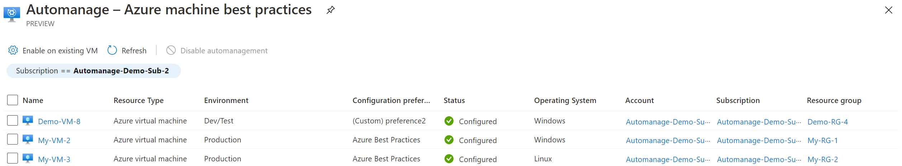

# Automanage machine statuses

In the Azure portal, go to the **Automanage machine best practices** page which lists all of your automanage machines. Here you will see the overall status of each machine.

For each listed machine, the following details are displayed: Name, Configuration profile, Status, Resource type, Resource group, Subscription.

## States of an Automanaged machine

The **Status** column can display the following states:
- *In progress* - the VM is being configured
- *Conformant* - the VM is configured and no drift is detected
- *Not conformant* - the VM has drifted and Automanage was unable to correct one or more services to the assigned configuration profile 
- *Needs upgrade* - the VM is onboarded to an earlier version of Automanage and needs to be [upgraded](automanage-upgrade.md) to the latest version
- *Action required* - the Automanage service is unable to determine the desired configuration of the machine. This is usually because the VM agent is not installed or the machine is not running. It can also indicate that the Automanage service does not have the necessary permissions that it needs to determine the desired configuration
- *Error* - the Automanage service encountered an error while attempting to determine if the machine conforms with the desired configuration

If you see the **Status** as *Not conformant* or *Error*, you can troubleshoot by clicking on the status in the portal and using the troubleshooting links provided

## Next steps

In this article, you learned that Automanage for machines provides a means for which you can eliminate the need for you to know of, onboard to, and configure best practices Azure services. In addition, if a machine you onboarded to Automanage for virtual machines drifts from the configuration profile, we will automatically bring it back into compliance.

Try enabling Automanage for Azure virtual machines or Arc-enabled servers in the Azure portal.

> [!div class="nextstepaction"]
> [Enable Automanage for virtual machines in the Azure portal](quick-create-virtual-machines-portal.md)