<properties urlDisplayName="Get Started with Azure Automation" pageTitle="Get Started with Azure Automation" metaKeywords="" description="Learn how to import and run an automation job in Azure." metaCanonical="" services="automation" documentationCenter="" title="Get Started with Azure Automation" authors="bwren" solutions="" manager="stevenka" editor="" />

<tags ms.service="automation" ms.workload="tbd" ms.tgt_pltfrm="na" ms.devlang="na" ms.topic="article" ms.date="01/01/1900" ms.author="bwren" />

# Get started with Azure Automation

Microsoft Azure Automation provides a way for developers to automate the manual, long-running, error-prone, and frequently repeated tasks that are commonly performed in a cloud environment. You can create, monitor, manage, and deploy resources in your Azure environment using runbooks, which under the hood are Windows PowerShell workflows. To learn more about Automation, see the [Automation Overview Guide](http://go.microsoft.com/fwlink/p/?LinkId=392861). 

This tutorial walks you through the steps to import a sample "Hello World" runbook into Azure Automation, execute the runbook, and then view its output.

>[WACOM.NOTE] To learn how to automate Azure operations using the [Azure PowerShell cmdlets](http://msdn.microsoft.com/en-us/library/jj156055.aspx) see <a href="http://azure.microsoft.com/blog/2014/08/27/azure-automation-authenticating-to-azure-using-azure-active-directory/">Azure Automation: Authenticating to Azure using Azure Active Directory</a>.

## Samples and utility runbooks

The Azure Automation team has created a number of runbook samples to help you get started with Automation.  These samples cover basic Automation concepts and are intended to help you learn how to write your own runbooks.  

The Automation team has also created utility runbooks that you can use as building blocks for larger Automation tasks.  

>[WACOM.NOTE] It's a best practice to write small, modular, reusable runbooks. We also strongly recommend that you create your own utility runbooks for commonly used scenarios after you're familiar with Automation.  

You can view and download the Automation team’s sample and utility runbooks on [Script Center](http://go.microsoft.com/fwlink/p/?LinkId=393029) or import them directly from the [Runbook Gallery](http://aka.ms/runbookgallery). 

## The Automation community and feedback

Runbooks from the community and from other Microsoft teams are also published on  [Script Center](http://go.microsoft.com/fwlink/?LinkID=391681) and the [Runbook Gallery](http://aka.ms/runbookgallery). 

<strong>Give us feedback!</strong>  If you are looking for an Automation runbook solution or integration module, post a Script Request on the Script Center. If you have an idea for a new feature for Automation, post it on [User Voice](http://feedback.windowsazure.com/forums/34192--general-feedback).

[WACOM.INCLUDE [create-account-note](../includes/create-account-note.md)]

## High-level steps for this tutorial

1. [Sign up for Automation preview](#automationaccount)
2. [Import Runbook from Runbook Gallery](#importrunbook)
3. [Publish Runbook](#publishrunbook)
4. [Start Runbook](#startrunbook)

## Sign up for the Azure Automation Preview

To start using Automation, you’ll need an active Azure subscription with the Microsoft Azure Automation preview feature enabled. 

- On the **Preview Features** page, click **try it now**. 

	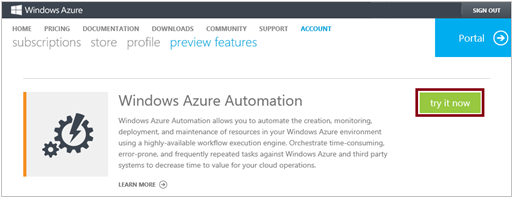

## Create an Automation Account

1.	Log in to the [Azure Management Portal](http://manage.windowsazure.com).

2.	In the Management Portal, click **Create an Automation Account**.

	>[WACOM.NOTE] If you’ve already created an automation account, you can skip to step 4.

	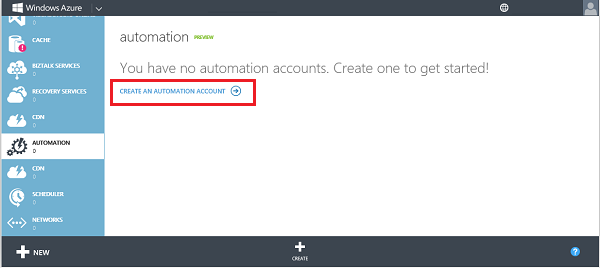

3.	On the **Add a New Automation Account** page, enter a name for the account, and then click the check mark.

	

## Import Runbook from Runbook Gallery
 
4.	On the **Automation** page, click the new account you just created.
 
	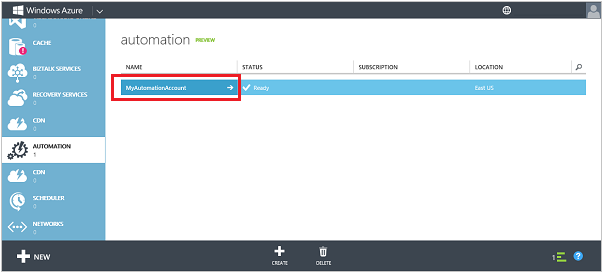

5.	Click **RUNBOOKS**.

	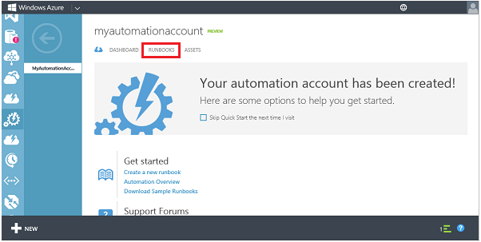
  
6.	Click **New** > **Runbook** > **From Gallery**.

	

7.  Select the **Tutorial** category and then **Hello World for Azure Automation**. Click the right arrow button.

	

8.  Review the contents of the runbook and then click the right arrow button.

	

8.	Review the details of the runbook and then click the check mark button.

	

## Publish Runbook 

9.	When the runbook has finished importing, click **Write-HelloWorld**.

	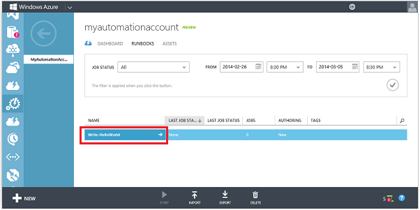

9.	Click **AUTHOR**, and then click **DRAFT**.  

	You can modify the contents of a runbook in Draft mode. For this runbook, you don’t need to make any modifications.

	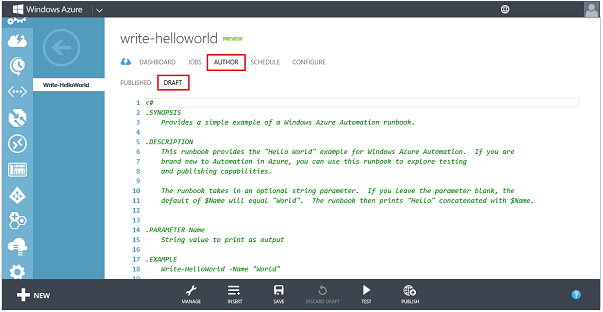  
 
10.	Click **PUBLISH** to promote the runbook so it's ready for production use.

	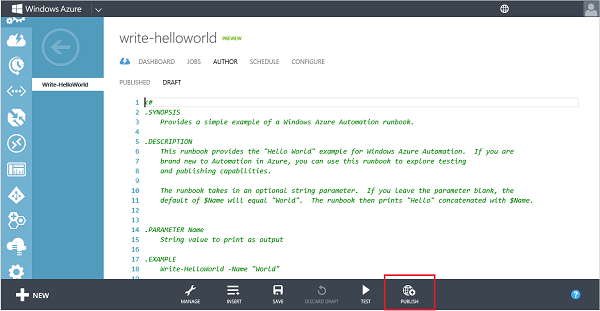
   
11.	When you are prompted to save and publish the runbook, click **Yes**.
 
	

## Start Runbook

12.	With the **Write-HelloWorld** runbook open, click **START**.

	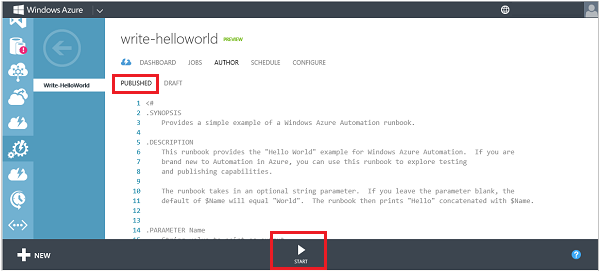
 
13.	On the **Specify the runbook parameter values** page, type a **Name** that will be used as an input parameter for the Write-HelloWorld.ps1 script, and then click the check mark.

	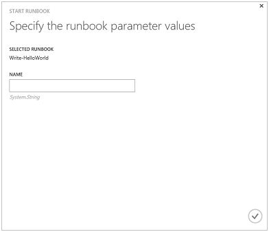
  
14.	Click **JOBS** to check the status of the runbook job you just started, and then click the timestamp in the **JOB START** column to view the job summary.

	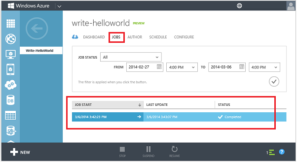

15.	On the **SUMMARY** page you can see the summary, input parameters, and output of the job.
 
	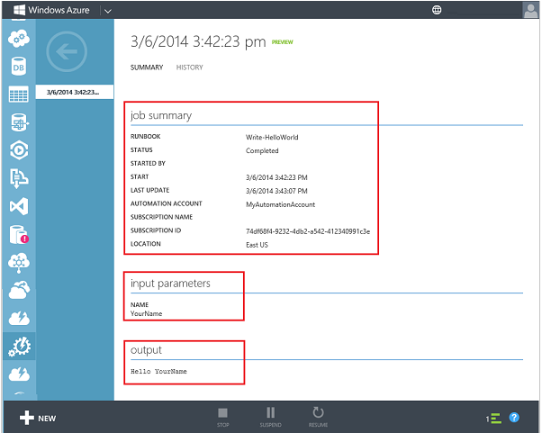

# Managing Azure Services from a Runbook 
The example above shows a simple runbook that does not manage Azure services. The [Azure cmdlets](http://msdn.microsoft.com/en-us/library/jj156055.aspx) require authentication to Azure. You can follow the instructions at [Azure Automation: Authenticating to Azure using Azure Active Directory](http://azure.microsoft.com/blog/2014/08/27/azure-automation-authenticating-to-azure-using-azure-active-directory/) in order to configure your Azure subscription for management through Azure Automation.

# See Also

- [Automation Overview](http://go.microsoft.com/fwlink/p/?LinkId=392860)
- [Runbook Authoring Guide](http://go.microsoft.com/fwlink/p/?LinkID=301740)
- [Automation Forum](http://go.microsoft.com/fwlink/p/?LinkId=390561)
- [Azure Automation: Authenticating to Azure using Azure Active Directory](http://azure.microsoft.com/blog/2014/08/27/azure-automation-authenticating-to-azure-using-azure-active-directory/)
