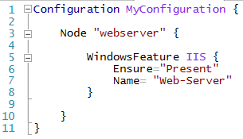

<properties 
   pageTitle="Azure Automation DSC Overview" 
   description="Azure Automation DSC Overview" 
   services="automation" 
   documentationCenter="dev-center-name" 
   authors="coreyp-at-msft" 
   manager="stevenka" 
   editor="tysonn"/>

<tags
   ms.service="automation"
   ms.devlang="NA"
   ms.topic="article"
   ms.tgt_pltfrm="powershell"
   ms.workload="TBD" 
   ms.date="05/04/2015"
   ms.author="coreyp"/>

# Azure Automation DSC Overview #

>[AZURE.IMPORTANT] **Azure Automation DSC is currently in limited preview**, and is not supported for production workloads. It is only cmdlet-based for now, and has no graphical user interface. By signing up for Azure Automation DSC’s preview, you acknowledge that this feature is in Preview and subject to reduced or different service terms, as set forth in the service agreement, and that you agree to the preview supplemental terms. While the service is currently free to use, pricing will be introduced in the future.

## What is PowerShell DSC? ##
Desired State Configuration (DSC) is a new management platform in Windows PowerShell that enables management of configuration for physical hosts and virtual machines using a declarative PowerShell syntax.

DSC provides a set of Windows PowerShell language extensions, new Windows PowerShell cmdlets, and resources that you can use to declaratively specify how you want your software environment to be configured. It also provides a means to maintain and manage existing configurations.

##What is Azure Automation DSC?##
Azure Automation DSC builds on top of the fundamentals introduced in PowerShell DSC to provide an even easier configuration management experience. Azure Automation DSC brings the same management layer to [PowerShell Desired State Configuration](https://technet.microsoft.com/library/dn249912.aspx) <link> as Azure Automation offers for PowerShell scripting today.

Azure Automation DSC allows you to [author and manage PowerShell Desired State Configurations](https://technet.microsoft.com/library/dn249918.aspx), import [DSC Resources](https://technet.microsoft.com/library/dn282125.aspx), and generate DSC Node Configurations (MOF documents), all in the cloud. These DSC items will be placed on the Azure Automation [DSC pull server](https://technet.microsoft.com/library/dn249913.aspx) so that target nodes (such as physical and virtual machines) in the cloud or on-premises can pick them up, automatically conform to the desired state they specify, and report back on their compliance with the desired state to Azure Automation.

For more details on PowerShell DSC, see: [Configuration in a DevOps world - Windows PowerShell Desired State Configuration](http://blogs.msdn.com/b/powershell/archive/2013/11/01/configuration-in-a-devops-world-windows-powershell-desired-state-configuration.aspx)

### Practical applications ###
Following are some example scenarios where you can use built-in DSC resources to configure and manage a set of computers (also known as target nodes) in an automated way:

- Enabling or disabling server roles and features
- Managing registry settings
- Managing files and directories
- Starting, stopping, and managing processes and services
- Managing groups and user accounts
- Deploying new software
- Managing environment variables
- Running Windows PowerShell scripts
- Fixing a configuration that has drifted away from the desired state
- Discovering the actual configuration state on a given node

In addition, you can create custom resources to configure the state of any application or system setting.

## Azure Automation DSC Terms ##
### Configuration ###
PS DSC introduced a new concept called configurations. Configurations allow you to define, via PowerShell syntax, the desired state of your environment. To use DSC to configure your environment, first define a Windows PowerShell script block using the configuration keyword, then follow it with an identifier, then with braces ({}) to delimit the block.

Inside the configuration block you can define node configuration blocks that specify the desired configuration for a set of nodes (computers) in your environment that should be configured exactly the same. In this way, a node configuration represents a “role” for one or more nodes to assume. A node configuration block starts with the node keyword. Follow this keyword with the name of the role, which can be a variable. After the computer name, use braces {} to delimit the node configuration block.

 
Inside the node configuration block, you can define resource blocks to configure specific DSC resources. A resource block starts with the name of the resource, followed by the identifier you want to specify for that block, then braces {} to delimit the block.

For more detailed information about the configuration keyword, see: [Understanding Configuration Keyword in Desired State Configuration](http://blogs.msdn.com/b/powershell/archive/2013/11/05/understanding-configuration-keyword-in-desired-state-configuration.aspx "Understanding Configuration Keyword in Desired State Configuration")

Running (compiling) a DSC configuration will produce one or more DSC node configurations (MOF documents), which are what DSC nodes apply to comply with desired state.

Azure Automation DSC allows you to import, author, and compile DSC configurations in Azure Automation, similar to how runbooks can be imported, authored, and started in Azure Automation.

Azure Automation DSC currently provides the following cmdlets in the **Azure Resource Manager PowerShell module** for management of DSC configurations:

- `Get-AzureAutomationDscConfiguration`
- `Import-AzureAutomationDscConfiguration`

>[AZURE.IMPORTANT] A configuration should contain only one configuration block, with the same name as the configuration, in Azure Automation DSC. 

####Script example####
The following example uses DSC to ensure that the Web Server (IIS) role is installed on a target computer called **Server001**, and that the **wwwroot** folder on **Server001** contains a specified set of files. This is accomplished using two built-in DSC resources: the Role resource (with the friendly type name WindowsFeature) and the **File resource** (with the friendly type name File).

#####To define the example configuration#####

1.	Start **Windows PowerShell ISE** as an Administrator.
2.	In the **View** menu, select **Show Script Pane**.
3.	In the **script pane**, define a variable called `$WebsiteFilePath`. Assign to it the path of a folder that contains website files. The content or type of files does not matter for the purpose of this example.
4.	Copy the script below and paste it into the script pane below the definition of the variable.
    
        Configuration MyWebConfig
        {
        # A Configuration block can have zero or more Node blocks
        Node "Server001"
        {
          # Next, specify one or more resource blocks

          # WindowsFeature is one of the built-in resources you can use in a Node block
          # This example ensures the Web Server (IIS) role is installed
         WindowsFeature MyRoleExample
          {
              Ensure = "Present" # To uninstall the role, set Ensure to "Absent"
              Name = "Web-Server"  
          }

          # File is a built-in resource you can use to manage files and directories
          # This example ensures files from the source directory are present in the destination directory
          File MyFileExample
          {
             Ensure = "Present"  # You can also set Ensure to "Absent"
             Type = "Directory“ # Default is “File”
             Recurse = $true
             SourcePath = $WebsiteFilePath # This is a path that has web files
             DestinationPath = "C:\inetpub\wwwroot" # The path where we want to ensure the web files are present
             DependsOn = "[WindowsFeature]MyRoleExample"  # This ensures that MyRoleExample completes successfully before this block runs
                 }   
               }
           }
    
5.	Change the name of the node block from **Server001** to the name of a server on which you want to ensure the Windows features are installed and the **C:\inetpub\wwwroot**  folder contains the appropriate content from the source directory. Alternatively, you can set the name of the node to **localhost**. This will allow the configuration to be applied locally.
6.	Run the example script. You will see the script appear in the console pane.
You have now defined the example configuration. Next, you will need to enact this configuration. Do so by invoking the configuration. For example:

        PS C:\Scripts> MyWebConfig

Invoking the configuration creates MOF files and places them in a new directory with the same name as the configuration block. The new directory is a child of the current directory. (To specify a different directory for the MOF files, use the **OutputPath** parameter when invoking the configuration.) The new MOF files contain the configuration information for the target nodes. To enact the configuration, run the following command.

    Start-DscConfiguration -Wait -Verbose -Path .\MyWebConfig

This cmdlet is part of the DSC system. The **Wait** parameter is optional and makes the cmdlet run interactively. Without this parameter, the cmdlet will create and return a job. If you use the **OutputPath** parameter when invoking the configuration, you must specify the same path using the **Path** parameter of the `Start-DscConfiguration` cmdlet.

###Node Configuration###

When a DSC Configuration is compiled, one or more node configurations are produced depending on the Node blocks in the configuration. A node configuration is the same as a “MOF,” or “configuration document” (if you are familiar with those PS DSC terms) and represents a “role,” such as webserver or worker, which desired state one or more nodes should assume.

PS DSC nodes become aware of node configurations they should enact via either DSC push, or pull methods. Azure Automation DSC relies on the DSC pull method, where nodes request node configurations they should apply from Azure Automation DSC pull servers. Because the nodes make the request to Azure Automation DSC, they nodes can be behind firewalls, have all inbound ports closed, etc. They only need outbound access to the Internet.

Azure Automation DSC currently provides the following cmdlets in the **Azure Resource Manager PowerShell module** for management of DSC node configurations:
         
    Get-AzureAutomationDscNodeConfiguration

###Node###

A DSC node is any computer that's configuration is managed by DSC. This could be an Azure VM or on-premises VM / physical host. Nodes enact node configurations to become and maintain compliance with the desired state they define, and also can report back to a reporting server on their configuration status and compliance.

Azure Automation DSC makes onboarding of nodes for management by Azure Automation DSC easy, and allows changing of the node configuration assigned to each node server-side, so next time a node checks the server for instructions it will assume a different role and change how it is configured to match. Nodes also report their status and configuration compliance to Azure Automation DSC.

Azure Automation DSC currently provides the following cmdlets in the [Azure Resource Manager PowerShell module](powershell-azure-resource-manager.md) for management of DSC nodes:

-	`Get-AzureAutomationDscNode`  
-	`Register-AzureAutomationDscNode` (used to onboard Azure VMs as Nodes)
-	`Get-AzureAutomationDscOnboardingMetaconfig` (used to onboard Nodes)
-	`Set-AzureAutomationDscNode`  (used to set/update Node to Node Configuration mappings)
-	`Unregister-AzureAutomationDscNode`
-	`Get-AzureAutomationDscNodeReport`
-	`Export-AzureAutomationDscNodeReportContent`

The `Get-AzureAutomationRegistrationInfo` cmdlet can be used to get the registration URL and key needed to onboard Azure Classic VMs to an Azure Automation account, either via the Azure Automation DSC VM extension in the Azure portal, or via PowerShell:
Azure Automation DSC VM extension:

PowerShell:

    # fill in correct values for your VM / Automation Account here
    $VMName = ""
    $ServiceName = ""
    $AutomationAccountName = ""
    $AutomationAccountResourceGroup = ""

    # get Azure Automation DSC registration info
    Switch-AzureMode AzureResourceManager

    $Account = Get-AzureAutomationAccount -ResourceGroupName $AutomationAccountResourceGroup -Name $AutomationAccountName

    $RegistrationInfo = $Account | Get-AzureAutomationRegistrationInfo

    # use the DSC extension to onboard the VM for management with Azure Automation DSC
    Switch-AzureMode AzureServiceManagement

    $VM = Get-AzureVM -Name $VMName -ServiceName $ServiceName

    $PublicConfiguration = ConvertTo-Json -Depth 8 @{
        SasToken = ""
        ModulesUrl = "https://eus2oaasibizamarketprod1.blob.core.windows.net/automationdscpreview/RegistrationMetaConfig.zip"
        ConfigurationFunction = "RegistrationMetaConfig.ps1\RegistrationMetaConfig"

        # update these DSC agent configurations if these defaults are not what you want. 
        # See https://technet.microsoft.com/en-us/library/dn249922.aspx?f=255&MSPPError=-2147217396 for more details
        Properties = @{
            RegistrationKey = $RegistrationInfo.PrimaryKey
            RegistrationUrl = $RegistrationInfo.Endpoint
            NodeConfigurationName = "configname.webserver"
            ConfigurationMode = "ApplyAndMonitor"
            ConfigurationModeFrequencyMins = 15
            RefreshFrequencyMins = 30
           RebootNodeIfNeeded = $False
           ActionAfterReboot = "ContinueConfiguration"
           AllowModuleOverwrite = $False
        }
    } 

    $VM = Set-AzureVMExtension `
        -VM $vm `
        -Publisher Microsoft.Powershell `
        -ExtensionName DSC `
        -Version 1.9 `
        -PublicConfiguration $PublicConfiguration

    $VM | Update-AzureVM
 

###Resource###
DSC resources are building blocks that you can use to define a Windows PowerShell Desired State Configuration (DSC) configuration. DSC comes with a set of built-in functionality for configuring resources such as files and folders, server features and roles, registry settings, environment variables, and services and processes. To learn about the full list of built-in DSC resources and how to use them, see [Built-In Windows PowerShell Desired State Configuration Resources](https://technet.microsoft.com/library/dn249921.aspx).

DSC resources can also be imported as part of PowerShell Modules to extend the set of built-in DSC resources. Non-default resources will be pulled down by DSC nodes from the DSC pull server, if a node configuration the node is meant to enact contains references to those resources. To learn how to create custom resources, see [Build Custom Windows PowerShell Desired State Configuration Resources](https://technet.microsoft.com/library/dn249927.aspx).

Azure Automation DSC ships with all the same built-in DSC resources as does PS DSC. Additional resources can be added to Azure Automation DSC by importing PowerShell modules containing the resources into Azure Automation.

Azure Automation DSC currently provides the following cmdlets in the [Azure Resource Manager PowerShell module](powershell-azure-resource-manager.md) for management of DSC Nodes:

- `New-AzureAutomationModule`
- `Remove-AzureAutomationModule`
- `Set-AzureAutomationModule`
- `Get-AzureAutomationModule`

###Compilation Job###
A compilation job in Azure Automation DSC is an instance of compilation of a configuration, to create one or more node configurations. They are similar to Azure Automation runbook jobs, except that they do not actually perform any task except to create node configurations. Any node configurations created by a compilation job are automatically placed on the Azure Automation DSC pull server, and overwrite previous versions of node Configurations, if they existed for this Configuration. The name of a node configuration produced by a compilation job takes the form of “<Configuration-name>.<Node configuration-block-name>”. For example, compiling the below configuration would produce a single node configuration called “MyConfiguration.webserver”

>[AZURE.NOTE] Just like runbooks, configurations can be published. This is not related to putting DSC items onto the Azure Automation DSC pull server. Compilation jobs DSC items to be placed on the pull server. For more information on “publishing” in Azure Automation, see [Publishing a Runbook](https://msdn.microsoft.com/library/dn903765.aspx).

Azure Automation DSC currently provides the following cmdlets in the [Azure Resource Manager PowerShell module](powershell-azure-resource-manager.md) for management of compilation jobs:

-	`Get-AzureAutomationDscCompilationJob`
-	`Get-AzureAutomationDscCompilationJobOutput`
-	`Start-AzureAutomationDscCompilationJob`
