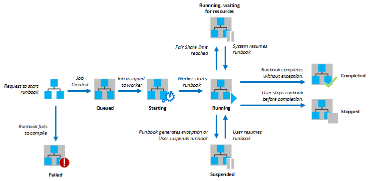

<properties 
   pageTitle="Runbook execution in Azure Automation"
   description="Describes the details of how a runbook in Azure Automation is processed."
   services="automation"
   documentationCenter=""
   authors="bwren"
   manager="stevenka"
   editor="tysonn" />
<tags 
   ms.service="automation"
   ms.devlang="na"
   ms.topic="article"
   ms.tgt_pltfrm="na"
   ms.workload="infrastructure-services"
   ms.date="04/28/2015"
   ms.author="bwren" />

# Runbook execution in Azure Automation

When you start a runbook in Azure Automation, a job is created. A job is a single execution instance of a runbook. An Azure Automation worker is assigned to run each job. While workers are shared by multiple Azure accounts, jobs from different Automation accounts are isolated from one another. You do not have control over which worker will service the request for your job.  A single runbook can have multiple jobs running at one time. When you view the list of runbooks in the Azure portal, it will list the status of the last job that was started for each runbook. You can view the list of jobs for each runbook in order to track the status of each. For a description of the different job statuses, see [Job Statuses](automation-viewing-the-status-of-a-runbook-job.md#job-statuses).

Your jobs will have access to your Azure resources by making a connection to your Azure subscription. They will only have access to resources in your data center if those resources are accessible from the public cloud.

## Permissions

Runbooks in Azure Automation will typically require access to resources in your Azure subscription. [Authenticating to Azure using Azure Active Directory](http://aka.ms/runbookauthor/authentication) describes how to configure Azure Active Directory and a [credential]() in Azure Automation for authenticating with Azure resources. This topic also includes information on using the [Add-AzureAccount cmdlet](http://aka.ms/runbookauthor/azurecmdlets/addazureaccount) to access Azure resources in runbooks that you create. Refer to the documentation for individual runbooks that you import for their security requirements.

## Fair share

In order to share resources among all runbooks in the cloud, Azure Automation will temporarily unload any job after it has been running for 3 hours and then restart it from its last [checkpoint](http://aka.ms/runbookauthor/checkpoints). During this time, the job will show a status of Running, Waiting for Resources. If the runbook has no checkpoints or the job had not reached the first checkpoint before being unloaded, then it will restart from the beginning.

If the runbook restarts from the same checkpoint or from the beginning of the runbook three consecutive times, it will be terminated with a status of Failed, waiting for resources. This is to protect from runbooks running indefinitely without completing, as they are not able to make it to the next checkpoint without being unloaded again. In this case, you will receive the following exception with the failure.

The job cannot continue running because it was repeatedly evicted from the same checkpoint. Please make sure your Runbook does not perform lengthy operations without persisting its state.

When you create a runbook, you should ensure that the time to run any activities between two checkpoints will not exceed 3 hours. You may need to add checkpoints to your runbook to ensure that it does not reach this 3 hour limit. You may also need to break up long running operations. For example, your runbook might perform a reindex on a large SQL database. If this single operation does not complete within the fair share limit, then the job will be unloaded and restarted from the beginning. In this case, you should break up the reindex operation into multiple steps, such as reindexing one table at a time, and then insert a checkpoint after each operation so that the job could resume after the last operation to complete.

## Related articles

- [Starting a runbook in Azure Automation](automation-starting-a-runbook)
- [Viewing the status of a runbook job in Azure Automation](automation-viewing-the-status-of-a-runbook-job)