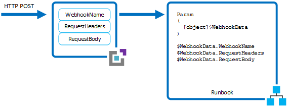

<properties 
   pageTitle="Azure Automation webhooks"
   description="A webhook that allows a client to start a runbook in Azure Automation from an HTTP call.  This article describes how to create a webhook and how to call one to start a runbook."
   services="automation"
   documentationCenter=""
   authors="bwren"
   manager="stevenka"
   editor="tysonn" />
<tags 
   ms.service="automation"
   ms.devlang="na"
   ms.topic="article"
   ms.tgt_pltfrm="na"
   ms.workload="infrastructure-services"
   ms.date="05/04/2015"
   ms.author="bwren" />

# Azure Automation webhooks

A *webhook* allows you to start a particular runbook in Azure Automation through a single HTTP request. This allows external services such as Visual Studio Online, GitHub, or custom applications to start runbooks without implementing a full solution using the Azure Automation API.

You can compare webhooks to other methods of starting a runbook in [Starting a runbook in Azure Automation](automation-starting-a-runbook.md)

## Details of a webhook

The following table describes the properties that you must configure for a webhook.

| Property | Description |
|:---|:---|
|Name | You can provide any name you want for a webhook since this is not exposed to the client.  It is only used for you to identify the runbook in Azure Automation.    As a best practice, you should give the webhook a name related to the client that will use it. |
|URL |The URL of the webhook is the unique address that a client calls with an HTTP POST to start the runbook linked to the webhook.  It is automatically generated when you create the webhook.  You cannot specify a custom URL.      The URL contains a security token that allows the runbook to be invoked by a third party system with no further authentication. For this reason, it should be treated like a password.  For security reasons, you can only view the URL in the Azure portal at the time the webhook is created. You should note the URL in a secure location for future use.   |
|Expiration date | Like a certificate, each webhook has an expiration date at which time it can no longer be used.  This expiration date cannot be changed after the webhook is created, and the webhook also cannot be enabled again after the expiration date is reached.  In this case, you must create another webhook to replace the current one and update the client to use the new webhook. |
| Enabled | A runbook is enabled by default when it is created.  If you set it to Disabled, then no client will be able to use it.  You can set the **Enabled** property when you create the webhook or anytime once it is created. |

### Parameters
A webhook can define values for runbook parameters that are used when the runbook is started by that webhook. The webhook must include values for any mandatory parameters of the runbook and may include values for optional parameters.  Multiple webhooks linked to a single runbook can each use different parameter values.

>[AZURE.NOTE] Parameter values set by a webhook currently cannot be changed after the webhook is created.  You must create another webhook that uses different parameter values. 

When a client starts a runbook using a webhook, it cannot override the parameter values defined in the webhook.  To receive data from the client, the runbook can accept a single parameter called **$WebhookData** of type [object] that will contain data that the client includes in the POST request. 

The **$WebhookData** object will have the following properties:

| Property | Description |
|:--- |:---|
| WebhookName | The name of the webhook. |
| RequestHeaders | The headers of the incoming POST request. |
| RequestBody | The body of the incoming POST request. |

There is no configuration of the webhook required to support the **$WebhookData** parameter, and the runbook is not required to accept it.  If the runbook does not define the parameter, then any details of the request sent from the client is ignored.

If you specify a value for $WebhookData when you create the webhook, that value will be overriden when the webhook starts the runbook with the data from the client POST request, even if the client does not include any data in the request body.  If you start a runbook that has $WebhookData using a method other than a webhook, you can provide a value for $Webhookdata that will be recognized by the runbook.  This value should be an object with the same properties as $Webhookdata so that the runbook can properly work with it.

>[AZURE.NOTE] The values of all input parameters are logged with the runbook job.  This means that any input provided by the client will be logged with $WebhookData and available to anyone with access to the automation job.  For this reason, you should be cautious about including sensitive information in webhook calls.

## Security

The security of a webhook relies on the privacy of its URL which contains a security token that allows it to be invoked. Azure Automation does not perform any authentication on the request as long as it is made to the correct URL. For this reason, webhooks should not be used for runbooks that perform highly sensitive functions without using an alternate means of validating the request.

You can include logic within the runbook to determine that it was called by a webhook by checking the **WebhookName** property of the $WebhookData parameter. The runbook could perform further validation by looking for particular information in the **RequestHeader** or **RequestBody** properties.

Another strategy is to have the runbook perform some validation of an external condition when it received a webhook request.  For example, consider a runbook that is called by GitHub whenever there is a new commit to a GitHub repository.  The runbook might connect to GitHub to validate that a new commit had actually just occurred before continuing.

## Creating a webhook

Use the following procedure to create a new webhook linked to a runbook in the Azure Preview portal.

1. From the **Runbooks blade** in the Azure portal, click the runbook that the webhook will start to view its detail blade. 
3. Click **Webhook** at the top of the blade to open the **Add Webhook** blade.  

4. Click **Create new webhook** to open the **Create webhook blade**.
5. Specify a **Name**, **Expiration Date** for the webhook and whether it should be enabled. See [Details of a webhook](#details-of-a-webhook) for more information these properties.
6. Click the copy icon and press Ctrl+C to copy the URL of the webhook.  Then record it in a safe place.  **Once you create the webhook, you cannot retrieve the URL again.**  

1. Click **Create** to create the webhook.
3. Click **Parameters** to provide values for the runbook parameters.  
1. Click **OK** when you are done configuring the webhook.

## Using a webhook

To use a webhook, your client application must issue an HTTP POST with the URL for the webhook.  The syntax of the webhook will be in the following format.

	http://<Webhook Server>/token?=<Token Value>

The client will receive one of the following codes in response to the POST request.  

| Code | Text | Description |
|:---|:----|:---|
| 202 | Accepted | The request was accepted, and the runbook was successfully started. |
| 400 | Bad Request | The request was not accepted for one of the following reasons. <ul> <li>The webhook has expired.</li> <li>The webhook is disabled.</li> <li>The token in the URL is invalid.</li>  </ul>|
| 500 | Internal Server Error | The URL was valid, but an error occurred.  Please resubmit the request.  |

The client cannot get the determine when the runbook job completes or its completion status from a webhook because the webhook does not return an identifier for the runbook job.  You can only validate that the request was submitted successfully.

### Example

The following example starts a runbook using a webhook with Windows PowerShell.  This sample includes data in the header and body that can be used by the runbook.  Note that any language that can make an HTTP request can use a webhook.

	$uri = "https://oaaswebhookcurrent.cloudapp.net/webhooks?token=8ud0dSrSo%2fvHWpYbklW%3c8s0GrOKJZ9Nr7zqcS%2bIQr4c%3d"
	$headers = @{"header1"="headerval1";"header2"="headerval2"}
	$body = "some request body"

	Invoke-RestMethod -Method Post -Uri $uri -Headers $headers -Body $body

The following sample runbook accepts the previous request and retrieves the data from the webhook.

	workflow Sample-Webhook
	{
		param (	
				$WebookData
		)
	
		$WebhookName 	= 	$WebookData.webhookname
		$WebhookHeaders = 	$WebookData.webhookHeaders
		$WebhookBody 	= 	$WebookData.webhookBody
	} 

	

## Related articles

- [Starting a Runbook](automation-starting-a-runbook.md)
- [Viewing the Status of a Runbook Job](automation-viewing-the-status-of-a-runbook-job.md)