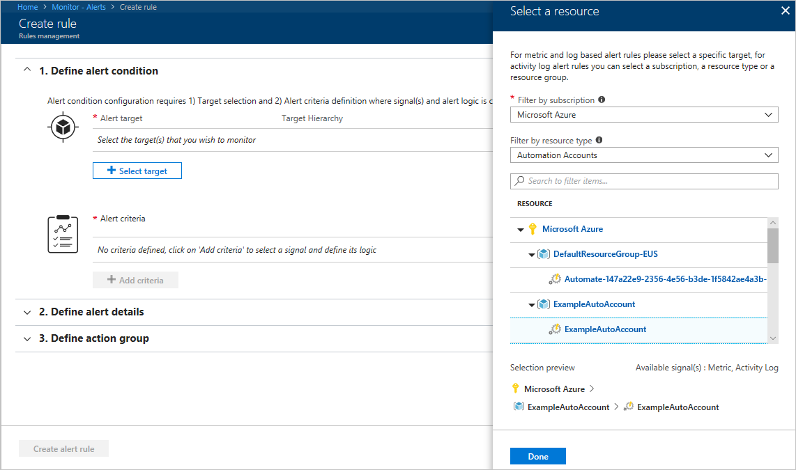

# Monitoring runbooks with Azure Activity logs

In this article we discuss how to create alerts on failed runbooks. You create a test runbook and alert when it fails. Once you test the logic you can go back into the alert and change the alert to the runbook you wish to alert on.

## Log in to Azure

Log in to Azure at https://portal.azure.com

## Create a test Runbook

## Create alert

In the Azure portal, select **Monitor**. On the Monitor page, select **Alerts** and click **+ New Alert Rule**.

Under **1. Define alert condition**, click **+  Select target**. Under **Filter by resource type**, select **Automation Account**. Choose your Automation Account and click **Done**.

Click **+ Add criteria**. Select **Metrics** for the **Signal type**, and choose **Total Jobs** from the table.

On the **Configure signal logic** page, two dimensions are displayed **Runbook Name** and **Status**. For **Runbook Name**, select the runbook you want to alert on, for **Status** choose the status you want to alert on. The drop downs for the dimensions are based off of activity within the time frame selected. If you want to alert on a status there must have been a runbook in that state during that time period. For example, if you want to alert on Failed runbook
> [!IMPORTANT] If you want to create an alert for the failure of a job for a particular runbook you will need to find a way to have the runbook fail and then quickly go create an alert for that runbook and condition.

Under **2. Define alert details**, give the alert a friendly name and description. Set the **Severity** to **Sev 3** since the alert is for a successful run.

Under **3. Define action group**, click **+ New action group**. An action group is a group of actions that you can use across multiple alerts. These can include but are not limited to, email notifications, runbooks, webhooks, and many more. To learn more about action groups, see [Create and manage action groups](../monitoring-and-diagnostics/monitoring-action-groups.md)

In the **Action group name** box, give it a friendly name and short name. The short name is used in place of a full action group name when notifications are sent using this group.

Under **Actions**, the action a friendly name like **Email Notifications** under **ACTION TYPE** select **Email/SMS/Push/Voice**. Under **DETAILS**, select **Edit details**.

On the **Email/SMS/Push/Voice** page, give it a name. Check the **Email** checkbox and enter in a valid email address to be used.

Click **OK** on the **Email/SMS/Push/Voice** page to close it and click **OK** to close the **Add action group** page.

You can customize the subject of the email sent by clicking **Email subject** under **Customize Actions** on the **Create rule** page. When complete, click **Create alert rule**. This creates the rule that alerts you when a runbook  fails.

## Test the alert

Navigate to your Automation Account and select **Runbooks**, and click **+ Add a runbook**. Choose **Quick Create** and give the runbook a name and choose **PowerShell** for the **Runbook type**.

In the canvas type `throw` and click **Publish**. When prompted choose **Yes** to publish the runbook. The logic in this runbook throws a default exception and causes the runbook to fail.

On the **Runbook** page, click **Start** and when prompted click **Yes** to start the runbook.

## Next steps
