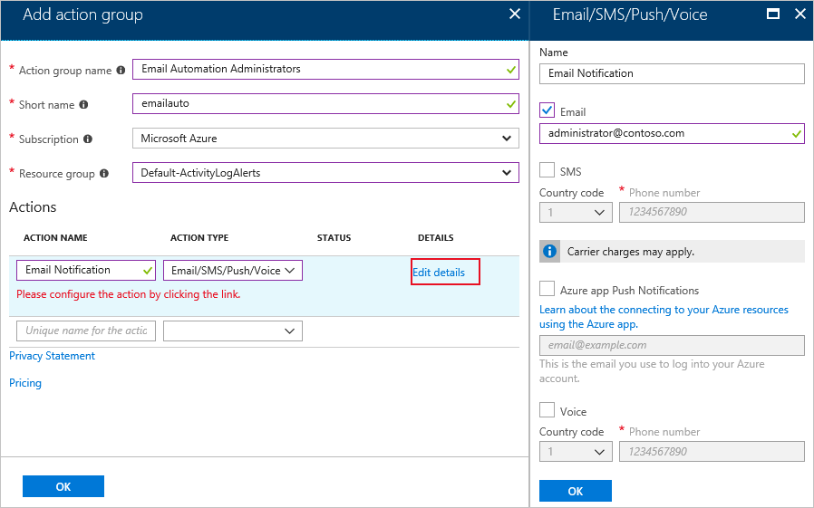
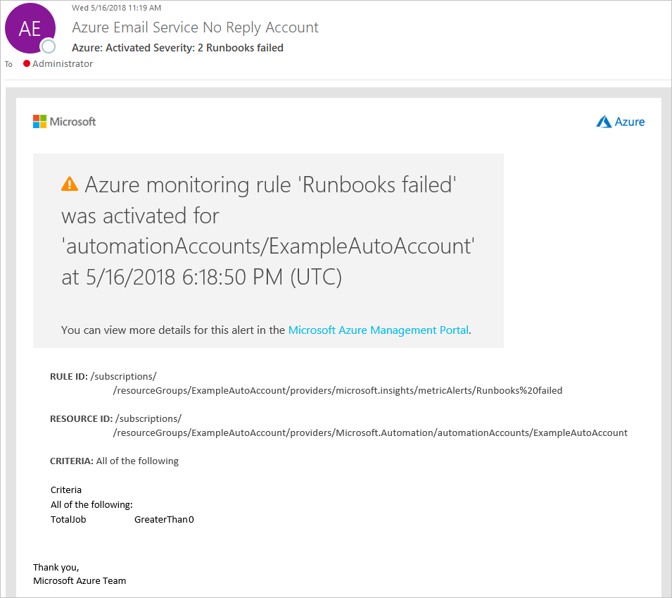

# Monitoring runbooks with metric alerts

In this article, you learn how to create alerts based on the completion status of runbooks.

## Sign in to Azure

Sign in to Azure at https://portal.azure.com

## Create alert

Alerts allow you to define a condition to monitor for and an action to take when that condition is met.

In the Azure portal, navigate to your Automation Account. Under **Monitoring**, select **Alerts** and click **+ New Alert Rule**. The scope for the target is already defined to your Automation Account.

### Configure alert criteria

1. Click **+ Add criteria**. Select **Metrics** for the **Signal type**, and choose **Total Jobs** from the table.

2. The **Configure signal logic** page is where you define the logic that triggers the alert. Under the historical graph you are presented with two dimensions, **Runbook Name** and **Status**. Dimensions are different properties for a metric that can be used to filter results. For **Runbook Name**, select the runbook you want to alert on or leave blank to alert on all runbooks. For **Status**, select a status from the drop-down you want to monitor for. The runbook name and status values that appear in the dropdown are only for jobs that have ran in the past week.

   If you want to alert on a status or runbook that isn't shown in the dropdown, click the **\+** next to the dimension. This action opens a dialog that allows you to enter in a custom value, which hasn't emitted for that dimension recently. If you enter a value that doesn't exist for a property your alert won't be triggered.

   > [!NOTE]
   > If you don't apply a name for the **RunbookName** dimension, if there are any runbooks that meet the status criteria, which includes hidden system runbooks, you will receive an alert.

3. Under **Alert logic**, define the condition and threshold for your alert. A preview of your condition defined is shown underneath.

4. Under **Evaluated based on**, select the timespan for the query and how often you want that query ran. For example, if you choose **Over the last 5 minutes** for **Period** and **Every 1 Minute** for **Frequency**, the alert looks for the number of runbooks that met your criteria over the past 5 minutes. This query is run every minute, and once the alert criteria you defined is no longer found in a 5-minute window, the alert resolves itself. When finished, click **Done**.

   

### Define alert details

1. Under **2. Define alert details**, give the alert a friendly name and description. Set the **Severity** to match your alert condition. There are five severities ranging from 0 to 5. The alerts are treated the same independent of the severity, you can match the severity to match your business logic.

1. At the bottom of the section, is a button that allows you to enable the rule upon completion. By default rules are enabled at creation. If you select No, you can create the alert and it's created in a **Disabled** state. From the **Rules** page in Azure Monitor, you can select it and click **Enable** to enable the alert when you're ready.

### Define the action to take

1. Under **3. Define action group**, click **+ New action group**. An action group is a group of actions that you can use across more than one alert. These can include but aren't limited to, email notifications, runbooks, webhooks, and many more. To learn more about action groups, see [Create and manage action groups](../azure-monitor/platform/action-groups.md)

1. In the **Action group name** box, give it a friendly name and short name. The short name is used in place of a full action group name when notifications are sent using this group.

1. In the **Actions** section under **ACTION TYPE**, select **Email/SMS/Push/Voice**.

1. On the **Email/SMS/Push/Voice** page, give it a name. Check the **Email** checkbox and enter in a valid email address to be used.

   

1. Click **OK** on the **Email/SMS/Push/Voice** page to close it and click **OK** to close the **Add action group** page. The Name specified in this page is saved as the **ACTION NAME**.

1. When complete, click **Save**. This action creates the rule that alerts you when a runbook completed with a certain status.

> [!NOTE]
> When adding an email address to an Action Group, a notification email is sent stating the address has been added to an Action Group.

## Notification

When the alert criteria is met, the action group runs the action defined. In this article's example, an email is sent. The following image is an example of an email you receive after the alert is triggered:

Once the metric is no longer outside of the threshold defined, the alert is deactivated and the action group runs the action defined. If an email action type is selected, a resolution email is sent stating it has been resolved.

## Next steps

Continue to the following article to learn about other ways that you can integrate alertings into your Automation Account.

> [!div class="nextstepaction"]
> [Use an alert to trigger an Azure Automation runbook](automation-create-alert-triggered-runbook.md)
