<properties
   pageTitle="Azure Automation & Hybrid Cloud Management: Automating deployment of a VM in Amazon Web Services"
   description="Azure Automation & Hybrid Cloud Management: Automating deployment of a VM in Amazon Web Services"
   services="automation"
   documentationCenter=""
   authors="tiander"
   manager="stevenka"
   editor="" />
<tags
   ms.service="automation"
   ms.devlang="na"
   ms.topic="article"
   ms.tgt_pltfrm="na"
   ms.workload="na"
   ms.date="02/01/2016"
   ms.author="tiandert; bwren" />

# Azure Automation and hybrid cloud management: automating deployment of a VM in Amazon Web Services

During our [Cloud Roadshow](https://microsoftcloudroadshow.com/cities) events where I presented on Azure Automation there were a number of questions around whether Azure Automation was intended only for Azure. Fortunately, I had a demo lined up which I’m going to talk about in this blog article, but the key answer is **that Azure Automation is not only for Azure, it’s for on-premises resources *AND* for managing hybrid cloud environments as well!** So, for example, if you are an Amazon Web Services (AWS) customer then Azure Automation is for you too!

## Objectives

In this article, I’ll talk about how you can leverage Azure Automation to provision a VM in AWS and give that VM a specific name – which in the AWS world is referred to as “tagging” the VM.

## Assumptions

For the purposes of this article, I’m assuming you have an Azure Automation account already set up and that you have an AWS subscription as well.

For more information on setting up an Azure Automation account, check out our [documentation page](automation-configuring.md).

## Preparation: Storing your AWS credentials

For Azure Automation to “talk” to AWS, you will need to retrieve your AWS credentials and store them as assets in Azure Automation.

When you are logged into the AWS portal, click on the little triangle under your name and click on **Security Credentials**.

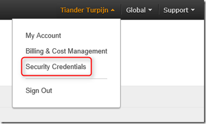

Click **Access Keys**.

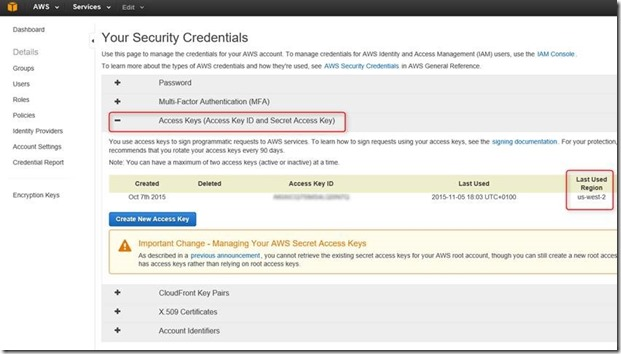

Copy your access key and secret access key (optionally download your key file to store it somewhere safe).

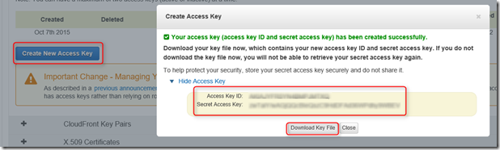

## AWS Assets in Azure Automation

In the previous step you have copied and saved your AWS **Access Key ID** and **Secret Access Key**. We are going to store them now in Azure Automation.

Navigate to your Automation Account and select **Assets** - **Credentials** and add a new credential and name it **AWScred**.

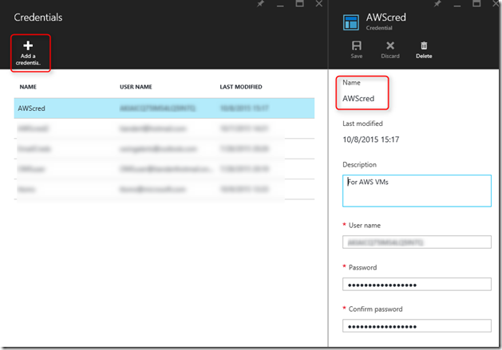

Provide an optional description and make sure that you enter your **Access ID** in the **User name** field and your **Secret Access Key** in the field which is labeled **Password**. Save your AWS credentials.

## Amazon Web Services PowerShell Module

Our VM provisioning runbook will leverage the AWS PowerShell module to do its work. The AWS PowerShell module ships on [PowerShell Gallery](http://www.powershellgallery.com/packages/AWSPowerShell/) and can easily be added to an Automation account via the **Deploy to Azure Automation** button.

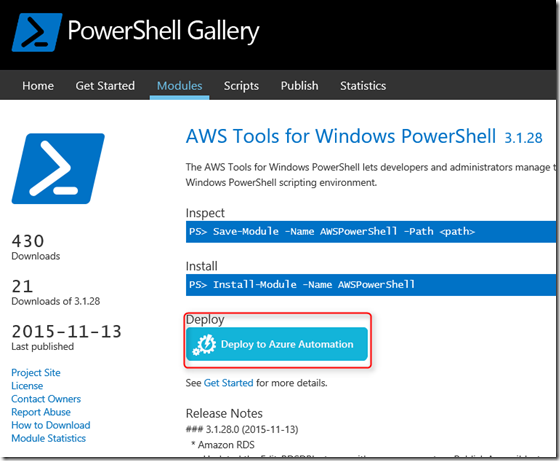

When you click on **Deploy to Azure Automation** it will take to the Azure login page and after you have provided your credentials you will see the following screen.

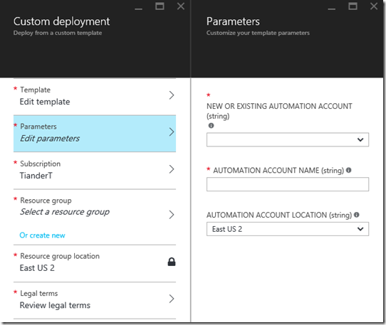

Select a new or existing Automation Account. Please note that there is no dropdown box for an existing account, so make sure that you do not make typos and that the region and resource group for your Automation account are correct. Go through the other steps to complete the configuration and then click on **Create**.

If you navigate to your selected Automation Account and navigate to **Assets** - **Modules**, you now can see the AWS module with 1427 activities, awesome!

>[AZURE.NOTE] Importing a PowerShell module into Azure Automation consists of two steps:
>
> 1.  Importing the module
> 2.  Extracting the cmdlets
>
>The activities will not show up until the module has completely finished importing and extracting the cmdlets which can take a few minutes.

## Provision AWS VM runbook

Now that we have all prerequisites in place it’s time to author our runbook which will provision a VM in AWS. We will also showcase that you can leverage a native PowerShell script in Azure Automation instead of PowerShell Workflow.

More information about the differences between native PowerShell and PowerShell workflow can be found [here](https://azure.microsoft.com/blog/announcing-powershell-script-support-azure-automation-2/). Information about graphical runbook authoring can be found [here](https://azure.microsoft.com/blog/azure-automation-graphical-and-textual-runbook-authoring/).

The PowerShell script for our runbook can be downloaded from the [PowerShell Gallery](https://www.powershellgallery.com/packages/New-AwsVM/DisplayScript).

You can download the script by opening a PowerShell session and typing in: **Save-Script -Name New-AwsVM -Path \<path\>**

When you have saved the PowerShell script you can add it to Azure Automation as a runbook by doing the following:

Under your **Automation Account**, click **Runbooks** and select **Add a runbook**. Select **Quick Create** (Create a new runbook), provide a name for your runbook and under **Runbook type** select **PowerShell**. Then click on **Create**.

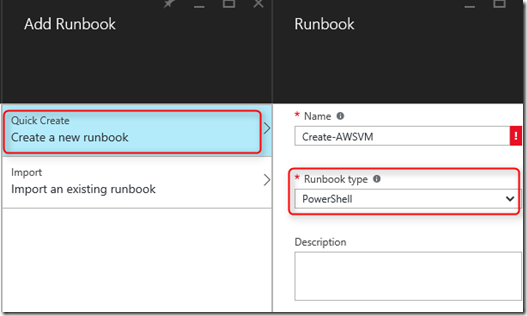

When the runbook editor opens copy and paste the PowerShell script into the runbook authoring area.

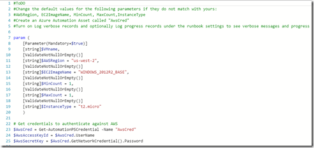

Please note the following when using the downloaded PowerShell script:

-   The runbook contains a number of default parameter values as mentioned in the \#ToDo section. Please evaluate all default values and update where necessary.
-   Make sure that have you stored your AWS credentials under **Assets**, called **AWScred**.
-   The region which you will be using will be dependent of your AWS subscription. In the AWS portal where you have also looked up your security credentials, click on the arrow next to your Account to verify your region.

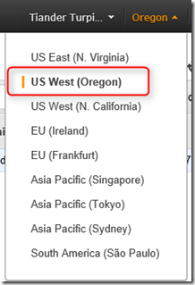

-   Figure out [which region](http://docs.aws.amazon.com/powershell/latest/userguide/pstools-installing-specifying-region.html) you need to provide in your runbook. For example, my region is US West (Oregon) which translates to us-west-2.

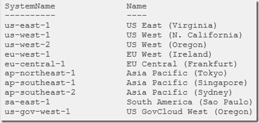

-   You can get a list of image names when you use PowerShell ISE, import the module, authenticate against AWS by replacing **Get-AutomationPSCredential** in your ISE environment with **$AwsCred = Get-Credential.** This will prompt you for credentials and you can provide your **Access Key ID** and **Secret Access Key** as username and password. See the sample below:

		#Sample to get the AWS VM available images
		#Please provide the path where you have downloaded the AWS PowerShell module
		Import-Module AWSPowerShell
		$AWSRegion = "us-west-2"
		$AwsCred = Get-Credential
		$AwsAccessKeyId = $AwsCred.UserName
		$AwsSecretKey = $AwsCred.GetNetworkCredential().Password
		
		# Set up the environment to access AWS
		Set-AWSCredentials -AccessKey $AwsAccessKeyId -SecretKey $AwsSecretKey -StoreAs AWSProfile
		Set-DefaultAWSRegion -Region $AWSRegion
		
		Get-EC2ImageByName -ProfileName AWSProfile 

That will you get you this output:

Copy and paste the image name of your liking in an automation variable as referenced in the runbook as **$InstanceType**. Since I’m using a free AWS tier I have selected **t2.micro** in my runbook.

Learn more about Amazon EC2 instance types [here](https://aws.amazon.com/ec2/instance-types/).

## Testing the provision AWS VM runbook

Preflight checklist:

-   Assets for authenticating against AWS have been created and has been named **AWScred**
-   The AWS PowerShell module has been imported in Azure Automation
-   A new runbook has been created and parameter values have been verified and updated where necessary
-   **Log verbose records** and optionally **Log progress records** under the runbook settings have been set to **On**

Let’s start our new runbook by providing a **VMname.**

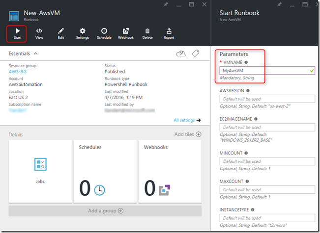

Since we have enabled **Log verbose records** and **Log progress records** we can see our output **Streams** under **All Logs**.

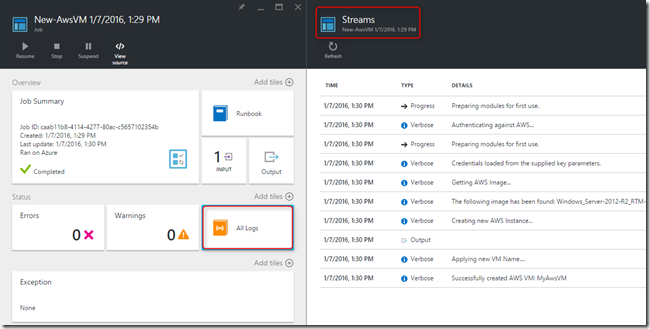

Let’s check in AWS:

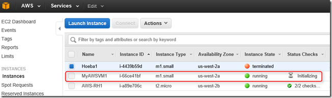

Nice!

With this article, I have provided an example of how Azure Automation can be used to manage hybrid clouds, such as by creating a VM in Amazon Web Services and applying a custom tag to give it a name.

Happy automating and until next time!

Tiander.
