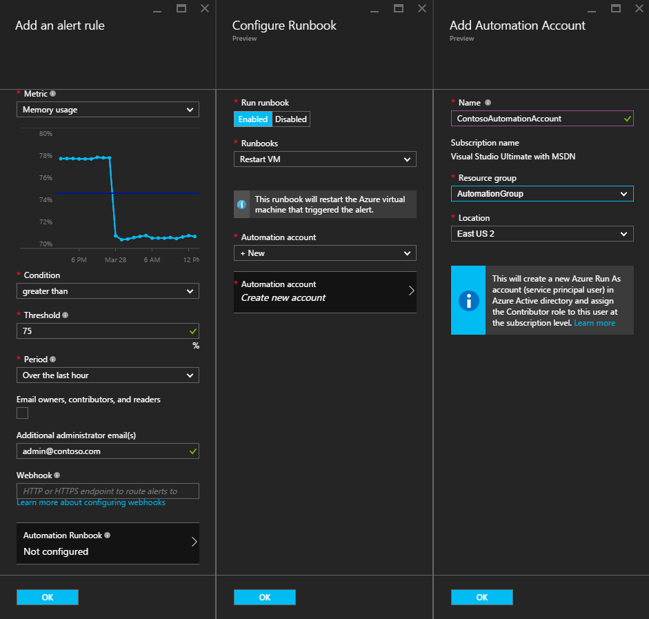
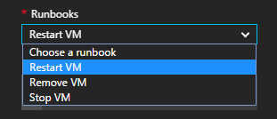
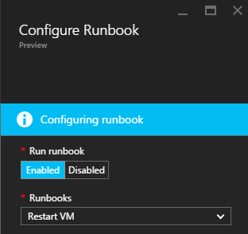

<properties
    pageTitle=" Remediate Azure VM Alerts with Automation Runbooks | Microsoft Azure"
    description="This article demonstrates how to integrate Azure Virtual Machine alerts with Azure Automation runbooks and auto-remediate issues"
    services="automation"
    documentationCenter=""
    authors="mgoedtel"
    manager="jwhit"
    editor="tysonn" />    
<tags
    ms.service="automation"
    ms.devlang="na"
    ms.topic="article"
    ms.tgt_pltfrm="na"
    ms.workload="infrastructure-services"
    ms.date="06/14/2016"
    ms.author="csand;magoedte" />

# Azure Automation scenario - remediate Azure VM alerts

Azure Automation and Azure Virtual Machines have released a new feature allowing you to configure Virtual Machine (VM) alerts to run Automation runbooks. This new capability allows you to automatically perform standard remediation in response to VM alerts, like restarting or stopping the VM.

Previously, during VM alert rule creation you were able to [specify an Automation webhook](https://azure.microsoft.com/blog/using-azure-automation-to-take-actions-on-azure-alerts/) to a runbook in order to run the runbook whenever the alert triggered. However, this required you to do the work of creating the runbook, creating the webhook for the runbook, and then copying and pasting the webhook during alert rule creation. With this new release, the process is much easier because you can directly choose a runbook from a list during alert rule creation, and you can choose an Automation account which will run the runbook or easily create an account.

In this article, we will show you how easy it is to set up an Azure VM alert and configure an Automation runbook to run whenever the alert triggers. Example scenarios include restarting a VM when the memory usage exceeds some threshold due to an application on the VM with a memory leak, or stopping a VM when the CPU user time has been below 1% for past hour and is not in use. We’ll also explain how the automated creation of a service principal in your Automation account simplifies the use of runbooks in Azure alert remediation.

## Create an alert on a VM

Perform the following steps to configure an alert to launch a runbook when its threshold has been met.

>[AZURE.NOTE] With this release, we only support V2 virtual machines and support for classic VMs will be added soon.  

1. Log in to the Azure portal and click **Virtual Machines**.  
2. Select one of your virtual machines.  The virtual machine dashboard blade will appear and the **Settings** blade to its right.  
3. From the **Settings** blade, under the Monitoring section select **Alert rules**.
4. On the **Alert rules** blade, click **Add alert**.

This opens up the **Add an alert rule** blade, where you can configure the conditions for the alert and choose among one or all of these options: send email to someone, use a webhook to forward the alert to another system, and/or run an Automation runbook in response attempt to remediate the issue.

## Configure a runbook

To configure a runbook to run when the VM alert threshold is met, select **Automation Runbook**. In the **Configure runbook** blade, you can select the runbook to run and the Automation account to run the runbook in.



>[AZURE.NOTE] For this release you can choose from three runbooks that the service provides – Restart VM, Stop VM, or Remove VM (delete it).  The ability to select other runbooks or one of your own runbooks will be available in a future release.



After you select one of the three available runbooks, the **Automation account** drop-down list appears and you can select an automation account the runbook will run as. Runbooks need to run in the context of an [Automation account](automation-security-overview.md) that is in your Azure subscription. You can select an Automation account that you already created, or you can have a new Automation account created for you.

The runbooks that are provided authenticate to Azure using a service principal. If you choose to run the runbook in one of your existing Automation accounts, we will automatically create the service principal for you. If you choose to create a new Automation account, then we will automatically create the account and the service principal. In both cases, two assets will also be created in the Automation account – a certificate asset named **AzureRunAsCertificate** and a connection asset named **AzureRunAsConnection**. The runbooks will use **AzureRunAsConnection** to authenticate with Azure in order to perform the management action against the VM.

>[AZURE.NOTE] The service principal is created in the subscription scope and is assigned the Contributor role. This role is required in order for the account to have permission to run Automation runbooks to manage Azure VMs.  The creation of an Automaton account and/or service principal is a one-time event. Once they are created, you can use that account to run runbooks for other Azure VM alerts.

When you click **OK** the alert is configured and if you selected the option to create a new Automation account, it is created along with the service principal.  This can take a few seconds to complete.  



After the configuration is completed you will see the name of the runbook appear in the **Add an alert rule** blade.


Click **OK** in the **Add an alert rule** blade and the alert rule will be created and activate if the virtual machine is in a running state.

### Enable or disable a runbook

If you have a runbook configured for an alert, you can disable it without removing the runbook configuration. This allows you to keep the alert running and perhaps test some of the alert rules and then later re-enable the runbook.

## Create a runbook that works with an Azure alert

When you choose a runbook as part of an Azure alert rule, the runbook needs to have logic in it to manage the alert data that is passed to it.  When a runbook is configured in an alert rule, a webhook is created for the runbook; that webhook is then used to start the runbook each time the alert triggers.  The actual call to start the runbook is an HTTP POST request to the webhook URL. The body of the POST request contains a JSON-formated object that contains useful properties related to the alert.  As you can see below, the alert data contains details like subscriptionID, resourceGroupName, resourceName, and resourceType.

### Example of Alert data
```
{
    "WebhookName": "AzureAlertTest",
    "RequestBody": "{
	\"status\":\"Activated\",
	\"context\": {
		\"id\":\"/subscriptions/<subscriptionId>/resourceGroups/MyResourceGroup/providers/microsoft.insights/alertrules/AlertTest\",
		\"name\":\"AlertTest\",
		\"description\":\"\",
		\"condition\": {
			\"metricName\":\"CPU percentage guest OS\",
			\"metricUnit\":\"Percent\",
			\"metricValue\":\"4.26337916666667\",
			\"threshold\":\"1\",
			\"windowSize\":\"60\",
			\"timeAggregation\":\"Average\",
			\"operator\":\"GreaterThan\"},
		\"subscriptionId\":\<subscriptionID> \",
		\"resourceGroupName\":\"TestResourceGroup\",
		\"timestamp\":\"2016-04-24T23:19:50.1440170Z\",
		\"resourceName\":\"TestVM\",
		\"resourceType\":\"microsoft.compute/virtualmachines\",
		\"resourceRegion\":\"westus\",
		\"resourceId\":\"/subscriptions/<subscriptionId>/resourceGroups/TestResourceGroup/providers/Microsoft.Compute/virtualMachines/TestVM\",
		\"portalLink\":\"https://portal.azure.com/#resource/subscriptions/<subscriptionId>/resourceGroups/TestResourceGroup/providers/Microsoft.Compute/virtualMachines/TestVM\"
		},
	\"properties\":{}
	}",
    "RequestHeader": {
        "Connection": "Keep-Alive",
        "Host": "<webhookURL>"
    }
}
```

When the Automation webhook service receives the HTTP POST it extracts the alert data and passes it to the runbook in the WebhookData runbook input parameter.  Below is a sample runbook that shows how to use the WebhookData parameter and extract the alert data and use it to manage the Azure resource that triggered the alert.

### Example runbook

```
#  This runbook will restart an ARM (V2) VM in response to an Azure VM alert.

[OutputType("PSAzureOperationResponse")]

param ( [object] $WebhookData )

if ($WebhookData)
{
	# Get the data object from WebhookData
	$WebhookBody = (ConvertFrom-Json -InputObject $WebhookData.RequestBody)

    # Assure that the alert status is 'Activated' (alert condition went from false to true)
    # and not 'Resolved' (alert condition went from true to false)
	if ($WebhookBody.status -eq "Activated")
    {
	    # Get the info needed to identify the VM
	    $AlertContext = [object] $WebhookBody.context
	    $ResourceName = $AlertContext.resourceName
	    $ResourceType = $AlertContext.resourceType
        $ResourceGroupName = $AlertContext.resourceGroupName
        $SubId = $AlertContext.subscriptionId

	    # Assure that this is the expected resource type
	    Write-Verbose "ResourceType: $ResourceType"
	    if ($ResourceType -eq "microsoft.compute/virtualmachines")
	    {
		    # This is an ARM (V2) VM

		    # Authenticate to Azure with service principal and certificate
            $ConnectionAssetName = "AzureRunAsConnection"
		    $Conn = Get-AutomationConnection -Name $ConnectionAssetName
		    if ($Conn -eq $null) {
                throw "Could not retrieve connection asset: $ConnectionAssetName. Check that this asset exists in the Automation account."
            }
		    Add-AzureRMAccount -ServicePrincipal -Tenant $Conn.TenantID -ApplicationId $Conn.ApplicationID -CertificateThumbprint $Conn.CertificateThumbprint | Write-Verbose
		    Set-AzureRmContext -SubscriptionId $SubId -ErrorAction Stop | Write-Verbose

            # Restart the VM
		    Restart-AzureRmVM -Name $ResourceName -ResourceGroupName $ResourceGroupName
	    } else {
		    Write-Error "$ResourceType is not a supported resource type for this runbook."
	    }
    } else {
        # The alert status was not 'Activated' so no action taken
		Write-Verbose ("No action taken. Alert status: " + $WebhookBody.status)
    }
} else {
    Write-Error "This runbook is meant to be started from an Azure alert only."
}
```

## Summary

When you configure an alert on an Azure VM, you now have the ability to easily configure an Automation runbook to automatically perform remediation action when the alert triggers. For this release, you can choose from runbooks to restart, stop, or delete a VM depending on your alert scenario. This is just the beginning of enabling scenarios where you control the actions (notification, troubleshooting, remediation) that will be taken automatically when an alert triggers.

## Next Steps

- To get started with Graphical runbooks, see [My first graphical runbook](automation-first-runbook-graphical.md)
- To get started with PowerShell workflow runbooks, see [My first PowerShell workflow runbook](automation-first-runbook-textual.md)
- To learn more about runbook types, their advantages and limitations, see [Azure Automation runbook types](automation-runbook-types.md)
