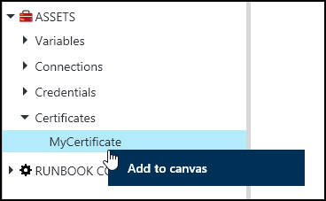
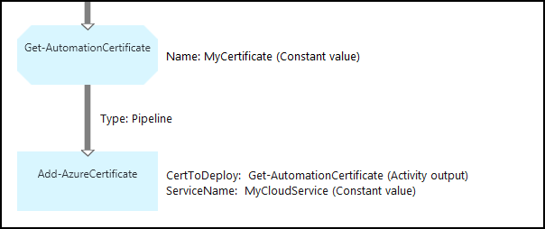

<properties 
   pageTitle="Certificate assets in Azure Automation | Microsoft Azure"
   description="Certificates can be stored securely in Azure Automation so they can be accessed by runbooks or DSC configurations to authenticate against Azure and third party resources.  This article explains the details of certificates and how to work with them in both textual and graphical authoring."
   services="automation"
   documentationCenter=""
   authors="bwren"
   manager="stevenka"
   editor="tysonn" />
<tags 
   ms.service="automation"
   ms.devlang="na"
   ms.topic="article"
   ms.tgt_pltfrm="na"
   ms.workload="infrastructure-services"
   ms.date="10/23/2015"
   ms.author="bwren" />

# Certificate assets in Azure Automation

Certificates can be stored securely in Azure Automation so they can be accessed by runbooks or DSC configurations using the **Get-AutomationCertificate** activity. This allows you to create runbooks and DSC configurations that use certificates for authentication or adds them to Azure or third party resources.

>[AZURE.NOTE] Secure assets in Azure Automation include credentials, certificates, connections, and encrypted variables. These assets are encrypted and stored in the Azure Automation using a unique key that is generated for each automation account. This key is encrypted by a master certificate and stored in Azure Automation. Before storing a secure asset, the key for the automation account is decrypted using the master certificate and then used to encrypt the asset.

## Windows PowerShell Cmdlets

The cmdlets in the following table are used to create and manage automation certificate assets with Windows PowerShell. They ship as part of the [Azure PowerShell module](../powershell-install-configure.md) which is available for use in Automation runbooks and DSC configurations.

|Cmdlets|Description|
|:---|:---|
|[Get-AzureAutomationCertificate](http://msdn.microsoft.com/library/dn913765.aspx)|Retrieves information about a certificate. You can only retrieve the certificate itself from Get-AutomationCertificate activity.|
|[New- AzureAutomationCertificate](http://msdn.microsoft.com/library/dn913764.aspx)|Imports a new certificate into Azure Automation.|
|[Remove- AzureAutomationCertificate](http://msdn.microsoft.com/library/dn913773.aspx)|Removes a certificate from Azure Automation.|
|[Set- AzureAutomationCertificate](http://msdn.microsoft.com/library/dn913763.aspx)|Sets the properties for an existing certificate including uploading the certificate file and setting the password for a .pfx.|

## Activities to access certificates

The activities in the following table are used to access certificates in a runbook or DSC configuration.

|Activities|Description|
|:---|:---|
|Get-AutomationCertificate|Gets a certificate to use in a runbook or DSC configuration.|

>[AZURE.NOTE] You should avoid using variables in the –Name parameter of GetAutomationCertificate since this can complicate discovering dependencies between runbooks or DSC configurations, and certificate assets at design time.

## Creating a new certificate

When you create a new certificate, you upload a cer or pfx file to Azure Automation. If you mark the certificate as exportable, then you can transfer it out of the Azure Automation certificate store. If it is not exportable, then it can only be used for signing within the runbook or DSC configuration.

### To create a new certificate with the Azure portal

1. From your automation account, click **Assets** at the top of the window.
1. At the bottom of the window, click **Add Setting**.
1. Click **Add Credential**.
2. In the **Credential Type** dropdown, select **Certificate**.
3. Type a name for the certificate in the **Name** box and click the right arrow.
4. Browse for a .cer or .pfx file.  If you select a .pfx file, specify a password and whether it should be allowed to be exported.
1. Click the check mark to upload the certificate file and save the new certificate asset.

### To create a new certificate with the Azure preview portal

1. From your automation account, click the **Assets** part to open the **Assets** blade.
1. Click the **Certificates** part to open the **Certificates** blade.
1. Click **Add a certificate** at the top of the blade.
2. Type a name for the certificate in the **Name** box.
2. Click **Select a file** under **Upload a certificate file** to browse for a .cer or .pfx file.  If you select a .pfx file, specify a password and whether it should be allowed to be exported.
1. Click **Create** to save the new certificate asset.

### To create a new certificate with Windows PowerShell

The following sample commands show how to create a new automation certificate and marks it exportable. This imports an existing pfx file.

	$certName = 'MyCertificate'
	$certPath = '.\MyCert.pfx'
	$certPwd = ConvertTo-SecureString -String 'P@$$w0rd' -AsPlainText -Force
	
	New-AzureAutomationCertificate -AutomationAccountName "MyAutomationAccount" -Name $certName -Path $certPath –Password $certPwd -Exportable

## Using a certificate

You must use the **Get-AutomationCertificate** activity to use a certificate. You cannot use the [Get-AzureAutomationCertificate](http://msdn.microsoft.com/library/dn913765.aspx) cmdlet since it returns information about the certificate asset but not the certificate itself.

### Textual runbook sample

The following sample code shows how to add a certificate to a cloud service in a runbook. In this sample, the password is retrieved from an encrypted automation variable.

	$serviceName = 'MyCloudService'
	$cert = Get-AutomationCertificate -Name 'MyCertificate'
	$certPwd = Get-AutomationVariable –Name 'MyCertPassword'
	Add-AzureCertificate -ServiceName $serviceName -CertToDeploy $cert

### Graphical runbook sample

You add a **Get-AutomationCerticiate** to a graphical runbook by right-clicking on the certificate in the Library pane of the graphical editor and selecting **Add to canvas**.

The following image shows an example of using a certificate in a graphical runbook.  This is the same example shown above for adding a certificate to a cloud service from a textual runbook.  

This example uses the **UseConnectionObject** parameter set for the Send-**TwilioSMS activity** that uses a connection object for authentication to the service.  A [pipeline link](automation-graphical-authoring-intro.md#links-and-workflow) must be used here since a sequence link would return a collection containing containing a single object which the Connection parameter is not expecting.

## See Also

- [Links in graphical authoring](automation-graphical-authoring-intro.md#links-and-workflow) 
