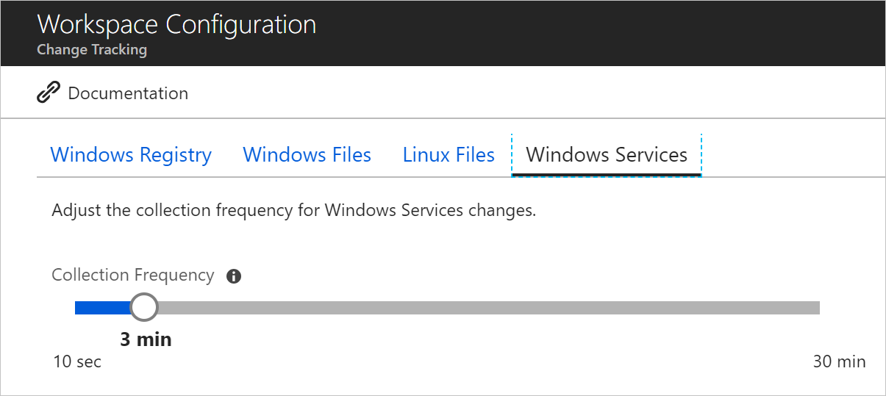
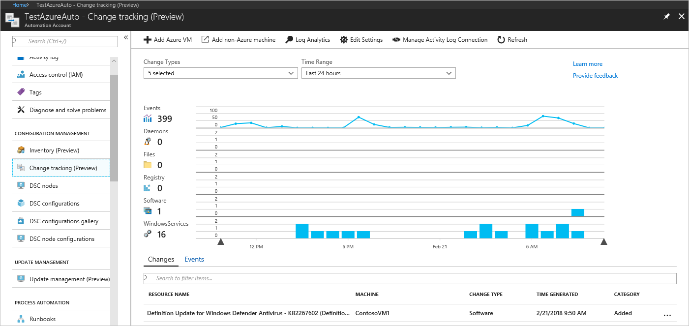
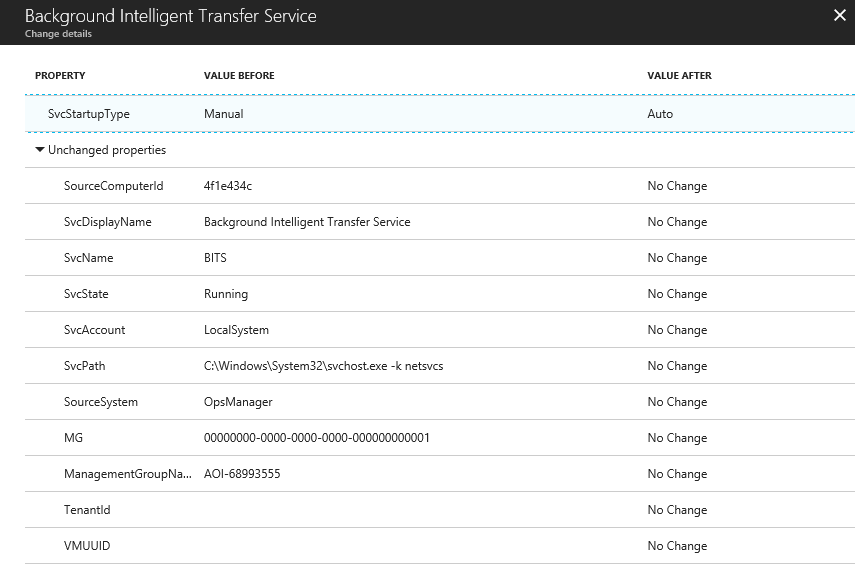

# Track changes in your environment with the Change Tracking solution

This article helps you use the Change Tracking solution to easily identify changes in your environment. The solution tracks changes to Windows and Linux software, Windows and Linux files, Windows registry keys, Windows services, and Linux daemons. Identifying configuration changes can help you pinpoint operational issues.

Changes to installed software, Windows services, Windows registry and files, and Linux daemons on the monitored servers are sent to the Log Analytics service in the cloud for processing. Logic is applied to the received data and the cloud service records the data. By using the information on the Change Tracking dashboard, you can easily see the changes that were made in your server infrastructure.

## Supported Windows operating systems

The following versions of the Windows operating system are officially supported for the Windows agent:

* Windows Server 2008 R2 or later

## Supported Linux operating systems

The following Linux distributions are officially supported. However, the Linux agent might also run on other distributions not listed. Unless otherwise noted, all minor releases are supported for each major version listed.  

### 64-bit

* CentOS 6 and 7
* Amazon Linux 2017.09
* Oracle Linux 6 and 7
* Red Hat Enterprise Linux Server 6 and 7
* Debian GNU/Linux 8 and 9
* Ubuntu Linux 14.04 LTS, 16.04 LTS and 18.04 LTS
* SUSE Linux Enterprise Server 12

### 32-bit

* CentOS 6
* Oracle Linux 6
* Red Hat Enterprise Linux Server 6
* Debian GNU/Linux 8 and 9
* Ubuntu Linux 14.04 LTS and 16.04 LTS

## Enable Change Tracking and Inventory

To begin tracking changes, you need to enable the Change Tracking and Inventory solution for your Automation Account.

1. In the Azure portal, navigate to your Automation Account
2. Select **Change Tracking** under **CONFIGURATION**.
3. Select an existing Log analytics workspace or **Create New Workspace** and click **Enable**.

This enables the solution for your automation account. The solution can take up to 15 minutes to enable. The blue banner notifies you when the solution is enabled. Navigate back to the **Change Tracking** page to manage the solution.

## Configuring Change Tracking and Inventory

To learn how to onboard computers to the solution visit: [Onboarding Automation solutions](automation-onboard-solutions-from-automation-account.md). Once you have a machine onboarding with the Change Tracking and Inventory solution you can configure the items to track. When you enable a new file or registry key to track, it is enabled for both Change Tracking and Inventory.

For tracking changes in files on both Windows and Linux, MD5 hashes of the files are used. Theses hashes are then used to detect if a change has been made since the last inventory.

### Configure Linux files to track

Use the following steps to configure file tracking on Linux computers:

1. In your Automation Account, select **Change tracking** under **CONFIGURATION MANAGEMENT**. Click **Edit Settings** (the gear symbol).
2. On the **Change Tracking** page, select **Linux Files**, then click **+ Add** to add a new file to track.
3. On the **Add Linux File for Change Tracking**, enter the information for the file or directory to track and click **Save**.

|Property  |Description  |
|---------|---------|
|Enabled     | Determines if the setting is applied.        |
|Item Name     | Friendly name of the file to be tracked.        |
|Group     | A group name for logically grouping files.        |
|Enter Path     | The path to check for the file. For example: "/etc/*.conf"       |
|Path Type     | Type of item to be tracked, possible values are File and Directory.        |
|Recursion     | Determines if recursion is used when looking for the item to be tracked.        |
|Use Sudo     | This setting determines if sudo is used when checking for the item.         |
|Links     | This setting determines how symbolic links dealt with when traversing directories.  **Ignore** - Ignores symbolic links and does not include the files/directories referenced. **Follow** - Follows the symbolic links during recursion and also includes the files/directories referenced. **Manage** - Follows the symbolic links and allows altering of returned content.     |
|Upload file content for all settings| Turns on or off file content upload on tracked changes. Available options: **True** or **False**.|

> [!NOTE]
> The "Manage" links option is not recommended. File content retrieval is not supported.

### Configure Windows files to track

Use the following steps to configure files tracking on Windows computers:

1. In your Automation Account, select **Change tracking** under **CONFIGURATION MANAGEMENT**. Click **Edit Settings** (the gear symbol).
2. On the **Change Tracking** page, select **Windows Files**, then click **+ Add** to add a new file to track.
3. On the **Add Windows File for Change Tracking**, enter the information for the file to track and click **Save**.

|Property  |Description  |
|---------|---------|
|Enabled     | Determines if the setting is applied.        |
|Item Name     | Friendly name of the file to be tracked.        |
|Group     | A group name for logically grouping files.        |
|Enter Path     | The path to check for the file For example: "c:\temp\\\*.txt" You can also use environment variables such as "%winDir%\System32\\\*.*"       |
|Recursion     | Determines if recursion is used when looking for the item to be tracked.        |
|Upload file content for all settings| Turns on or off file content upload on tracked changes. Available options: **True** or **False**.|

## Wildcard, recursion, and environment settings

Recursion allows you to specify wildcards to simplify tracking across directories, and environment variables to allow you to track files across environments with multiple or dynamic drive names. The following is a list of common information you should know when configuring recursion:

* Wildcards are required for tracking multiple files
* If using wildcards, they can only be used in the last segment of a path. (such as C:\folder\\**file** or /etc/*.conf)
* If an environment variable has an invalid path, validation will succeed but that path will fail when inventory runs.
* Avoid general paths such as `c:\*.*` when setting the path, as this would result in too many folders being traversed.

## Configure File Content tracking

You can view the contents before and after a change of a file with File Content Change Tracking. This is available for Windows and Linux files, for each change to the file, the contents of the file is stored in a storage account, and shows the file before and after the change, inline or side by side. To learn more, see [View the contents of a tracked file](change-tracking-file-contents.md).

### Configure Windows registry keys to track

Use the following steps to configure registry key tracking on Windows computers:

1. In your Automation Account, select **Change tracking** under **CONFIGURATION MANAGEMENT**. Click **Edit Settings** (the gear symbol).
2. On the **Change Tracking** page, select **Windows Registry**, then click **+ Add** to add a new registry key to track.
3. On the **Add Windows Registry for Change Tracking**, enter the information for the key to track and click **Save**.

|Property  |Description  |
|---------|---------|
|Enabled     | Determines if the setting is applied.        |
|Item Name     | Friendly name of the file to be tracked.        |
|Group     | A group name for logically grouping files.        |
|Windows Registry Key   | The path to check for the file. For example: "HKEY_LOCAL_MACHINE\SOFTWARE\Microsoft\Windows\CurrentVersion\Explorer\User Shell Folders\Common Startup"      |

## Limitations

The Change Tracking solution does not currently support the following items:

* Recursion for Windows registry tracking
* Network file systems

Other limitations:

* The **Max File Size** column and values are unused in the current implementation.
* If you collect more than 2500 files in the 30-minute collection cycle, solution performance might be degraded.
* When network traffic is high, change records may take up to six hours to display.
* If you modify the configuration while a computer is shut down, the computer might post changes that belonged to the previous configuration.

## Known Issues

The Change Tracking solution is currently experiencing the following issues:

* Hotfix updates are not collected for Windows 10 Creators Update and Windows Server 2016 Core RS3 machines.
* For Windows files, Change Tracking does not currently detect when a new file has been added to a tracked folder path

## Change Tracking data collection details

The following table shows the data collection frequency for the types of changes. For every type the data snapshot of the current state is also refreshed at least every 24 hours:

| **Change type** | **Frequency** |
| --- | --- |
| Windows registry | 50 minutes |
| Windows file | 30 minutes |
| Linux file | 15 minutes |
| Windows services | 10 seconds to 30 minutes  Default: 30 minutes |
| Linux daemons | 5 minutes |
| Windows software | 30 minutes |
| Linux software | 5 minutes |

### Windows service tracking

The default collection frequency for Windows services is 30 minutes. To configure the frequency go to **Change Tracking**. Under **Edit Settings** on the **Windows Services** tab, there is a slider that allows you to change the collection frequency for Windows services from as quickly as 10 seconds to as long as 30 minutes. Move the slider bar to the frequency you want and it automatically saves it.

The agent only tracks changes, this optimizes the performance of the agent. By setting too high of a threshold changes may be missed if the service reverted to their original state. Setting the frequency to a smaller value allows you to catch changes that may be missed otherwise.

> [!NOTE]
> While the agent can track changes down to a 10 second interval, the data still takes a few minutes to be displayed in the portal. Changes during the time to display in the portal are still tracked and logged.
  
### Registry key change tracking

The purpose of monitoring changes to registry keys is to pinpoint extensibility points where third-party code and malware can activate. The following list shows the list of pre-configured registry keys. These keys are configured but not enabled. To track these registry keys, you must enable each one.

> [!div class="mx-tdBreakAll"]
> |  |
> |---------|
> |**HKEY\_LOCAL\_MACHINE\Software\Classes\Directory\ShellEx\ContextMenuHandlers**     |
|&nbsp;&nbsp;&nbsp;&nbsp;Monitors common autostart entries that hook directly into Windows Explorer and usually run in-process with Explorer.exe.    |
> |**HKEY\_LOCAL\_MACHINE\Software\Microsoft\Windows\CurrentVersion\Group Policy\Scripts\Startup**     |
|&nbsp;&nbsp;&nbsp;&nbsp;Monitors scripts that run at startup.     |
> |**HKEY\_LOCAL\_MACHINE\Software\Microsoft\Windows\CurrentVersion\Group Policy\Scripts\Shutdown**    |
|&nbsp;&nbsp;&nbsp;&nbsp;Monitors scripts that run at shutdown.     |
> |**HKEY\_LOCAL\_MACHINE\SOFTWARE\Wow6432Node\Microsoft\Windows\CurrentVersion\Run**     |
|&nbsp;&nbsp;&nbsp;&nbsp;Monitors keys that are loaded before the user signs in to their Windows account. The key is used for 32-bit programs running on 64-bit computers.    |
> |**HKEY\_LOCAL\_MACHINE\SOFTWARE\Microsoft\Active Setup\Installed Components**     |
|&nbsp;&nbsp;&nbsp;&nbsp;Monitors changes to application settings.     |
> |**HKEY\_LOCAL\_MACHINE\Software\Classes\Directory\ShellEx\ContextMenuHandlers**|
|&nbsp;&nbsp;&nbsp;&nbsp;Monitors common autostart entries that hook directly into Windows Explorer and usually run in-process with Explorer.exe.|
> |**HKEY\_LOCAL\_MACHINE\Software\Classes\Directory\Shellex\CopyHookHandlers**|
|&nbsp;&nbsp;&nbsp;&nbsp;Monitors common autostart entries that hook directly into Windows Explorer and usually run in-process with Explorer.exe.|
> |**HKEY\_LOCAL\_MACHINE\Software\Microsoft\Windows\CurrentVersion\Explorer\ShellIconOverlayIdentifiers**|
|&nbsp;&nbsp;&nbsp;&nbsp;Monitors for icon overlay handler registration.|
|**HKEY\_LOCAL\_MACHINE\Software\Wow6432Node\Microsoft\Windows\CurrentVersion\Explorer\ShellIconOverlayIdentifiers**|
|&nbsp;&nbsp;&nbsp;&nbsp;Monitors for icon overlay handler registration for 32-bit programs running on 64-bit computers.|
> |**HKEY\_LOCAL\_MACHINE\Software\Microsoft\Windows\CurrentVersion\Explorer\Browser Helper Objects**|
|&nbsp;&nbsp;&nbsp;&nbsp;Monitors for new browser helper object plugins for Internet Explorer. Used to access the Document Object Model (DOM) of the current page and to control navigation.|
> |**HKEY\_LOCAL\_MACHINE\Software\Wow6432Node\Microsoft\Windows\CurrentVersion\Explorer\Browser Helper Objects**|
|&nbsp;&nbsp;&nbsp;&nbsp;Monitors for new browser helper object plugins for Internet Explorer. Used to access the Document Object Model (DOM) of the current page and to control navigation for 32-bit programs running on 64-bit computers.|
> |**HKEY\_LOCAL\_MACHINE\Software\Microsoft\Internet Explorer\Extensions**|
|&nbsp;&nbsp;&nbsp;&nbsp;Monitors for new Internet Explorer extensions, such as custom tool menus and custom toolbar buttons.|
> |**HKEY\_LOCAL\_MACHINE\Software\Wow6432Node\Microsoft\Internet Explorer\Extensions**|
|&nbsp;&nbsp;&nbsp;&nbsp;Monitors for new Internet Explorer extensions, such as custom tool menus and custom toolbar buttons for 32-bit programs running on 64-bit computers.|
> |**HKEY\_LOCAL\_MACHINE\Software\Microsoft\Windows NT\CurrentVersion\Drivers32**|
|&nbsp;&nbsp;&nbsp;&nbsp;Monitors the 32-bit drivers associated with wavemapper, wave1 and wave2, msacm.imaadpcm, .msadpcm, .msgsm610, and vidc. Similar to the [drivers] section in the SYSTEM.INI file.|
> |**HKEY\_LOCAL\_MACHINE\Software\Wow6432Node\Microsoft\Windows NT\CurrentVersion\Drivers32**|
|&nbsp;&nbsp;&nbsp;&nbsp;Monitors the 32-bit drivers associated with wavemapper, wave1 and wave2, msacm.imaadpcm, .msadpcm, .msgsm610, and vidc for 32-bit programs running on 64-bit computers. Similar to the [drivers] section in the SYSTEM.INI file.|
> |**HKEY\_LOCAL\_MACHINE\System\CurrentControlSet\Control\Session Manager\KnownDlls**|
|&nbsp;&nbsp;&nbsp;&nbsp;Monitors the list of known or commonly used system DLLs; this system prevents people from exploiting weak application directory permissions by dropping in Trojan horse versions of system DLLs.|
> |**HKEY\_LOCAL\_MACHINE\SOFTWARE\Microsoft\Windows NT\CurrentVersion\Winlogon\Notify**|
|&nbsp;&nbsp;&nbsp;&nbsp;Monitors the list of packages able to receive event notifications from Winlogon, the interactive logon support model for the Windows operating system.|

## Network requirements

The following addresses are required specifically for Change Tracking. Communication to these addresses is done over port 443.

|Azure Public  |Azure Government  |
|---------|---------|
|*.ods.opinsights.azure.com     |*.ods.opinsights.azure.us         |
|*.oms.opinsights.azure.com     | *.oms.opinsights.azure.us        |
|*.blob.core.windows.net|*.blob.core.usgovcloudapi.net|
|*.azure-automation.net|*.azure-automation.us|

## Use Change Tracking

After the solution is enabled, you can view the summary of changes for your monitored computers by selecting **Change Tracking** under **CONFIGURATION MANAGEMENT** in your Automation account.

You can view changes to your computers and then drill-into details for each event. Drop downs are available at the top of the chart to limit the chart and detailed information based on change type and time ranges. You can also click and drag on the chart to select a custom time range.

Clicking on a change or event brings up the detailed information about that change. As you can see from the example, the startup type of the service was changed from Manual to Auto.

## Search logs

In addition to the details that are provided in the portal, searches can be done against the logs. With the **Change Tracking** page open, click **Log Analytics**, this opens the **Log Search** page.

### Sample queries

The following table provides sample log searches for change records collected by this solution:

|Query  |Description  |
|---------|---------|
|ConfigurationData &#124; where   ConfigDataType == "WindowsServices" and SvcStartupType == "Auto" &#124; where SvcState == "Stopped" &#124; summarize arg_max(TimeGenerated, *) by SoftwareName, Computer         | Shows the most recent inventory records for Windows Services that were set to Auto but were reported as being Stopped Results are limited to the most recent record for that SoftwareName and Computer      |
|ConfigurationChange &#124; where ConfigChangeType == "Software" and ChangeCategory == "Removed" &#124; order by TimeGenerated desc|Shows the change records for removed software|

## Next steps

Visit the tutorial on Change Tracking to learn more about using the solution:

> [!div class="nextstepaction"]
> [Troubleshoot changes in your environment](automation-tutorial-troubleshoot-changes.md)

* Use [Log searches in Log Analytics](../log-analytics/log-analytics-log-searches.md) to view detailed change tracking data.
