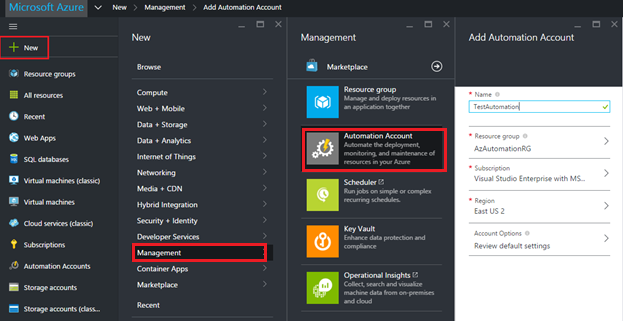

<properties
   pageTitle="Configuring Azure Automation"
   description="Describes steps that you must perform to configure Azure Automation for initial use."
   services="automation"
   documentationCenter=""
   authors="MGoedtel"
   manager="stevenka"
   editor="tysonn" />
<tags
   ms.service="automation"
   ms.devlang="na"
   ms.topic="get-started-article"
   ms.tgt_pltfrm="na"
   ms.workload="infrastructure-services"
   ms.date="02/23/2016"
   ms.author="magoedte;bwren" />

# Configuring Azure Automation

This article describes the actions you must perform to initially start using Azure Automation.

## Automation accounts

When you start Azure Automation for the first time, you must create at least one Automation account. Automation accounts allow you to isolate your Automation resources (runbooks, assets, configurations) from the Automation resources contained in other Automation accounts. You can use Automation accounts to separate Automation resources into separate logical environments. For example, you might use one account for development and another for production.

The Automation resources for each Automation account are associated with a single Azure region, but Automation accounts can manage Azure services in any region. The main reason to create Automation accounts in different regions would be if you have policies that require data and resources to be isolated to a specific region.

>[AZURE.NOTE] Automation accounts, and the resources they contain, that are created with the Azure portal cannot be accessed in the Azure classic portal. If you want to manage these accounts or their resources with Windows PowerShell, you must use the Azure Resource Manager modules. 
>
>Automation accounts created with the Azure classic portal can be managed by either portal and either set of cmdlets. Once the account is created, it makes no difference how you create and manage resources within the account. If you are planning to continue to use the Azure classic portal, then you should use it instead of the Azure portal to create any Automation accounts.

An Automation account may be suspended if there is an issue with your Azure account, such as an overdue payment. In this case, you can’t access the account, any running jobs will be suspended, and all schedules will be disabled. You will be able to view the account, but you won’t be able to see any resources in it. Once you correct the issue and the Automation account is enabled, you will have to enable your schedules and restart any runbooks that were suspended.

## Configuring authentication to Azure resources

When you access Azure resources using the [Azure cmdlets](http://msdn.microsoft.com/library/azure/jj554330.aspx), you need to provide authentication to your Azure subscription. In Azure Automation, this is done with an organizational account in Azure Active Directory that you configure as an administrator for your subscription. You can then create a [credential](http://msdn.microsoft.com/library/dn940015.aspx) for this user account and use it with [Add-AzureAccount](http://msdn.microsoft.com/library/azure/dn722528.aspx) in your runbook.

>[AZURE.NOTE] Microsoft accounts, formerly known as LiveIDs, cannot be used with Azure Automation.

## Create a new Azure Active Directory user to manage an Azure subscription

1. Log in to the Azure classic portal as a service administrator for the Azure subscription you want to manage.
2. Select **Active Directory**
3. Select the directory name that is associated with your Azure subscription. If necessary, you can change this association from **Settings > Subscriptions > Edit Directory**.
4. [Create a new Active Directory user](http://msdn.microsoft.com/library/azure/hh967632.aspx).  Select **New user in your organization** for the **Type of user** and do not **Enable Multi-Factor Authentication**.
5. Note the user’s full name and temporary password.
7. Select **Settings > Administrators > Add**.
8. Type the full user name of the user that you created.
9. Select the subscription that you want the user to manage.
10. Log out of Azure and then log back in with the account you just created. You will be prompted to change the user’s password.
11. Create a new [Azure Automation Credential asset](automation-credentials.md) for the user account that you created. The **Credential Type** should be **Windows PowerShell Credential**.

## Create an automation account

An automation account is a container for your Azure Automation resources. It provides a way to separate your environments or further organize your workflows. If you've already created an automation account, you can skip this step.

1. Log in to the [Azure portal](https://portal.azure.com/).

2. Click **New** > **Management** > **Automation Account**

3. In the **Add Automation Account** blade, configure your Automation Account details. 

>[AZURE.NOTE] When an Automation account is created using the Azure portal, the account and all the resources associated with it are not brought back to the Azure classic portal. 

Below is the list of parameters to configure:

|Parameter            |Description |
|:---|:---|
| Name | Name of your Automation Account; it must be a unique value. |
| Resource Group | Resource groups make it simple to see and manage related Azure resources. In the Azure portal, you can choose an existing resource group or create a new one for your Automation Account, whereas in the Azure classic portal, all the Automation Accounts would be placed in a default resource group. |
| Subscription | Choose a subscription from the list of available subscriptions. |
| Region | The region specifies where the Automation resources in the account will be stored. You can choose any region from the list, this will not affect the functionality of your account, but your runbooks may execute faster if your account region is near where your other Azure resources are stored. |
| Account Options | This option allows you to choose what resources will be created in your new Automation Account; selecting **Yes** will create a tutorial runbook. |

>[AZURE.NOTE] When an Automation Account created using the Azure classic portal is [moved to a different resource group](../resource-group-move-resources.md) using the Azure portal, the Automation Account will no longer be available in Azure classic portal.

## Use the credential in a runbook

You can retrieve the credential in a runbook using the [Get-AutomationPSCredential](http://msdn.microsoft.com/library/dn940015.aspx) activity and then use it with [Add-AzureAccount](http://msdn.microsoft.com/library/azure/dn722528.aspx) to connect to your Azure subscription. If the credential is an administrator of multiple Azure subscriptions, then you should also use [Select-AzureSubscription](http://msdn.microsoft.com/library/dn495203.aspx) to specify the correct one. This is shown in the sample Windows PowerShell below that will typically appear at the top of most Azure Automation runbooks.

    $cred = Get-AutomationPSCredential –Name "myuseraccount.onmicrosoft.com"
	Add-AzureAccount –Credential $cred
	Select-AzureSubscription –SubscriptionName "My Subscription"

You should repeat these lines after any [checkpoints](http://technet.microsoft.com/library/dn469257.aspx#bk_Checkpoints) in your runbook. If the runbook is suspended and then resumes on another worker, then it will need to perform the authentication again.

## Related articles
- [Azure Automation: Authenticating to Azure using Azure Active Directory](https://azure.microsoft.com/blog/2014/08/27/azure-automation-authenticating-to-azure-using-azure-active-directory/)
 
