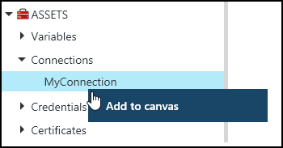
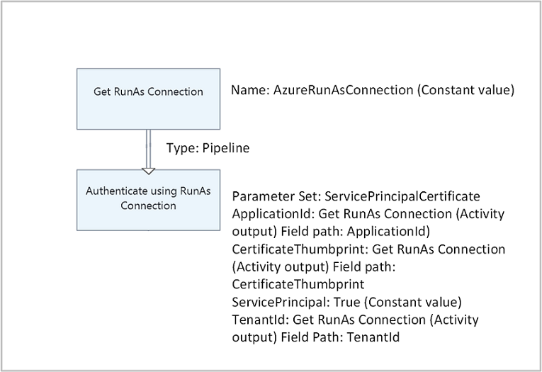

# Connection assets in Azure Automation

An Automation connection asset contains the information required to connect to an external service or application from a runbook or DSC configuration. This may include information required for authentication such as a username and password in addition to connection information such as a URL or a port. The value of a connection is keeping all of the properties for connecting to a particular application in one asset as opposed to creating multiple variables. The user can edit the values for a connection in one place, and you can pass the name of a connection to a runbook or DSC configuration in a single parameter. The properties for a connection can be accessed in the runbook or DSC configuration with the **Get-AutomationConnection** activity. 

When you create a connection, you must specify a *connection type*. The connection type is a template that defines a set of properties. The connection defines values for each property defined in its connection type. Connection types are added to Azure Automation in integration modules or created with the [Azure Automation API](/previous-versions/azure/reference/mt163818(v=azure.100)) if the integration module includes a connection type and is imported into your Automation account. Otherwise, you will need to create a metadata file to specify an Automation connection type.  For further information regarding this, see [Integration Modules](automation-integration-modules.md).  

>[!NOTE]
>Secure assets in Azure Automation include credentials, certificates, connections, and encrypted variables. These assets are encrypted and stored in Azure Automation using a unique key that is generated for each automation account. This key is stored in a system managed Key Vault. Before storing a secure asset, the key is loaded from Key Vault and then used to encrypt the asset. This process is managed by Azure Automation.

## Connection types

There are three types of built in connections available in Azure Automation:

* **Azure** - This connection can be used to manage classic resources.
* **AzureClassicCertificate** - This connection is used by the **AzureClassicRunAs** account.
* **AzureServicePrincipal** - This connection is used by the **AzureRunAs** account.

In most cases you do not need to create a connection resource as it is created when you create a [RunAs account](manage-runas-account.md).

## Windows PowerShell Cmdlets

The cmdlets in the following table are used to create and manage Automation connections with Windows PowerShell. They ship as part of the [Azure PowerShell module](/powershell/azure/overview) which is available for use in Automation runbooks and DSC configurations.

|Cmdlet|Description|
|:---|:---|
|[Get-AzureRmAutomationConnection](/powershell/module/azurerm.automation/get-azurermautomationconnection)|Retrieves a connection. Includes a hash table with the values of the connection’s fields.|
|[New-AzureRmAutomationConnection](/powershell/module/azurerm.automation/new-azurermautomationconnection)|Creates a new connection.|
|[Remove-AzureRmAutomationConnection](/powershell/module/azurerm.automation/remove-azurermautomationconnection)|Remove an existing connection.|
|[Set-AzureRmAutomationConnectionFieldValue](/powershell/module/azurerm.automation/set-azurermautomationconnectionfieldvalue)|Sets the value of a particular field for an existing connection.|

## Activities

The activities in the following table are used to access connections in a runbook or DSC configuration.

|Activities|Description|
|---|---|
|[Get-AutomationConnection](/powershell/module/servicemanagement/azure/get-azureautomationconnection?view=azuresmps-3.7.0)|Gets a connection to use. Returns a hash table with the properties of the connection.|

>[!NOTE] 
>You should avoid using variables with the –Name parameter of **Get-AutomationConnection** since this can complicate discovering dependencies between runbooks or DSC configurations, and connection assets at design time.

 
## Python2 functions 
The function in the following table is used to access connections in a Python2 runbook. 

| Function | Description | 
|:---|:---| 
| automationassets.get_automation_connection | Retrieves a connection. Returns a dictionary with the properties of the connection. | 

> [!NOTE] 
> You must import the "automationassets" module at the top of your Python runbook in order to access the asset functions.

## Creating a New Connection

### To create a new connection with the Azure portal

1. From your automation account, click the **Assets** part to open the **Assets** blade.
2. Click the **Connections** part to open the **Connections** blade.
3. Click **Add a connection** at the top of the blade.
4. In the **Type** dropdown, select the type of connection you want to create. The form will present the properties for that particular type.
5. Complete the form and click **Create** to save the new connection.

### To create a new connection with Windows PowerShell

Create a new connection with Windows PowerShell using the [New-AzureRmAutomationConnection](/powershell/module/azurerm.automation/new-azurermautomationconnection) cmdlet. This cmdlet has a parameter named **ConnectionFieldValues** that expects a [hash table](https://technet.microsoft.com/library/hh847780.aspx) defining values for each of the properties defined by the connection type.

If you are familiar with the Automation [Run As account](automation-sec-configure-azure-runas-account.md) to authenticate runbooks using the service principal, the PowerShell script, provided as an alternative to creating the Run As account from the portal, creates a new connection asset using the following sample commands.  

```powershell
$ConnectionAssetName = "AzureRunAsConnection"
$ConnectionFieldValues = @{"ApplicationId" = $Application.ApplicationId; "TenantId" = $TenantID.TenantId; "CertificateThumbprint" = $Cert.Thumbprint; "SubscriptionId" = $SubscriptionId}
New-AzureRmAutomationConnection -ResourceGroupName $ResourceGroup -AutomationAccountName $AutomationAccountName -Name $ConnectionAssetName -ConnectionTypeName AzureServicePrincipal -ConnectionFieldValues $ConnectionFieldValues
```

You are able to use the script to create the connection asset because when you create your Automation account, it automatically includes several global modules by default along with the connection type **AzureServicePrincipal** to create the **AzureRunAsConnection** connection asset.  This is important to keep in mind, because if you attempt to create a new connection asset to connect to a service or application with a different authentication method, it will fail because the connection type is not already defined in your Automation account.  For further information on how to create your own connection type for your custom or module from the [PowerShell Gallery](https://www.powershellgallery.com), see [Integration Modules](automation-integration-modules.md)
  
## Using a connection in a runbook or DSC configuration

You retrieve a connection in a runbook or DSC configuration with the **Get-AutomationConnection** cmdlet.  You cannot use the [Get-AzureRmAutomationConnection](/powershell/module/azurerm.automation/get-azurermautomationconnection) activity.  This activity retrieves the values of the different fields in the connection and returns them as a [hash table](https://go.microsoft.com/fwlink/?LinkID=324844) which can then be used with the appropriate commands in the runbook or DSC configuration.

### Textual runbook sample

The following sample commands show how to use the Run As account mentioned earlier, to authenticate with Azure Resource Manager resources in your runbook.  It uses the connection asset representing the Run As account, which references the certificate-based service principal, not credentials.  

```powershell
$Conn = Get-AutomationConnection -Name AzureRunAsConnection 
Connect-AzureRmAccount -ServicePrincipal -Tenant $Conn.TenantID -ApplicationId $Conn.ApplicationID -CertificateThumbprint $Conn.CertificateThumbprint
```

> [!IMPORTANT]
> **Add-AzureRmAccount** is now an alias for **Connect-AzureRMAccount**. When searching your library items, if you do not see **Connect-AzureRMAccount**, you can use **Add-AzureRmAccount**, or you can update your modules in your Automation Account.

### Graphical runbook samples

You add a **Get-AutomationConnection** activity to a graphical runbook by right-clicking on the connection in the Library pane of the graphical editor and selecting **Add to canvas**.



The following image shows an example of using a connection in a graphical runbook.  This is the same example shown above for authenticating using the Run As account with a textual runbook.  This example uses the **Constant value** data set for the **Get RunAs Connection** activity that uses a connection object for authentication.  A [pipeline link](automation-graphical-authoring-intro.md#links-and-workflow) is used here since the ServicePrincipalCertificate parameter set is expecting a single object.



### Python2 runbook sample
The following sample shows how to authenticate using the Run As connection in a Python2 runbook.

```python
""" Tutorial to show how to authenticate against Azure resource manager resources """
import azure.mgmt.resource
import automationassets


def get_automation_runas_credential(runas_connection):
    """ Returns credentials to authenticate against Azure resoruce manager """
    from OpenSSL import crypto
    from msrestazure import azure_active_directory
    import adal

    # Get the Azure Automation Run As service principal certificate
    cert = automationassets.get_automation_certificate("AzureRunAsCertificate")
    pks12_cert = crypto.load_pkcs12(cert)
    pem_pkey = crypto.dump_privatekey(
        crypto.FILETYPE_PEM, pks12_cert.get_privatekey())

    # Get Run As connection information for the Azure Automation service principal
    application_id = runas_connection["ApplicationId"]
    thumbprint = runas_connection["CertificateThumbprint"]
    tenant_id = runas_connection["TenantId"]

    # Authenticate with service principal certificate
    resource = "https://management.core.windows.net/"
    authority_url = ("https://login.microsoftonline.com/" + tenant_id)
    context = adal.AuthenticationContext(authority_url)
    return azure_active_directory.AdalAuthentication(
        lambda: context.acquire_token_with_client_certificate(
            resource,
            application_id,
            pem_pkey,
            thumbprint)
    )


# Authenticate to Azure using the Azure Automation Run As service principal
runas_connection = automationassets.get_automation_connection(
    "AzureRunAsConnection")
azure_credential = get_automation_runas_credential(runas_connection)
```

## Next steps

- Review [Links in graphical authoring](automation-graphical-authoring-intro.md#links-and-workflow) to understand how to direct and control the flow of logic in your runbooks.  

- To learn more about Azure Automation's use of PowerShell modules and best practices for creating your own PowerShell modules to work as Integration Modules within Azure Automation, see [Integration Modules](automation-integration-modules.md).  

