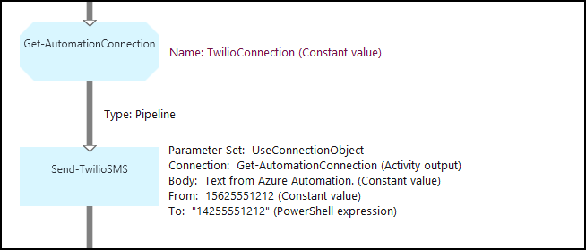
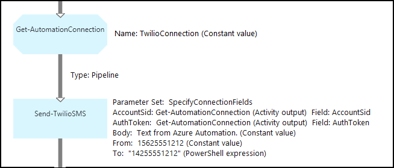

<properties 
   pageTitle="Connection assets in Azure Automation | Microsoft Azure"
   description="Connection assets in Azure Automation contain the information required to connect to an external service or application from a runbook or DSC configuration. This article explains the details of connections and how to work with them in both textual and graphical authoring."
   services="automation"
   documentationCenter=""
   authors="bwren"
   manager="stevenka"
   editor="tysonn" />
<tags 
   ms.service="automation"
   ms.devlang="na"
   ms.topic="article"
   ms.tgt_pltfrm="na"
   ms.workload="infrastructure-services"
   ms.date="10/23/2015"
   ms.author="bwren" />

# Connection assets in Azure Automation runbooks and DSC configurations

An Automation connection asset contains the information required to connect to an external service or application from a runbook or DSC configuration. This may include information required for authentication such as a username and password in addition to connection information such as a URL or a port. The value of a connection is keeping all of the properties for connecting to a particular application in one asset as opposed to creating multiple variables. The user can edit the values for a connection in one place, and you can pass the name of a connection to a runbook or DSC configuration in a single parameter. The properties for a connection can be accessed in the runbook or DSC configuration with the **Get-AutomationConnection** activity.

When you create a connection, you must specify a *connection type*. The connection type is a template that defines a set of properties. The connection defines values for each property defined in its connection type. Connection types are added to Azure Automation in integration modules or created with the [Azure Automation API](http://msdn.microsoft.com/library/azure/mt163818.aspx). The only connection types that are available when you create a connection are those installed in your automation account.

>[AZURE.NOTE] Secure assets in Azure Automation include credentials, certificates, connections, and encrypted variables. These assets are encrypted and stored in the Azure Automation using a unique key that is generated for each automation account. This key is encrypted by a master certificate and stored in Azure Automation. Before storing a secure asset, the key for the automation account is decrypted using the master certificate and then used to encrypt the asset.

## Windows PowerShell Cmdlets

The cmdlets in the following table are used to create and manage Automation connections with Windows PowerShell They ship as part of the [Azure PowerShell module](../powershell-install-configure.md) which is available for use in Automation runbooks and DSC configurations.

|Cmdlet|Description|
|:---|:---|
|[Get-AzureAutomationConnection](http://msdn.microsoft.com/library/dn921828.aspx)|Retrieves a connection. Includes a hashtable with the values of the connection’s fields.|
|[New-AzureAutomationConnection](http://msdn.microsoft.com/library/dn921825.aspx)|Creates a new connection.|
|[Remove-AzureAutomationConnection](http://msdn.microsoft.com/library/dn921827.aspx)|Remove an existing connection.|
|[Set-AzureAutomationConnectionFieldValue](http://msdn.microsoft.com/library/dn921826.aspx)|Sets the value of a particular field for an existing connection.|

## Activities

The activities in the following table are used to access connections in a runbook or DSC configuration.

|Activities|Description|
|---|---|
|Get-AutomationConnection|Gets a connection to use. Returns a hashtable with the properties of the connection.|

>[AZURE.NOTE] You should avoid using variables in the –Name parameter of **Get- AutomationConnection** since this can complicate discovering dependencies between runbooks or DSC configurations, and connection assets at design time.

## Creating a New Connection

### To create a new connection with the Azure portal

1. From your automation account, click **Assets** at the top of the window.
1. At the bottom of the window, click **Add Setting**.
1. Click **Add Connection**.
2. In the **Connection Type** dropdown, select the type of connection you want to create.  The wizard will present the properties for that particular type.
1. Complete the wizard and click the checkbox to save the new connection.

### To create a new connection with the Azure preview portal

1. From your automation account, click the **Assets** part to open the **Assets** blade.
1. Click the **Connections** part to open the **Connections** blade.
1. Click **Add a connection** at the top of the blade.
2. In the **Type** dropdown, select the type of connection you want to create.  The form will present the properties for that particular type.
1. Complete the form and click **Create** to save the new connection.

### To create a new connection with Windows PowerShell

Create a new connection with Windows PowerShell using the [New-AzureAutomationConnection](http://msdn.microsoft.com/library/dn921825.aspx) cmdlet. This cmdlet has a parameter named **ConnectionFieldValues** that expects a [hash table](http://technet.microsoft.com/en-us/library/hh847780.aspx) defining values for each of the properties defined by the connection type.

The following sample commands create a new connection for [Twilio](http://www.twilio.com) which is a telephony service that allows you to send and receive text messages.  A sample integration module that includes a Twilio connection type is available in [Script Center](http://gallery.technet.microsoft.com/scriptcenter/Twilio-PowerShell-Module-8a8bfef8).  This connection type defines properties for Account SID and Authorization Token, which are required to validate your account when connecting to Twilio.  You must [download this module](http://gallery.technet.microsoft.com/scriptcenter/Twilio-PowerShell-Module-8a8bfef8) and install it in your automation account for this sample code to work.

	$AccountSid = "DAf5fed830c6f8fac3235c5b9d58ed7ac5"
	$AuthToken  = "17d4dadfce74153d5853725143c52fd1"
	$FieldValues = @{"AccountSid" = $AccountSid;"AuthToken"=$AuthToken}

	New-AzureAutomationConnection -AutomationAccountName "MyAutomationAccount" -Name "TwilioConnection" -ConnectionTypeName "Twilio" -ConnectionFieldValues $FieldValues

## Using a connection in a runbook or DSC configuration

You retrieve a connection in a runbook or DSC configuration with the **Get-AutomationConnection** cmdlet.  This activity retrieves the values of the different fields in the connection and returns them as a [hash table](http://go.microsoft.com/fwlink/?LinkID=324844) which can then be used with the appropriate commands in the runbook or DSC configuration.

### Textual runbook sample
The following sample commands show how to use the Twilio connection in the previous example to send a text message from a runbook.  The Send-TwilioSMS activity used here has two parameter sets that each use a different method for authenticating to the Twilio service.  One uses a connection object and another uses individual parameters for the Account SID and Authorization Token.  Both methods are shown in this sample.

	$Con = Get-AutomationConnection -Name "TwilioConnection"
	$NumTo = "14255551212"
	$NumFrom = "15625551212"
	$Body = "Text from Azure Automation."

	#Send text with connection object.
	Send-TwilioSMS -Connection $Con -From $NumFrom -To $NumTo -Body $Body

	#Send text with connection properties.
	Send-TwilioSMS -AccountSid $Con.AccountSid -AuthToken $Con.AuthToken $Con -From $NumFrom -To $NumTo -Body $Body

### Graphical runbook samples

You add a **Get-AutomationConnection** activity to a graphical runbook by right-clicking on the connection in the Library pane of the graphical editor and selecting **Add to canvas**.

The following image shows an example of using a connection in a graphical runbook.  This is the same example shown above for sending a text message using Twilio from a textual runbook.  This example uses the **UseConnectionObject** parameter set for the **Send-TwilioSMS** activity that uses a connection object for authentication to the service.  A [pipeline link](automation-graphical-authoring-intro.md#links-and-workflow) is used here since the Connection parameter is expecting a single object.

The reason that a PowerShell expression is used for the value in the **To** parameter instead of a Constant value is that this parameter expects a string array value type so that you can send to multiple numbers.  A PowerShell expression allows you to provide a single value or an array.

The image below shows the same example as above but uses the **SpecifyConnectionFields** parameter set that expects the AccountSid and AuthToken parameters to be specified individually as opposed to using a connection object for authentication.  In this case, fields of the connection are specified instead of the object itself.  

## Related articles

- [Links in graphical authoring](automation-graphical-authoring-intro.md#links-and-workflow)
 
