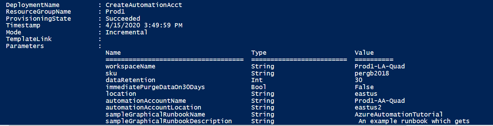

# Create an Automation account using an Azure Resource Manager template

You can use [Azure Resource Manager templates](../azure-resource-manager/templates/template-syntax.md) to create an Azure Automation account in your resource group. This article provides a sample template that:

* Automates the creation of an Azure Monitor Log Analytics workspace.
* Automates the creation of an Azure Automation account.
* Links the Automation account to the Log Analytics workspace.

The template doesn't automate the enabling of Azure or non-Azure virtual machines. 

>[!NOTE]
>Creation of the Automation Run As account is not supported when you're using an Azure Resource Manager template. To create a Run As account manually from the portal or with PowerShell, see [Manage Run As accounts](manage-runas-account.md).

After you complete these steps, you need to [configure diagnostic settings](automation-manage-send-joblogs-log-analytics.md) for your Automation account to send runbook job status and job streams to the linked Log Analytics workspace. 

## API versions

The following table lists the API version for the resources used in this example.

| Resource | Resource type | API version |
|:---|:---|:---|
| Workspace | workspaces | 2020-03-01-preview |
| Automation account | automation | 2018-06-30 | 

## Before you use the template

If you choose to install and use PowerShell locally, this article requires the Azure PowerShell Az module. Run `Get-Module -ListAvailable Az` to find the version. If you need to upgrade, see [Install the Azure PowerShell module](/powershell/azure/install-az-ps). If you're running PowerShell locally, you also need to run `Connect-AzAccount` to create a connection with Azure. With PowerShell, the deployment uses [New-AzResourceGroupDeployment](/powershell/module/az.resources/new-azresourcegroupdeployment).

If you choose to install and use the Azure CLI locally, this article requires that you're running version 2.1.0 or later. Run `az --version` to find the version. If you need to install or upgrade, see [Install the Azure CLI](https://docs.microsoft.com/cli/azure/install-azure-cli?view=azure-cli-latest). With the Azure CLI, this deployment uses [az group deployment create](https://docs.microsoft.com/cli/azure/group/deployment?view=azure-cli-latest#az-group-deployment-create). 

The JSON template is configured to prompt you for:

* The name of the workspace.
* The region to create the workspace in.
* To enable resource or workspace permissions.
* The name of the Automation account.
* The region to create the Automation account in.

The following parameters in the template are set with a default value for the Log Analytics workspace:

* *sku* defaults to the per GB pricing tier released in the April 2018 pricing model.
* *dataRetention* defaults to 30 days.

>[!WARNING]
>If you want to create or configure a Log Analytics workspace in a subscription that has opted into the April 2018 pricing model, the only valid Log Analytics pricing tier is *PerGB2018*.
>

The JSON template specifies a default value for the other parameters that would likely be used as a standard configuration in your environment. You can store the template in an Azure storage account for shared access in your organization. For more information about working with templates, see [Deploy resources with Resource Manager templates and the Azure CLI](../azure-resource-manager/templates/deploy-cli.md).

If you're new to Azure Automation and Azure Monitor, it's important that you understand the following configuration details. They can help you avoid errors when you try to create, configure, and use a Log Analytics workspace linked to your new Automation account.

* Review [additional details](../azure-monitor/platform/template-workspace-configuration.md#create-a-log-analytics-workspace) to fully understand workspace configuration options, such as access control mode, pricing tier, retention, and capacity reservation level.

* Review [workspace mappings](how-to/region-mappings.md) to specify the supported regions inline or in a parameter file. Only certain regions are supported for linking a Log Analytics workspace and an Automation account in your subscription.

* If you're new to Azure Monitor logs and have not deployed a workspace already, you should review the [workspace design guidance](../azure-monitor/platform/design-logs-deployment.md). It will help you to learn about access control, and understand the design implementation strategies we recommend for your organization.

## Deploy the template

1. Copy and paste the following JSON syntax into your file:

    ```json
    {
    "$schema": "https://schema.management.azure.com/schemas/2015-01-01/deploymentTemplate.json#",
    "contentVersion": "1.0.0.0",
    "parameters": {
        "workspaceName": {
            "type": "string",
            "metadata": {
                "description": "Workspace name"
            }
        },
        "sku": {
            "type": "string",
            "allowedValues": [
                "pergb2018",
                "Free",
                "Standalone",
                "PerNode",
                "Standard",
                "Premium"
            ],
            "defaultValue": "pergb2018",
            "metadata": {
                "description": "Pricing tier: perGB2018 or legacy tiers (Free, Standalone, PerNode, Standard or Premium), which are not available to all customers."
            }
        },
        "dataRetention": {
            "type": "int",
            "defaultValue": 30,
            "minValue": 7,
            "maxValue": 730,
            "metadata": {
                "description": "Number of days to retain data."
            }
        },
        "location": {
            "type": "string",
            "metadata": {
                "description": "Specifies the location in which to create the workspace."
            }
        },
    	"resourcePermissions": {
              "type": "bool",
              "metadata": {
                "description": "true to use resource or workspace permissions. false to require workspace permissions."
              }
        },
        "automationAccountName": {
            "type": "string",
            "metadata": {
                "description": "Automation account name"
            }
        },
        "automationAccountLocation": {
            "type": "string",
            "metadata": {
                "description": "Specify the location in which to create the Automation account."
            }
        },
    	"sampleGraphicalRunbookName": {
                "type": "String",
    			"defaultValue": "AzureAutomationTutorial"
            },
            "sampleGraphicalRunbookDescription": {
                "type": "String",
    			"defaultValue": " An example runbook that gets all the Resource Manager resources by using the Run As account (service principal)."
            },
            "sampleGraphicalRunbookContentUri": {
                "type": "String",
    			"defaultValue": "https://eus2oaasibizamarketprod1.blob.core.windows.net/marketplace-runbooks/AzureAutomationTutorial.graphrunbook"
            },
            "samplePowerShellRunbookName": {
                "type": "String",
    			"defaultValue": "AzureAutomationTutorialScript"
            },
            "samplePowerShellRunbookDescription": {
                "type": "String",
    			"defaultValue": " An example runbook that gets all the Resource Manager resources by using the Run As account (service principal)."
            },
            "samplePowerShellRunbookContentUri": {
                "type": "String",
    			"defaultValue": "https://eus2oaasibizamarketprod1.blob.core.windows.net/marketplace-runbooks/AzureAutomationTutorial.ps1"
            },
            "samplePython2RunbookName": {
                "type": "String",
    			"defaultValue": "AzureAutomationTutorialPython2"
            },
            "samplePython2RunbookDescription": {
                "type": "String",
    			"defaultValue": " An example runbook that gets all the Resource Manager resources by using the Run As account (service principal)."
            },
            "samplePython2RunbookContentUri": {
                "type": "String",
    			"defaultValue": "https://eus2oaasibizamarketprod1.blob.core.windows.net/marketplace-runbooks/AzureAutomationTutorialPython2.py"
    		}
    },
    "resources": [
        {
        "type": "Microsoft.OperationalInsights/workspaces",
            "name": "[parameters('workspaceName')]",
            "apiVersion": "2020-03-01-preview",
            "location": "[parameters('location')]",
            "properties": {
                "sku": {
                    "name": "[parameters('sku')]",
                },
                "retentionInDays": "[parameters('dataRetention')]",
                "features": {
                    "searchVersion": 1,
                    "legacy": 0,
                    "enableLogAccessUsingOnlyResourcePermissions": true
                }
            },
    	"resources": [
        {
            "type": "Microsoft.Automation/automationAccounts",
            "apiVersion": "2018-06-30",
            "name": "[parameters('automationAccountName')]",
            "location": "[parameters('automationAccountLocation')]",
            "dependsOn": [
    		     "[concat('Microsoft.OperationalInsights/workspaces/', parameters('workspaceName'))]",
    		],
            "tags": {},
            "properties": {
                "sku": {
                    "name": "Basic"
                }
            },
    		"resources": [
                    {
                        "type": "runbooks",
                        "apiVersion": "2018-06-30",
                        "name": "[parameters('sampleGraphicalRunbookName')]",
                        "location": "[parameters('automationAccountLocation')]",
                        "dependsOn": [
                            "[concat('Microsoft.Automation/automationAccounts/', parameters('automationAccountName'))]"
                        ],
                        "tags": {},
                        "properties": {
                            "runbookType": "GraphPowerShell",
                            "logProgress": "false",
                            "logVerbose": "false",
                            "description": "[parameters('sampleGraphicalRunbookDescription')]",
                            "publishContentLink": {
                                "uri": "[parameters('sampleGraphicalRunbookContentUri')]",
                                "version": "1.0.0.0"
                            }
                        }
                    },
                    {
                        "type": "runbooks",
                        "apiVersion": "2018-06-30",
                        "name": "[parameters('samplePowerShellRunbookName')]",
                        "location": "[parameters('automationAccountLocation')]",
                        "dependsOn": [
                            "[concat('Microsoft.Automation/automationAccounts/', parameters('automationAccountName'))]"
                        ],
                        "tags": {},
                        "properties": {
                            "runbookType": "PowerShell",
                            "logProgress": "false",
                            "logVerbose": "false",
                            "description": "[parameters('samplePowerShellRunbookDescription')]",
                            "publishContentLink": {
                                "uri": "[parameters('samplePowerShellRunbookContentUri')]",
                                "version": "1.0.0.0"
                            }
                        }
                    },
                    {
                        "type": "runbooks",
                        "apiVersion": "2018-06-30",
                        "name": "[parameters('samplePython2RunbookName')]",
                        "location": "[parameters('automationAccountLocation')]",
                        "dependsOn": [
                            "[concat('Microsoft.Automation/automationAccounts/', parameters('automationAccountName'))]"
                        ],
                        "tags": {},
                        "properties": {
                            "runbookType": "Python2",
                            "logProgress": "false",
                            "logVerbose": "false",
                            "description": "[parameters('samplePython2RunbookDescription')]",
                            "publishContentLink": {
                                "uri": "[parameters('samplePython2RunbookContentUri')]",
                                "version": "1.0.0.0"
                            }
                        }
                    }
                ]
        },
        {
            "apiVersion": "2020-03-01-preview",
            "type": "Microsoft.OperationalInsights/workspaces/linkedServices",
            "name": "[concat(parameters('workspaceName'), '/' , 'Automation')]",
            "location": "[parameters('location')]",
            "dependsOn": [
                "[concat('Microsoft.OperationalInsights/workspaces/', parameters('workspaceName'))]",
                "[concat('Microsoft.Automation/automationAccounts/', parameters('automationAccountName'))]"
            ],
            "properties": {
                "resourceId": "[resourceId('Microsoft.Automation/automationAccounts/', parameters('automationAccountName'))]"
            }
        }
       ]
      }
     ]
    }
    ```

2. Edit the template to meet your requirements. Consider creating a [Resource Manager parameter file](../azure-resource-manager/templates/parameter-files.md) instead of passing parameters as inline values.

3. Save this file as deployAzAutomationAccttemplate.json to a local folder.

4. You're ready to deploy this template. You can use either PowerShell or the Azure CLI. When you're prompted for a workspace and Automation account name, provide a name that's globally unique across all your Azure subscriptions.

    **PowerShell**

    ```powershell
    New-AzResourceGroupDeployment -Name <deployment-name> -ResourceGroupName <resource-group-name> -TemplateFile deployAzAutomationAccttemplate.json
    ```

    **Azure CLI**

    ```cli
    az group deployment create --resource-group <my-resource-group> --name <my-deployment-name> --template-file deployAzAutomationAccttemplate.json
    ```

    The deployment can take a few minutes to finish. When it does, you'll see a message like the following that includes the result.

    

## Next steps

To forward runbook job status and job streams to your linked Log Analytics workspace, review [Forward Azure Automation job data to Azure Monitor logs](automation-manage-send-joblogs-log-analytics.md). This configures the diagnostic settings of the Automation account using Azure PowerShell commands to complete the integration for sending logs to the workspace for analysis. 
