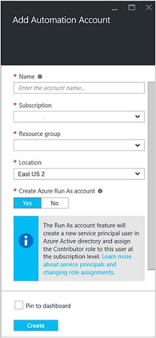

# Authenticate Runbooks with Azure classic deployment and Resource Manager
This article describes the steps you must perform to configure an Azure AD User account for Azure Automation runbooks running against Azure classic deployment model or Azure Resource Manager resources. While this continues to be a supported authentication identity for your Azure Resource Manager based runbooks, the recommended method is to use an Azure Run As account.       

## Create a new Azure Active Directory user
1. Log in to the Azure portal as a service administrator for the Azure subscription you want to manage.
2. Select **Azure Active Directory** > **Users and groups** > **All users** > **New user**.
3. Enter details for the user, like **Name** and **User name**.  
4. Note the user’s full name and temporary password.
5. Select **Directory role**.
6. Assign role Global or Limited Administrator.
7. Log out of Azure and then log back in with the account you just created.You are prompted to change the user’s password.

## Create an Automation account in the Azure portal
In this section, perform the following steps to create an Azure Automation account in the Azure portal for use with your runbooks managing resources in Azure Resource Manager mode.  

1. Log in to the Azure portal as a service administrator for the Azure subscription you want to manage.
2. Select **Automation Accounts**.
3. Select **Add**.  
4. In the **Add Automation Account** blade, in the **Name** box type in a name for your new Automation account.
5. If you have more than one subscription, specify the one for the new account, as well as a new or existing **Resource group** and an Azure datacenter **Location**.
6. Select the value **Yes** for the **Create Azure Run As account** option, and click the **Create** button.  
   
    > [!NOTE]
    > If you choose to not create the Run As account by selecting the option **No**, you are presented with a warning message in the **Add Automation Account** blade. While the account is created and assigned to the **Contributor** role in the subscription, it does not have a corresponding authentication identity within your subscriptions directory service and therefore, no access resources in your subscription. This prevents any runbooks referencing this account from being able to authenticate and perform tasks against Azure Resource Manager resources.
    > 
    >

        
7. While Azure creates the Automation account, you can track the progress under **Notifications** from the menu.

When the creation of the credential is completed, you need to create a Credential Asset to associate the Automation Account with the AD User account created earlier. Remember, you only created the Automation account and it is not associated with an authentication identity. Perform the steps outlined in the [Credential assets in Azure Automation article](automation-credentials.md#creating-a-new-credential-asset) and enter the value for **username** in the format **domain\user**.

## Use the credential in a runbook
You can retrieve the credential in a runbook using the [Get-AutomationPSCredential](http://msdn.microsoft.com/library/dn940015.aspx) activity and then use it with [Add-AzureAccount](http://msdn.microsoft.com/library/azure/dn722528.aspx) to connect to your Azure subscription. If the credential is an administrator of multiple Azure subscriptions, then you should also use [Select-AzureSubscription](http://msdn.microsoft.com/library/dn495203.aspx) to specify the correct one. This is shown in the following PowerShell sample that typically appears at the top of most Azure Automation runbooks.

    $cred = Get-AutomationPSCredential –Name "myuseraccount.onmicrosoft.com"
    Add-AzureAccount –Credential $cred
    Select-AzureSubscription –SubscriptionName "My Subscription"

Repeat these lines after any [checkpoints](http://technet.microsoft.com/library/dn469257.aspx#bk_Checkpoints) in your runbook. If the runbook is suspended and then resumes on another worker, then it needs to perform the authentication again.

## Next Steps
* Review the different runbook types and steps for creating your own runbooks from the following article [Azure Automation runbook types](automation-runbook-types.md)

