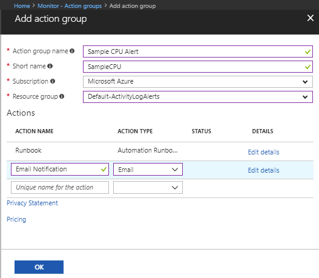

# Use an alert to trigger an Azure Automation runbook

You can use [Azure Monitor](../azure-monitor/overview.md?toc=%2fazure%2fautomation%2ftoc.json) to monitor base-level metrics and logs for most services in Azure. You can call Azure Automation runbooks by using [action groups](../azure-monitor/platform/action-groups.md?toc=%2fazure%2fautomation%2ftoc.json) or by using classic alerts to automate tasks based on alerts. This article shows you how to configure and run a runbook by using alerts.

## Alert types

You can use automation runbooks with three alert types:

* Common alerts
* Activity log alerts
* Near-real-time metric alerts

> [!NOTE]
> The common alert schema standardizes the consumption experience for alert notifications in Azure today. Historically, the three alert types in Azure today (metric, log, and activity log) have had their own email templates, webhook schemas, etc. To learn more, see [Common alert schema](../azure-monitor/platform/alerts-common-schema.md)

When an alert calls a runbook, the actual call is an HTTP POST request to the webhook. The body of the POST request contains a JSON-formated object that has useful properties that are related to the alert. The following table lists links to the payload schema for each alert type:

|Alert  |Description|Payload schema  |
|---------|---------|---------|
|[Common alert](../azure-monitor/platform/alerts-common-schema.md?toc=%2fazure%2fautomation%2ftoc.json)|The common alert schema that standardizes the consumption experience for alert notifications in Azure today.|Common alert payload schema|
|[Activity log alert](../azure-monitor/platform/activity-log-alerts.md?toc=%2fazure%2fautomation%2ftoc.json)    |Sends a notification when any new event in the Azure activity log matches specific conditions. For example, when a `Delete VM` operation occurs in **myProductionResourceGroup** or when a new Azure Service Health event with an Active status appears.| [Activity log alert payload schema](../azure-monitor/platform/activity-log-alerts-webhook.md)        |
|[Near real-time metric alert](../azure-monitor/platform/alerts-metric-near-real-time.md?toc=%2fazure%2fautomation%2ftoc.json)    |Sends a notification faster than metric alerts when one or more platform-level metrics meet specified conditions. For example, when the value for **CPU %** on a VM is greater than 90, and the value for **Network In** is greater than 500 MB for the past 5 minutes.| [Near real-time metric alert payload schema](../azure-monitor/platform/alerts-webhooks.md#payload-schema)          |

Because the data that's provided by each type of alert is different, each alert type is handled differently. In the next section, you learn how to create a runbook to handle different types of alerts.

## Create a runbook to handle alerts

To use Automation with alerts, you need a runbook that has logic that manages the alert JSON payload that's passed to the runbook. The following example runbook must be called from an Azure alert.

As described in the preceding section, each type of alert has a different schema. The script takes the webhook data from an alert in the `WebhookData` runbook input parameter. Then, the script evaluates the JSON payload to determine which alert type is being used.

This example uses an alert from a VM. It retrieves the VM data from the payload, and then uses that information to stop the VM. The connection must be set up in the Automation account where the runbook is run. When using alerts to trigger runbooks, it is important to check the alert status in the runbook that is triggered. The runbook triggers each time the alert changes state. Alerts have multiple states, with the two most common being Activated and Resolved. Check for state in your runbook logic to ensure that the runbook does not run more than once. The example in this article shows how to look for alerts with state Activated only.

The runbook uses the connection asset `AzureRunAsConnection` [Run As account](automation-create-runas-account.md) to authenticate with Azure to perform the management action against the VM.

Use this example to create a runbook called **Stop-AzureVmInResponsetoVMAlert**. You can modify the PowerShell script, and use it with many different resources.

1. Go to your Azure Automation account.
2. Under **Process Automation**, select **Runbooks**.
3. At the top of the list of runbooks, select **+ Create a runbook**.
4. On the **Add Runbook** page, enter **Stop-AzureVmInResponsetoVMAlert** for the runbook name. For the runbook type, select **PowerShell**. Then, select **Create**.  
5. Copy the following PowerShell example into the **Edit** page.

    ```powershell-interactive
    [OutputType("PSAzureOperationResponse")]
    param
    (
        [Parameter (Mandatory=$false)]
        [object] $WebhookData
    )
    $ErrorActionPreference = "stop"

    if ($WebhookData)
    {
        # Get the data object from WebhookData
        $WebhookBody = (ConvertFrom-Json -InputObject $WebhookData.RequestBody)

        # Get the info needed to identify the VM (depends on the payload schema)
        $schemaId = $WebhookBody.schemaId
        Write-Verbose "schemaId: $schemaId" -Verbose
        if ($schemaId -eq "azureMonitorCommonAlertSchema") {
            # This is the common Metric Alert schema (released March 2019)
            $Essentials = [object] ($WebhookBody.data).essentials
            # Get the first target only as this script doesn't handle multiple
            $alertTargetIdArray = (($Essentials.alertTargetIds)[0]).Split("/")
            $SubId = ($alertTargetIdArray)[2]
            $ResourceGroupName = ($alertTargetIdArray)[4]
            $ResourceType = ($alertTargetIdArray)[6] + "/" + ($alertTargetIdArray)[7]
            $ResourceName = ($alertTargetIdArray)[-1]
            $status = $Essentials.monitorCondition
        }
        elseif ($schemaId -eq "AzureMonitorMetricAlert") {
            # This is the near-real-time Metric Alert schema
            $AlertContext = [object] ($WebhookBody.data).context
            $SubId = $AlertContext.subscriptionId
            $ResourceGroupName = $AlertContext.resourceGroupName
            $ResourceType = $AlertContext.resourceType
            $ResourceName = $AlertContext.resourceName
            $status = ($WebhookBody.data).status
        }
        elseif ($schemaId -eq "Microsoft.Insights/activityLogs") {
            # This is the Activity Log Alert schema
            $AlertContext = [object] (($WebhookBody.data).context).activityLog
            $SubId = $AlertContext.subscriptionId
            $ResourceGroupName = $AlertContext.resourceGroupName
            $ResourceType = $AlertContext.resourceType
            $ResourceName = (($AlertContext.resourceId).Split("/"))[-1]
            $status = ($WebhookBody.data).status
        }
        elseif ($schemaId -eq $null) {
            # This is the original Metric Alert schema
            $AlertContext = [object] $WebhookBody.context
            $SubId = $AlertContext.subscriptionId
            $ResourceGroupName = $AlertContext.resourceGroupName
            $ResourceType = $AlertContext.resourceType
            $ResourceName = $AlertContext.resourceName
            $status = $WebhookBody.status
        }
        else {
            # Schema not supported
            Write-Error "The alert data schema - $schemaId - is not supported."
        }

        Write-Verbose "status: $status" -Verbose
        if (($status -eq "Activated") -or ($status -eq "Fired"))
        {
            Write-Verbose "resourceType: $ResourceType" -Verbose
            Write-Verbose "resourceName: $ResourceName" -Verbose
            Write-Verbose "resourceGroupName: $ResourceGroupName" -Verbose
            Write-Verbose "subscriptionId: $SubId" -Verbose

            # Determine code path depending on the resourceType
            if ($ResourceType -eq "Microsoft.Compute/virtualMachines")
            {
                # This is an Resource Manager VM
                Write-Verbose "This is an Resource Manager VM." -Verbose

                # Authenticate to Azure with service principal and certificate and set subscription
                Write-Verbose "Authenticating to Azure with service principal and certificate" -Verbose
                $ConnectionAssetName = "AzureRunAsConnection"
                Write-Verbose "Get connection asset: $ConnectionAssetName" -Verbose
                $Conn = Get-AutomationConnection -Name $ConnectionAssetName
                if ($Conn -eq $null)
                {
                    throw "Could not retrieve connection asset: $ConnectionAssetName. Check that this asset exists in the Automation account."
                }
                Write-Verbose "Authenticating to Azure with service principal." -Verbose
                Add-AzAccount -ServicePrincipal -Tenant $Conn.TenantID -ApplicationId $Conn.ApplicationID -CertificateThumbprint $Conn.CertificateThumbprint | Write-Verbose
                Write-Verbose "Setting subscription to work against: $SubId" -Verbose
                Set-AzContext -SubscriptionId $SubId -ErrorAction Stop | Write-Verbose

                # Stop the Resource Manager VM
                Write-Verbose "Stopping the VM - $ResourceName - in resource group - $ResourceGroupName -" -Verbose
                Stop-AzVM -Name $ResourceName -ResourceGroupName $ResourceGroupName -Force
                # [OutputType(PSAzureOperationResponse")]
            }
            else {
                # ResourceType not supported
                Write-Error "$ResourceType is not a supported resource type for this runbook."
            }
        }
        else {
            # The alert status was not 'Activated' or 'Fired' so no action taken
            Write-Verbose ("No action taken. Alert status: " + $status) -Verbose
        }
    }
    else {
        # Error
        Write-Error "This runbook is meant to be started from an Azure alert webhook only."
    }
    ```

6. Select **Publish** to save and publish the runbook.

## Create the alert

Alerts use action groups, which are collections of actions that are triggered by the alert. Runbooks are just one of the many actions that you can use with action groups.

1. In your Automation account, select **Alerts** under **Monitoring**.
1. Select **+ New alert rule**.
1. Click **Select** under **Resource**. On the **Select a resource** page, select your VM to alert off of, and click **Done**.
1. Click **Add condition** under **Condition**. Select the signal you want to use, for example **Percentage CPU** and click **Done**.
1. On the **Configure signal logic** page, enter your **Threshold value** under **Alert logic**, and click **Done**.
1. Under **Action groups**, select **Create New**.
1. On the **Add action group** page, give your action group a name and a short name.
1. Give the action a name. For the action type, select **Automation Runbook**.
1. Select **Edit Details**. On the **Configure Runbook** page, under **Runbook source**, select **User**.  
1. Select your **Subscription** and **Automation account**, and then select the **Stop-AzureVmInResponsetoVMAlert** runbook.  
1. Select **Yes** for **Enable the common alert schema**.
1. To create the action group, select **OK**.

    

    You can use this action group in the [activity log alerts](../azure-monitor/platform/activity-log-alerts.md?toc=%2fazure%2fautomation%2ftoc.json) and [near real-time alerts](../azure-monitor/platform/alerts-overview.md?toc=%2fazure%2fautomation%2ftoc.json) that you create.

1. Under **Alert Details**, add an alert rule name and description and click **Create alert rule**.

## Next steps

* To start a runbook using a webhook, see [Start a runbook from a webhook](automation-webhooks.md).
* To discover different ways to start a runbook, see [Start a runbook](automation-starting-a-runbook.md).
* To create an activity log alert, see [Create activity log alerts](../azure-monitor/platform/activity-log-alerts.md?toc=%2fazure%2fautomation%2ftoc.json).
* To learn how to create a near real-time alert, see [Create an alert rule in the Azure portal](../azure-monitor/platform/alerts-metric.md?toc=/azure/azure-monitor/toc.json).
* For a PowerShell cmdlet reference, see [Az.Automation](https://docs.microsoft.com/powershell/module/az.automation/?view=azps-3.7.0#automation).
