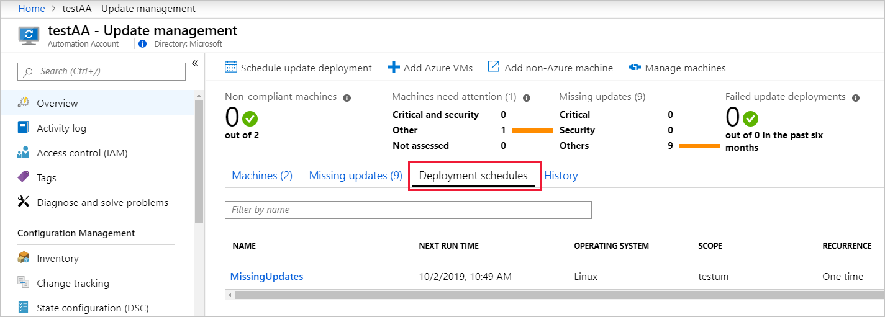
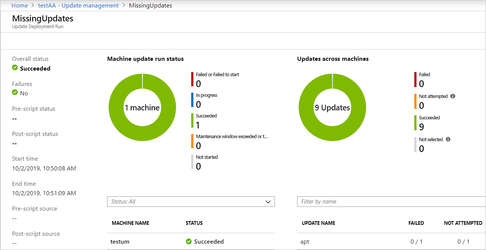
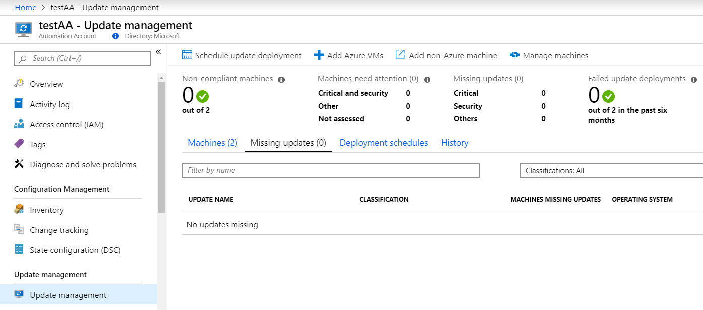

# Quickstart: Install updates using Update Management

After updates are assessed for all the Linux and Windows computers in your workspace, you can install required updates by creating an **Update deployment**. An **Update Deployment** is a scheduled installation of required updates for one or more computers. To create an **Update Deployment**, you must have write access to the Automation Account and write access to the any Azure VMs that are targeted in the deployment. You specify the date and time for the deployment and a computer or group of computers to include in the scope of a deployment. To learn more about computer groups, see [Computer groups in Azure Monitor logs](../azure-monitor/platform/computer-groups.md).

In this Quickstart, you will learn how to:

> [!div class="checklist"]
> - View missing updates
> - Create an Update Deployment
> - View Update Deployments

## Prerequisites

## View missing updates

Select **Missing updates** to view the list of updates that are missing from your machines. Each update is listed and can be selected. Information about the number of machines that require the update, the operating system, and a link for more information is shown. The **Log search** pane shows more details about the updates.

In the image below, you can see that one of our machines is missing updates. In the next step, we will create an **Update Deployment** to install the updates.


### Update classifications

The following tables list the update classifications in Update Management, with a definition for each classification.

#### Windows

|Classification  |Description  |
|---------|---------|
|Critical updates     | An update for a specific problem that addresses a critical, non-security-related bug.        |
|Security updates     | An update for a product-specific, security-related issue.        |
|Update rollups     | A cumulative set of hotfixes that are packaged together for easy deployment.        |
|Feature packs     | New product features that are distributed outside a product release.        |
|Service packs     | A cumulative set of hotfixes that are applied to an application.        |
|Definition updates     | An update to virus or other definition files.        |
|Tools     | A utility or feature that helps complete one or more tasks.        |
|Updates     | An update to an application or file that currently is installed.        |

#### <a name="linux-2"></a>Linux

|Classification  |Description  |
|---------|---------|
|Critical and security updates     | Updates for a specific problem or a product-specific, security-related issue.         |
|Other updates     | All other updates that aren't critical in nature or aren't security updates.        |

For Linux, Update Management can distinguish between critical and security updates in the cloud while displaying assessment data due to data enrichment in the cloud. For patching, Update Management relies on classification data available on the machine. Unlike other distributions, CentOS does not have this information available out of the box. If you have CentOS machines configured in a way to return security data for the following command, Update Management will be able to patch based on classifications.

```bash
sudo yum -q --security check-update
```

There's currently no method supported method to enable native classification-data availability on CentOS. At this time, only best-effort support is provided to customers who may have enabled this on their own.

## Create an Update Deployment

To create a new update deployment, select **Schedule update deployment**. The **New Update Deployment** page opens. For this deployment, we will select **Machines to Update** which opens the **Select machines** blade. Change the **Type** dropdown to *Machines* and select the machine to update. As our missing updates were all for Linux, we will select the Linux machine.


We will not be changing the [Maintenance Window](#maintenance-windows) or **Reboot Settings**, and we will not change the **Schedule Settings**, as it defaults to now.

Click **Create** to finalize the new **Update Deployment**.

Below is a list of all available **Update Deployment** properties and their descriptions for reference.

### New Update Deployment properties


## View update deployments

Now that we have created a new **Update Deployment**, select the **Deployment Schedules** tab to view the list of scheduled update deployments.



Next, select the **History** tab and click on the most recent run of your **Update Deployment** to open the **Update Deployment Run** pane for that update deployment. Job logs are stored for a max of 30 days.



To view an update deployment from the REST API, see [Software Update Configuration Runs](/rest/api/automation/softwareupdateconfigurationruns).

After the agent refreshes(?) we see that our machines now have no missing updates.



## Clean up resources

## Next Steps

> [!div class="nextstepaction"]
> [Manage updates and patches for your Azure Windows VMs](automation-tutorial-update-management.md)
