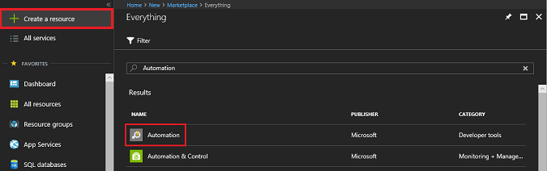
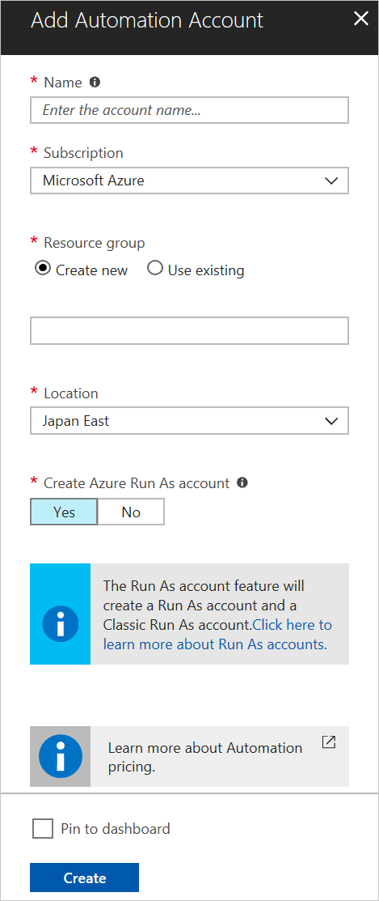
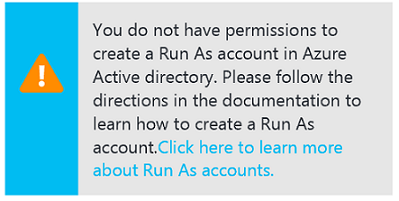
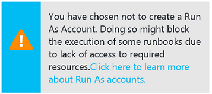

# Create a standalone Azure Automation account

This article shows you how to create an Azure Automation account in the Azure portal. You can use the portal Automation account to evaluate and learn about Automation without using additional management features or integrating with Azure Monitor logs. You can add management features or integrate with Azure Monitor logs for advanced monitoring of runbook jobs at any point in the future.

With an Automation account, you can authenticate runbooks by managing resources in either Azure Resource Manager or the classic deployment model. One Automation Account can manage resources across all regions and subscriptions for a given tenant.

When you create an Automation account in the Azure portal, the **Run As** account is automatically created. This account does the following tasks:

* Creates a service principal in Azure Active Directory (Azure AD).
* Creates a certificate.
* Assigns the Contributor Role-Based Access Control (RBAC), which manages Azure Resource Manager resources by using runbooks.

With this account created for you, you can quickly start building and deploying runbooks to support your automation needs.

## Permissions required to create an Automation account

To create or update an Automation account, and to complete the tasks described in this article, you must have the following privileges and permissions:

* To create an Automation account, your Azure AD user account must be added to a role with permissions equivalent to the Owner role for `Microsoft.Automation` resources. For more information, see [Role-Based Access Control in Azure Automation](automation-role-based-access-control.md).
* In the Azure portal, under **Azure Active Directory** > **MANAGE** > **User settings**, if **App registrations** is set to **Yes**, non-administrator users in your Azure AD tenant can [register Active Directory applications](../active-directory/develop/howto-create-service-principal-portal.md#check-azure-subscription-permissions). If **App registrations** is set to **No**, the user who performs this action must have at least an Application Developer role in Azure AD.

If you aren't a member of the subscription's Active Directory instance before you're added to the subscription's global Administrator/Coadministrator role, you're added to Active Directory as a guest. In this scenario, you see this message on the Add Automation Account pane: `You do not have permissions to create.`

If a user is added to the global Administrator/Coadministrator role first, you can remove the user from the subscription's Active Directory instance. You can readd the user to the User role in Active Directory. To verify user roles:

1. In the Azure portal, go to the Azure Active Directory pane.
1. Select **Users and groups**.
1. Select **All users**.
1. After you select a specific user, select **Profile**. The value of the **User type** attribute under the user's profile should not be **Guest**.

## Create a new Automation account in the Azure portal

To create an Azure Automation account in the Azure portal, complete the following steps:

1. Sign in to the Azure portal with an account that's a member of the subscription Administrators role and a coadministrator of the subscription.
1. Select **+ Create a Resource**.
1. Search for **Automation**. In the search results, select **Automation**.

   

1. On the next screen, select **Create new**.

   

   > [!NOTE]
   > If you see the following message in the Add Automation Account pane, your account is not a member of the subscription Administrators role and a coadministrator of the subscription.
   >
   > 

1. In the Add Automation Account pane, enter a name for your new Automation account in the **Name** field. You can't change this name after it's chosen. 

    > [!NOTE]
    > Automation account names are unique per region and resource group. Names for deleted Automation accounts might not be immediately available.

1. If you have more than one subscription, use the **Subscription** field to specify the subscription to use for the new account.
1. For **Resource group**, enter or select a new or existing resource group.
1. For **Location**, select an Azure datacenter location.
1. For the **Create Azure Run As account** option, ensure that **Yes** is selected, and then click **Create**.

   > [!NOTE]
   > If you choose not to create the Run As account by selecting **No** for **Create Azure Run As account**, a message appears in the Add Automation Account pane. Although the account is created in the Azure portal, the account doesn't have a corresponding authentication identity in your classic deployment model subscription or in the Azure Resource Manager subscription directory service. Therefore, the Automation account doesn't have access to resources in your subscription. This prevents any runbooks that reference this account from being able to authenticate and perform tasks against resources in those deployment models.
   >
   > 
   >
   > When the service principal is not created, the Contributor role is not assigned.
   >

1. To track the progress of the Automation account creation, select **Notifications** in the menu.

When the Automation account is successfully created, several resources are automatically created for you. After creation, these runbooks can be safely deleted if you do not wish to keep them. The Run As Accounts, can be used to authenticate to your account in a runbook, and should be left unless you create another one or do not require them. The following table summarizes resources for the Run As account.

| Resource | Description |
| --- | --- |
| AzureAutomationTutorial Runbook |An example graphical runbook that demonstrates how to authenticate by using the Run As account. The runbook gets all Resource Manager resources. |
| AzureAutomationTutorialScript Runbook |An example PowerShell runbook that demonstrates how to authenticate by using the Run As account. The runbook gets all Resource Manager resources. |
| AzureAutomationTutorialPython2 Runbook |An example Python runbook that demonstrates how to authenticate by using the Run As account. The runbook lists all resource groups present in the subscription. |
| AzureRunAsCertificate |A certificate asset that's automatically created when the Automation account is created, or by using a PowerShell script for an existing account. The certificate authenticates with Azure so you can manage Azure Resource Manager resources from runbooks. This certificate has a one-year lifespan. |
| AzureRunAsConnection |A connection asset that's automatically created when the Automation account is created, or by using a PowerShell script for an existing account. |

## Create a Classic Run As account

Classic Run As accounts are no longer created by default when you create an Azure Automation account. If you still require a Classic Run As account:

1. From your Automation account, select **Run As Accounts** under **Account Settings**.
2. Select **Azure Classic Run As Account**.
3. Click **Create** to proceed with Classic Run As account creation.

## Next steps

* To learn more about graphical authoring, see [Author graphical runbooks in Azure Automation](automation-graphical-authoring-intro.md).
* To get started with PowerShell runbooks, see [Tutorial: Create a PowerShell runbook](learn/automation-tutorial-runbook-textual-powershell.md).
* To get started with PowerShell Workflow runbooks, see [Tutorial: Create a PowerShell workflow runbook](learn/automation-tutorial-runbook-textual.md).
* To get started with Python 2 runbooks, see [Tutorial: Create a Python 2 runbook](learn/automation-tutorial-runbook-textual-python2.md).
* For a PowerShell cmdlet reference, see [Az.Automation](https://docs.microsoft.com/powershell/module/az.automation/?view=azps-3.7.0#automation
).