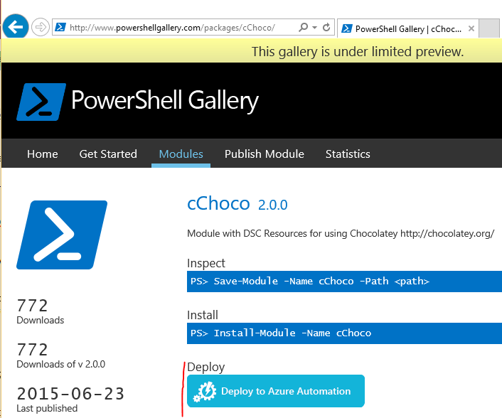

<properties
   pageTitle="Azure Automation DSC Continuous Deployment w/Chocolatey"
   description="DevOps continuous deployment using Azure Automation DSC and Chocolatey package manager.  Example with full JSON ARM template + PowerShell source."
   services="automation"
   documentationCenter=""
   authors="sebastus"
   manager="manager-alias"
   editor=""/>

<tags
   ms.service="automation"
   ms.devlang="multiple"
   ms.topic="article"
   ms.tgt_pltfrm="vm-windows"
   ms.workload="na"
   ms.date="10/01/2015"
   ms.author="golive@microsoft.com"/>

# Continuous Deployment to IaaS VMs Using Azure Automation DSC + Chocolatey

In a DevOps world there are many tools to assist with various points in the Continuous Integration pipeline.  Azure Automation Desired State Configuration (DSC) is a welcome new addition to the options that DevOps teams can employ.  In this article, I will demonstrate setting up Continuous Deployment (CD) for a Windows computer.  The technique extends trivially to include as many Windows computers as necessary in the role (web site, for example), and from there to additional roles as well.

Meta: This article was written in Sept 2015.  The version of Visual Studio is 2015.  [PowerShell Tools for Visual Studio](http://adamdriscoll.github.io/poshtools/) is installed and makes working with PowerShell easier by adding syntax highlighting and Intellisense.  At the time of writing, Azure Automation DSC is in Public Preview, so changes may occur as it moves to GA status.  [Full source](https://github.com/sebastus/ARM/tree/master/CDIaaSVM) for the example is on GitHub.

## At a High Level

There is quite a bit going on here, but fortunately it can be broken into two main processes: 1) writing code and testing it, then creating and publishing installation packages for major and minor versions of the system, and 2) creating and managing VMs that will install and execute the code in the packages.  Once both of these core processes are in place, it’s a short step to automatically update the package running on any particular VM as new versions are created and deployed.

## Some Background

Package managers such as [apt-get](https://en.wikipedia.org/wiki/Advanced_Packaging_Tool) are pretty well known in the Linux world, but not so much in the Windows world.  [Chocolatey](https://chocolatey.org/) is such a thing, and Scott Hanselman’s [blog](http://www.hanselman.com/blog/IsTheWindowsUserReadyForAptget.aspx) on the topic is a great intro.  In a nutshell, Chocolatey allows you to install packages from a central repository of packages into a Windows system using the command line .  You can create and manage your own repository, and Chocolatey can install packages from any number of repositories that you designate.

Desired State Configuration (DSC) ([overview](https://technet.microsoft.com/en-us/library/dn249912.aspx)) is a PowerShell tool that allows you to declare the configuration that you want for a machine.  For example, you could say “I want Chocolatey installed, I want IIS installed, I want port 80 opened, I want version 1.0.0 of my website installed.”  The DSC Local Configuration Manager (LCM) “makes it so”.  A DSC Pull Server holds a repository of configurations for your machines.  The LCM on each machine checks in periodically to see if its configuration matches the stored configuration.  It can either report status or attempt to bring the machine back into alignment with the stored configuration.  You can edit the stored configuration on the pull server to cause a machine or set of machines to come into alignment with the changed configuration.

Azure Automation is a managed service in Microsoft Azure that allows you to automate various tasks using runbooks and other assets such as nodes, credentials and resources.  Azure Automation DSC extends this automation capability to include PowerShell DSC tools.  Here’s a great [overview](automation-dsc-overview.md).

A DSC Resource is a module of code that has specific capabilities, such as managing networking, Active Directory, or SQL Server.  The Chocolatey DSC Resource knows how to access a NuGet Server (among others), download packages, install packages, and so on.  There are many other DSC Resources in the [PowerShell Gallery](http://www.powershellgallery.com/packages?q=dsc+resources&prerelease=&sortOrder=package-title).  These modules are installed into your Azure Automation DSC Pull Server (by you) so they can be used by your configurations.

ARM templates provide a declarative way of generating your infrastructure - things like networks, subnets, network security and routing, load balancers, NICs, VMs, and so on.  Here’s an [article](.\resource-manager-deployment-model.md) that compares the ARM deployment model (declarative) with the Azure Service Management (ASM, or classic) deployment model (imperative).  And another [article](.\virtual-machines\virtual-machines-azurerm-versus-azuresm.md) about the core resource providers, compute, storage and network.

One key feature of an ARM template is its ability to install a VM extension into the VM as it’s provisioned.  A VM extension has specific capabilities such as running a custom script, installing anti-virus software, or running a DSC configuration script.  There are many other types of VM extensions.

## Quick Trip Around the Pictorial

Starting at the top, you write your code, build and test, then create an installation package.  Chocolatey can handle various types of installation packages, such as MSI, MSU, ZIP.  And you have the full power of PowerShell to do the actual installation if Chocolatey’s native capabilities aren’t quite up to it.  Put the package into someplace reachable – a package repository.  I use a public folder in my Azure blob storage account, but it can be anywhere.  Chocolatey works natively with NuGet servers and a few others for management of package metadata.  Here’s a [link](https://github.com/chocolatey/choco/wiki/How-To-Host-Feed) to an article that describes the options.  In my sample, I use NuGet.  A Nuspec is metadata about your packages.  The Nuspec’s are “compiled” into NuPkg’s and stored in a NuGet server.  When your configuration requests a package by name, and references a NuGet server, the Chocolatey DSC Resource (now on the VM) grabs the package and installs it for you.  You can also request a specific version of a package.

In the bottom part of the picture, I start with an Azure Resource Manager (ARM) template.  In my example, the VM extension registers the VM with the Azure Automation DSC Pull Server (aka pull server) as a Node.  The configuration is stored in the pull server.  Actually, it’s stored twice: once as plain text and once compiled as an MOF file (for those that know about such things.)  In the portal, the MOF is a “node configuration” (as opposed to simply “configuration”).  It’s the artifact that’s associated with a Node so the node will know its configuration.  Details below show how to assign the node configuration to the node.

Presumably you’re already doing the bit at the top, or most of it.  Creating the nuspec, compiling and storing it in a NuGet server is a small thing.  And you’re already managing VMs.  Taking the next step to continuous deployment requires setting up the pull server (once), registering your nodes with it (once), and creating and storing the configuration there (initially).  Then as packages are upgraded and deployed to the repository, refresh the configuration in the pull server (repeat as needed).

If you’re not starting with an ARM template, that’s also ok.  There are PowerShell cmdlets designed to help you register your VMs with the pull server and all of the rest.

## And Now Some Details

Here’s a table of contents for what follows:

1. [Setting up the Pull Server and Automation Account](#setting-up-the-pull-server-and-automation-account) 
1. [VM Extension Tweaks to the ARM Template](#vm-extension-tweaks-to-the-arm-template) 
1. [Adding Required DSC Resources to the Pull Server](#adding-required-dsc-resources-to-the-pull-server) 
1. [Adding the Node Configuration to the Pull Server](#adding-the-node-configuration-to-the-pull-server)
1. [Assigning the Node Configuration to the Node](#assigning-the-node-configuration-to-the-node)
1. [Where to Put all this PowerShell?](#where-to-put-all-this-powershell?)
1. [Creating and Maintaining Package Metadata](#creating-and-maintaining-package-metadata) 

## Setting up the Pull Server and Automation Account

At an authenticated (Add-AzureAccount) PowerShell command line:  (can take a few minutes while the pull server is set up)

    Switch-AzureMode -Name AzureResourceManager 
    Register-AzureProvider –ProviderNamespace Microsoft.Automation 
    Register-AzureProviderFeature -FeatureName dsc -ProviderNamespace Microsoft.Automation 
    New-AzureResourceGroup –Name MY-AUTOMATION-RG –Location MY-RG-LOCATION-IN-QUOTES
    New-AzureAutomationAccount –ResourceGroupName MY-AUTOMATION-RG –Location MY-RG-LOCATION-IN-QUOTES –Name MY-AUTOMATION-ACCOUNT 

You can put your automation account into any of the following regions (aka location):  Japan East, East US 2, West Europe, Southeast Asia, South Central US.  Of course, make sure your automation resource group is in the same region as your automation account.

## VM Extension Tweaks to the ARM Template

Details for VM registration (using the PowerShell DSC VM extension) provided in this [Azure Quickstart Template](https://github.com/Azure/azure-quickstart-templates/tree/master/dsc-extension-azure-automation-pullserver).  This step registers your new VM with the pull server in the list of DSC Nodes.

## Adding Required DSC Resources to the Pull Server

The PowerShell Gallery is instrumented to install DSC resources into your Azure Automation account.  Navigate to the resource you want and click the “Deploy to Azure Automation” button.

Or, there’s the manual approach.  The folder structure of a PowerShell Integration Module for a Windows computer is a little different from the folder structure expected by the Azure Automation DSC Pull Server.  This requires a little tweaking on your part.  But it’s not hard, and it’s done only once per resource (unless you want to upgrade it in future.)
- Install the module that you need on your workstation, as follows:
    - Install [Windows Management Framework, v5](http://aka.ms/wmf5latest) 
    - Install-Module  –ModuleName MODULENAME    <—grabs the module from the PowerShell gallery 
- Copy the module folder from c:\Program Files\WindowsPowerShell\Modules\MODULE-NAME to a temp folder 
- Delete samples and documentation from the main folder 
- Zip the main folder, naming the zip file exactly the same as the folder 
- Put the zip file into a reachable http location 
- Run this PowerShell:

    New-AzureAutomationModule `  
        -ResourceGroupName MY-AUTOMATION-RG -AutomationAccountName MY-AUTOMATION-ACCOUNT `  
        -Name MODULE-NAME –ContentLink "https://STORAGE-URI/public/MODULE-NAME.zip"

I did these steps for cChoco and xNetworking for this example. 

## Adding the Node Configuration to the Pull Server

There’s nothing special about the first time you import your configuration into the pull server and compile.  All subsequent import/compiles of the same configuration look exactly the same.  Each time you update your package and need to push it out to production you do this step after ensuring the configuration file is correct – including the new version of your package.  Here’s the configuration file and PowerShell:

    Configuration ISVBoxConfig 
    { 
        Import-DscResource -ModuleName cChoco 
        Import-DscResource -ModuleName xNetworking
    
        Node "isvbox" {   <— node must be named, $AllNodes.NodeName won’t work.
    
            cChocoInstaller installChoco 
            { 
                InstallDir = "C:\choco" 
            }
    
            WindowsFeature installIIS 
            { 
                Ensure="Present" 
                Name="Web-Server" 
            }
    
            xFirewall WebFirewallRule 
            { 
                Direction = "Inbound" 
                Name = "Web-Server-TCP-In" 
                DisplayName = "Web Server (TCP-In)" 
                Description = "IIS allow incoming web site traffic." 
                DisplayGroup = "IIS Incoming Traffic" 
                State = "Enabled" 
                Access = "Allow" 
                Protocol = "TCP" 
                LocalPort = "80" 
                Ensure = "Present" 
            }
    
            cChocoPackageInstaller trivialWeb 
            {            
                Name = "trivialweb" 
                Version = "1.0.0" 
                Source = “MY-NUGET-SERVER-ADDRESS” 
                DependsOn = "[cChocoInstaller]installChoco", 
                "[WindowsFeature]installIIS" 
            } 
        }    
    }

    Import-AzureAutomationDscConfiguration ` 
        -ResourceGroupName MY-AUTOMATION-RG –AutomationAccountName MY-AUTOMATION-ACCOUNT ` 
        -SourcePath C:\temp\AzureAutomationDsc\ISVBoxConfig.ps1 ` 
        -Published –Force
    
    $jobData = Start-AzureAutomationDscCompilationJob ` 
        -ResourceGroupName MY-AUTOMATION-RG –AutomationAccountName MY-AUTOMATION-ACCOUNT ` 
        -ConfigurationName ISVBoxConfig 
    
    $compilationJobId = $jobData.Id
    
    Get-AzureAutomationDscCompilationJob ` 
        -ResourceGroupName MY-AUTOMATION-RG –AutomationAccountName MY-AUTOMATION-ACCOUNT ` 
        -Id $compilationJobId

These steps result in a new node configuration named “ISVBoxConfig.isvbox”.  The name is built as “configurationName.nodeName”.

## Assign the Node Configuration to your Node

For this step, you need to query the pull server to get the Id of your new VM after it’s been registered.  The cmdlet to do this is Get-AzureAutomationDscNode.  It has a few filters that might work, but in the general case you’re going to want to pipe the output of this through a filter that will grab VMs with a name pattern.  If you only create VMs of a single role, then you can grab all where the NodeConfigurationName is ConfigureLCMforAAPull.isvbox.  This is the configuration name of any newly registered VM if you’re going by this example.  Once you have the list of Id’s, here’s the cmdlet:

    Set-AzureAutomationDscNode ` 
        -ResourceGroupName MY-AUTOMATION-RG -AutomationAccountName MY-AUTOMATION-ACCOUNT ` 
        -NodeConfigurationName ISVBoxConfig.isvbox -Id $theId

## Where to put all of this PowerShell?

When you’re writing custom ARM templates, there’s a PowerShell script provided by Visual Studio that invokes the template.  The cmdlets that import your configuration, compile it, get the id’s of your VMs, and so on can be appended to this script.  See the source for an example on GitHub.  For the parts that get executed each time your package is updated, integrate the needed commands into your Continuous Integration pipeline.

## Creating and Maintaining Package Metadata

For each package that you put into the package repository, you need a nuspec that describes it.  That nuspec must be compiled and stored in your NuGet server. This process is described [here](http://docs.nuget.org/create/creating-and-publishing-a-package).  I used MyGet.org as my NuGet server.  They sell this service, but have a starter SKU that’s free.  At NuGet.org you’ll find instructions on installing your own NuGet server for your private packages.

## Notes

In my example, I start my VM off with a generic Windows 2012 R2 image from the Azure gallery.  I could have started it from any stored image and then proceeded to tweak from there with my DSC configuration.

You don’t have to use an ARM template and the VM extension to use this technique with your VMs.  And your VMs don’t have to be on Azure to be under CD management.  All that’s necessary is that Chocolatey be installed and the LCM configured on the VM so it knows where the pull server is.  

Of course, when you update a package on a VM that’s in production, you need to take that VM out of rotation while the update is installed.  How you do this varies widely.  For example, with a VM behind an Azure Load Balancer, you can add a Custom Probe.  While updating the VM, have the probe endpoint return a 400.  The tweak necessary to cause this change can be inside your configuration, as can the tweak to switch it back to returning a 200 once the update is complete.

Full source for this example is in [this Visual Studio project](https://github.com/sebastus/ARM/tree/master/CDIaaSVM) on GitHub.
