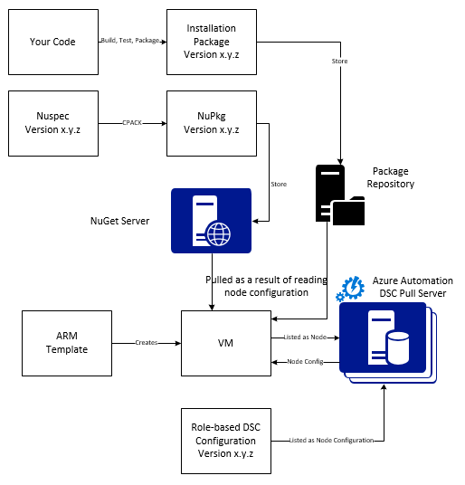
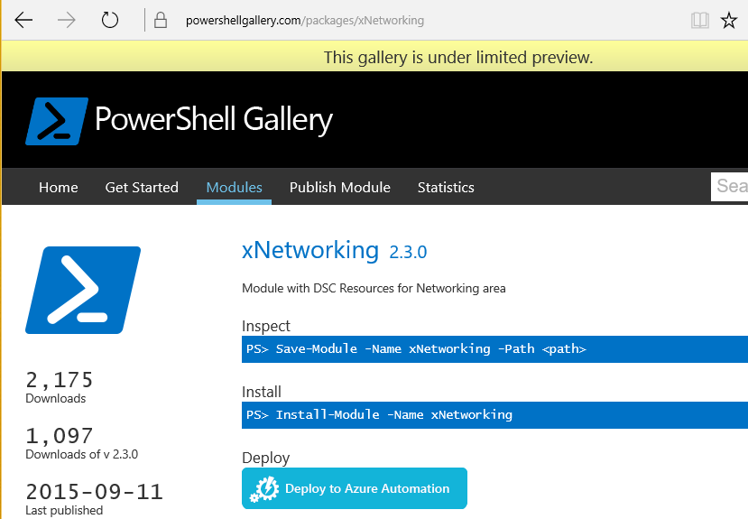

# Usage Example: Continuous deployment to Virtual Machines using Automation State Configuration and Chocolatey

In a DevOps world there are many tools to assist with various points in the Continuous Integration
pipeline. Azure Automation State Configuration is a welcome new addition to the options that DevOps
teams can employ. This article demonstrates setting up Continuous Deployment (CD) for a Windows
computer. You can easily extend the technique to include as many Windows computers as necessary in
the role (a web site, for example), and from there to additional roles as well.



## At a high level

There is quite a bit going on here, but fortunately it can be broken into two main processes:

- Writing code and testing it, then creating and publishing installation packages for major and minor versions of the system.
- Creating and managing VMs that will install and execute the code in the packages.  

Once both of these core processes are in place, it's a short step to automatically update the
package running on any particular VM as new versions are created and deployed.

## Component overview

Package managers such as [apt-get](https://en.wikipedia.org/wiki/Advanced_Packaging_Tool) are
pretty well known in the Linux world, but not so much in the Windows world.
[Chocolatey](https://chocolatey.org/) is such a thing, and Scott Hanselman's
[blog](https://www.hanselman.com/blog/IsTheWindowsUserReadyForAptget.aspx) on the topic is a great
intro. In a nutshell, Chocolatey allows you to install packages from a central repository of
packages into a Windows system using the command line. You can create and manage your own
repository, and Chocolatey can install packages from any number of repositories that you designate.

Desired State Configuration (DSC) ([overview](/powershell/dsc/overview)) is a PowerShell tool that
allows you to declare the configuration that you want for a machine. For example, you can say, "I
want Chocolatey installed, I want IIS installed, I want port 80 opened, I want version 1.0.0 of my
website installed." The DSC Local Configuration Manager (LCM) implements that configuration. A DSC
Pull Server holds a repository of configurations for your machines. The LCM on each machine checks
in periodically to see if its configuration matches the stored configuration. It can either report
status or attempt to bring the machine back into alignment with the stored configuration. You can
edit the stored configuration on the pull server to cause a machine or set of machines to come into
alignment with the changed configuration.

Azure Automation is a managed service in Microsoft Azure that allows you to automate various tasks
using runbooks, nodes, credentials, resources and assets such as schedules and global variables.
Azure Automation State Configuration extends this automation capability to include PowerShell DSC
tools. Here's a great [overview](automation-dsc-overview.md).

A DSC Resource is a module of code that has specific capabilities, such as managing networking,
Active Directory, or SQL Server. The Chocolatey DSC Resource knows how to access a NuGet Server
(among others), download packages, install packages, and so on. There are many other DSC Resources
in the [PowerShell
Gallery](https://www.powershellgallery.com/packages?q=dsc+resources&prerelease=&sortOrder=package-title).
These modules are installed into your Azure Automation State Configuration Pull Server (by you) so
they can be used by your configurations.

Resource Manager templates provide a declarative way of generating your infrastructure - things
like networks, subnets, network security and routing, load balancers, NICs, VMs, and so on. Here's
an [article](../azure-resource-manager/resource-manager-deployment-model.md) that compares the
Resource Manager deployment model (declarative) with the Azure Service Management (ASM or classic)
deployment model (imperative), and discusses the core resource providers, compute, storage and
network.

One key feature of an Resource Manager template is its ability to install a VM extension into the
VM as it's provisioned. A VM extension has specific capabilities such as running a custom script,
installing anti-virus software, or running a DSC configuration script. There are many other types
of VM extensions.

## Quick trip around the diagram

Starting at the top, you write your code, build and test, then create an installation package.
Chocolatey can handle various types of installation packages, such as MSI, MSU, ZIP. And you have
the full power of PowerShell to do the actual installation if Chocolateys native capabilities
aren't quite up to it. Put the package into some place reachable – a package repository. This usage
example uses a public folder in an Azure blob storage account, but it can be anywhere. Chocolatey
works natively with NuGet servers and a few others for management of package metadata. [This
article](https://github.com/chocolatey/choco/wiki/How-To-Host-Feed) describes the options. This
usage example uses NuGet. A Nuspec is metadata about your packages. The Nuspec's are “compiled”
into NuPkg's and stored in a NuGet server. When your configuration requests a package by name, and
references a NuGet server, the Chocolatey DSC Resource (now on the VM) grabs the package and
installs it for you. You can also request a specific version of a package.

In the bottom left portion of the picture, there is an Azure Resource Manager template. In this
usage example, the VM extension registers the VM with the Azure Automation State Configuration Pull
Server (that is, a pull server) as a Node. The configuration is stored in the pull server.
Actually, it's stored twice: once as plain text and once compiled as an MOF file (for those that
know about such things.) In the portal, the MOF is a “node configuration” (as opposed to simply
“configuration”). It's the artifact that's associated with a Node so the node will know its
configuration. Details below show how to assign the node configuration to the node.

Presumably you're already doing the bit at the top, or most of it. Creating the nuspec, compiling
and storing it in a NuGet server is a small thing. And you're already managing VMs. Taking the next
step to continuous deployment requires setting up the pull server (once), registering your nodes
with it (once), and creating and storing the configuration there (initially). Then as packages are
upgraded and deployed to the repository, refresh the Configuration and Node Configuration in the
pull server (repeat as needed).

If you're not starting with an Resource Manager template, that's also OK. There are PowerShell
cmdlets designed to help you register your VMs with the pull server and all of the rest. For more
details, see this article: [Onboarding machines for management by Azure Automation State Configuration](automation-dsc-onboarding.md).

## Step 1: Setting up the pull server and automation account

At an authenticated (`Connect-AzureRmAccount`) PowerShell command line: (can take a few minutes while the pull server is set up)

```azurepowershell-interactive
New-AzureRmResourceGroup –Name MY-AUTOMATION-RG –Location MY-RG-LOCATION-IN-QUOTES
New-AzureRmAutomationAccount –ResourceGroupName MY-AUTOMATION-RG –Location MY-RG-LOCATION-IN-QUOTES –Name MY-AUTOMATION-ACCOUNT
```

You can put your automation account into any of the following regions (aka location): East US 2,
South Central US, US Gov Virginia, West Europe, Southeast Asia, Japan East, Central India and
Australia Southeast, Canada Central, North Europe.

## Step 2: VM extension tweaks to the Resource Manager template

Details for VM registration (using the PowerShell DSC VM extension) provided in this [Azure
Quickstart
Template](https://github.com/Azure/azure-quickstart-templates/tree/master/dsc-extension-azure-automation-pullserver).
This step registers your new VM with the pull server in the list of State Configuration Nodes. Part of this
registration is specifying the node configuration to be applied to the node. This node
configuration doesn't have to exist yet in the pull server, so it's OK that Step 4 is where this is
done for the first time. But here in Step 2 you do need to have decided the name of the node and
the name of the configuration. In this usage example, the node is 'isvbox' and the configuration is
'ISVBoxConfig'. So the node configuration name (to be specified in DeploymentTemplate.json) is
'ISVBoxConfig.isvbox'.

## Step 3: Adding required DSC resources to the pull server

The PowerShell Gallery is instrumented to install DSC resources into your Azure Automation account.
Navigate to the resource you want and click the “Deploy to Azure Automation” button.



Another technique recently added to the Azure Portal allows you to pull in new modules or update
existing modules. Click through the Automation Account resource, the Assets tile, and finally the
Modules tile. The Browse Gallery icon allows you to see the list of modules in the gallery, drill
down into details and ultimately import into your Automation Account. This is a great way to keep
your modules up to date from time to time. And, the import feature checks dependencies with other
modules to ensure nothing gets out of sync.

Or, there's the manual approach. The folder structure of a PowerShell Integration Module for a
Windows computer is a little different from the folder structure expected by the Azure Automation.
This requires a little tweaking on your part. But it's not hard, and it's done only once per
resource (unless you want to upgrade it in future.) For more information on authoring PowerShell
Integration Modules, see this article: [Authoring Integration Modules for Azure
Automation](https://azure.microsoft.com/blog/authoring-integration-modules-for-azure-automation/)

- Install the module that you need on your workstation, as follows:
  - Install [Windows Management Framework, v5](https://aka.ms/wmf5latest) (not needed for Windows 10)
  - `Install-Module –Name MODULE-NAME`    <—grabs the module from the PowerShell Gallery
- Copy the module folder from `c:\Program Files\WindowsPowerShell\Modules\MODULE-NAME` to a temp folder
- Delete samples and documentation from the main folder
- Zip the main folder, naming the ZIP file exactly the same as the folder 
- Put the ZIP file into a reachable HTTP location, such as blob storage in an Azure Storage Account.
- Run this PowerShell:

  ```powershell
  New-AzureRmAutomationModule `
    -ResourceGroupName MY-AUTOMATION-RG -AutomationAccountName MY-AUTOMATION-ACCOUNT `
    -Name MODULE-NAME –ContentLink 'https://STORAGE-URI/CONTAINERNAME/MODULE-NAME.zip'
  ```

The included example performs these steps for cChoco and xNetworking. See the [Notes](#notes) for special handling for cChoco.

## Step 4: Adding the node configuration to the pull server

There's nothing special about the first time you import your configuration into the pull server and
compile. All subsequent import/compiles of the same configuration look exactly the same. Each time
you update your package and need to push it out to production you do this step after ensuring the
configuration file is correct – including the new version of your package. Here's the configuration
file and PowerShell:

ISVBoxConfig.ps1:

```powershell
Configuration ISVBoxConfig
{
    Import-DscResource -ModuleName cChoco
    Import-DscResource -ModuleName xNetworking

    Node 'isvbox' {

        cChocoInstaller installChoco
        {
            InstallDir = 'C:\choco'
        }

        WindowsFeature installIIS
        {
            Ensure = 'Present'
            Name   = 'Web-Server'
        }

        xFirewall WebFirewallRule
        {
            Direction    = 'Inbound'
            Name         = 'Web-Server-TCP-In'
            DisplayName  = 'Web Server (TCP-In)'
            Description  = 'IIS allow incoming web site traffic.'
            Enabled       = 'True'
            Action       = 'Allow'
            Protocol     = 'TCP'
            LocalPort    = '80'
            Ensure       = 'Present'
        }

        cChocoPackageInstaller trivialWeb
        {
            Name      = 'trivialweb'
            Version   = '1.0.0'
            Source    = 'MY-NUGET-V2-SERVER-ADDRESS'
            DependsOn = '[cChocoInstaller]installChoco','[WindowsFeature]installIIS'
        }
    }
}
```

New-ConfigurationScript.ps1:

```powershell
Import-AzureRmAutomationDscConfiguration `
    -ResourceGroupName MY-AUTOMATION-RG –AutomationAccountName MY-AUTOMATION-ACCOUNT `
    -SourcePath C:\temp\AzureAutomationDsc\ISVBoxConfig.ps1 `
    -Published –Force

$jobData = Start-AzureRmAutomationDscCompilationJob `
    -ResourceGroupName MY-AUTOMATION-RG –AutomationAccountName MY-AUTOMATION-ACCOUNT `
    -ConfigurationName ISVBoxConfig

$compilationJobId = $jobData.Id

Get-AzureRmAutomationDscCompilationJob `
    -ResourceGroupName MY-AUTOMATION-RG –AutomationAccountName MY-AUTOMATION-ACCOUNT `
    -Id $compilationJobId
```

These steps result in a new node configuration named “ISVBoxConfig.isvbox” being placed on the pull
server. The node configuration name is built as “configurationName.nodeName”.

## Step 5: Creating and maintaining package metadata

For each package that you put into the package repository, you need a nuspec that describes it.
That nuspec must be compiled and stored in your NuGet server. This process is described
[here](https://docs.nuget.org/create/creating-and-publishing-a-package). You can use MyGet.org as a
NuGet server. They sell this service, but have a starter SKU that's free. At NuGet.org you'll find
instructions on installing your own NuGet server for your private packages.

## Step 6: Tying it all together

Each time a version passes QA and is approved for deployment, the package is created, nuspec and
nupkg updated and deployed to the NuGet server. In addition, the configuration (Step 4 above) must
be updated to agree with the new version number. It must be sent to the pull server and compiled.
From that point on, it's up to the VMs that depend on that configuration to pull the update and
install it. Each of these updates are simple - just a line or two of PowerShell. In the case of
Azure DevOps, some of them are encapsulated in build tasks that can be chained
together in a build. This
[article](https://www.visualstudio.com/docs/alm-devops-feature-index#continuous-delivery)
provides more details. This [GitHub repo](https://github.com/Microsoft/vso-agent-tasks) details the
various available build tasks.

## Notes

This usage example starts with a VM from a generic Windows Server 2012 R2 image from the Azure
gallery. You can start from any stored image and then tweak from there with the DSC configuration.
However, changing configuration that is baked into an image is much harder than dynamically
updating the configuration using DSC.

You don't have to use a Resource Manager template and the VM extension to use this technique with
your VMs. And your VMs don't have to be on Azure to be under CD management. All that's necessary is
that Chocolatey be installed and the LCM configured on the VM so it knows where the pull server is.

Of course, when you update a package on a VM that's in production, you need to take that VM out of
rotation while the update is installed. How you do this varies widely. For example, with a VM
behind an Azure Load Balancer, you can add a Custom Probe. While updating the VM, have the probe
endpoint return a 400. The tweak necessary to cause this change can be inside your configuration,
as can the tweak to switch it back to returning a 200 once the update is complete.

Full source for this usage example is in [this Visual Studio project](https://github.com/sebastus/ARM/tree/master/CDIaaSVM) on GitHub.

## Related Articles
* [Azure Automation DSC Overview](automation-dsc-overview.md)
* [Azure Automation DSC cmdlets](https://docs.microsoft.com/powershell/module/azurerm.automation#automation)
* [Onboarding machines for management by Azure Automation DSC](automation-dsc-onboarding.md)

## Next steps

- For an overview, see [Azure Automation State Configuration](automation-dsc-overview.md)
- To get started, see [Getting started with Azure Automation State Configuration](automation-dsc-getting-started.md)
- To learn about compiling DSC configurations so that you can assign them to target nodes, see [Compiling configurations in Azure Automation State Configuration](automation-dsc-compile.md)
- For PowerShell cmdlet reference, see [Azure Automation State Configuration cmdlets](/powershell/module/azurerm.automation/#automation)
- For pricing information, see [Azure Automation State Configuration pricing](https://azure.microsoft.com/pricing/details/automation/)
- To see an example of using Azure Automation State Configuration in a continuous deployment pipeline, see [Continuous Deployment Using Azure Automation State Configuration and Chocolatey](automation-dsc-cd-chocolatey.md)
