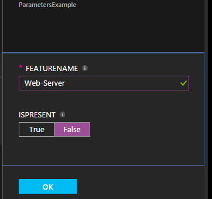
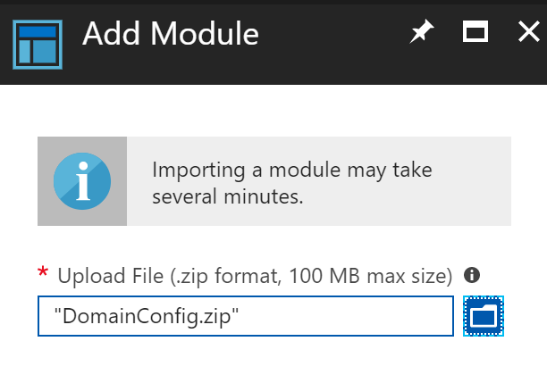
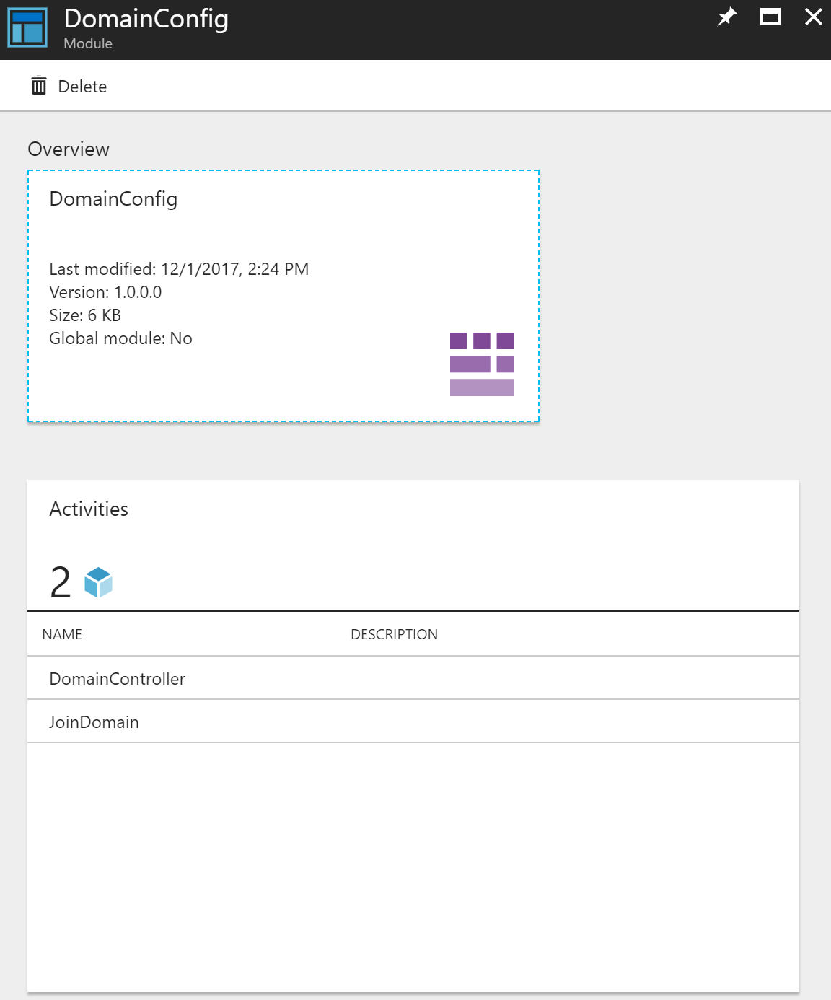
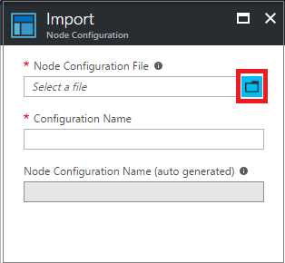

# Compiling DSC configurations in Azure Automation State Configuration

You can compile Desired State Configuration (DSC) configurations in two ways with Azure Automation
State Configuration: in the Azure portal and with Windows PowerShell. The following table helps you
determine when to use which method based on the characteristics of each:

**Azure portal**

- Simplest method with interactive user interface
- Form to provide simple parameter values
- Easily track job state
- Access authenticated with Azure logon

**Windows PowerShell**

- Call from command line with Windows PowerShell cmdlets
- Can be included in automated solution with multiple steps
- Provide simple and complex parameter values
- Track job state
- Client required to support PowerShell cmdlets
- Pass ConfigurationData
- Compile configurations that use credentials

Once you have decided on a compilation method, use the following procedures to start compiling.

## Compiling a DSC Configuration with the Azure portal

1. From your Automation account, click **State configuration (DSC)**.
1. Click on the **Configurations** tab, then click on the configuration name to compile.
1. Click **Compile**.
1. If the configuration has no parameters, you are prompted to confirm whether you want to compile it. If the configuration has parameters, the **Compile Configuration** blade opens so you can provide parameter values. See the following [**Basic Parameters**](#basic-parameters) section for further details on parameters.
1. The **Compilation Job** page is opened so that you can track the compilation job's status, and the node configurations (MOF configuration documents) it caused to be placed on the Azure Automation State Configuration Pull Server.

## Compiling a DSC Configuration with Windows PowerShell

You can use [`Start-AzureRmAutomationDscCompilationJob`](/powershell/module/azurerm.automation/start-azurermautomationdsccompilationjob)
to start compiling with Windows PowerShell. The following sample code starts compilation of a DSC configuration called **SampleConfig**.

```powershell
Start-AzureRmAutomationDscCompilationJob -ResourceGroupName 'MyResourceGroup' -AutomationAccountName 'MyAutomationAccount' -ConfigurationName 'SampleConfig'
```

`Start-AzureRmAutomationDscCompilationJob` returns a compilation job object that you can use to
track its status. You can then use this compilation job object with
[`Get-AzureRmAutomationDscCompilationJob`](/powershell/module/azurerm.automation/get-azurermautomationdsccompilationjob)
to determine the status of the compilation job, and
[`Get-AzureRmAutomationDscCompilationJobOutput`](/powershell/module/azurerm.automation/get-azurermautomationdsccompilationjoboutput)
to view its streams (output). The following sample code starts compilation of the **SampleConfig**
configuration, waits until it has completed, and then displays its streams.

```powershell
$CompilationJob = Start-AzureRmAutomationDscCompilationJob -ResourceGroupName 'MyResourceGroup' -AutomationAccountName 'MyAutomationAccount' -ConfigurationName 'SampleConfig'

while($CompilationJob.EndTime –eq $null -and $CompilationJob.Exception –eq $null)
{
    $CompilationJob = $CompilationJob | Get-AzureRmAutomationDscCompilationJob
    Start-Sleep -Seconds 3
}

$CompilationJob | Get-AzureRmAutomationDscCompilationJobOutput –Stream Any
```

## Basic Parameters

Parameter declaration in DSC configurations, including parameter types and properties, works the
same as in Azure Automation runbooks. See [Starting a runbook in Azure Automation](automation-starting-a-runbook.md)
to learn more about runbook parameters.

The following example uses two parameters called **FeatureName** and **IsPresent**, to determine
the values of properties in the **ParametersExample.sample** node configuration, generated during
compilation.

```powershell
Configuration ParametersExample
{
    param(
        [Parameter(Mandatory=$true)]
        [string] $FeatureName,

        [Parameter(Mandatory=$true)]
        [boolean] $IsPresent
    )

    $EnsureString = 'Present'
    if($IsPresent -eq $false)
    {
        $EnsureString = 'Absent'
    }

    Node 'sample'
    {
        WindowsFeature ($FeatureName + 'Feature')
        {
            Ensure = $EnsureString
            Name   = $FeatureName
        }
    }
}
```

You can compile DSC Configurations that use basic parameters in the Azure Automation State
Configuration portal or with Azure PowerShell:

### Portal

In the portal, you can enter parameter values after clicking **Compile**.



### PowerShell

PowerShell requires parameters in a [hashtable](/powershell/module/microsoft.powershell.core/about/about_hash_tables)
where the key matches the parameter name, and the value equals the parameter value.

```powershell
$Parameters = @{
    'FeatureName' = 'Web-Server'
    'IsPresent' = $False
}

Start-AzureRmAutomationDscCompilationJob -ResourceGroupName 'MyResourceGroup' -AutomationAccountName 'MyAutomationAccount' -ConfigurationName 'ParametersExample' -Parameters $Parameters
```

For information about passing PSCredentials as parameters, see [Credential Assets](#credential-assets) below.

## Composite Resources

**Composite Resources** allow you to use DSC configurations as nested resources inside of a
configuration. This enables you to apply multiple configurations to a single resource. See
[Composite resources: Using a DSC configuration as a resource](/powershell/dsc/authoringresourcecomposite)
to learn more about **Composite Resources**.

> [!NOTE]
> In order for **Composite Resources** to compile correctly, you must first ensure that any DSC Resources that the composite relies on are first installed in the Azure Automation Account Modules repository or it doesn't import properly.

To add a DSC **Composite Resource**, you must add the resource module to an archive (*.zip). Go to
the Modules repository on your Azure Automation Account. Then click on the 'Add a Module' button.


Navigate to the directory where your archive is located. Select the archive file, and click OK.



You are taken back to the modules directory, where you can monitor the status of your **Composite
Resource** while it unpacks and registers with Azure Automation.


Once the module is registered, you can then click on it to validate that the **Composite
Resources** are now available to be used in a configuration.



Then you can call the **Composite Resource** into your configuration like so:

```powershell
Node ($AllNodes.Where{$_.Role -eq 'WebServer'}).NodeName
{
    DomainConfig myCompositeConfig
    {
        DomainName = $DomainName
        Admincreds = $Admincreds
    }

    PSWAWebServer InstallPSWAWebServer
    {
        DependsOn = '[DomainConfig]myCompositeConfig'
    }
}
```

## ConfigurationData

**ConfigurationData** allows you to separate structural configuration from any environment-specific
configuration while using PowerShell DSC. See [Separating "What" from "Where" in PowerShell DSC](https://blogs.msdn.com/b/powershell/archive/2014/01/09/continuous-deployment-using-dsc-with-minimal-change.aspx)
to learn more about **ConfigurationData**.

> [!NOTE]
> You can use **ConfigurationData** when compiling in Azure Automation State Configuration using Azure PowerShell, but not in the Azure portal.

The following example DSC configuration uses **ConfigurationData** via the **$ConfigurationData**
and **$AllNodes** keywords. You also need the [**xWebAdministration** module](https://www.powershellgallery.com/packages/xWebAdministration/)
for this example:

```powershell
Configuration ConfigurationDataSample
{
    Import-DscResource -ModuleName xWebAdministration -Name MSFT_xWebsite

    Write-Verbose $ConfigurationData.NonNodeData.SomeMessage

    Node $AllNodes.Where{$_.Role -eq 'WebServer'}.NodeName
    {
        xWebsite Site
        {
            Name         = $Node.SiteName
            PhysicalPath = $Node.SiteContents
            Ensure       = 'Present'
        }
    }
}
```

You can compile the preceding DSC configuration with PowerShell. The following PowerShell adds two
node configurations to the Azure Automation State Configuration Pull Server:
**ConfigurationDataSample.MyVM1** and **ConfigurationDataSample.MyVM3**:

```powershell
$ConfigData = @{
    AllNodes = @(
        @{
            NodeName = 'MyVM1'
            Role = 'WebServer'
        },
        @{
            NodeName = 'MyVM2'
            Role = 'SQLServer'
        },
        @{
            NodeName = 'MyVM3'
            Role = 'WebServer'
        }
    )

    NonNodeData = @{
        SomeMessage = 'I love Azure Automation State Configuration and DSC!'
    }
}

Start-AzureRmAutomationDscCompilationJob -ResourceGroupName 'MyResourceGroup' -AutomationAccountName 'MyAutomationAccount' -ConfigurationName 'ConfigurationDataSample' -ConfigurationData $ConfigData
```

## Assets

Asset references are the same in Azure Automation State Configuration and runbooks. See the
following for more information:

- [Certificates](automation-certificates.md)
- [Connections](automation-connections.md)
- [Credentials](automation-credentials.md)
- [Variables](automation-variables.md)

### Credential Assets

DSC configurations in Azure Automation can reference Automation credential assets using the 
`Get-AutomationPSCredential` cmdlet. If a configuration has a parameter that has a **PSCredential**
type, then you can use the `Get-AutomationPSCredential` cmdlet by passing the string name
of an Azure Automation credential asset to the cmdlet to retrieve the credential. You can then use
that object for the parameter requiring the **PSCredential** object. Behind the scenes, the Azure
Automation credential asset with that name is retrieved and passed to the configuration. The
example below shows this in action.

Keeping credentials secure in node configurations (MOF configuration documents) requires encrypting
the credentials in the node configuration MOF file. However, currently you must tell PowerShell DSC
it is okay for credentials to be outputted in plain text during node configuration MOF generation,
because PowerShell DSC doesn’t know that Azure Automation will be encrypting the entire MOF file
after its generation via a compilation job.

You can tell PowerShell DSC that it is okay for credentials to be outputted in plain text in the
generated node configuration MOFs using [**ConfigurationData**](#configurationdata). You should
pass `PSDscAllowPlainTextPassword = $true` via **ConfigurationData** for each node block’s name
that appears in the DSC configuration and uses credentials.

The following example shows a DSC configuration that uses an Automation credential asset.

```powershell
Configuration CredentialSample
{
    Import-DscResource -ModuleName PSDesiredStateConfiguration
    $Cred = Get-AutomationPSCredential 'SomeCredentialAsset'

    Node $AllNodes.NodeName
    {
        File ExampleFile
        {
            SourcePath      = '\\Server\share\path\file.ext'
            DestinationPath = 'C:\destinationPath'
            Credential      = $Cred
        }
    }
}
```

You can compile the preceding DSC configuration with PowerShell. The following PowerShell adds two
node configurations to the Azure Automation State Configuration Pull Server:
**CredentialSample.MyVM1** and **CredentialSample.MyVM2**.

```powershell
$ConfigData = @{
    AllNodes = @(
        @{
            NodeName = '*'
            PSDscAllowPlainTextPassword = $True
        },
        @{
            NodeName = 'MyVM1'
        },
        @{
            NodeName = 'MyVM2'
        }
    )
}

Start-AzureRmAutomationDscCompilationJob -ResourceGroupName 'MyResourceGroup' -AutomationAccountName 'MyAutomationAccount' -ConfigurationName 'CredentialSample' -ConfigurationData $ConfigData
```

> [!NOTE]
> When compilation is complete you may receive an error stating: **The 'Microsoft.PowerShell.Management' module was not imported because the 'Microsoft.PowerShell.Management' snap-in was already imported.** This warning can safely be ignored.

## Partial Configuration

Azure Automation State Configuration supports usage of
[partial configurations](https://docs.microsoft.com/powershell/dsc/pull-server/partialconfigs).
In this scenario, DSC is configured to manage multiple configurations independently,
and each configuration is retreieved from Azure Automation.
However, only one configuration can be assigned to a node per automation account.
This means if you are using two configurations for a node you will require two automation accounts.
For more information about how teams can work together to collaboratively manage servers
using configuration as code see
[Understanding DSC's role in a CI/CD Pipeline](https://docs.microsoft.com/powershell/dsc/overview/authoringadvanced).

## Importing node configurations

You can also import node configurations (MOFs) that have been compiled outside of Azure. One
advantage of this is that node configurations can be signed. A signed node configuration is
verified locally on a managed node by the DSC agent, ensuring that the configuration being applied
to the node comes from an authorized source.

> [!NOTE]
> You can use import signed configurations into your Azure Automation account, but Azure Automation does not currently support compiling signed configurations.

> [!NOTE]
> A node configuration file must be no larger than 1 MB to allow it to be imported into Azure Automation.

For more information about how to sign node configurations, see [Improvements in WMF 5.1 - How to sign configuration and module](/powershell/wmf/5.1/dsc-improvements#dsc-module-and-configuration-signing-validations).

### Importing a node configuration in the Azure portal

1. From your Automation account, click **State configuration (DSC)** under **Configuration Management**.
1. In the **State configuration (DSC)** page, click on the **Configurations** tab, then click **+ Add**.
1. In the **Import** page, click the folder icon next to the **Node Configuration File** textbox to browse for a node configuration file (MOF) on your local computer.

   

1. Enter a name in the **Configuration Name** textbox. This name must match the name of the configuration from which the node configuration was compiled.
1. Click **OK**.

### Importing a node configuration with PowerShell

You can use the [Import-AzureRmAutomationDscNodeConfiguration](/powershell/module/azurerm.automation/import-azurermautomationdscnodeconfiguration)
cmdlet to import a node configuration into your automation account.

```powershell
Import-AzureRmAutomationDscNodeConfiguration -AutomationAccountName 'MyAutomationAccount' -ResourceGroupName 'MyResourceGroup' -ConfigurationName 'MyNodeConfiguration' -Path 'C:\MyConfigurations\TestVM1.mof'
```

## Next steps

- To get started, see [Getting started with Azure Automation State Configuration](automation-dsc-getting-started.md)
- To learn about compiling DSC configurations so that you can assign them to target nodes, see [Compiling configurations in Azure Automation State Configuration](automation-dsc-compile.md)
- For PowerShell cmdlet reference, see [Azure Automation State Configuration cmdlets](/powershell/module/azurerm.automation/#automation)
- For pricing information, see [Azure Automation State Configuration pricing](https://azure.microsoft.com/pricing/details/automation/)
- To see an example of using Azure Automation State Configuration in a continuous deployment pipeline, see [Continuous Deployment Using Azure Automation State Configuration and Chocolatey](automation-dsc-cd-chocolatey.md)
