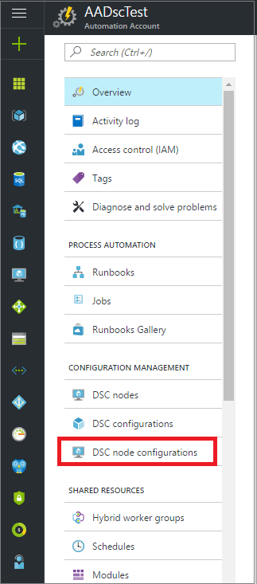

---
title: Compiling configurations in Azure Automation DSC | Microsoft Docs
description: This article describes how to compile Desired State Configuration (DSC) configurations for Azure Automation.
services: automation
documentationcenter: na
author: eslesar
manager: carmonm

ms.assetid: 49f20b31-4fa5-4712-b1c7-8f4409f1aecc
ms.service: automation
ms.devlang: na
ms.topic: article
ms.tgt_pltfrm: powershell
ms.workload: na
ms.date: 02/07/2017
ms.author: magoedte; eslesar
---

# Compiling configurations in Azure Automation DSC

You can compile Desired State Configuration (DSC) configurations in two ways with Azure Automation: in the Azure portal, and with Windows PowerShell. The following table will help you determine when to use which method based on the characteristics of each:

### Azure portal

* Simplest method with interactive user interface
* Form to provide simple parameter values
* Easily track job state
* Access authenticated with Azure logon

### Windows PowerShell

* Call from command line with Windows PowerShell cmdlets
* Can be included in automated solution with multiple steps
* Provide simple and complex parameter values
* Track job state
* Client required to support PowerShell cmdlets
* Pass ConfigurationData
* Compile configurations that use credentials

Once you have decided on a compilation method, you can follow the respective procedures below to start compiling.

## Compiling a DSC Configuration with the Azure portal

1. From your Automation account, click **DSC Configurations**.
2. Click a configuration to open its blade.
3. Click **Compile**.
4. If the configuration has no parameters, you will be prompted to confirm whether you want to compile it. If the configuration has parameters, the **Compile Configuration** blade will open so you can provide parameter values. See the [**Basic Parameters**](#basic-parameters) section below for further details on parameters.
5. The **Compilation Job** blade is opened so that you can track the compilation job's status, and the node configurations (MOF configuration documents) it caused to be placed on the Azure Automation DSC Pull Server.

## Compiling a DSC Configuration with Windows PowerShell

You can use [`Start-AzureRmAutomationDscCompilationJob`](/powershell/module/azurerm.automation/start-azurermautomationdsccompilationjob) to start compiling with Windows PowerShell. The following sample code starts compilation of a DSC configuration called **SampleConfig**.

```powershell
Start-AzureRmAutomationDscCompilationJob -ResourceGroupName "MyResourceGroup" -AutomationAccountName "MyAutomationAccount" -ConfigurationName "SampleConfig"
```

`Start-AzureRmAutomationDscCompilationJob` returns a compilation job object that you can use to track its status. You can then use this compilation job object with [`Get-AzureRmAutomationDscCompilationJob`](/powershell/module/azurerm.automation/get-azurermautomationdsccompilationjob) to determine the status of the compilation job, and [`Get-AzureRmAutomationDscCompilationJobOutput`](/powershell/module/azurerm.automation/get-azurermautomationdsccompilationjoboutput) to view its streams (output). The following sample code starts compilation of the **SampleConfig** configuration, waits until it has completed, and then displays its streams.

```powershell
$CompilationJob = Start-AzureRmAutomationDscCompilationJob -ResourceGroupName "MyResourceGroup" -AutomationAccountName "MyAutomationAccount" -ConfigurationName "SampleConfig"

while($CompilationJob.EndTime –eq $null -and $CompilationJob.Exception –eq $null)
{
    $CompilationJob = $CompilationJob | Get-AzureRmAutomationDscCompilationJob
    Start-Sleep -Seconds 3
}

$CompilationJob | Get-AzureRmAutomationDscCompilationJobOutput –Stream Any
```

## Basic Parameters
Parameter declaration in DSC configurations, including parameter types and properties, works the same as in Azure Automation runbooks. See [Starting a runbook in Azure Automation](automation-starting-a-runbook.md) to learn more about runbook parameters.

The following example uses two parameters called **FeatureName** and **IsPresent**, to determine the values of properties in the **ParametersExample.sample** node configuration, generated during compilation.

```powershell
Configuration ParametersExample
{
    param(
        [Parameter(Mandatory=$true)]

        [string] $FeatureName,

        [Parameter(Mandatory=$true)]
        [boolean] $IsPresent
    )

    $EnsureString = "Present"
    if($IsPresent -eq $false)
    {
        $EnsureString = "Absent"
    }

    Node "sample"
    {
        WindowsFeature ($FeatureName + "Feature")
        {
            Ensure = $EnsureString
            Name = $FeatureName
        }
    }
}
```

You can compile DSC Configurations that use basic parameters in the Azure Automation DSC portal, or with Azure PowerShell:

### Portal

In the portal, you can enter parameter values after clicking **Compile**.


### PowerShell

PowerShell requires parameters in a [hashtable](http://technet.microsoft.com/library/hh847780.aspx) where the key matches the parameter name, and the value equals the parameter value.

```powershell
$Parameters = @{
    "FeatureName" = "Web-Server"
    "IsPresent" = $False
}

Start-AzureRmAutomationDscCompilationJob -ResourceGroupName "MyResourceGroup" -AutomationAccountName "MyAutomationAccount" -ConfigurationName "ParametersExample" -Parameters $Parameters
```

For information about passing PSCredentials as parameters, see <a href="#credential-assets">**Credential Assets**</a> below.

## ConfigurationData
**ConfigurationData** allows you to separate structural configuration from any environment specific configuration while using PowerShell DSC. See [Separating "What" from "Where" in PowerShell DSC](http://blogs.msdn.com/b/powershell/archive/2014/01/09/continuous-deployment-using-dsc-with-minimal-change.aspx) to learn more about **ConfigurationData**.

> [!NOTE]
> You can use **ConfigurationData** when compiling in Azure Automation DSC using Azure PowerShell, but not in the Azure portal.

The following example DSC configuration uses **ConfigurationData** via the **$ConfigurationData** and **$AllNodes** keywords. You'll also need the [**xWebAdministration** module](https://www.powershellgallery.com/packages/xWebAdministration/) for this example:

```powershell
Configuration ConfigurationDataSample
{
    Import-DscResource -ModuleName xWebAdministration -Name MSFT_xWebsite

    Write-Verbose $ConfigurationData.NonNodeData.SomeMessage

    Node $AllNodes.Where{$_.Role -eq "WebServer"}.NodeName
    {
        xWebsite Site
        {
            Name = $Node.SiteName
            PhysicalPath = $Node.SiteContents
            Ensure   = "Present"
        }
    }
}
```

You can compile the DSC configuration above with PowerShell. The below PowerShell adds two node configurations to the Azure Automation DSC Pull Server: **ConfigurationDataSample.MyVM1** and **ConfigurationDataSample.MyVM3**:

```powershell
$ConfigData = @{
    AllNodes = @(
        @{
            NodeName = "MyVM1"
            Role = "WebServer"
        },
        @{
            NodeName = "MyVM2"
            Role = "SQLServer"
        },
        @{
            NodeName = "MyVM3"
            Role = "WebServer"
        }
    )

    NonNodeData = @{
        SomeMessage = "I love Azure Automation DSC!"
    }
}

Start-AzureRmAutomationDscCompilationJob -ResourceGroupName "MyResourceGroup" -AutomationAccountName "MyAutomationAccount" -ConfigurationName "ConfigurationDataSample" -ConfigurationData $ConfigData
```

## Assets

Asset references are the same in Azure Automation DSC configurations and runbooks. See the following for more information:

* [Certificates](automation-certificates.md)
* [Connections](automation-connections.md)
* [Credentials](automation-credentials.md)
* [Variables](automation-variables.md)

### Credential Assets

While DSC configurations in Azure Automation can reference credential assets using **Get-AzureRmAutomationCredential**, credential assets can also be passed in via parameters, if desired. If a configuration takes a parameter of **PSCredential** type, then you need to pass the string name of an Azure Automation credential asset as that parameter’s value, rather than a PSCredential object. Behind the scenes, the Azure Automation credential asset with that name will be retrieved and passed to the configuration.

Keeping credentials secure in node configurations (MOF configuration documents) requires encrypting the credentials in the node configuration MOF file. Azure Automation takes this one step further and encrypts the entire MOF file. However, currently you must tell PowerShell DSC it is okay for credentials to be outputted in plain text during node configuration MOF generation, because PowerShell DSC doesn’t know that Azure Automation will be encrypting the entire MOF file after its generation via a compilation job.

You can tell PowerShell DSC that it is okay for credentials to be outputted in plain text in the generated node configuration MOFs using [**ConfigurationData**](#configurationdata). You should pass `PSDscAllowPlainTextPassword = $true` via **ConfigurationData** for each node block’s name that appears in the DSC configuration and uses credentials.

The following example shows a DSC configuration that uses an Automation credential asset.

```powershell
Configuration CredentialSample
{
    $Cred = Get-AzureRmAutomationCredential -ResourceGroupName "ResourceGroup01" -AutomationAccountName "AutomationAcct" -Name "SomeCredentialAsset"

    Node $AllNodes.NodeName
    {
        File ExampleFile
        {
            SourcePath = "\\Server\share\path\file.ext"
            DestinationPath = "C:\destinationPath"
            Credential = $Cred
        }
    }
}
```

You can compile the DSC configuration above with PowerShell. The below PowerShell adds two node configurations to the Azure Automation DSC Pull Server:  **CredentialSample.MyVM1** and **CredentialSample.MyVM2**.

```powershell
$ConfigData = @{
    AllNodes = @(
        @{
            NodeName = "*"
            PSDscAllowPlainTextPassword = $True
        },
        @{
            NodeName = "MyVM1"
        },
        @{
            NodeName = "MyVM2"
        }
    )
}

Start-AzureRmAutomationDscCompilationJob -ResourceGroupName "MyResourceGroup" -AutomationAccountName "MyAutomationAccount" -ConfigurationName "CredentialSample" -ConfigurationData $ConfigData
```

## Importing node configurations

You can also import node configuratons (MOFs) that you have compiled outside of Azure. One advantage of this is that node confiturations can be signed.
A signed node configuration is verified locally on a managed node by the DSC agent, ensuring that the configuration being applied to the node comes from an
authorized source.

> [!NOTE]
> You can use import signed configurations into your Azure Automation account, but Azure Automation does not currently support compiling signed configurations.

> [!NOTE]
> A node configuration file must be no larger than 1 MB to allow it to be imported into Azure Automation.

You can learn how to sign node configurations at https://msdn.microsoft.com/en-us/powershell/wmf/5.1/dsc-improvements#how-to-sign-configuration-and-module.

### Importing a node configuration in the Azure portal

1. From your Automation account, click **DSC node configurations**.

    
2. In the **DSC node configurations** blade, click **Add a NodeConfiguration**.
3. In the **Import** blade, click the folder icon next to the **Node Configuration File** textbox to browse for a node configuration file (MOF) on your local computer.

    
4. Enter a name in the **Configuration Name** textbox. This name must match the name of the configuration from which the node configuration was compiled.
5. Click **OK**.

### Importing a node configuration with PowerShell

You can use the [Import-AzureRmAutomationDscNodeConfiguration](/powershell/module/azurerm.automation/import-azurermautomationdscnodeconfiguration)
cmdlet to import a node configuration into your automation account.

```powershell
Import-AzureRmAutomationDscNodeConfiguration -AutomationAccountName "MyAutomationAccount" -ResourceGroupName "MyResourceGroup" -ConfigurationName "MyNodeConfiguration" -Path "C:\MyConfigurations\TestVM1.mof"
```


