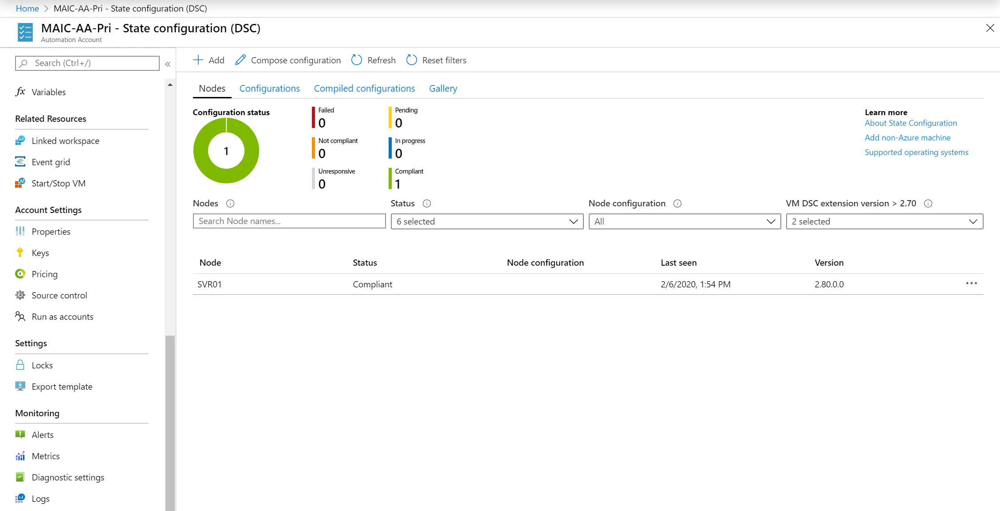

# Integrate Azure Automation State Configuration with Azure Monitor Logs

> [!NOTE]
> Before you enable Automation State Configuration, we would like you to know that a newer version of DSC is now generally available, managed by a feature of Azure Policy named [guest configuration](../governance/machine-configuration/overview.md). The guest configuration service combines features of DSC Extension, Azure Automation State Configuration, and the most commonly requested features from customer feedback. Guest configuration also includes hybrid machine support through [Arc-enabled servers](../azure-arc/servers/overview.md).

Azure Automation State Configuration retains node status data for 30 days. You can send node status data to [Azure Monitor Logs](../azure-monitor/logs/data-platform-logs.md) if you prefer to retain this data for a longer period. Compliance status is visible in the Azure portal or with PowerShell, for nodes and for individual DSC resources in node configurations.

Azure Monitor Logs provides greater operational visibility to your Automation State Configuration data and can help address incidents more quickly. With Azure Monitor Logs you can:

- Get compliance information for managed nodes and individual resources.
- Trigger an email or alert based on compliance status.
- Write advanced queries across your managed nodes.
- Correlate compliance status across Automation accounts.
- Use custom views and search queries to visualize your runbook results, runbook job status, and other related key indicators or metrics.

[!INCLUDE [azure-monitor-log-analytics-rebrand](../../includes/azure-monitor-log-analytics-rebrand.md)]

## Prerequisites

To start sending your Automation State Configuration reports to Azure Monitor Logs, you need:

* The PowerShell [Az Module](/powershell/azure/new-azureps-module-az) installed. Ensure you have the latest version. If necessary, run `Update-Module -Name Az`.
- An Azure Automation account. For more information, see [An introduction to Azure Automation](automation-intro.md).
- A Log Analytics workspace. For more information, see [Azure Monitor Logs overview](../azure-monitor/logs/data-platform-logs.md).
- At least one Azure Automation State Configuration node. For more information, see [Onboarding machines for management by Azure Automation State Configuration](automation-dsc-onboarding.md).
- The [xDscDiagnostics](https://www.powershellgallery.com/packages/xDscDiagnostics/2.7.0.0) module, version 2.7.0.0 or greater. For installation steps, see [Troubleshoot Azure Automation Desired State Configuration](./troubleshoot/desired-state-configuration.md).

## Set up integration with Azure Monitor Logs

To begin importing data from Azure Automation State Configuration into Azure Monitor Logs, complete the following steps. For steps using the Portal, see [Forward Azure Automation job data to Azure Monitor Logs](./automation-manage-send-joblogs-log-analytics.md).

1. From your machine, sign in to your Azure subscription with the PowerShell [Connect-AzAccount](/powershell/module/Az.Accounts/Connect-AzAccount) cmdlet and follow the on-screen directions.

    ```powershell
    # Sign in to your Azure subscription
    $sub = Get-AzSubscription -ErrorAction SilentlyContinue
    if(-not($sub))
    {
        Connect-AzAccount
    }
    
    # If you have multiple subscriptions, set the one to use
    # Select-AzSubscription -SubscriptionId "<SUBSCRIPTIONID>"
    ```

1. Provide an appropriate value for the variables `automationAccount` with the actual name of your Automation account, and `workspaceName` with the actual name of your Log Analytics workspace. Then execute the script.

    ```powershell
    $automationAccount = "automationAccount"
    $law = "workspaceName"
    ```

1. Get the resource ID of your Automation account by running the following PowerShell commands.

   ```powershell
   # Find the ResourceId for the Automation account
   $AutomationResourceId = (Get-AzResource `
      -ResourceType 'Microsoft.Automation/automationAccounts' | 
      WHERE {$_.Name -eq $automationAccount}).ResourceId
   ```

1. Get the resource ID of your Log Analytics workspace by running the following PowerShell commands.

   ```powershell
    # Find the ResourceId for the Log Analytics workspace
    $WorkspaceResourceId = (Get-AzResource `
        -ResourceType 'Microsoft.OperationalInsights/workspaces' | 
        WHERE {$_.Name -eq $law}).ResourceId
   ```

1. To configure diagnostic settings on the Automation account to forward DSC node status log data to Azure Monitor Logs, the following PowerShell cmdlet creates a diagnostic setting using that destination.

   ```powershell
    Set-AzDiagnosticSetting `
        -ResourceId $AutomationResourceId `
        -WorkspaceId $WorkspaceResourceId `
        -Enabled $true `
        -Category 'DscNodeStatus'
   ```

   When you want to stop forwarding log data from Automation State Configuration to Azure Monitor Logs, run the following PowerShell cmdlet.

   ```powershell
    Set-AzDiagnosticSetting `
        -ResourceId $AutomationResourceId `
        -WorkspaceId $WorkspaceResourceId `
        -Enabled $false `
        -Category 'DscNodeStatus'
   ```

## View the State Configuration logs

You can search the State Configuration logs for DSC operations by searching in Azure Monitor Logs. After you set up integration with Azure Monitor Logs for your Automation State Configuration data, navigate to your Automation account in the [Azure portal](https://portal.azure.com/). Then under **Monitoring**, select **Logs**.



Close the **Queries** dialog box. The Log Search pane opens with a query region scoped to your Automation account resource. The records for DSC operations are stored in the `AzureDiagnostics` table. To find nodes that aren't compliant, type the following query.

```Kusto
AzureDiagnostics
| where Category == "DscNodeStatus"
| where OperationName contains "DSCNodeStatusData"
| where ResultType != "Compliant"
```

Filtering details:

- Filter on `DscNodeStatusData` to return operations for each State Configuration node.
- Filter on `DscResourceStatusData` to return operations for each DSC resource called in the node configuration applied to that resource.
- Filter on `DscResourceStatusData` to return error information for any DSC resources that fail.

To learn more about constructing log queries to find data, see [Overview of log queries in Azure Monitor](../azure-monitor/logs/log-query-overview.md).

### Send an email when a State Configuration compliance check fails

1. Return to your query created earlier.

1. Press on '+ New Alert Rule' button to start the alert creation flow.

1. In the query below, replace `NODENAME` with the actual name of the managed node, and then paste the revised query in the **Search query** text box:

    ```kusto
    AzureDiagnostics
    | where Category == "DscNodeStatus"
    | where NodeName_s == "NODENAME"
    | where OperationName == "DscNodeStatusData"
    | where ResultType == "Failed"
    ```

   If you have set up logs from more than one Automation account or subscription to your workspace, you can group your alerts by subscription and Automation account. Derive the Automation account name from the `Resource` property in the log search results of the `DscNodeStatusData`.

1. Review [Create, view, and manage metric alerts using Azure Monitor](../azure-monitor/alerts/alerts-metric.md) to complete the remaining steps.

### Find failed DSC resources across all nodes

One advantage of using Azure Monitor Logs is that you can search for failed checks across nodes. To find all instances of DSC resources that have failed, use the following query:

```kusto
AzureDiagnostics 
| where Category == "DscNodeStatus"
| where OperationName == "DscResourceStatusData"
| where ResultType == "Failed"
```

### View historical DSC node status

To visualize your DSC node status history over time, you can use this query:

```kusto
AzureDiagnostics 
| where ResourceProvider == "MICROSOFT.AUTOMATION" 
| where Category == "DscNodeStatus"
| where ResultType != "started"
| summarize count() by ResultType
``````

This query displays a chart of the node status over time.

## Azure Monitor Logs records

Azure Automation diagnostics create two categories of records in Azure Monitor Logs:

* Node status data (`DscNodeStatusData`)
* Resource status data (`DscResourceStatusData`)

### DscNodeStatusData

| Property | Description |
| --- | --- |
| TimeGenerated |Date and time when the compliance check ran. |
| OperationName |`DscNodeStatusData`. |
| ResultType |Value that indicates if the node is compliant. |
| NodeName_s |The name of the managed node. |
| NodeComplianceStatus_s |Status value that specifies if the node is compliant. |
| DscReportStatus |Status value indicating if the compliance check ran successfully. |
| ConfigurationMode | The mode used to apply the configuration to the node. Possible values are: <ul><li>`ApplyOnly`: DSC applies the configuration and does nothing further unless a new configuration is pushed to the target node or when a new configuration is pulled from a server. After initial application of a new configuration, DSC doesn't check for drift from a previously configured state. DSC attempts to apply the configuration until it's successful before the `ApplyOnly` value takes effect. </li><li>`ApplyAndMonitor`: This is the default value. The LCM applies any new configurations. After initial application of a new configuration, if the target node drifts from the desired state, DSC reports the discrepancy in logs. DSC attempts to apply the configuration until it's successful before the `ApplyAndMonitor` value takes effect.</li><li>`ApplyAndAutoCorrect`: DSC applies any new configurations. After initial application of a new configuration, if the target node drifts from the desired state, DSC reports the discrepancy in logs, and then reapplies the current configuration.</li></ul> |
| HostName_s | The name of the managed node. |
| IPAddress | The IPv4 address of the managed node. |
| Category | `DscNodeStatus`. |
| Resource | The name of the Azure Automation account. |
| Tenant_g | GUID that identifies the tenant for the caller. |
| NodeId_g | GUID that identifies the managed node. |
| DscReportId_g | GUID that identifies the report. |
| LastSeenTime_t | Date and time when the report was last viewed. |
| ReportStartTime_t | Date and time when the report was started. |
| ReportEndTime_t | Date and time when the report completed. |
| NumberOfResources_d | The number of DSC resources called in the configuration applied to the node. |
| SourceSystem | The source system identifying how Azure Monitor Logs has collected the data. Always `Azure` for Azure diagnostics. |
| ResourceId |The resource identifier of the Azure Automation account. |
| ResultDescription | The resource description for this operation. |
| SubscriptionId | The Azure subscription ID (GUID) for the Automation account. |
| ResourceGroup | The name of the resource group for the Automation account. |
| ResourceProvider | MICROSOFT.AUTOMATION. |
| ResourceType | AUTOMATIONACCOUNTS. |
| CorrelationId | A GUID that is the correlation identifier of the compliance report. |

### DscResourceStatusData

| Property | Description |
| --- | --- |
| TimeGenerated |Date and time when the compliance check ran. |
| OperationName |`DscResourceStatusData`.|
| ResultType |Whether the resource is compliant. |
| NodeName_s |The name of the managed node. |
| Category | DscNodeStatus. |
| Resource | The name of the Azure Automation account. |
| Tenant_g | GUID that identifies the tenant for the caller. |
| NodeId_g |GUID that identifies the managed node. |
| DscReportId_g |GUID that identifies the report. |
| DscResourceId_s |The name of the DSC resource instance. |
| DscResourceName_s |The name of the DSC resource. |
| DscResourceStatus_s |Whether the DSC resource is in compliance. |
| DscModuleName_s |The name of the PowerShell module that contains the DSC resource. |
| DscModuleVersion_s |The version of the PowerShell module that contains the DSC resource. |
| DscConfigurationName_s |The name of the configuration applied to the node. |
| ErrorCode_s | The error code if the resource failed. |
| ErrorMessage_s |The error message if the resource failed. |
| DscResourceDuration_d |The time, in seconds, that the DSC resource ran. |
| SourceSystem | How Azure Monitor Logs collected the data. Always `Azure` for Azure diagnostics. |
| ResourceId |The identifier of the Azure Automation account. |
| ResultDescription | The description for this operation. |
| SubscriptionId | The Azure subscription ID (GUID) for the Automation account. |
| ResourceGroup | The name of the resource group for the Automation account. |
| ResourceProvider | MICROSOFT.AUTOMATION. |
| ResourceType | AUTOMATIONACCOUNTS. |
| CorrelationId |GUID that is the correlation ID of the compliance report. |

## Next steps

- For an overview, see [Azure Automation State Configuration overview](automation-dsc-overview.md).
- To get started, see [Get started with Azure Automation State Configuration](automation-dsc-getting-started.md).
- To learn about compiling DSC configurations so that you can assign them to target nodes, see [Compile DSC configurations in Azure Automation State Configuration](automation-dsc-compile.md).
- For a PowerShell cmdlet reference, see [Az.Automation](/powershell/module/az.automation).
- For pricing information, see [Azure Automation State Configuration pricing](https://azure.microsoft.com/pricing/details/automation/).
- To see an example of using Azure Automation State Configuration in a continuous deployment pipeline, see [Set up continuous deployment with Chocolatey](automation-dsc-cd-chocolatey.md).
- To learn more about how to construct different search queries and review the Automation State Configuration logs with Azure Monitor Logs, see [Log searches in Azure Monitor Logs](../azure-monitor/logs/log-query-overview.md).
- To learn more about Azure Monitor Logs and data collection sources, see [Collecting Azure storage data in Azure Monitor Logs overview](../azure-monitor/essentials/resource-logs.md#send-to-log-analytics-workspace).
