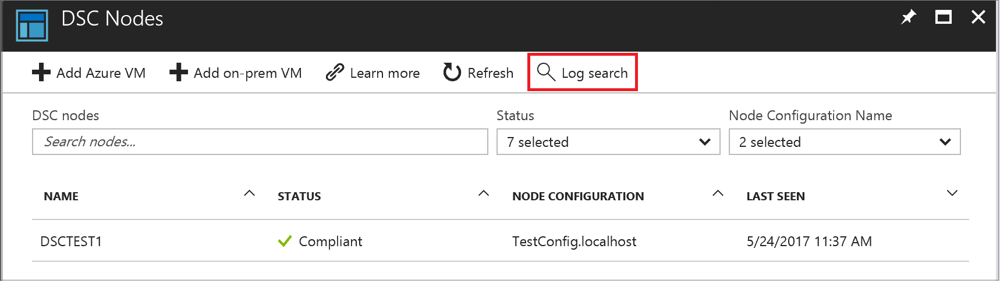

# Forward Azure Automation State Configuration reporting data to Azure Monitor logs

Azure Automation State Configuration retains node status data for 30 days.
You can send node status data to your Log Analytics workspace if you prefer to retain this data for a longer period.
Compliance status is visible in the Azure portal or with PowerShell,
for nodes and for individual DSC resources in node configurations.
With Azure Monitor logs you can:

- Get compliance information for managed nodes and individual resources
- Trigger an email or alert based on compliance status
- Write advanced queries across your managed nodes
- Correlate compliance status across Automation accounts
- Visualize your node compliance history over time

[!INCLUDE [azure-monitor-log-analytics-rebrand](../../includes/azure-monitor-log-analytics-rebrand.md)]

## Prerequisites

To start sending your Automation State Configuration reports to Azure Monitor logs, you need:

- The November 2016 or later release of [Azure PowerShell](/powershell/azure/overview) (v2.3.0).
- An Azure Automation account. For more information, see [Getting Started with Azure Automation](automation-offering-get-started.md)
- A Log Analytics workspace with an **Automation & Control** service offering. For more information, see [Get started with Azure Monitor logs](../log-analytics/log-analytics-get-started.md).
- At least one Azure Automation State Configuration node. For more information, see [Onboarding machines for management by Azure Automation State Configuration](automation-dsc-onboarding.md)

## Set up integration with Azure Monitor logs

To begin importing data from Azure Automation DSC into Azure Monitor logs, complete the following steps:

1. Log in to your Azure account in PowerShell. See [Log in with Azure PowerShell](https://docs.microsoft.com/powershell/azure/authenticate-azureps)
1. Get the _ResourceId_ of your automation account by running the following PowerShell command:
   (if you have more than one automation account, choose the _ResourceID_ for the account you want to configure).

   ```powershell
   # Find the ResourceId for the Automation Account
   Get-AzResource -ResourceType 'Microsoft.Automation/automationAccounts'
   ```

1. Get the _ResourceId_ of your Log Analytics workspace by running the following PowerShell command:
   (if you have more than one workspace, choose the _ResourceID_ for the workspace you want to configure).

   ```powershell
   # Find the ResourceId for the Log Analytics workspace
   Get-AzResource -ResourceType 'Microsoft.OperationalInsights/workspaces'
   ```

1. Run the following PowerShell command, replacing `<AutomationResourceId>` and `<WorkspaceResourceId>` with the _ResourceId_ values from each of the previous steps:

   ```powershell
   Set-AzDiagnosticSetting -ResourceId <AutomationResourceId> -WorkspaceId <WorkspaceResourceId> -Enabled $true -Category 'DscNodeStatus'
   ```

If you want to stop importing data from Azure Automation State Configuration into Azure Monitor logs, run the following PowerShell command:

```powershell
Set-AzDiagnosticSetting -ResourceId <AutomationResourceId> -WorkspaceId <WorkspaceResourceId> -Enabled $false -Category 'DscNodeStatus'
```

## View the State Configuration logs

After you set up integration with Azure Monitor logs for your Automation State Configuration data, a
**Log search** button will appear on the **DSC Nodes** blade of your automation account. Click the
**Log Search** button to view the logs for DSC node data.



The **Log Search** blade opens, and you see a **DscNodeStatusData** operation for each State
Configuration node, and a **DscResourceStatusData** operation for each [DSC
resource](/powershell/dsc/resources) called in the Node configuration applied to that node.

The **DscResourceStatusData** operation contains error information for any DSC resources that failed.

Click each operation in the list to see the data for that operation.

You can also view the logs by searching in Azure Monitor logs.
See [Find data using log searches](../log-analytics/log-analytics-log-searches.md).
Type the following query to find your State Configuration logs:
`Type=AzureDiagnostics ResourceProvider='MICROSOFT.AUTOMATION' Category='DscNodeStatus'`

You can also narrow the query by the operation name. For example:
`Type=AzureDiagnostics ResourceProvider='MICROSOFT.AUTOMATION' Category='DscNodeStatus' OperationName='DscNodeStatusData'`

### Send an email when a State Configuration compliance check fails

One of our top customer requests is for the ability to send an email or a text when something goes
wrong with a DSC configuration.

To create an alert rule, you start by creating a log search for the State Configuration report
records that should invoke the alert. Click the **+ New Alert Rule** button to create and configure
the alert rule.

1. From the Log Analytics workspace Overview page, click **Logs**.
1. Create a log search query for your alert by typing the following search into the query field:  `Type=AzureDiagnostics Category='DscNodeStatus' NodeName_s='DSCTEST1' OperationName='DscNodeStatusData' ResultType='Failed'`

   If you have set up logs from more than one Automation account or subscription to your workspace, you can group your alerts by subscription and Automation account.  
   Automation account name can be derived from the Resource field in the search of DscNodeStatusData.  
1. To open the **Create rule** screen, click **+ New Alert Rule** at the top of the page. For more information on the options to configure the alert, see [Create an alert rule](../monitoring-and-diagnostics/monitor-alerts-unified-usage.md).

### Find failed DSC resources across all nodes

One advantage of using Azure Monitor logs is that you can search for failed checks across nodes.
To find all instances of DSC resources that failed.

1. From the Log Analytics workspace Overview page, click **Logs**.
1. Create a log search query for your alert by typing the following search into the query field:  `Type=AzureDiagnostics Category='DscNodeStatus' OperationName='DscResourceStatusData' ResultType='Failed'`

### View historical DSC node status

Finally, you may want to visualize your DSC node status history over time.  
You can use this query to search for the status of your DSC node status over time.

`Type=AzureDiagnostics ResourceProvider="MICROSOFT.AUTOMATION" Category=DscNodeStatus NOT(ResultType="started") | measure Count() by ResultType interval 1hour`  

This will display a chart of the node status over time.

## Azure Monitor logs records

Diagnostics from Azure Automation creates two categories of records in Azure Monitor logs.

### DscNodeStatusData

| Property | Description |
| --- | --- |
| TimeGenerated |Date and time when the compliance check ran. |
| OperationName |DscNodeStatusData |
| ResultType |Whether the node is compliant. |
| NodeName_s |The name of the managed node. |
| NodeComplianceStatus_s |Whether the node is compliant. |
| DscReportStatus |Whether the compliance check ran successfully. |
| ConfigurationMode | How the configuration is applied to the node. Possible values are __"ApplyOnly"__,__"ApplyandMonitior"__, and __"ApplyandAutoCorrect"__. <ul><li>__ApplyOnly__: DSC applies the configuration and does nothing further unless a new configuration is pushed to the target node or when a new configuration is pulled from a server. After initial application of a new configuration, DSC does not check for drift from a previously configured state. DSC attempts to apply the configuration until it is successful before __ApplyOnly__ takes effect. </li><li> __ApplyAndMonitor__: This is the default value. The LCM applies any new configurations. After initial application of a new configuration, if the target node drifts from the desired state, DSC reports the discrepancy in logs. DSC attempts to apply the configuration until it is successful before __ApplyAndMonitor__ takes effect.</li><li>__ApplyAndAutoCorrect__: DSC applies any new configurations. After initial application of a new configuration, if the target node drifts from the desired state, DSC reports the discrepancy in logs, and then reapplies the current configuration.</li></ul> |
| HostName_s | The name of the managed node. |
| IPAddress | The IPv4 address of the managed node. |
| Category | DscNodeStatus |
| Resource | The name of the Azure Automation account. |
| Tenant_g | GUID that identifies the tenant for the Caller. |
| NodeId_g |GUID that identifies the managed node. |
| DscReportId_g |GUID that identifies the report. |
| LastSeenTime_t |Date and time when the report was last viewed. |
| ReportStartTime_t |Date and time when the report was started. |
| ReportEndTime_t |Date and time when the report completed. |
| NumberOfResources_d |The number of DSC resources called in the configuration applied to the node. |
| SourceSystem | How Azure Monitor logs collected the data. Always *Azure* for Azure diagnostics. |
| ResourceId |Specifies the Azure Automation account. |
| ResultDescription | The description for this operation. |
| SubscriptionId | The Azure subscription Id (GUID) for the Automation account. |
| ResourceGroup | Name of the resource group for the Automation account. |
| ResourceProvider | MICROSOFT.AUTOMATION |
| ResourceType | AUTOMATIONACCOUNTS |
| CorrelationId |GUID that is the Correlation Id of the compliance report. |

### DscResourceStatusData

| Property | Description |
| --- | --- |
| TimeGenerated |Date and time when the compliance check ran. |
| OperationName |DscResourceStatusData|
| ResultType |Whether the resource is compliant. |
| NodeName_s |The name of the managed node. |
| Category | DscNodeStatus |
| Resource | The name of the Azure Automation account. |
| Tenant_g | GUID that identifies the tenant for the Caller. |
| NodeId_g |GUID that identifies the managed node. |
| DscReportId_g |GUID that identifies the report. |
| DscResourceId_s |The name of the DSC resource instance. |
| DscResourceName_s |The name of the DSC resource. |
| DscResourceStatus_s |Whether the DSC resource is in compliance. |
| DscModuleName_s |The name of the PowerShell module that contains the DSC resource. |
| DscModuleVersion_s |The version of the PowerShell module that contains the DSC resource. |
| DscConfigurationName_s |The name of the configuration applied to the node. |
| ErrorCode_s | The error code if the resource failed. |
| ErrorMessage_s |The error message if the resource failed. |
| DscResourceDuration_d |The time, in seconds, that the DSC resource ran. |
| SourceSystem | How Azure Monitor logs collected the data. Always *Azure* for Azure diagnostics. |
| ResourceId |Specifies the Azure Automation account. |
| ResultDescription | The description for this operation. |
| SubscriptionId | The Azure subscription Id (GUID) for the Automation account. |
| ResourceGroup | Name of the resource group for the Automation account. |
| ResourceProvider | MICROSOFT.AUTOMATION |
| ResourceType | AUTOMATIONACCOUNTS |
| CorrelationId |GUID that is the Correlation Id of the compliance report. |

## Summary

By sending your Automation State Configuration data to Azure Monitor logs, you can get better insight
into the status of your Automation State Configuration nodes by:

- Setting up alerts to notify you when there is an issue
- Using custom views and search queries to visualize your runbook results, runbook job status, and other related key indicators or metrics.  

Azure Monitor logs provides greater operational visibility to your Automation State Configuration data
and can help address incidents more quickly.

## Next steps

- For an overview, see [Azure Automation State Configuration](automation-dsc-overview.md)
- To get started, see [Getting started with Azure Automation State Configuration](automation-dsc-getting-started.md)
- To learn about compiling DSC configurations so that you can assign them to target nodes, see [Compiling configurations in Azure Automation State Configuration](automation-dsc-compile.md)
- For PowerShell cmdlet reference, see [Azure Automation State Configuration cmdlets](/powershell/module/azurerm.automation/#automation)
- For pricing information, see [Azure Automation State Configuration pricing](https://azure.microsoft.com/pricing/details/automation/)
- To see an example of using Azure Automation State Configuration in a continuous deployment pipeline, see [Continuous Deployment Using Azure Automation State Configuration and Chocolatey](automation-dsc-cd-chocolatey.md)
- To learn more about how to construct different search queries and review the Automation State Configuration logs with Azure Monitor logs, see [Log searches in Azure Monitor logs](../log-analytics/log-analytics-log-searches.md)
- To learn more about Azure Monitor logs and data collection sources, see [Collecting Azure storage data in Azure Monitor logs overview](../azure-monitor/platform/collect-azure-metrics-logs.md)
