<properties
   pageTitle="Getting started with Azure Automation DSC"
   description="Explanation and examples of the most common tasks in Azure Automation Desired State Configuration (DSC)"
   services="automation" 
   documentationCenter="na" 
   authors="eslesar" 
   manager="dongill" 
   editor="tysonn"/>

<tags
   ms.service="automation"
   ms.devlang="na"
   ms.topic="article"
   ms.tgt_pltfrm="powershell"
   ms.workload="na" 
   ms.date="06/06/2016"
   ms.author="magoedte;eslesar"/>
   

# Getting started with Azure Automation DSC

This topic explains how to do the most common tasks with Azure Automation Desired State Configuration (DSC), such as creating, importing, and compiling configurations, onboarding machines to 
manage, and viewing reports. For an overview of what Azure Automation DSC is, see [Azure Automation DSC Overview](automation-dsc-overview.md). For DSC documentation, see 
[Windows PowerShell Desired State Configuration Overview](Windows PowerShell Desired State Configuration Overview).

This topic provides a step-by-step guide to using Azure Automation DSC. If you want a sample environment that is already set up without following the steps described in this topic,
you can use the ARM template at https://github.com/azureautomation/automation-packs/tree/master/102-sample-automation-setup. This template sets up a completed Azure Automation DSC
environment, including an Azure VM that is managed by Azure Automation DSC.
 
## Prerequisites

To complete the examples in this topic, the following are required:

- An Azure Automation account. For instructions on creating an Azure Automation Run As account, see [Azure Run As Account](automation-sec-configure-azure-runas-account.md).
- An Azure Resource Manager VM (not Classic) running Windows Server 2008 R2 or later. For instructions on creating a VM, see 
[Create your first Windows virtual machine in the Azure portal](../virtual-machines/virtual-machines-windows-hero-tutorial.md)

## Creating a DSC configuration

We will create a simple [DSC configuration](https://msdn.microsoft.com/powershell/dsc/configurations) that ensures either the presence or absence of the **Web-Server** Windows Feature (IIS),
depending on how you assign nodes.

1. Start the Windows PowerShell ISE (or any text editor).

2. Type the following text:

    ```powershell
    configuration TestConfig
    {
        Node WebServer
        {
            WindowsFeature IIS
            {
                Ensure               = 'Present'
                Name                 = 'Web-Server'
                IncludeAllSubFeature = $true

            }
        }

        Node NotWebServer
        {
            WindowsFeature IIS
            {
                Ensure               = 'Absent'
                Name                 = 'Web-Server'

            }
        }
        }
    ```
3. Save the file as `TestConfig.ps1`.

This configuration calls one resource in each node block, the [WindowsFeature resource](https://msdn.microsoft.com/powershell/dsc/windowsfeatureresource), that ensures either the presence
or absence of the **Web-Server** feature.

## Importing a configuration into Azure Automation

Next, we'll import the configuration into the Automation account.

1. Sign in to the [Azure portal](https://portal.azure.com).

2. On the Hub menu, click **All resources** and then the name of your Automation account.

3. On the **Automation account** blade, click **DSC Configurations**.

4. On the **DSC Configurations** blade, click **Add a configuration**.

5. On the **Import Configuration** blade, browse to the `TestConfig.ps1` file on your computer.
    
    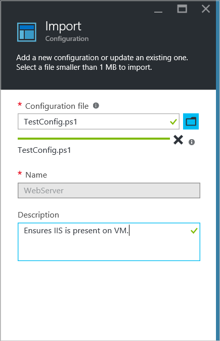
    

6. Click **OK**.

## Viewing a configuration in Azure Automation

After you have imported a configuration, you can view it in the Azure portal.

1. Sign in to the [Azure portal](https://portal.azure.com).

2. On the Hub menu, click **All resources** and then the name of your Automation account.

3. On the **Automation account** blade, click **DSC Configurations**

4. On the **DSC Configurations blade, click **TestConfig** (this is the name of the configuration you imported in the previous procedure).

5. On the **TestConfig Configuration** blade, click **View configuration source**.

    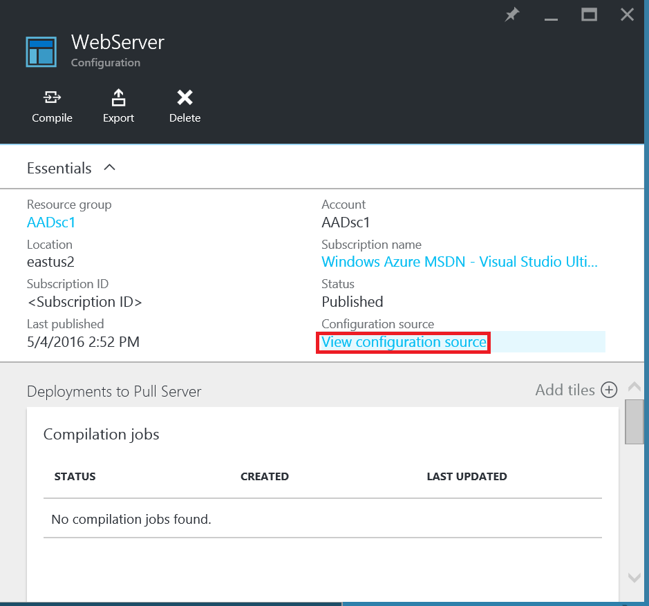
    
    A **TestConfig Configuration source** blade opens, displaying the PowerShell code for the configuration.
    
## Compiling a configuration in Azure Automation

Before you can apply a desired state to a node, a DSC configuration defining that state must be compiled into one or more node configurations (MOF document), and placed on the Automation DSC
Pull Server. For a more detailed description of compiling configurations in Azure Automation DSC, see [Compiling configurations in Azure Automation DSC](automation-dsc-compile.md). 
For more information about compiling configurations, see [DSC Configurations](https://msdn.microsoft.com/PowerShell/DSC/configurations).

1. Sign in to the [Azure portal](https://portal.azure.com).

2. On the Hub menu, click **All resources** and then the name of your Automation account.

3. On the **Automation account** blade, click **DSC Configurations**

4. On the **DSC Configurations blade, click **TestConfig** (the name of the previously imported configuration).

5. On the **TestConfig Configuration** blade, click **Compile**, and then click **Yes**. This starts a compilation job.
    
    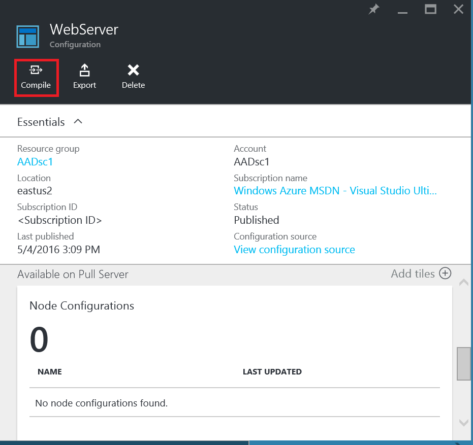
    
> [AZURE.NOTE] When you compile a configuration in Azure Automation, it automatically deploys any created node configuration MOFs to the pull server.

## Viewing a compilation job

After you start a compilation, you can view it in the **Compilation jobs** tile in the **Configuration** blade. The **Compilation jobs** tile shows currently running, completed, and
failed jobs. When you open a compilation job blade, it shows information about that job including any errors or warnings encountered, input parameters used in the configuration, and 
compilation logs.

1. Sign in to the [Azure portal](https://portal.azure.com).

2. On the Hub menu, click **All resources** and then the name of your Automation account.

3. On the **Automation account** blade, click **DSC Configurations**.

4. On the **DSC Configurations blade, click **TestConfig** (the name of the previously imported configuration).

5. On the **Compilation jobs** tile of the **TestConfig Configuration** blade, click on any of the jobs listed. A **Compilation Job** blade opens, labeled with the date that the 
compilation job was started.

    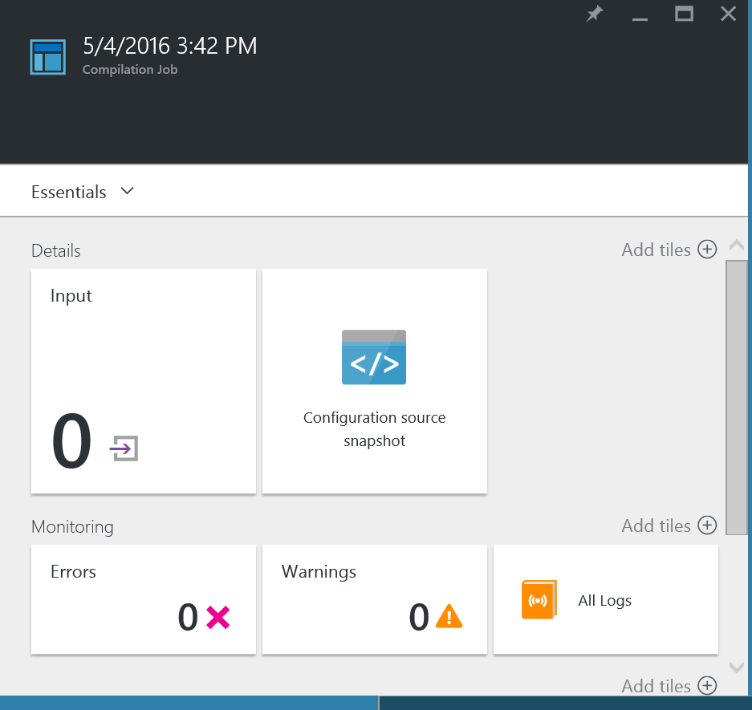
  
6. Click on any tile in the **Compilation Job** blade to see further details about the job.

## Viewing node configurations

Successful completion of a compilation job creates one or more new node configurations. A node configuration is a MOF document that is deployed to the pull server and ready to be pulled and 
applied by one or more nodes. You can view the node configurations in your Automation account in the **DSC Node Configurations** blade. A node configuration has a name with the form 
*ConfigurationName*.*NodeName*.

1. Sign in to the [Azure portal](https://portal.azure.com).

2. On the Hub menu, click **All resources** and then the name of your Automation account.

3. On the **Automation account** blade, click **DSC Node Configurations**.

    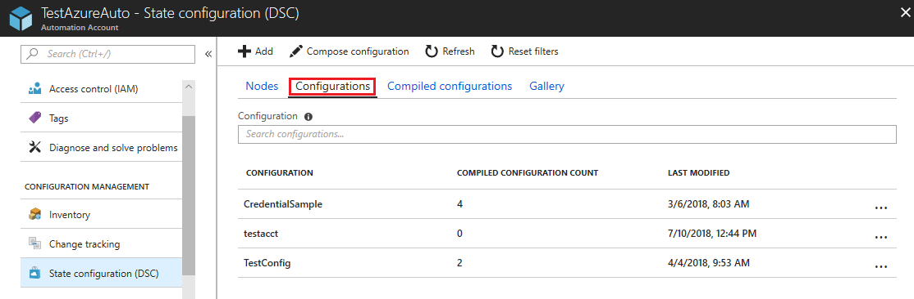
    
## Onboarding an Azure VM for management with Azure Automation DSC

You can use Azure Automation DSC to manage Azure VMs (both Classic and Resource Manager), on-premises VMs, Linux machines, AWS VMs, and on-premises physical machines. In this topic, 
we cover how to onboard only Azure Resource Manager VMs. For information about onboarding other types of machines, see 
[Onboarding machines for management by Azure Automation DSC](automation-dsc-onboarding.md).

### To onboard an Azure Resource Manager VM for management by Azure Automation DSC

1. Sign in to the [Azure portal](https://portal.azure.com).

2. On the Hub menu, click **All resources** and then the name of your Automation account.

3. On the **Automation account** blade, click **DSC Nodes**.

4. In the **DSC Nodes** blade, click **Add Azure VM**.

    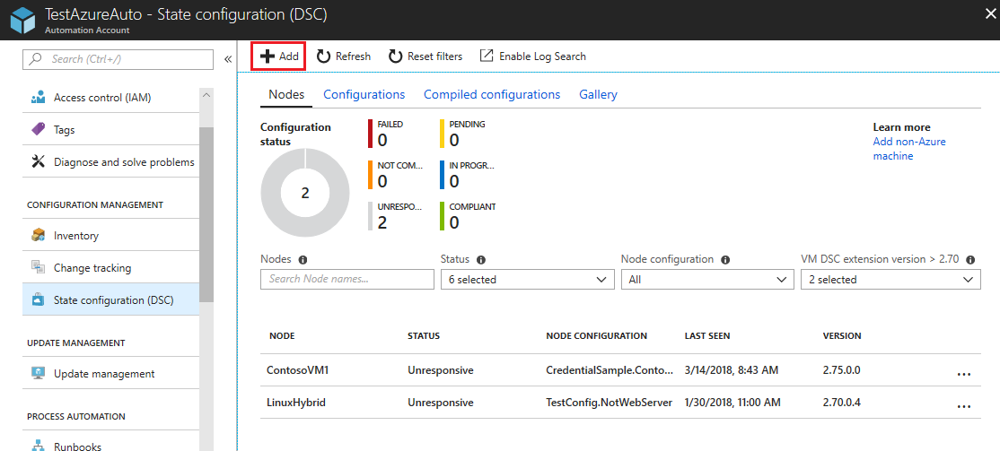

5. In the **Add Azure VMs** blade, click **Select virtual machines to onboard**.

6. In the **Select VMs** blade, select the VM you want to onboard, and click **OK**.

    >[AZURE.IMPORTANT] This must be an Azure Resource Manager VM running Windows Server 2008 R2 or later.
    
7. In the **Add Azure VMs** blade, click **Configure registration data**.

8. In the **Registration** blade, enter the name of the node configuration you want to apply to the VM in the **Node Configuration Name** box. This must exactly match the name
of a node configuration in the Automation account. Providing a name at this point is optional. You can change the assigned node configuration after onboarding the node.
Check **Reboot Node if Needed**, and then click **OK**.
    
    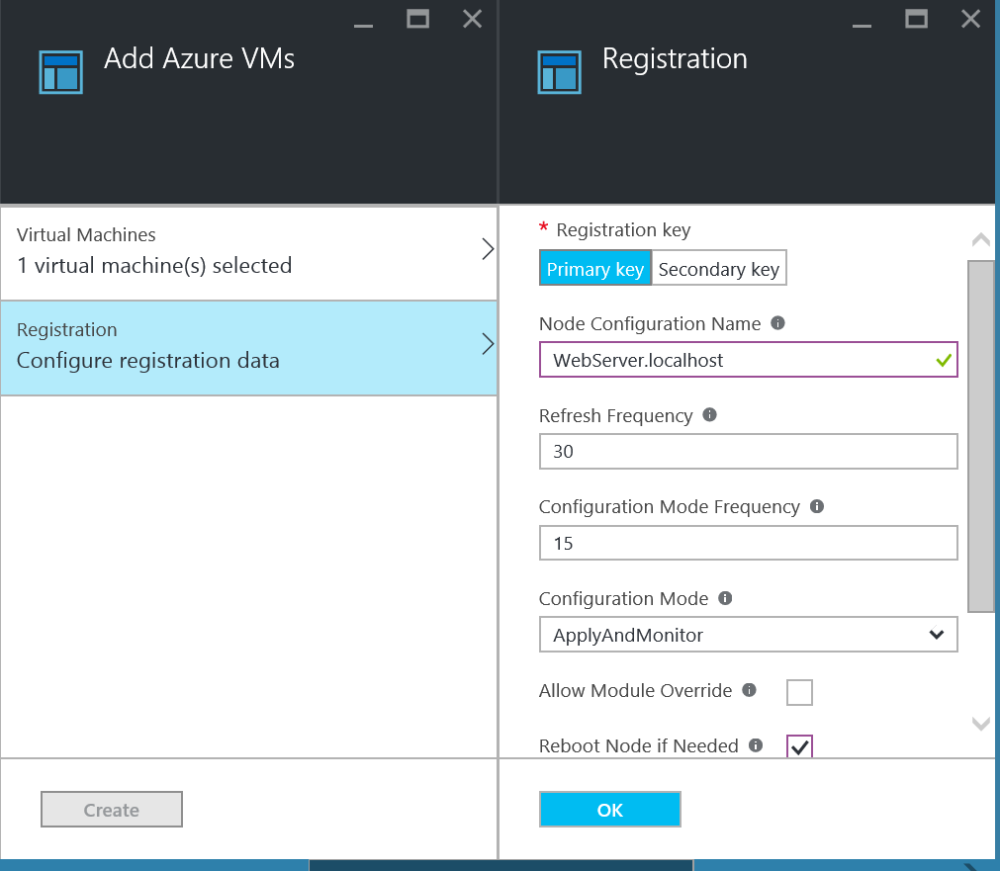
    
    The node configuration you specified will be applied to the VM at intervals specified by the **Configuration Mode Frequency**,
and the VM will check for updates to the node configuration at intervals specified by the **Refresh Frequency**. For more information about how these values are used, see
[Configuring the Local Configuration Manager](https://msdn.microsoft.com/PowerShell/DSC/metaConfig).
    
9. In the **Add Azure VMs** blade, click **Create**.

Azure will start the process of onboarding the VM. When it is complete, the VM will show up in the **DSC Nodes** blade in the Automation account.

## Viewing the list of DSC nodes

You can view the list of all machines that have been onboarded for management in your Automation account in the **DSC Nodes** blade.

1. Sign in to the [Azure portal](https://portal.azure.com).

2. On the Hub menu, click **All resources** and then the name of your Automation account.

3. On the **Automation account** blade, click **DSC Nodes**.

## Viewing reports for DSC nodes

Each time Azure Automation DSC performs a consistency check on a managed node, the node sends a status report back to the pull server. You can view these reports on the blade
for that node.

1. Sign in to the [Azure portal](https://portal.azure.com).

2. On the Hub menu, click **All resources** and then the name of your Automation account.

3. On the **Automation account** blade, click **DSC Nodes**.

4. On the **Reports** tile, click on any of the reports in the list.

    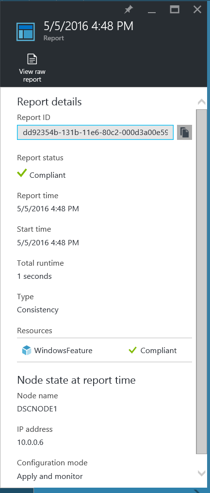

On the blade for an individual report, you can see the following status information for the corresponding consistency check:
- The report status--whether the node is "Compliant", the configuration "Failed", or the node is "Not Compliant" (when the node is in **applyandmonitor** mode and the machine is not in the
desired state).
- The start time for the consistency check.
- The total runtime for the consistency check.
- The type of consistency check.
- Any errors, including the error code and error message. 
- Any DSC resources used in the configuration, and the state of each resource (whether the node is in the desired state for that resource)--you can click on each resource to get more 
detailed information for that resource.
- The name, IP address, and configuration mode of the node.

You can also click **View raw report** to see the actual data that the node sends to the server. For more information about using that data, see 
[Using a DSC report server](https://msdn.microsoft.com/powershell/dsc/reportserver).

It can take some time after a node is onboarded before the first report is available. You might need to wait up to 30 minutes for the first report after you onboard a node.

## Reassigning a node to a different node configuration

You can assign a node to use a different node configuration than the one you initially assigned.

1. Sign in to the [Azure portal](https://portal.azure.com).

2. On the Hub menu, click **All resources** and then the name of your Automation account.

3. On the **Automation account** blade, click **DSC Nodes**.

4. On the **DSC Nodes** blade, click on the name of the node you want to reassign.

5. On the blade for that node, click **Assign node**.

    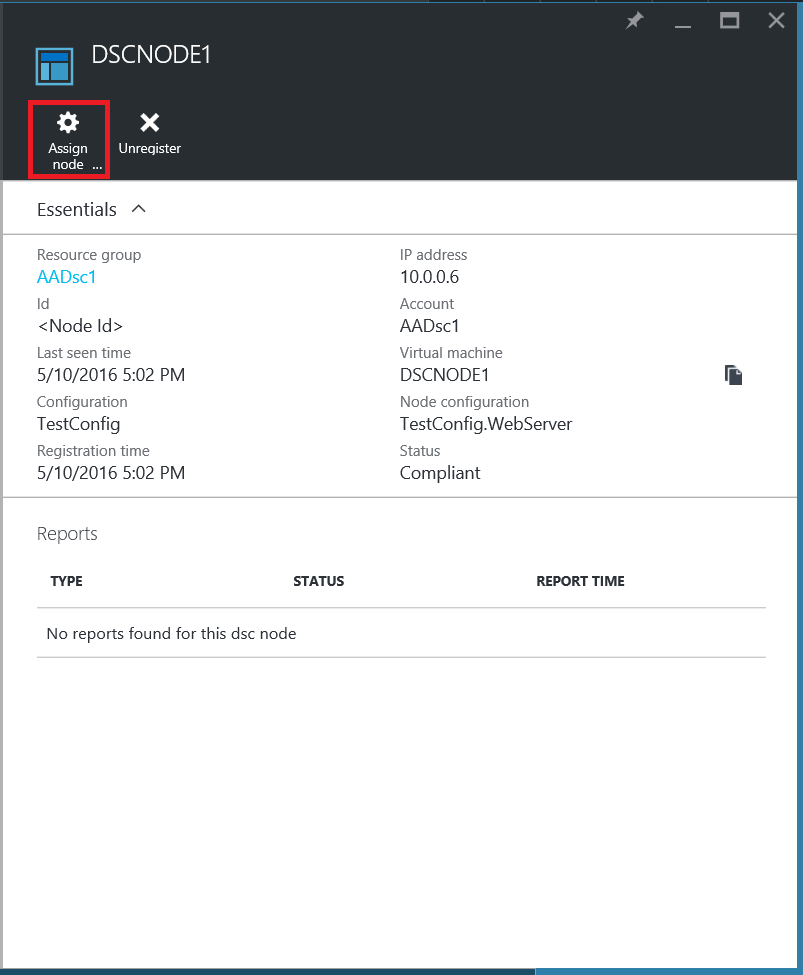

6. On the **Assign Node Configuration** blade, select the node configuration to which you want to assign the node, and then click **OK**.

    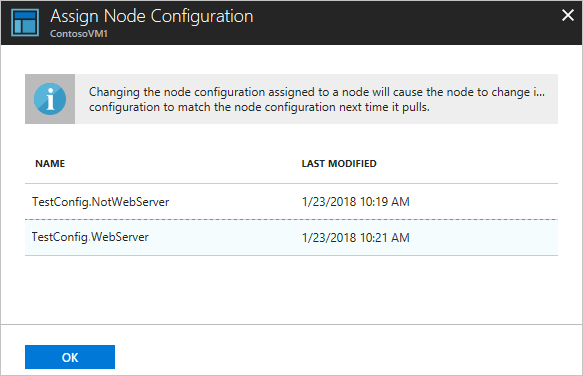
    
## Unregistering a node

If you no longer want a node to be managed by Azure Automation DSC, you can unregister it.

1. Sign in to the [Azure portal](https://portal.azure.com).

2. On the Hub menu, click **All resources** and then the name of your Automation account.

3. On the **Automation account** blade, click **DSC Nodes**.

4. On the **DSC Nodes** blade, click on the name of the node you want to reassign.

5. On the blade for that node, click **Unregister**.

    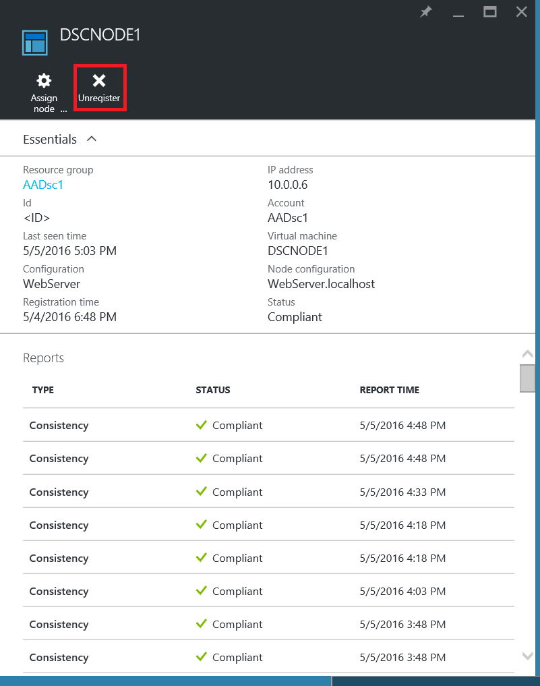

## Related Articles
* [Azure Automation DSC overview](automation-dsc-overview.md)
* [Onboarding machines for management by Azure Automation DSC](automation-dsc-onboarding.md)
* [Windows PowerShell Desired State Configuration Overview](https://msdn.microsoft.com/powershell/dsc/overview)
* [Azure Automation DSC cmdlets](https://msdn.microsoft.com/library/mt244122.aspx)
* [Azure Automation DSC pricing](https://azure.microsoft.com/pricing/details/automation/)

