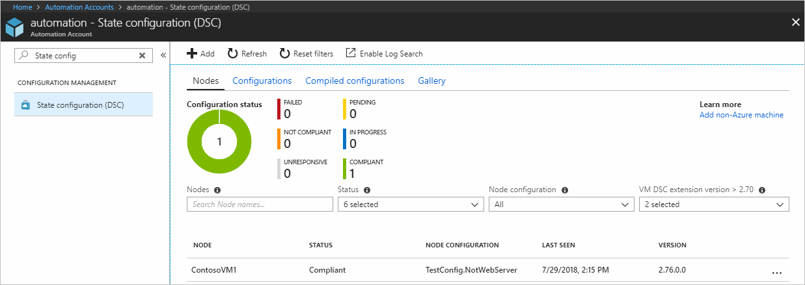

# Getting started with Azure Automation State Configuration

This article explains how to do the most common tasks with Azure Automation State Configuration, such as creating, importing, and compiling configurations, onboarding machines to manage, and viewing reports. For an overview of what Azure Automation State Configuration is, see [Azure Automation State Configuration Overview](automation-dsc-overview.md). For Desired State Configuration (DSC) documentation, see [Windows PowerShell Desired State Configuration Overview](/powershell/dsc/overview).

This article provides a step-by-step guide to using Azure Automation State Configuration. If you
want a sample environment that is already set up without following the steps described in this
article, you can use the following Resource Manager template: [Azure Automation Managed Node template](https://github.com/Azure/azure-quickstart-templates/tree/master/101-automation-configuration). This template sets up a completed
Azure Automation State Configuration environment, including an Azure VM that is managed by Azure
Automation State Configuration.

## Prerequisites

To complete the examples in this article, the following are required:

- An Azure Automation account. For instructions on creating an Azure Automation Run As account, see [Azure Run As Account](automation-sec-configure-azure-runas-account.md).
- An Azure Resource Manager VM (not Classic) running Windows Server 2008 R2 or later. For instructions on creating a VM, see [Create your first Windows virtual machine in the Azure portal](../virtual-machines/virtual-machines-windows-hero-tutorial.md)

## Creating a DSC configuration

You create a simple [DSC configuration](/powershell/dsc/configurations) that ensures either the
presence or absence of the **Web-Server** Windows Feature (IIS), depending on how you assign nodes.

1. Start [VSCode](https://code.visualstudio.com/docs) (or any text editor).
1. Type the following text:

    ```powershell
    configuration TestConfig
    {
        Node IsWebServer
        {
            WindowsFeature IIS
            {
                Ensure               = 'Present'
                Name                 = 'Web-Server'
                IncludeAllSubFeature = $true
            }
        }

        Node NotWebServer
        {
            WindowsFeature IIS
            {
                Ensure               = 'Absent'
                Name                 = 'Web-Server'
            }
        }
    }
    ```
1. Save the file as `TestConfig.ps1`.

This configuration calls one resource in each node block, the [WindowsFeature resource](/powershell/dsc/windowsfeatureresource), that ensures either the presence
or absence of the **Web-Server** feature.

## Importing a configuration into Azure Automation

Next, you import the configuration into the Automation account.

1. Sign in to the [Azure portal](https://portal.azure.com).
1. On the left, click **All resources** and then the name of your Automation account.
1. On the **Automation account** page, select **State configuration (DSC)** under **Configuration Management**.
1. On the **State configuration (DSC)** page, click the **Configurations** tab, then click **+ Add**.
1. On the **Import Configuration** page, browse to the `TestConfig.ps1` file on your computer.

   

1. Click **OK**.

## Viewing a configuration in Azure Automation

After you have imported a configuration, you can view it in the Azure portal.

1. Sign in to the [Azure portal](https://portal.azure.com).
1. On the left, click **All resources** and then the name of your Automation account.
1. On the **Automation account** page, select  **State configuration (DSC)** under **Configuration Management**.
1. On the **State configuration (DSC)** page, click the **Configurations** tab, then click **TestConfig** (this is the name of the configuration you imported in the previous procedure).
1. On the **TestConfig Configuration** page, click **View configuration source**.

   

   A **TestConfig Configuration source** page opens, displaying the PowerShell code for the configuration.

## Compiling a configuration in Azure Automation

Before you can apply a desired state to a node, a DSC configuration defining that state must be
compiled into one or more node configurations (MOF document), and placed on the Automation DSC Pull
Server. For a more detailed description of compiling configurations in Azure Automation State
Configuration, see [Compiling configurations in Azure Automation State Configuration](automation-dsc-compile.md).
For more information about compiling configurations, see
[DSC Configurations](/powershell/dsc/configurations).

1. Sign in to the [Azure portal](https://portal.azure.com).
1. On the left, click **All resources** and then the name of your Automation account.
1. On the **Automation account** page, click **State configuration (DSC)** under **Configuration Management**.
1. On the **State configuration (DSC)** page, click the **Configurations** tab, then click **TestConfig** (the name of the previously imported configuration).
1. On the **TestConfig Configuration** page, click **Compile**, and then click **Yes**. This starts a compilation job.

   

> [!NOTE]
> When you compile a configuration in Azure Automation, it automatically deploys any created node configuration MOFs to the pull server.

## Viewing a compilation job

After you start a compilation, you can view it in the **Compilation Jobs** tile in the
**Configuration** page. The **Compilation Jobs** tile shows currently running, completed, and
failed jobs. When you open a compilation job page, it shows information about that job including
any errors or warnings encountered, input parameters used in the configuration, and compilation
logs.

1. Sign in to the [Azure portal](https://portal.azure.com).
1. On the left, click **All resources** and then the name of your Automation account.
1. On the **Automation account** page, click **State configuration (DSC)** under **Configuration Management**.
1. On the **State configuration (DSC)** page, click the **Configurations** tab, then click **TestConfig** (the name of the previously imported configuration).
1. Under **Compilation jobs**, select the compilation job you want to view. A **Compilation Job** page opens labeled with the date that the compilation job was started.

   

1. Click on any tile in the **Compilation Job** page to see further details about the job.

## Viewing node configurations

Successful completion of a compilation job creates one or more new node configurations. A node
configuration is a MOF document that is deployed to the pull server and ready to be pulled and
applied by one or more nodes. You can view the node configurations in your Automation account in
the **State configuration (DSC)** page. A node configuration has a name with the form
*ConfigurationName*.*NodeName*.

1. Sign in to the [Azure portal](https://portal.azure.com).
1. On the left, click **All resources** and then the name of your Automation account.
1. On the **Automation account** blade, click **State configuration (DSC)** under **Configuration Management**.
1. On the **State configuration (DSC)** page, click the **Compiled configurations** tab.

   

## Onboarding an Azure VM for management with Azure Automation State Configuration

You can use Azure Automation State Configuration to manage Azure VMs (both Classic and Resource
Manager), on-premises VMs, Linux machines, AWS VMs, and on-premises physical machines. In this
article, you learn how to onboard only Azure Resource Manager VMs. For information about onboarding
other types of machines, see [Onboarding machines for management by Azure Automation
State Configuration](automation-dsc-onboarding.md).

### To onboard an Azure Resource Manager VM for management by Azure Automation State Configuration

1. Sign in to the [Azure portal](https://portal.azure.com).
1. On the left, click **All resources** and then the name of your Automation account.
1. On the **Automation account** blade, click **State configuration (DSC)** under **Configuration Management**.
1. On the **State configuration (DSC)** page, while on the **Nodes** tab, click **+ Add**.

   

1. On the **Virtual Machines** page, select your VM.
1. On the **Virtual machine** detail page, click **+ Connect**.

   > [!IMPORTANT]
   > This must be an Azure Resource Manager VM running Windows Server 2008 R2 or later.

1. In the **Registration** page, select the name of the node configuration you want to apply to the VM in the **Node configuration name** box. Providing a name at this point is optional. You can change the assigned node configuration after onboarding the node.
   Check **Reboot Node if Needed**, then click **OK**.

   

   The node configuration you specified are applied to the VM at intervals specified by the **Configuration Mode Frequency**,
   and the VM checks for updates to the node configuration at intervals specified by the **Refresh Frequency**. For more information about how these values are used, see
   [Configuring the Local Configuration Manager](https://msdn.microsoft.com/PowerShell/DSC/metaConfig).
1. In the **Add Azure VMs** blade, click **Create**.

Azure starts the process of onboarding the VM. When it is complete, the VM shows up in the
**Nodes** tab of the **State configuration (DSC)** page in the Automation account.

## Viewing the list of managed nodes

You can view the list of all machines that have been onboarded for management in your Automation
account in the **Nodes** tab of the **State configuration (DSC)** page.

1. Sign in to the [Azure portal](https://portal.azure.com).
1. On the left, click **All resources** and then the name of your Automation account.
1. On the **Automation account** blade, click **State configuration (DSC)** under **Configuration Management**.
1. On the **State configuration (DSC)** page, click the **Nodes** tab.

## Viewing reports for managed nodes

Each time Azure Automation State Configuration performs a consistency check on a managed node, the
node sends a status report back to the pull server. You can view these reports on the page for that
node.

1. Sign in to the [Azure portal](https://portal.azure.com).
1. On the left, click **All resources** and then the name of your Automation account.
1. On the **Automation account** blade, click **State configuration (DSC)** under **Configuration Management**.
1. On the **State configuration (DSC)** page, click the **Nodes** tab. Here, you can see the overview of Configuration state and the details for each node.

   

1. While on the **Nodes** tab, click the node record to open the reporting. Click the report you want to view additional reporting details.

   

On the blade for an individual report, you can see the following status information for the corresponding consistency check:

- The report status — whether the node is "Compliant", the configuration "Failed", or the node is "Not Compliant" (when the node is in **ApplyandMonitor** mode and the machine is not in the desired state).
- The start time for the consistency check.
- The total runtime for the consistency check.
- The type of consistency check.
- Any errors, including the error code and error message.
- Any DSC resources used in the configuration, and the state of each resource (whether the node is in the desired state for that resource) — you can click on each resource to get more detailed information for that resource.
- The name, IP address, and configuration mode of the node.

You can also click **View raw report** to see the actual data that the node sends to the server.
For more information about using that data, see [Using a DSC report server](/powershell/dsc/reportserver).

It can take some time after a node is onboarded before the first report is available. You might
need to wait up to 30 minutes for the first report after you onboard a node.

## Reassigning a node to a different node configuration

You can assign a node to use a different node configuration than the one you initially assigned.

1. Sign in to the [Azure portal](https://portal.azure.com).
1. On the left, click **All resources** and then the name of your Automation account.
1. On the **Automation account** blade, click **State configuration (DSC)** under **Configuration Management**.
1. On the **State configuration (DSC)** page, click the **Nodes** tab.
1. On the **Nodes** tab, click on the name of the node you want to reassign.
1. On the page for that node, click **Assign node configuration**.

    

1. On the **Assign Node Configuration** page, select the node configuration to which you want to assign the node, and then click **OK**.

    

## Unregistering a node

If you no longer want a node to be managed by Azure Automation DSC, you can unregister it.

1. Sign in to the [Azure portal](https://portal.azure.com).
1. On the left, click **All resources** and then the name of your Automation account.
1. On the **Automation account** blade, click **State configuration (DSC)** under **Configuration Management**.
1. On the **State configuration (DSC)** page, click the **Nodes** tab.
1. On the **Nodes** tab, click on the name of the node you want to unregister.
1. On the page for that node, click **Unregister**.

    

## Related Articles

- [Azure Automation State Configuration overview](automation-dsc-overview.md)
- [Onboarding machines for management by Azure Automation State Configuration](automation-dsc-onboarding.md)
- [Windows PowerShell Desired State Configuration Overview](/powershell/dsc/overview)
- [Azure Automation State Configuration cmdlets](/powershell/module/azurerm.automation/#automation)
- [Azure Automation State Configuration pricing](https://azure.microsoft.com/pricing/details/automation/)