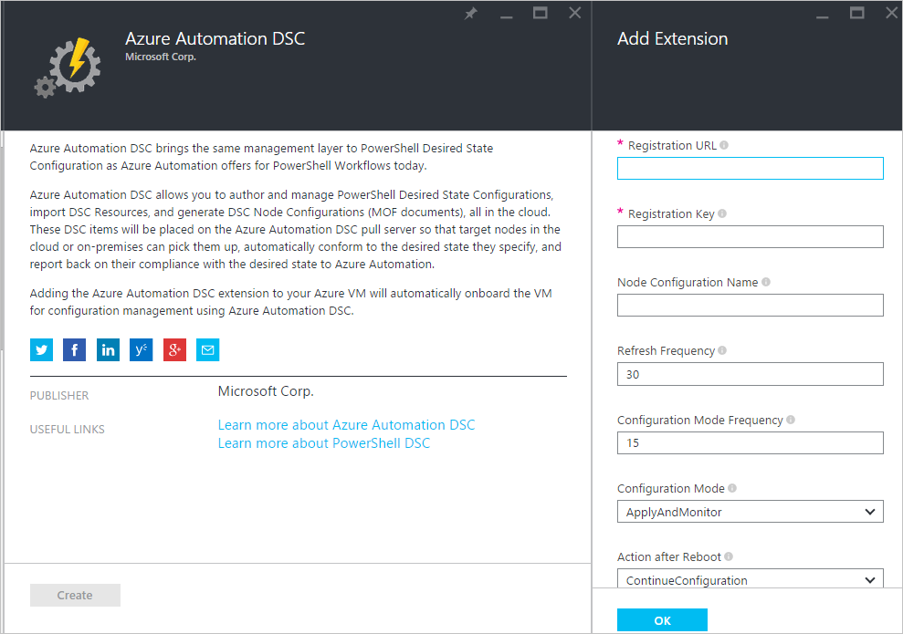
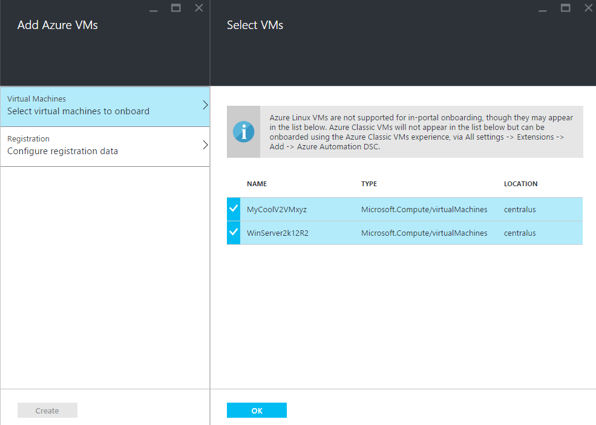
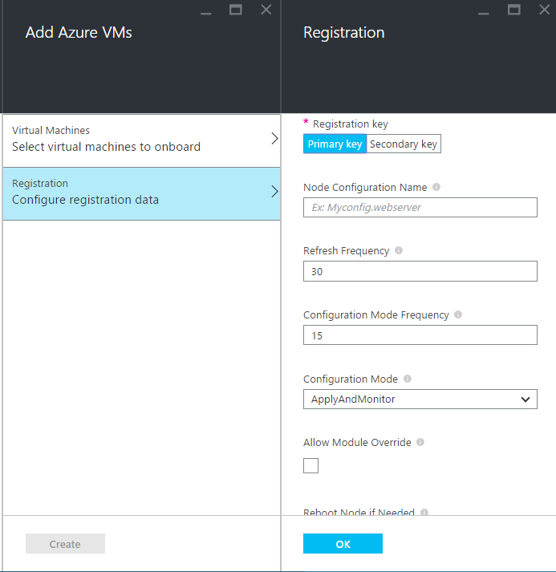
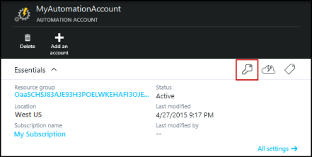
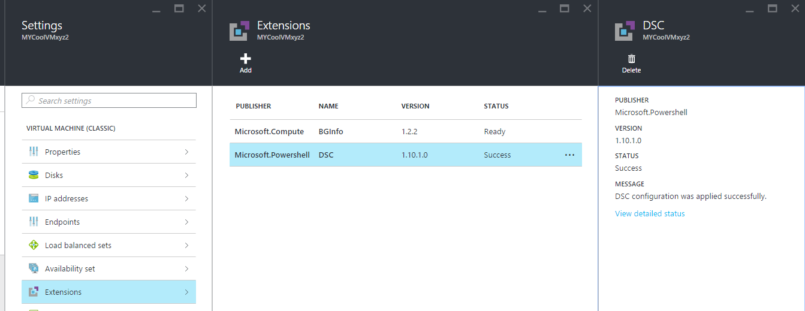

<properties 
   pageTitle="Onboarding physical and virtual machines for management by Azure Automation DSC | Microsoft Azure" 
   description="How to setup machines for management with Azure Automation DSC" 
   services="automation" 
   documentationCenter="dev-center-name" 
   authors="coreyp-at-msft" 
   manager="stevenka" 
   editor="tysonn"/>

<tags
   ms.service="automation"
   ms.devlang="NA"
   ms.topic="article"
   ms.tgt_pltfrm="powershell"
   ms.workload="TBD" 
   ms.date="04/22/2016"
   ms.author="coreyp"/>

# Onboarding machines for management by Azure Automation DSC

## Why manage machines with Azure Automation DSC?

Like [PowerShell Desired State Configuration](https://technet.microsoft.com/library/dn249912.aspx), Azure Automation Desired State Configuration is a simple, yet powerful, configuration management service for DSC nodes (physical and virtual machines) in any cloud or on-premises datacenter. It enables scalability across thousands of machines quickly and easily from a central, secure location. You can easily onboard machines, assign them declarative configurations, and view reports showing each machine’s compliance to the desired state you specified. The Azure Automation DSC management layer is to DSC what the Azure Automation management layer is to PowerShell scripting. In other words, in the same way that Azure Automation helps you manage PowerShell scripts, it also helps you manage DSC configurations. To learn more about the benefits of using Azure Automation DSC, see [Azure Automation DSC overview](automation-dsc-overview.md). 

Azure Automation DSC can be used to manage a variety of machines:

*    Azure virtual machines (classic)
*    Azure virtual machines
*    Amazon Web Services (AWS) virtual machines
*    Physical/virtual Windows machines on-premises, or in a cloud other than Azure/AWS
*    Physical/virtual Linux machines on-premises, in Azure, or in a cloud other than Azure

In addition, if you are not ready to manage machine configuration from the cloud, Azure Automation DSC can also be used as a report-only endpoint. This allows you to set (push) desired configuration through DSC on-premises and view rich reporting details on node compliance with the desired state in Azure Automation.

The following sections outline how you can onboard each type of machine to Azure Automation DSC.

## Azure virtual machines (classic)

With Azure Automation DSC, you can easily onboard Azure virtual machines (classic) for configuration management using either the Azure portal, or PowerShell. Under the hood, and without an administrator having to remote into the VM, the Azure VM Desired State Configuration extension registers the VM with Azure Automation DSC. Since the Azure VM Desired State Configuration extension runs asynchronously, steps to track its progress or troubleshoot it are provided in the [**Troubleshooting Azure virtual machine onboarding**](#troubleshooting-azure-virtual-machine-onboarding) section below.

### Azure portal

In the [Azure portal](http://portal.azure.com/), click **Browse** -> **Virtual machines (classic)**. Select the Windows VM you want to onboard. On the virtual machine’s dashboard blade, click **All settings** -> **Extensions** -> **Add** -> **Azure Automation DSC** -> **Create**. Enter the [PowerShell DSC Local Configuration Manager values](https://msdn.microsoft.com/powershell/dsc/metaconfig4) required for your use case, your Automation account’s registration key and registration URL, and optionally a node configuration to assign to the VM.

To find the registration URL and key for the Automation account to onboard the machine to, see the [**Secure registration**](#secure-registration) section below.

### PowerShell

    # log in to both Azure Service Management and Azure Resource Manager
    Add-AzureAccount
    Add-AzureRmAccount
    
    # fill in correct values for your VM/Automation account here
    $VMName = ""
    $ServiceName = ""
    $AutomationAccountName = ""
    $AutomationAccountResourceGroup = ""

    # fill in the name of a Node Configuration in Azure Automation DSC, for this VM to conform to
    $NodeConfigName = ""

    # get Azure Automation DSC registration info
    $Account = Get-AzureRmAutomationAccount -ResourceGroupName $AutomationAccountResourceGroup -Name $AutomationAccountName
    $RegistrationInfo = $Account | Get-AzureRmAutomationRegistrationInfo

    # use the DSC extension to onboard the VM for management with Azure Automation DSC
    $VM = Get-AzureVM -Name $VMName -ServiceName $ServiceName
    
    $PublicConfiguration = ConvertTo-Json -Depth 8 @{
      SasToken = ""
      ModulesUrl = "https://eus2oaasibizamarketprod1.blob.core.windows.net/automationdscpreview/RegistrationMetaConfigV2.zip"
      ConfigurationFunction = "RegistrationMetaConfigV2.ps1\RegistrationMetaConfigV2"

    # update these PowerShell DSC Local Configuration Manager defaults if they do not match your use case.
    # See https://technet.microsoft.com/library/dn249922.aspx?f=255&MSPPError=-2147217396 for more details
     Properties = @{
        RegistrationKey = @{
          UserName = 'notused'
          Password = 'PrivateSettingsRef:RegistrationKey'
        }
        RegistrationUrl = $RegistrationInfo.Endpoint
        NodeConfigurationName = $NodeConfigName
        ConfigurationMode = "ApplyAndMonitor"
        ConfigurationModeFrequencyMins = 15
        RefreshFrequencyMins = 30
        RebootNodeIfNeeded = $False
        ActionAfterReboot = "ContinueConfiguration"
        AllowModuleOverwrite = $False
      }
    }

    $PrivateConfiguration = ConvertTo-Json -Depth 8 @{
      Items = @{
         RegistrationKey = $RegistrationInfo.PrimaryKey
      }
    }
    
    $VM = Set-AzureVMExtension `
     -VM $vm `
     -Publisher Microsoft.Powershell `
     -ExtensionName DSC `
     -Version 2.19 `
     -PublicConfiguration $PublicConfiguration `
     -PrivateConfiguration $PrivateConfiguration `
     -ForceUpdate

    $VM | Update-AzureVM

## Azure virtual machines

Azure Automation DSC lets you easily onboard Azure virtual machines for configuration management, using either the Azure portal, Azure Resource Manager templates, or PowerShell. Under the hood, and without an administrator having to remote into the VM, the Azure VM Desired State Configuration extension registers the VM with Azure Automation DSC. Since the Azure VM Desired State Configuration extension runs asynchronously, steps to track its progress or troubleshoot it are provided in the [**Troubleshooting Azure virtual machine onboarding**](#troubleshooting-azure-virtual-machine-onboarding) section below.

### Azure portal

In the [Azure portal](https://portal.azure.com/), navigate to the Azure Automation account where you want to onboard virtual machines. On the Automation account dashboard, click **DSC Nodes** -> **Add Azure VM**.

Under **Select virtual machines to onboard**, select one or more Azure virtual machines to onboard.

Under **Configure registration data**, enter the [PowerShell DSC Local Configuration Manager values](https://msdn.microsoft.com/powershell/dsc/metaconfig4) required for your use case, and optionally a node configuration to assign to the VM.

 
### Azure Resource Manager templates

Azure virtual machines can be deployed and onboarded to Azure Automation DSC via Azure Resource Manager templates. See [Configure a VM via DSC extension and Azure Automation DSC](https://azure.microsoft.com/documentation/templates/dsc-extension-azure-automation-pullserver/) for an example template that onboards an existing VM to Azure Automation DSC. To find the registration key and registration URL taken as input in this template, see the [**Secure registration**](#secure-registration) section below.

### PowerShell

The [Register-AzureRmAutomationDscNode](https://msdn.microsoft.com/library/mt603833.aspx) cmdlet can be used to onboard virtual machines in the Azure portal via PowerShell.

## Amazon Web Services (AWS) virtual machines

You can easily onboard Amazon Web Services virtual machines for configuration management by Azure Automation DSC using the AWS DSC Toolkit. You can learn more about the toolkit [here](https://blogs.msdn.microsoft.com/powershell/2016/04/20/aws-dsc-toolkit/).

## Physical/virtual Windows machines on-premises, or in a cloud other than Azure/AWS

On-premises Windows machines and Windows machines in non-Azure clouds (such as Amazon Web Services) can also be onboarded to Azure Automation DSC, as long as they have outbound access to the internet, via a few simple steps:

1. Make sure the latest version of [WMF 5](http://aka.ms/wmf5latest) is installed on the machines you want to onboard to Azure Automation DSC.
2. Follow the directions in section [**Generating DSC metaconfigurations**](#generating-dsc-metaconfigurations) below to generate a folder containing the needed DSC metaconfigurations.
3. Remotely apply the PowerShell DSC metaconfiguration to the machines you want to onboard. **The machine this command is run from must have the latest version of [WMF 5](http://aka.ms/wmf5latest) installed**:

	`Set-DscLocalConfigurationManager -Path C:\Users\joe\Desktop\DscMetaConfigs -ComputerName MyServer1, MyServer2`

4. If you cannot apply the PowerShell DSC metaconfigurations remotely, copy the metaconfigurations folder from step 2 onto each machine to onboard. Then call **Set-DscLocalConfigurationManager** locally on each machine to onboard.
5. Using the Azure portal or cmdlets, check that the machines to onboard now show up as DSC nodes registered in your Azure Automation account.

## Physical/virtual Linux machines on-premises, in Azure, or in a cloud other than Azure

On-premises Linux machines, Linux machines in Azure, and Linux machines in non-Azure clouds can also be onboarded to Azure Automation DSC, as long as they have outbound access to the internet, via a few simple steps:

1. Make sure the latest version of the [DSC Linux agent](http://www.microsoft.com/download/details.aspx?id=49150) is installed on the machines you want to onboard to Azure Automation DSC.

2. If the [PowerShell DSC Local Configuration Manager defaults](https://msdn.microsoft.com/powershell/dsc/metaconfig4) match your use case, and you want to onboard machines such that they **both** pull from and report to Azure Automation DSC:

	*    On each Linux machine to onboard to Azure Automation DSC, use Register.py to onboard using the PowerShell DSC Local Configuration Manager defaults:

		`/opt/microsoft/dsc/Scripts/Register.py <Automation account registration key> <Automation account registration URL>`

	*    To find the registration key and registration URL for your Automation account, see the [**Secure registration**](#secure-registration) section below.

	If the PowerShell DSC Local Configuration Manager defaults **do** **not** match your use case, or you want to onboard machines such that they only report to Azure Automation DSC, but do not pull configuration or PowerShell modules from it,  follow steps 3 - 6. Otherwise, proceed directly to step 6.

3.	Follow the directions in the [**Generating DSC metaconfigurations**](#generating-dsc-metaconfigurations) section below to generate a folder containing the needed DSC metaconfigurations.
4.  Remotely apply the PowerShell DSC metaconfiguration to the machines you want to onboard:
    	
    	$SecurePass = ConvertTo-SecureString -String "<root password>" -AsPlainText -Force
        $Cred = New-Object System.Management.Automation.PSCredential "root", $SecurePass
        $Opt = New-CimSessionOption -UseSsl -SkipCACheck -SkipCNCheck -SkipRevocationCheck

        # need a CimSession for each Linux machine to onboard
        
        $Session = New-CimSession -Credential $Cred -ComputerName <your Linux machine> -Port 5986 -Authentication basic -SessionOption $Opt
    	
    	Set-DscLocalConfigurationManager -CimSession $Session –Path C:\Users\joe\Desktop\DscMetaConfigs
	
The machine this command is run from must have the latest version of [WMF 5](http://aka.ms/wmf5latest) installed.

5.  If you cannot apply the PowerShell DSC metaconfigurations remotely, for each Linux machine to onboard, copy the metaconfiguration corresponding to that machine from the folder in step 5 onto the Linux machine. Then call `SetDscLocalConfigurationManager.py` locally on each Linux machine you want to onboard to Azure Automation DSC:

	`/opt/microsoft/dsc/Scripts/SetDscLocalConfigurationManager.py –configurationmof <path to metaconfiguration file>`

6.  Using the Azure portal or cmdlets, check that the machines to onboard now show up as DSC nodes registered in your Azure Automation account.

##Generating DSC metaconfigurations
To generically onboard any machine to Azure Automation DSC, a DSC metaconfiguration can be generated that, when applied, tells the DSC agent on the machine to pull from and/or report to Azure Automation DSC. DSC metaconfigurations for Azure Automation DSC can be generated using either a PowerShell DSC configuration, or the Azure Automation PowerShell cmdlets.

**Note:** DSC metaconfigurations contain the secrets needed to onboard a machine to an Automation account for management. Make sure to properly protect any DSC metaconfigurations you create, or delete them after use.

###Using a DSC Configuration
1.	Open the PowerShell ISE as an administrator in a machine in your local environment. The machine must have the latest version of [WMF 5](http://aka.ms/wmf5latest) installed.

2.	Copy the following script locally. This script contains a PowerShell DSC configuration for creating metaconfigurations, and a command to kick off the metaconfiguration creation.
    
        # The DSC configuration that will generate metaconfigurations
        [DscLocalConfigurationManager()]
        Configuration DscMetaConfigs 
        { 
            param 
            ( 
                [Parameter(Mandatory=$True)] 
                [String]$RegistrationUrl,
         
                [Parameter(Mandatory=$True)] 
                [String]$RegistrationKey,

                [Parameter(Mandatory=$True)] 
                [String[]]$ComputerName,

                [Int]$RefreshFrequencyMins = 30, 
            
                [Int]$ConfigurationModeFrequencyMins = 15, 
            
                [String]$ConfigurationMode = "ApplyAndMonitor", 
            
                [String]$NodeConfigurationName,

                [Boolean]$RebootNodeIfNeeded= $False,

                [String]$ActionAfterReboot = "ContinueConfiguration",

                [Boolean]$AllowModuleOverwrite = $False,

                [Boolean]$ReportOnly
            )

    
            if(!$NodeConfigurationName -or $NodeConfigurationName -eq "") 
            { 
                $ConfigurationNames = $null 
            } 
            else 
            { 
                $ConfigurationNames = @($NodeConfigurationName) 
            }

            if($ReportOnly)
            {
               $RefreshMode = "PUSH"
            }
            else
            {
               $RefreshMode = "PULL"
            }

            Node $ComputerName
            {

                Settings 
                { 
                    RefreshFrequencyMins = $RefreshFrequencyMins 
                    RefreshMode = $RefreshMode 
                    ConfigurationMode = $ConfigurationMode 
                    AllowModuleOverwrite = $AllowModuleOverwrite 
                    RebootNodeIfNeeded = $RebootNodeIfNeeded 
                    ActionAfterReboot = $ActionAfterReboot 
                    ConfigurationModeFrequencyMins = $ConfigurationModeFrequencyMins 
                }

                if(!$ReportOnly)
                {
                   ConfigurationRepositoryWeb AzureAutomationDSC 
                    { 
                        ServerUrl = $RegistrationUrl 
                        RegistrationKey = $RegistrationKey 
                        ConfigurationNames = $ConfigurationNames 
                    }

                    ResourceRepositoryWeb AzureAutomationDSC 
                    { 
                       ServerUrl = $RegistrationUrl 
                       RegistrationKey = $RegistrationKey 
                    }
                }

                ReportServerWeb AzureAutomationDSC 
                { 
                    ServerUrl = $RegistrationUrl 
                    RegistrationKey = $RegistrationKey 
                }
            } 
        }
        
        # Create the metaconfigurations
        # TODO: edit the below as needed for your use case
        $Params = @{
             RegistrationUrl = '<fill me in>';
             RegistrationKey = '<fill me in>';
             ComputerName = @('<some VM to onboard>', '<some other VM to onboard>');
             NodeConfigurationName = 'SimpleConfig.webserver';
             RefreshFrequencyMins = 30;
             ConfigurationModeFrequencyMins = 15;
             RebootNodeIfNeeded = $False;
             AllowModuleOverwrite = $False;
             ConfigurationMode = 'ApplyAndMonitor';
             ActionAfterReboot = 'ContinueConfiguration';
             ReportOnly = $False;  # Set to $True to have machines only report to AA DSC but not pull from it
        }
        
        # Use PowerShell splatting to pass parameters to the DSC configuration being invoked
        # For more info about splatting, run: Get-Help -Name about_Splatting
        DscMetaConfigs @Params

3.	Fill in the registration key and URL for your Automation account, as well as the names of the machines to onboard. All other parameters are optional. To find the registration key and registration URL for your Automation account, see the [**Secure registration**](#secure-registration) section below.

4.	If you want the machines to report DSC status information to Azure Automation DSC, but not pull configuration or PowerShell modules, set the **ReportOnly** parameter to true.

5.	Run the script. You should now have a folder called **DscMetaConfigs** in your working directory, containing the PowerShell DSC metaconfigurations for the machines to onboard.

###Using the Azure Automation cmdlets
If the PowerShell DSC Local Configuration Manager defaults match your use case, and you want to onboard machines such that they both pull from and report to Azure Automation DSC, the Azure Automation cmdlets provide a simplified method of generating the DSC metaconfigurations needed:

1.	Open the PowerShell console or PowerShell ISE as an administrator in a machine in your local environment.

2.	Connect to Azure Resource Manager using **Add-AzureRmAccount**

3.	Download the PowerShell DSC metaconfigurations for the machines you want to onboard from the Automation account to which you want to onboard nodes:

        # Define the parameters for Get-AzureRmAutomationDscOnboardingMetaconfig using PowerShell Splatting
        $Params = @{
            ResourceGroupName = 'ContosoResources'; # The name of the ARM Resource Group that contains your Azure Automation Account
            AutomationAccountName = 'ContosoAutomation'; # The name of the Azure Automation Account where you want a node on-boarded to
            ComputerName = @('web01', 'web02', 'sql01'); # The names of the computers that the meta configuration will be generated for
            OutputFolder = "$env:UserProfile\Desktop\";
        }
        
        # Use PowerShell splatting to pass parameters to the Azure Automation cmdlet being invoked
        # For more info about splatting, run: Get-Help -Name about_Splatting
        Get-AzureRmAutomationDscOnboardingMetaconfig @Params

You should now have a folder called ***DscMetaConfigs***, containing the PowerShell DSC metaconfigurations for the machines to onboard.

##Secure registration

Machines can securely onboard to an Azure Automation account through the WMF 5 DSC registration protocol, which allows a DSC node to authenticate to a PowerShell DSC V2 Pull or Reporting server (including Azure Automation DSC). The node registers to the server at a **Registration URL**, authenticating using a **Registration key**. During registration, the DSC node and DSC Pull/Reporting server negotiate a unique certificate for this node to use for authentication to the server post-registration. This process prevents onboarded nodes from impersonating one another, such as if a node is compromised and behaving maliciously. After registration, the Registration key is not used for authentication again, and is deleted from the node.

You can get the information required for the DSC registration protocol from the **Manage Keys** blade in the Azure preview portal. Open this blade by clicking the key icon on the **Essentials** panel for the Automation account.

*    Registration URL is the URL field in the Manage Keys blade.
*    Registration key is the Primary Access Key or Secondary Access Key in the Manage Keys blade. Either key can be used.

For added security, the primary and secondary access keys of an Automation account can be regenerated at any time (on the **Manage Keys** blade) to prevent future node registrations using previous keys.

##Troubleshooting Azure virtual machine onboarding

Azure Automation DSC lets you easily onboard Azure Windows VMs for configuration management. Under the hood, the Azure VM Desired State Configuration extension is used to register the VM with Azure Automation DSC. Since the Azure VM Desired State Configuration extension runs asynchronously, tracking its progress and troubleshooting its execution may be important. 

>[AZURE.NOTE] Any method of onboarding an Azure Windows VM to Azure Automation DSC that uses the Azure VM Desired State Configuration extension could take up to an hour for the node to show up as registered in Azure Automation. This is due to the installation of Windows Management Framework 5.0 on the VM by the Azure VM DSC extension, which is required to onboard the VM to Azure Automation DSC.

To troubleshoot or view the status of the Azure VM Desired State Configuration extension, in the Azure portal navigate to the VM being onboarded, then click -> **All settings** -> **Extensions** -> **DSC**. For more details, you can click **View detailed status**.

## Certificate expiration and reregistration

After registering a machine as a DSC node in Azure Automation DSC, there are a number of reasons why you may need to reregister that node in the future:

* After registering, each node automatically negotiates a unique certificate for authentication that expires after one year. Currently, the PowerShell DSC registration protocol cannot automatically renew certificates when they are nearing expiration, so you need to reregister the nodes after a year’s time. Before reregistering, ensure that each node is running Windows Management Framework 5.0 RTM. If a node’s authentication certificate expires, and the node is not reregistered, the node will be unable to communicate with Azure Automation and will be marked ‘Unresponsive.’ Reregistration performed 90 days or less from the certificate expiration time, or at any point after the certificate expiration time, will result in a new certificate being generated and used.

* To change any [PowerShell DSC Local Configuration Manager values](https://msdn.microsoft.com/powershell/dsc/metaconfig4) that were set during initial registration of the node, such as ConfigurationMode. Currently, these DSC agent values can only be changed through reregistration. The one exception is the Node Configuration assigned to the node -- this can be changed in Azure Automation DSC directly.

Reregistration can be performed in the same way you registered the node initially, using any of the onboarding methods described in this document. You do not need to unregister a node from Azure Automation DSC before reregistering it.

## Related Articles
* [Azure Automation DSC overview](automation-dsc-overview.md)
* [Azure Automation DSC cmdlets](https://msdn.microsoft.com/library/mt244122.aspx)
* [Azure Automation DSC pricing](https://azure.microsoft.com/pricing/details/automation/)

