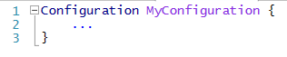
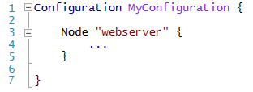
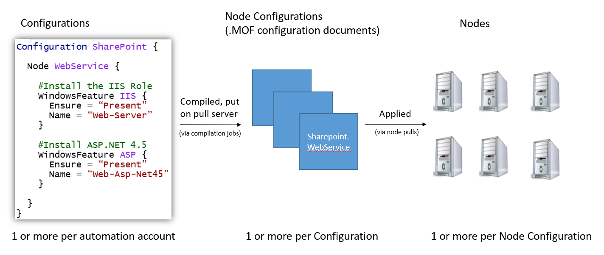
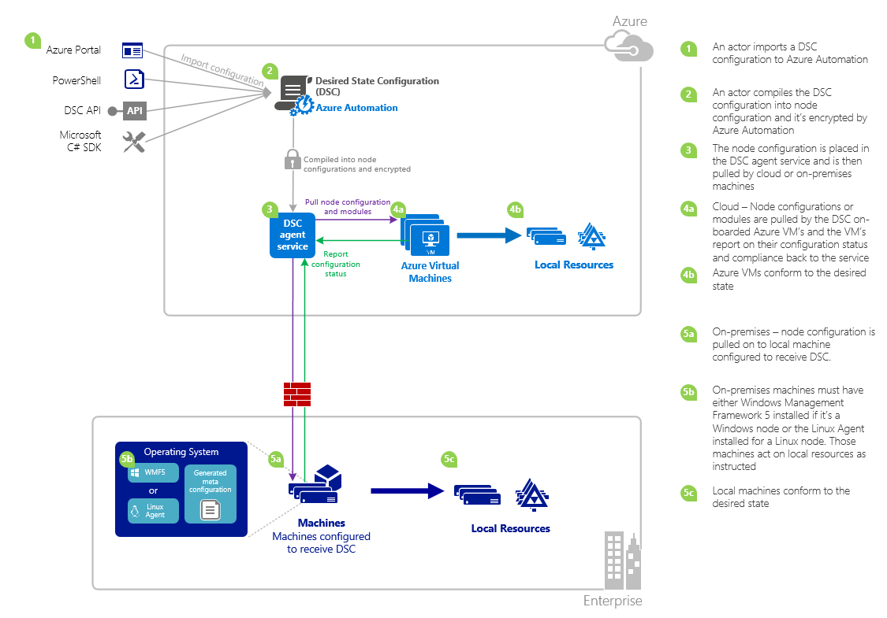

<properties 
   pageTitle="Azure Automation DSC Overview | Microsoft Azure" 
   description="An Overview of Azure Automation Desired State Configuration (DSC), its terms, and known issues" 
   services="automation" 
   documentationCenter="dev-center-name" 
   authors="coreyp-at-msft" 
   manager="stevenka" 
   editor="tysonn"
   keywords="powershell dsc, desired state configuration, powershell dsc azure"/>

<tags
   ms.service="automation"
   ms.devlang="NA"
   ms.topic="article"
   ms.tgt_pltfrm="powershell"
   ms.workload="TBD" 
   ms.date="05/10/2016"
   ms.author="magoedte;coreyp"/>

# Azure Automation DSC Overview #

##What is Azure Automation DSC?##
Deploying and maintaining the desired state of your servers and application resources can be tedious and error prone. With Azure Automation Desired State Configuration (DSC), you can consistently deploy, reliably monitor, and automatically update the desired state of all your IT resources, at scale from the cloud. Built on PowerShell DSC, Automation DSC can align machine configuration with a specific state across physical and virtual machines (VMs), using Windows or Linux, and in the cloud or on-premises. You can enable continuous IT services delivery with consistent control and manage rapid change across your heterogeneous hybrid IT environment with ease.

Azure Automation DSC builds on top of the fundamentals introduced in PowerShell DSC to provide an even easier configuration management experience. Azure Automation DSC brings the same management layer to [PowerShell Desired State Configuration](https://msdn.microsoft.com/powershell/dsc/overview) as Azure Automation offers for PowerShell scripting today.

Azure Automation DSC allows you to [author and manage PowerShell Desired State Configurations](https://technet.microsoft.com/library/dn249918.aspx), import [DSC Resources](https://technet.microsoft.com/library/dn282125.aspx), and generate DSC Node Configurations (MOF documents), all in the cloud. These DSC items will be placed on the Azure Automation [DSC pull server](https://technet.microsoft.com/library/dn249913.aspx) so that target nodes (such as physical and virtual machines) in the cloud or on-premises can pick them up, automatically conform to the desired state they specify, and report back on their compliance with the desired state to Azure Automation.

Prefer watching to reading? Have a look at the below video from May 2015, when Azure Automation DSC was first announced. **Note:** While the concepts and lifecycle discussed in this video are correct, Azure Automation DSC has progressed a lot since this video was recorded. It is now generally available, has a much more extensive UI in the Azure portal, and supports many additional capabilities.

> [AZURE.VIDEO microsoft-ignite-2015-heterogeneous-configuration-management-using-microsoft-azure-automation]

## Azure Automation DSC Terms ##
### Configuration ###
PowerShell DSC introduced a new concept called configurations. Configurations allow you to define, via PowerShell syntax, the desired state of your environment. To use DSC to configure your environment, first define a Windows PowerShell script block using the configuration keyword, then follow it with an identifier, then with braces ({}) to delimit the block.

Inside the configuration block you can define node configuration blocks that specify the desired configuration for a set of nodes (computers) in your environment that should be configured exactly the same. In this way, a node configuration represents a “role” for one or more nodes to assume. A node configuration block starts with the node keyword. Follow this keyword with the name of the role, which can be a variable or expression. After the role name, use braces {} to delimit the node configuration block.

 
Inside the node configuration block, you can define resource blocks to configure specific DSC resources. A resource block starts with the name of the resource, followed by the identifier you want to specify for that block, then braces {} to delimit the block.

For more detailed information about the configuration keyword, see: [Understanding Configuration Keyword in Desired State Configuration](http://blogs.msdn.com/b/powershell/archive/2013/11/05/understanding-configuration-keyword-in-desired-state-configuration.aspx "Understanding Configuration Keyword in Desired State Configuration")

Running (compiling) a DSC configuration will produce one or more DSC node configurations (MOF documents), which are what DSC nodes apply to comply with desired state.

Azure Automation DSC allows you to import, author, and compile DSC configurations in Azure Automation, similar to how runbooks can be imported, authored, and started in Azure Automation.

>[AZURE.IMPORTANT] A configuration should contain only one configuration block, with the same name as the configuration, in Azure Automation DSC. 

###Node Configuration###

When a DSC Configuration is compiled, one or more node configurations are produced depending on the Node blocks in the configuration. A node configuration is the same as a “MOF,” or “configuration document” (if you are familiar with those PS DSC terms) and represents a “role,” such as webserver or worker, which desired state one or more nodes should assume or check for compliance against. Names of node configurations in Azure Automation DSC take the form of “Configuration
Name.NodeConfigurationBlockName”.

PS DSC nodes become aware of node configurations they should enact via either DSC push, or pull methods. Azure Automation DSC relies on the DSC pull method, where nodes request node configurations they should apply from the Azure Automation DSC pull server. Because the nodes make the request to Azure Automation DSC, nodes can be behind firewalls, have all inbound ports closed, etc. They only need outbound access to the Internet (either directly or via a proxy).

###Node###

A DSC node is any machine that has its configuration managed by DSC. This could be a Windows or Linux Azure VM, on-premises VM / physical host, or machine in another public cloud. Nodes enact node configurations to become and maintain compliance with the desired state they define, and also can report back to a reporting server on their configuration status and compliance versus the desired state.

Azure Automation DSC makes onboarding of nodes for management by Azure Automation DSC easy, and allows changing of the node configuration assigned to each node server-side, so next time a node checks the server for instructions it will assume a different role and change both how it is configured and the complaince status it should report against to match.

###Resource###
DSC resources are building blocks that you can use to define a Windows PowerShell Desired State Configuration (DSC) configuration. DSC comes with a set of built-in resources such as those for files and folders, server features and roles, registry settings, environment variables, and services and processes. To learn about the full list of built-in DSC resources and how to use them, see [Built-In Windows PowerShell Desired State Configuration Resources](https://technet.microsoft.com/library/dn249921.aspx).

DSC resources can also be imported as part of PowerShell Modules to extend the set of built-in DSC resources. Non-default resources will be pulled down by DSC nodes from the DSC pull server, if a node configuration the node is meant to enact contains references to those resources. To learn how to create custom resources, see [Build Custom Windows PowerShell Desired State Configuration Resources](https://technet.microsoft.com/library/dn249927.aspx).

Azure Automation DSC ships with all the same built-in DSC resources as does PS DSC. Additional resources can be added to Azure Automation DSC by importing PowerShell modules containing the resources into Azure Automation.

###Compilation Job###
A compilation job in Azure Automation DSC is an instance of compilation of a configuration, to create one or more node configurations. They are similar to Azure Automation runbook jobs, except that they do not actually perform any task except to create node configurations. Any node configurations created by a compilation job are automatically placed on the Azure Automation DSC pull server, and overwrite previous versions of node configurations, if they existed for this configuration. The name of a node configuration produced by a compilation job takes the form of “ConfigurationName.NodeConfigurationBlockName”. For example, compiling the below configuration would produce a single node configuration called “MyConfiguration.webserver”

>[AZURE.NOTE] Just like runbooks, configurations can be published. This is not related to putting DSC items onto the Azure Automation DSC pull server. Compilation jobs cause DSC items to be placed on the Azure Automation DSC pull server. For more information on “publishing” in Azure Automation, see [Publishing a Runbook](https://msdn.microsoft.com/library/dn903765.aspx).

##Azure Automation DSC LifeCycle##
Going from an empty automation account to a managed set of correctly configured nodes involves a set of processes for defining configurations, turning those configurations into node configurations, and onboarding nodes to Azure Automation DSC and to those node configurations. The following diagram illustrates the Azure Automation DSC lifecycle:

The following image illustrates detailed step-by-step process in the life cycle of DSC. It includes different ways a configuration is imported and applied to nodes in Azure Automation, components required for an on-premises machine to support DSC and interactions between different components. 

     

##Gotchas / Known Issues:##

- When upgrading to WMF 5 RTM, if the machine is already registered as a node in Azure Automation DSC, please unregister it from Azure Automation DSC and reregister it after the WMF 5 RTM upgrade.

- Azure Automation DSC does not support partial or composite DSC configurations at this time. However, DSC composite resources can be imported and used just like in local PowerShell, enabling configuration reuse.

- The latest version of WMF 5 must be installed for the PowerShell DSC agent for Windows to be able to communicate with Azure Automation. The latest version of the PowerShell DSC agent for Linux must be installed for Linux to be able to communicate with Azure Automation.

- The traditional PowerShell DSC pull server expects module zips to be placed on the pull server in the format **ModuleName_Version.zip”**. Azure Automation expects PowerShell modules to be imported with names in the form of **ModuleName.zip**. See [this blog post](https://azure.microsoft.com/blog/2014/12/15/authoring-integration-modules-for-azure-automation/) for more info on the Integration Module format needed to import the module into Azure Automation. 

- PowerShell modules imported into Azure Automation cannot contain .doc or .docx files. Some PowerShell modules containing DSC resources contain these files, for help purposes. These files should be removed from modules, prior to import into Azure Automation.

- When a node is first registered with an Azure Automation account, or the node is changed to be mapped to a different node configuration server-side, it’s status will be 'Compliant', even if the node’s status is not actually compliant with the node configuration it is now mapped to. After the node performs its first pull, and sends its first report, after registration or a node configuration mapping change, the node status can be trusted.

- When onboarding an Azure Windows VM for management by Azure Automation DSC using any of our direct onboarding methods, it could take up to an hour for the VM to show up as a DSC node in Azure Automation. This is due to the installation of Windows Management Framework 5.0 on the VM by the Azure VM DSC extension, which is required to onboard the VM to Azure Automation DSC.

- After registering, each node automatically negotiates a unique certificate for authentication that expires after one year. At this time, the PowerShell DSC registration protocol cannot automatically renew certificates when they are nearing expiration, so you need to reregister the nodes after a year’s time. Before reregistering, ensure that each node is running Windows Management Framework 5.0 RTM. If a node’s authentication certificate expires, and the node is not reregistered, the node will be unable to communicate with Azure Automation and will be marked ‘Unresponsive.’ Reregistration is performed in the same way you registered the node initially. Reregistration performed 90 days or less from the certificate expiration time, or at any point after the certificate expiration time, will result in a new certificate being generated and used.

- When upgrading to WMF 5 RTM, if the machine is already registered as a node in Azure Automation DSC, please unregister it from Azure Automation DSC and reregister it after the WMF 5 RTM upgrade. Before reregistering, delete the $env:windir\system32\configuration\DSCEngineCache.mof file.

- PowerShell DSC cmdlets may not work if WMF 5 RTM is installed on top of WMF 5 Production Preview. To fix this, run the following command in an elevated PowerShell session (run as administrator):
`mofcomp $env:windir\system32\wbem\DscCoreConfProv.mof`
 

##Related Articles##

- [Onboarding machines for management by Azure Automation DSC] (../automation/automation-dsc-onboarding.md)
- [Compiling configurations in Azure Automation DSC] (../automation/automation-dsc-compile.md)
- [Azure Automation DSC cmdlets] (https://msdn.microsoft.com/library/mt244122.aspx)
- [Azure Automation DSC pricing] (https://azure.microsoft.com/pricing/details/automation/)
- [Continuous Deployment to IaaS VMs Using Azure Automation DSC and Chocolatey] (automation-dsc-cd-chocolatey.md)
