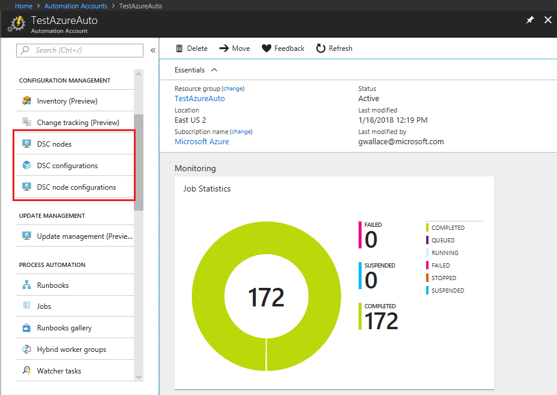

# Azure Automation State Configuration overview

> [!NOTE]
> Before you enable Automation State Configuration, we would like you to know that a newer version of DSC is now generally available, managed by a feature of Azure Policy named [guest configuration](../governance/machine-configuration/overview.md). The guest configuration service combines features of DSC Extension, Azure Automation State Configuration, and the most commonly requested features from customer feedback. Guest configuration also includes hybrid machine support through [Arc-enabled servers](../azure-arc/servers/overview.md).

Azure Automation State Configuration is an Azure configuration management service that allows you to write, manage, and
compile PowerShell Desired State Configuration (DSC) [configurations](/powershell/dsc/configurations/configurations) for nodes in any cloud or on-premises datacenter. The service also imports [DSC Resources](/powershell/dsc/resources/resources), and assigns configurations to target nodes, all in the cloud. You can access Azure Automation State Configuration in the Azure portal by selecting **State configuration (DSC)** under **Configuration Management**.

You can use Azure Automation State Configuration to manage a variety of machines:

- Azure virtual machines
- Azure virtual machines (classic)
- Physical/virtual Windows machines on-premises, or in a cloud other than Azure (including AWS EC2 instances)
- Physical/virtual Linux machines on-premises, in Azure, or in a cloud other than Azure

If you aren't ready to manage machine configuration from the cloud, you can use Azure Automation State Configuration as a report-only endpoint. This feature allows you to set (push) configurations through DSC and view reporting details in Azure Automation.

> [!NOTE]
> Managing Azure VMs with Azure Automation State Configuration is included at no extra charge if the installed Azure VM Desired State Configuration extension version is greater than 2.70. For more information, see [**Automation pricing page**](https://azure.microsoft.com/pricing/details/automation/).

## Why use Azure Automation State Configuration

Azure Automation State Configuration provides several advantages over the use of DSC outside of Azure. This service enables scalability across thousands of machines quickly and easily from a central, secure location. You can easily enable machines, assign them declarative configurations, and view reports showing each machine's compliance with the desired state you specify.

The Azure Automation State Configuration service is to DSC what Azure Automation runbooks are to PowerShell scripting. In other words, in the same way that Azure Automation helps you manage PowerShell scripts, it also helps you manage DSC configurations.

### Built-in pull server

Azure Automation State Configuration provides a DSC pull server similar to the [Windows Feature DSC-Service](/powershell/dsc/pull-server/pullserver). Target nodes can automatically receive
configurations, conform to the desired state, and report on their compliance. The built-in pull server in Azure Automation eliminates the need to set up and maintain your own pull server. Azure
Automation can target virtual or physical Windows or Linux machines, in the cloud or on-premises.

### Management of all your DSC artifacts

Azure Automation State Configuration brings the same management layer to [PowerShell Desired State Configuration](/powershell/dsc/overview) as it offers for PowerShell scripting. From the Azure portal or from PowerShell, you can manage all your DSC configurations, resources, and target nodes.

### Import of reporting data into Azure Monitor logs

Nodes that are managed with Azure Automation State Configuration send detailed reporting status data to the built-in pull server. You can configure Azure Automation State Configuration to send
this data to your Log Analytics workspace. See [Forward Azure Automation State Configuration reporting data to Azure Monitor logs](automation-dsc-diagnostics.md).

## Prerequisites

Consider the requirements in this section when using Azure Automation State Configuration.

### Operating system requirements

For nodes running Windows, the following versions are supported:

- Windows Server 2019
- Windows Server 2016
- Windows Server 2012R2
- Windows Server 2012
- Windows Server 2008 R2 SP1
- Windows 10
- Windows 8.1
- Windows 7

>[!NOTE]
>The [Microsoft Hyper-V Server](/windows-server/virtualization/hyper-v/hyper-v-server-2016) standalone product SKU does not contain an implementation of DSC. Thus it can't be managed by PowerShell DSC or Azure Automation State Configuration.

For nodes running Linux, the DSC Linux extension supports all the Linux distributions listed in the [PowerShell DSC documentation](/powershell/dsc/getting-started/lnxgettingstarted).

### DSC requirements

For all Windows nodes running in Azure,
[WMF 5.1](/powershell/scripting/wmf/setup/install-configure)
is installed when machines are enabled. For nodes running Windows Server 2012 and Windows 7,
[WinRM](/powershell/dsc/troubleshooting/troubleshooting#winrm-dependency) is enabled.

For all Linux nodes running in Azure,
[PowerShell DSC for Linux](https://github.com/Microsoft/PowerShell-DSC-for-Linux)
is installed when machines are enabled.

### Configuration of private networks

Check [Azure Automation Network Configuration](automation-network-configuration.md#hybrid-runbook-worker-and-state-configuration) for detailed information on the ports, URLs, and other networking details required for nodes on a private network.

#### Proxy support

Proxy support for the DSC agent is available in Windows release 1809 and later. This option is enabled by setting the values for `ProxyURL` and `ProxyCredential` properties in the [metaconfiguration script](automation-dsc-onboarding.md#generate-dsc-metaconfigurations)
used to register nodes.

>[!NOTE]
>Azure Automation State Configuration does not provide DSC proxy support for previous versions of Windows.

For Linux nodes, the DSC agent supports proxy and uses the `http_proxy` variable to determine the URL. To find out more about proxy support, see [Generate DSC metaconfigurations](automation-dsc-onboarding.md#generate-dsc-metaconfigurations).

#### DNS records per region

It's recommended to use the addresses listed in the [DNS records per region](how-to/automation-region-dns-records.md) table when defining exceptions.

## Next steps

- To get started, see [Get started with Azure Automation State Configuration](automation-dsc-getting-started.md).
- To learn how to enable nodes, see [Enable Azure Automation State Configuration](automation-dsc-onboarding.md).
- To learn about compiling DSC configurations so that you can assign them to target nodes, see [Compile DSC configurations in Azure Automation State Configuration](automation-dsc-compile.md).
- To see an example of using Azure Automation State Configuration in a continuous deployment pipeline, see [Set up continuous deployment with Chocolatey](automation-dsc-cd-chocolatey.md).
- For pricing information, see [Azure Automation State Configuration pricing](https://azure.microsoft.com/pricing/details/automation/).
- For a PowerShell cmdlet reference, see [Az.Automation](/powershell/module/az.automation).
