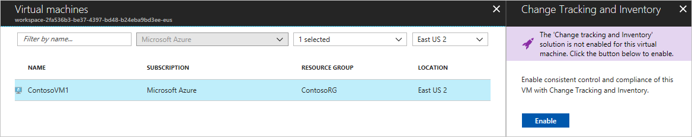
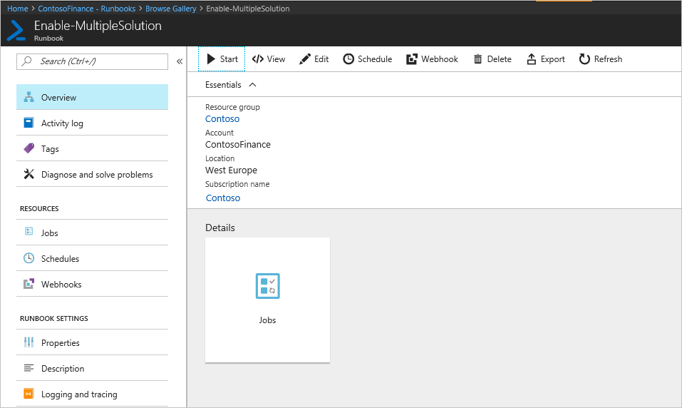
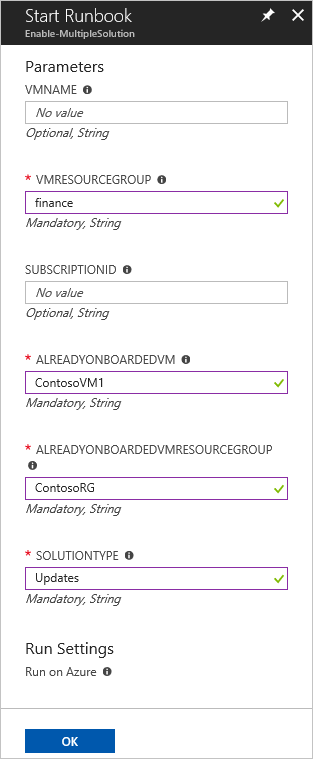

# Enable Change Tracking and Inventory from a runbook

This article describes how you can use a runbook to enable the [Change Tracking and Inventory](change-tracking.md) feature for VMs in your environment. To enable Azure VMs at scale, you must enable an existing VM using Change Tracking and Inventory. 

> [!NOTE]
> When enabling Change Tracking and Inventory, only certain regions are supported for linking a Log Analytics workspace and an Automation account. For a list of the supported mapping pairs, see [Region mapping for Automation account and Log Analytics workspace](how-to/region-mappings.md).

## Prerequisites

* Azure subscription. If you don't have one yet, you can [activate your MSDN subscriber benefits](https://azure.microsoft.com/pricing/member-offers/msdn-benefits-details/) or sign up for a [free account](https://azure.microsoft.com/free/?WT.mc_id=A261C142F).
* [Automation account](automation-offering-get-started.md) to manage machines.
* A [virtual machine](../virtual-machines/windows/quick-create-portal.md).

## Enable Change Tracking and Inventory 

1. In the Azure portal, select **Automation Accounts**, and then select your Automation account in the list.
1. Select **Inventory** under **Configuration Management**.
1. Select an existing Log Analytics workspace or create a new one. 
1. Click **Enable**.

    

## Select Azure VM to manage

With Change Tracking and Inventory enabled, you can add an Azure VM for management by the feature.

1. From your Automation account, select **Change tracking** or **Inventory** under **Configuration Management**.

2. Click **Add Azure VMs** to add your VM.

3. Choose your VM from the list and click **Enable**. This action enables Change Tracking and Inventory for the VM.

   

    > [!NOTE]
    > If you try to enable another feature before setup of Change Tracking and Inventory has completed, you receive this message: `Installation of another solution is in progress on this or a different virtual machine. When that installation completes the Enable button is enabled, and you can request installation of the solution on this virtual machine.`

## Install and update modules

It's required to update to the latest Azure modules and import the [Az.OperationalInsights](https://docs.microsoft.com/powershell/module/az.operationalinsights/?view=azps-3.7.0) module to successfully enable Change Tracking and Inventory for your VM.

1. In your Automation account, select **Modules** under **Shared Resources**. 
2. Select **Update Azure Modules** to update the Azure modules to the latest version. 
3. Click **Yes** to update all existing Azure modules to the latest version.

    

4. Return to **Modules** under **Shared Resources**. 
5. Select **Browse gallery** to open up the module gallery. 
6. Search for Az.OperationalInsights and import this module into the Automation account.

    

## Import a runbook to enable Change Tracking and Inventory

1. In your Automation account, select **Runbooks** under **Process Automation**.
2. Select **Browse gallery**.
3. Search for `update and change tracking`.
4. Select the runbook and click **Import** on the View Source page. 
5. Click **OK** to import the runbook into the Automation account.

   

6. On the Runbook page, click **Edit**, then select **Publish**. 
7. On the Publish Runbook pane, click **Yes** to publish the runbook.

## Start the runbook

You must have enabled Change Tracking and Inventory for an Azure VM to start this runbook. It requires an existing VM and resource group with the feature enabled for parameters.

1. Open the **Enable-MultipleSolution** runbook.

   

1. Click the start button and enter parameter values in the following fields:

   * **VMNAME** - The name of an existing VM to add to Change Tracking and Inventory. Leave this field blank to add all VMs in the resource group.
   * **VMRESOURCEGROUP** - The name of the resource group for the VMs to enable.
   * **SUBSCRIPTIONID** - The subscription ID of the new VM to enable. Leave this field blank to use the subscription of the workspace. When you use a different subscription ID, add the Run As account for your Automation account as a contributor for the subscription.
   * **ALREADYONBOARDEDVM** - The name of the VM that is already manually enabled for changes.
   * **ALREADYONBOARDEDVMRESOURCEGROUP** - The name of the resource group to which the VM belongs.
   * **SOLUTIONTYPE** - Enter **ChangeTracking**.

   

1. Select **OK** to start the runbook job.
1. Monitor progress and any errors on the runbook job page.

## Next steps

* To schedule a runbook, see [Manage schedules in Azure Automation](shared-resources/schedules.md).
* For details of working with the feature, see [Manage Change Tracking and Inventory](change-tracking-file-contents.md).
* To troubleshoot general problems with the feature, see [Troubleshoot Change Tracking and Inventory issues](troubleshoot/change-tracking.md).