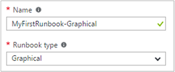
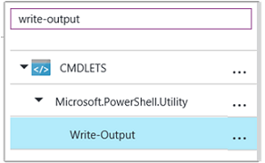
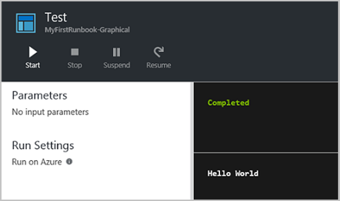
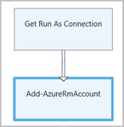
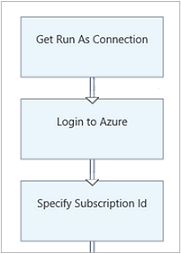
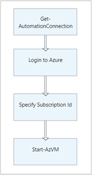
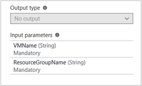
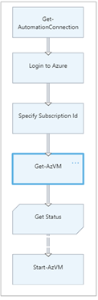
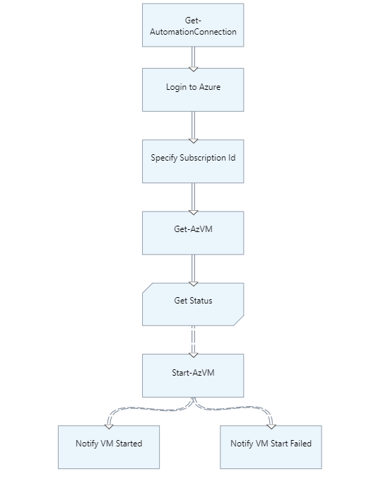

# My first graphical runbook

> [!div class="op_single_selector"]
> * [Graphical](automation-first-runbook-graphical.md)
> * [PowerShell](automation-first-runbook-textual-powershell.md)
> * [PowerShell Workflow](automation-first-runbook-textual.md)
> * [Python](automation-first-runbook-textual-python2.md)
> 

This tutorial walks you through the creation of a [graphical runbook](automation-runbook-types.md#graphical-runbooks) in Azure Automation. You start with a simple runbook that tests and publishes while learning how to track the status of the runbook job. Then you modify the runbook to actually manage Azure resources, in this case starting an Azure virtual machine. Then you complete the tutorial by making the runbook more robust by adding runbook parameters and conditional links.

## Prerequisites

To complete this tutorial, you need the following:

* Azure subscription. If you don't have one yet, you can [activate your MSDN subscriber benefits](https://azure.microsoft.com/pricing/member-offers/msdn-benefits-details/) or sign up for a [free account](https://azure.microsoft.com/free/?WT.mc_id=A261C142F).
* [Automation account](automation-offering-get-started.md) to hold the runbook and authenticate to Azure resources. This account must have permission to start and stop the virtual machine.
* An Azure virtual machine. You stop and start this machine so it should not be a production VM.

## Create runbook

Start by creating a simple runbook that outputs the text *Hello World*.

1. In the Azure portal, open your Automation account.

   The Automation account page gives you a quick view of the resources in this account. You should already have some Assets. Most of those assets are the modules that are automatically included in a new Automation account. You should also have the Credential asset that's mentioned in the [prerequisites](#prerequisites).

2. Select **Runbooks** under **PROCESS MANAGEMENT** to open the list of runbooks.
3. Create a new runbook by selecting **+ Add a runbook**, then click **Create a new runbook**.
4. Give the runbook the name *MyFirstRunbook-Graphical*.
5. In this case, you're going to create a [graphical runbook](automation-graphical-authoring-intro.md) so select **Graphical** for **Runbook type**.<br> <br>
6. Click **Create** to create the runbook and open the graphical editor.

## Add activities

The Library control on the left side of the editor allows you to select activities to add to your runbook. You're going to add a **Write-Output** cmdlet to output text from the runbook.

1. In the Library control, click in the search textbox and type **Write-Output**. The search results are shown in the following image: <br> 
1. Scroll down to the bottom of the list. You can either right-click **Write-Output** and select **Add to canvas**, or click the ellipses next to the cmdlet and then select **Add to canvas**.
1. Click the **Write-Output** activity on the canvas. This action opens the Configuration control page, which allows you to configure the activity.
1. The **Label** defaults to the name of the cmdlet, but you can change it to something more friendly. Change it to *Write Hello World to output*.
1. Click **Parameters** to provide values for the cmdlet's parameters.

   Some cmdlets have multiple parameter sets, and you need to select which you one to use. In this case, **Write-Output** has only one parameter set, so you don't need to select one.

1. Select the **InputObject** parameter. This is the parameter where you specify the text to send to the output stream.
1. In the **Data source** dropdown, select **PowerShell expression**. The **Data source** dropdown provides different sources that you use to populate a parameter value.

   You can use output from such sources such as another activity, an Automation asset, or a PowerShell expression. In this case, the output is just *Hello World*. You can use a PowerShell expression and specify a string.<br>

1. In the **Expression** box, type *"Hello World"* and then click **OK** twice to return to the canvas.
1. Save the runbook by clicking **Save**.

## Test the runbook

Before you publish the runbook to make it available in production, you want to test it to make sure that it works properly. When you test a runbook, you run its **Draft** version and view its output interactively.

1. Select **Test pane** to open the Test page.
1. Click **Start** to start the test. This should be the only enabled option.
1. A [runbook job](automation-runbook-execution.md) is created and its status displayed in the pane.

   The job status starts as *Queued* indicating that it is waiting for a runbook worker in the cloud to become available. It then moves to *Starting* when a worker claims the job, and then *Running* when the runbook actually starts running.

1. When the runbook job completes, its output is displayed. In this case, you see *Hello World*.<br> 
1. Close the Test page to return to the canvas.

## Publish and start the runbook

The runbook that you created is still in Draft mode. It needs to be published before you can run it in production. When you publish a runbook, you overwrite the existing Published version with the Draft version. In this case, you don't have a Published version yet because you just created the runbook.

1. Select **Publish** to publish the runbook and then **Yes** when prompted.
1. If you scroll left to view the runbook in the **Runbooks** page, it shows an **Authoring Status** of **Published**.
1. Scroll back to the right to view the page for **MyFirstRunbook-Graphical**.

   The options across the top allow us to start the runbook, schedule it to start at some time in the future, or create a [webhook](automation-webhooks.md) so it can be started through an HTTP call.

1. Select **Start** and then **Yes** when prompted to start the runbook.
1. A job page is opened for the runbook job that was created. Verify that the **Job status** shows **Completed**.
1. Once the runbook status shows *Completed*, click **Output**. The **Output** page is opened, and you can see the *Hello World* in the pane.
1. Close the Output page.
1. Click **All Logs** to open the Streams page for the runbook job. You should only see *Hello World* in the output stream, but this can show other streams for a runbook job such as Verbose and Error if the runbook writes to them.
1. Close the All Logs page and the Job page to return to the MyFirstRunbook-Graphical page.
1. To view all the jobs for the runbook close the **Job** page and select **Jobs** under **RESOURCES**. This lists all the jobs created by this runbook. You should only see one job listed since you only ran the job once.
1. You can click this job to open the same Job pane that you viewed when you started the runbook. This allows you to go back in time and view the details of any job that was created for a particular runbook.

## Create variable assets

You've tested and published your runbook, but so far it doesn't do anything useful. You want to have it manage Azure resources. Before you configure the runbook to authenticate, you create a variable to hold the subscription ID and reference it after you set up the activity to authenticate in step 6 below. Including a reference to the subscription context allows you to easily work between multiple subscriptions. Before proceeding, copy your subscription ID from the Subscriptions option off the Navigation pane.

1. In the Automation Accounts page, select **Variables** under **SHARED RESOURCES**.
1. Select **Add a variable**.
1. In the New variable page, in the **Name** box, enter **AzureSubscriptionId** and in the **Value** box enter your Subscription ID. Keep *string* for the **Type** and the default value for **Encryption**.
1. Click **Create** to create the variable.

## Add authentication

Now that you have a variable to hold the subscription ID, you can configure the runbook to authenticate with the Run As credentials that are referred to in the [prerequisites](#prerequisites). You do that by adding the Azure Run As connection **Asset** and **Connect-AzureRmAccount** cmdlet to the canvas.

1. Navigate back to your runbook and select **Edit** on the MyFirstRunbook-Graphical page.
1. You don't need the **Write Hello World to output** anymore, so click the ellipses (...) and select **Delete**.
1. In the Library control, expand **ASSETS**, **Connections**, and add **AzureRunAsConnection** to the canvas by selecting **Add to canvas**.
1. In the Library control, type **Connect-AzureRmAccount** in the search textbox.

   > [!IMPORTANT]
   > **Add-AzureRmAccount** is now an alias for **Connect-AzureRMAccount**. When searching your library items, if you do not see **Connect-AzureRMAccount**, you can use **Add-AzureRmAccount**, or you can update your modules in your Automation Account.

1. Add **Connect-AzureRmAccount** to the canvas.
1. Hover over **Get Run As Connection** until a circle appears on the bottom of the shape. Click the circle and drag the arrow to **Connect-AzureRmAccount**. The arrow that you created is a *link*. The runbook starts with **Get Run As Connection** and then run **Connect-AzureRmAccount**.<br> 
1. On the canvas, select **Connect-AzureRmAccount** and in the Configuration control pane type **Login to Azure** in the **Label** textbox.
1. Click **Parameters** and the Activity Parameter Configuration page appears.
1. **Connect-AzureRmAccount** has multiple parameter sets, so you need to select one before you can provide parameter values. Click **Parameter Set** and then select the **ServicePrincipalCertificate** parameter set.
1. Once you select the parameter set, the parameters are displayed in the Activity Parameter Configuration page. Click **APPLICATIONID**.<br> 
1. In the Parameter Value page, select **Activity output** for the **Data source** and select **Get Run As Connection** from the list, in the **Field path** textbox type **ApplicationId**, and then click **OK**. You are specifying the name of the property for the Field path because the activity outputs an object with multiple properties.
1. Click **CERTIFICATETHUMBPRINT**, and in the Parameter Value page, select **Activity output** for the **Data source**. Select **Get Run As Connection** from the list, in the **Field path** textbox type **CertificateThumbprint**, and then click **OK**.
1. Click **SERVICEPRINCIPAL**, and in the Parameter Value page, select **ConstantValue** for the **Data source**, click the option **True**, and then click **OK**.
1. Click **TENANTID**, and in the Parameter Value page, select **Activity output** for the **Data source**. Select **Get Run As Connection** from the list, in the **Field path** textbox type **TenantId**, and then click **OK** twice.
1. In the Library control, type **Set-AzureRmContext** in the search textbox.
1. Add **Set-AzureRmContext** to the canvas.
1. On the canvas, select **Set-AzureRmContext** and in the Configuration control pane type **Specify Subscription Id** in the **Label** textbox.
1. Click **Parameters** and the Activity Parameter Configuration page appears.
1. **Set-AzureRmContext** has multiple parameter sets, so you need to select one before you can provide parameter values. Click **Parameter Set** and then select the **SubscriptionId** parameter set.
1. Once you select the parameter set, the parameters are displayed in the Activity Parameter Configuration page. Click **SubscriptionID**
1. In the Parameter Value page, select **Variable Asset** for the **Data source** and select **AzureSubscriptionId** from the list and then click **OK** twice.
1. Hover over **Login to Azure** until a circle appears on the bottom of the shape. Click the circle and drag the arrow to **Specify Subscription Id**.

Your runbook should look like the following at this point: <br>

## Add activity to start a VM

Here you add a **Start-AzureRmVM** activity to start a virtual machine. You can pick any virtual machine in your Azure subscription, and for now you hardcode that name into the cmdlet.

1. In the Library control, type **Start-AzureRm** in the search textbox.
2. Add **Start-AzureRmVM** to the canvas and then click and drag it underneath **Specify Subscription Id**.
1. Hover over **Specify Subscription Id** until a circle appears on the bottom of the shape. Click the circle and drag the arrow to **Start-AzureRmVM**.
1. Select **Start-AzureRmVM**. Click **Parameters** and then **Parameter Set** to view the sets for **Start-AzureRmVM**. Select the **ResourceGroupNameParameterSetName** parameter set. **ResourceGroupName** and **Name** have exclamation points next them. This indicates that they are required parameters. Also note both expect string values.
1. Select **Name**. Select **PowerShell expression** for the **Data source** and type in the name of the virtual machine surrounded with double quotes that you start with this runbook. Click **OK**.
1. Select **ResourceGroupName**. Use **PowerShell expression** for the **Data source** and type in the name of the resource group surrounded with double quotes. Click **OK**.
1. Click Test pane so that you can test the runbook.
1. Click **Start** to start the test. Once it completes, check that the virtual machine was started.

Your runbook should look like the following at this point: <br>

## Add additional input parameters

Our runbook currently starts the virtual machine in the resource group that you specified in the **Start-AzureRmVM** cmdlet. The runbook would be more useful if we could specify both when the runbook is started. You now add input parameters to the runbook to provide that functionality.

1. Open the graphical editor by clicking **Edit** on the **MyFirstRunbook-Graphical** pane.
1. Select **Input and output** and then **Add input** to open the Runbook Input Parameter pane.
1. Specify *VMName* for the **Name**. Keep *string* for the **Type**, but change **Mandatory** to *Yes*. Click **OK**.
1. Create a second mandatory input parameter called *ResourceGroupName* and then click **OK** to close the **Input and Output** pane.<br> 
1. Select the **Start-AzureRmVM** activity and then click **Parameters**.
1. Change the **Data source** for **Name** to **Runbook input** and then select **VMName**.
1. Change the **Data source** for **ResourceGroupName** to **Runbook input** and then select **ResourceGroupName**.<br> 
1. Save the runbook and open the Test pane. You can now provide values for the two input variables that you use in the test.
1. Close the Test pane.
1. Click **Publish** to publish the new version of the runbook.
1. Stop the virtual machine that you started in the previous step.
1. Click **Start** to start the runbook. Type in the **VMName** and **ResourceGroupName** for the virtual machine that you're going to start.
1. When the runbook completes, check that the virtual machine was started.

## Create a conditional link

You now modify the runbook so that it only attempts to start the virtual machine if it is not already started. You do this by adding a **Get-AzureRmVM** cmdlet to the runbook that gets the instance level status of the virtual machine. Then you add a PowerShell Workflow code module called **Get Status** with a snippet of PowerShell code to determine if the virtual machine state is running or stopped. A conditional link from the **Get Status** module only runs **Start-AzureRmVM** if the current running state is stopped. Finally, You output a message to inform you if the VM was successfully started or not using the PowerShell Write-Output cmdlet.

1. Open **MyFirstRunbook-Graphical** in the graphical editor.
1. Remove the link between **Specify Subscription Id** and **Start-AzureRmVM** by clicking on it and then pressing the *Delete* key.
1. In the Library control, type **Get-AzureRm** in the search textbox.
1. Add **Get-AzureRmVM** to the canvas.
1. Select **Get-AzureRmVM** and then **Parameter Set** to view the sets for **Get-AzureRmVM**. Select the **GetVirtualMachineInResourceGroupNameParamSet** parameter set. **ResourceGroupName** and **Name** have exclamation points next them. This indicates that they are required parameters. Also note both expect string values.
1. Under **Data source** for **Name**, select **Runbook input** and then select **VMName**. Click **OK**.
1. Under **Data source** for **ResourceGroupName**, select **Runbook input** and then select **ResourceGroupName**. Click **OK**.
1. Under **Data source** for **Status**, select **Constant value** and then click  **True**. Click **OK**.
1. Create a link from **Specify Subscription Id** to **Get-AzureRmVM**.
1. In the library control, expand **Runbook Control** and add **Code** to the canvas.  
1. Create a link from **Get-AzureRmVM** to **Code**.  
1. Click **Code** and in the Configuration pane, change label to **Get Status**.
1. Select **Code** parameter, and the **Code Editor** page appears.  
1. In the code editor, paste the following snippet of code:

    ```powershell-interactive
     $StatusesJson = $ActivityOutput['Get-AzureRmVM'].StatusesText
     $Statuses = ConvertFrom-Json $StatusesJson
     $StatusOut =""
     foreach ($Status in $Statuses){
     if($Status.Code -eq "Powerstate/running"){$StatusOut = "running"}
     elseif ($Status.Code -eq "Powerstate/deallocated") {$StatusOut = "stopped"}
     }
     $StatusOut
     ```

1. Create a link from **Get Status** to **Start-AzureRmVM**.<br>   
1. Select the link and in the Configuration pane, change **Apply condition** to **Yes**. Note the link turns to a dashed line indicating that the target activity only runs if the condition resolves to true.  
1. For the **Condition expression**, type *$ActivityOutput['Get Status'] -eq "Stopped"*. **Start-AzureRmVM** now only runs if the virtual machine is stopped.
1. In the Library control, expand **Cmdlets** and then **Microsoft.PowerShell.Utility**.
1. Add **Write-Output** to the canvas twice.
1. On the first **Write-Output** control, click **Parameters** and change the **Label** value to *Notify VM Started*.
1. For **InputObject**, change **Data source** to **PowerShell expression** and type in the expression *"$VMName successfully started."*.
1. On the second **Write-Output** control, click **Parameters** and change the **Label** value to *Notify VM Start Failed*
1. For **InputObject**, change **Data source** to **PowerShell expression** and type in the expression *"$VMName could not start."*.
1. Create a link from **Start-AzureRmVM** to **Notify VM Started** and **Notify VM Start Failed**.
1. Select the link to **Notify VM Started** and change **Apply condition** to **True**.
1. For the **Condition expression**, type *$ActivityOutput['Start-AzureRmVM'].IsSuccessStatusCode -eq $true*. This Write-Output control now only runs if the virtual machine is successfully started.
1. Select the link to **Notify VM Start Failed** and change **Apply condition** to **True**.
1. For the **Condition expression**, type *$ActivityOutput['Start-AzureRmVM'].IsSuccessStatusCode -ne $true*. This Write-Output control now only runs if the virtual machine is not successfully started. Your runbook should look like the following image: <br> 
1. Save the runbook and open the Test pane.
1. Start the runbook with the virtual machine stopped, and it should start.

## Next steps

* To learn more about Graphical Authoring, see [Graphical authoring in Azure Automation](automation-graphical-authoring-intro.md)
* To get started with PowerShell runbooks, see [My first PowerShell runbook](automation-first-runbook-textual-powershell.md)
* To get started with PowerShell workflow runbooks, see [My first PowerShell workflow runbook](automation-first-runbook-textual.md)


