<properties
    pageTitle="My first graphical runbook in Azure Automation | Microsoft Azure"
    description="Tutorial that walks you through the creation, testing, and publishing of a simple graphical runbook."
    services="automation"
    documentationCenter=""
    authors="mgoedtel"
    manager="jwhit"
    editor=""
	keywords="runbook, runbook template, runbook automation, azure runbook"/>
<tags
    ms.service="automation"
    ms.workload="tbd"
    ms.tgt_pltfrm="na"
    ms.devlang="na"
    ms.topic="get-started-article"
    ms.date="07/06/2016"
    ms.author="magoedte;bwren"/>

# My first graphical runbook

> [AZURE.SELECTOR] - [Graphical](automation-first-runbook-graphical.md) - [PowerShell](automation-first-runbook-textual-PowerShell.md) - [PowerShell Workflow](automation-first-runbook-textual.md)

This tutorial walks you through the creation of a [graphical runbook](automation-runbook-types.md#graphical-runbooks) in Azure Automation.  We'll start with a simple runbook that we'll test and publish while we explain how to track the status of the runbook job.  Then we'll modify the runbook to actually manage Azure resources, in this case starting an Azure virtual machine.  We'll then make the runbook more robust by adding runbook parameters and conditional links.

## Prerequisites

To complete this tutorial, you will need the following.

-	Azure subscription.  If you don't have one yet, you can [activate your MSDN subscriber benefits](https://azure.microsoft.com/pricing/member-offers/msdn-benefits-details/) or <a href="/pricing/free-account/" target="_blank">[sign up for a free account](https://azure.microsoft.com/free/).
-	[Azure Run As Account](automation-sec-configure-azure-runas-account.md) to hold the runbook and authenticate to Azure resources.  This account must have permission to start and stop the virtual machine.
-	An Azure virtual machine.  We will stop and start this machine so it should not be production.


## Step 1 - Create new runbook

We'll start by creating a simple runbook that outputs the text *Hello World*.

1.	In the Azure Portal, open your Automation account.  
	The Automation account page gives you a quick view of the resources in this account.  You should already have some Assets.  Most of those are the modules that are automatically included in a new Automation account.  You should also have the Credential asset that's mentioned in the [prerequisites](#prerequisites).
2.	Click on the **Runbooks** tile to open the list of runbooks.<br> 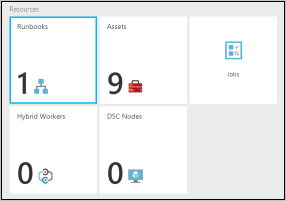
3.	Create a new runbook by clicking on the **Add a runbook** button and then **Create a new runbook**.
4.	Give the runbook the name *MyFirstRunbook-Graphical*.
5.	In this case, we're going to create a [graphical runbook](automation-graphical-authoring-intro.md) so select **Graphical** for **Runbook type**.<br> <br>
6.	Click **Create** to create the runbook and open the graphical editor.

## Step 2 - Add activities to the runbook

The Library control on the left side of the editor allows you to select activities to add to your runbook.  We're going to add a **Write-Output** cmdlet to output text from the runbook.

1.	In the Library control, click in the search textbox and type **Write-Output**.  The search results will be displayed below. <br> 
2.	Scroll down to the bottom of the list.  You can either right click **Write-Output** and select **Add to canvas** or click on the ellipse next to the cmdlet and then select **Add to canvas**.
3.	Click on the **Write-Output** activity on the canvas.  This opens the Configuration control blade which allows you to configure the activity.
4.	The **Label** defaults to the name of the cmdlet, but we can change it to something more friendly. Change it to *Write Hello World to output*.
5.	Click **Parameters** to provide values for the cmdlet's parameters.  
	Some cmdlets have multiple parameter sets, and you need to select which you will use. In this case, **Write-Output** has only one parameter set, so you don't need to select one. <br> 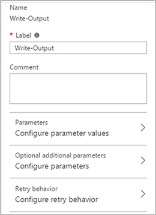
6.	Select the **InputObject** parameter.  This is the parameter where we will specify the text to send to the output stream.
7.	In the **Data source** dropdown, select **PowerShell expression**.  The **Data source** dropdown provides different sources that you use to populate a parameter value.  
    You can use output from such sources such as another activity, an Automation asset, or a PowerShell expression.  In this case, we just want to output the text *Hello World*. We can use a PowerShell expression and specify a string.
8.	In the **Expression** box, type *"Hello World"* and then click **OK** twice to return to the canvas.<br> 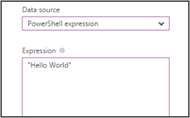
9.	Save the runbook by clicking **Save**.<br> 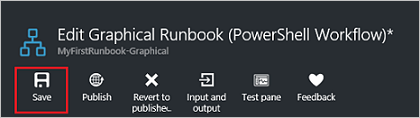

## Step 3 - Test the runbook

Before we publish the runbook to make it available in production, we want to test it to make sure that it works properly.  When you test a runbook, you run its **Draft** version and view its output interactively.

1.	Click **Test pane** to open the Test blade.<br> 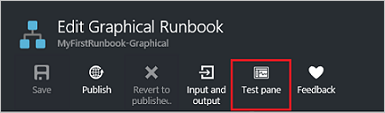
2.	Click **Start** to start the test.  This should be the only enabled option.
3.	A [runbook job](automation-runbook-execution.md) is created and its status displayed in the pane.  
	The job status will start as *Queued* indicating that it is waiting for a runbook worker in the cloud to become available.  It will then move to *Starting* when a worker claims the job, and then *Running* when the runbook actually starts running.  
4.	When the runbook job completes, its output is displayed. In our case, we should see *Hello World*.<br> 
5.	Close the Test blade to return to the canvas.

## Step 4 - Publish and start the runbook

The runbook that we just created is still in Draft mode. We need to publish it before we can run it in production.  When you publish a runbook, you overwrite the existing Published version with the Draft version.  In our case, we don't have a Published version yet because we just created the runbook.

1.	Click **Publish** to publish the runbook and then **Yes** when prompted.<br> 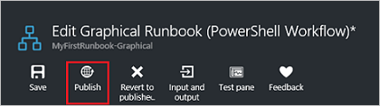
2.	If you scroll left to view the runbook in the **Runbooks** blade, it will show an **Authoring Status** of **Published**.
3.	Scroll back to the right to view the blade for **MyFirstRunbook**.  
	The options across the top allow us to start the runbook, schedule it to start at some time in the future, or create a [webhook](automation-webhooks.md) so it can be started through an HTTP call.
4.	We just want to start the runbook so click **Start** and then **Yes** when prompted.<br> 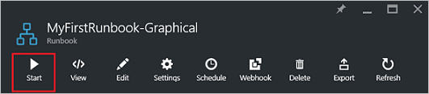
5.	A job blade is opened for the runbook job that we just created.  We can close this blade, but in this case we'll leave it open so we can watch the job's progress.
6.	The job status is shown in **Job Summary** and matches the statuses that we saw when we tested the runbook.<br> 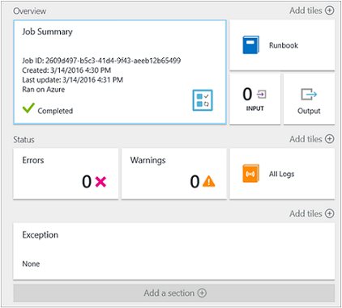
7.	Once the runbook status shows *Completed*, click **Output**. The **Output** blade is opened, and we can see our *Hello World* in the pane.<br> 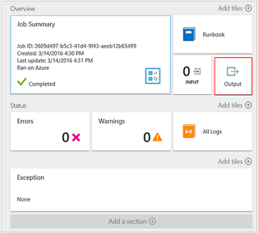  
8.	Close the Output blade.
9.	Click **All Logs** to open the Streams blade for the runbook job.  We should only see *Hello World* in the output stream, but this can show other streams for a runbook job such as Verbose and Error if the runbook writes to them.<br> 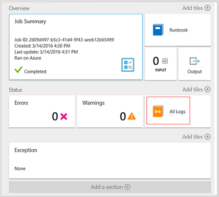
10.	Close the All Logs blade and the Job blade to return to the MyFirstRunbook blade.
11.	Click **Jobs** to open the Jobs blade for this runbook.  This lists all of the jobs created by this runbook. We should only see one job listed since we only ran the job once.<br> 
12.	You can click on this job to open the same Job pane that we viewed when we started the runbook.  This allows you to go back in time and view the details of any job that was created for a particular runbook.

## Step 5 - Create variable assets

We've tested and published our runbook, but so far it doesn't do anything useful. We want to have it manage Azure resources.  Before we configure the runbook to authenticate, we will create a variable to hold the subscription ID and reference it after we setup the activity to authenticate in step 6 below.  Including a reference to the subscription context allows you to easily work between multiple subscriptions.  Before proceeding, copy your subscription ID from the Subscriptions option off of the Navigation pane.  

1. In the Automation Accounts blade, click on the **Assets** tile and the **Assets** blade is opened.
2. In the Assets blade, click on the **Variables** tile.
3. On the Variables blade, click **Add a variable**.<br>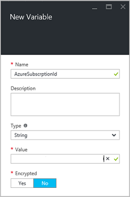
4. In the New variable blade, in the **Name** box, enter **AzureSubscriptionId** and in the **Value** box enter your Subscription ID.  Keep *string* for the **Type** and the default value for **Encryption**.  
5. Click **Create** to create the variable.  


## Step 6 - Add authentication to manage Azure resources

Now that we have a variable to hold our subscription ID, we can configure our runbook to authenticate with the Run As credentials that are referred to in the [prerequisites](#prerequisites).  We do that by adding the Azure Run As connection **Asset** and **Add-AzureRMAccount** cmdlet to the canvas.  

1.	Open the graphical editor by clicking **Edit** on the MyFirstRunbook blade.<br> 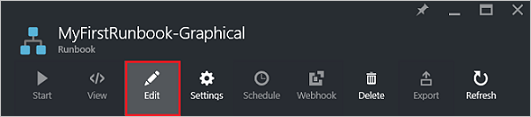
2.	We don't need the **Write Hello World to output** anymore, so right click it and select **Delete**.
3.	In the Library control, expand **Connections** and add **AzureRunAsConnection** to the canvas by selecting **Add to canvas**.
4.	On the canvas, select **AzureRunAsConnection** and in the Configuration control pane, type **Get Run As Connection** in the **Label** textbox.  This is the connection 
5.	In the Library control, type **Add-AzureRmAccount** in the search textbox.
6.	Add **Add-AzureRmAccount** to the canvas.<br> 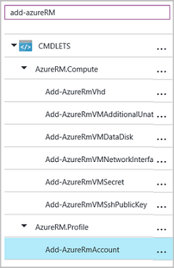
7.	Hover over **Get Run As Connection** until a circle appears on the bottom of the shape. Click the circle and drag the arrow to **Add-AzureRmAccount**.  The arrow that you just created is a *link*.  The runbook will start with **Get Run As Connection** and then run **Add-AzureRmAccount**.<br> 
8.	On the canvas, select **Add-AzureRmAccount** and in the Configuration control pane type **Login to Azure** in the **Label** textbox.
9.	Click **Parameters** and the Activity Parameter Configuration blade appears. 
10.  **Add-AzureRmAccount** has multiple parameter sets, so we need to select one before we can provide parameter values.  Click **Parameter Set** and then select the **ServicePrincipalCertificate** parameter set. 
11.  Once you select the parameter set, the parameters are displayed in the Activity Parameter Configuration blade.  Click **APPLICATIONID**.<br> 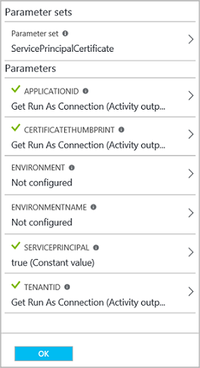
12.  In the Parameter Value blade, select **Activity output** for the **Data source** and select **Get Run As Connection** from the list, in the **Field path** textbox type **ApplicationId**, and then click **OK**.  We are specifying the name of the property for the Field path because the activity outputs an object with multiple properties.
13.  Click **CERTIFICATETHUMBPRINT**, and in the Parameter Value blade, select **Activity output** for the **Data source**.  Select **Get Run As Connection** from the list, in the **Field path** textbox type **CertificateThumbprint**, and then click **OK**. 
14.  Click **SERVICEPRINCIPAL**, and in the Parameter Value blade, select **ConstantValue** for the **Data source**, click the option **True**, and then click **OK**.
15.  Click **TENANTID**, and in the Parameter Value blade, select **Activity output** for the **Data source**.  Select **Get Run As Connection** from the list, in the **Field path** textbox type **TenantId**, and then click **OK** twice.  
16.  In the Library control, type **Set-AzureRmContext** in the search textbox.
17.	 Add **Set-AzureRmContext** to the canvas.
18.	 On the canvas, select **Set-AzureRmContext** and in the Configuration control pane type **Specify Subscription Id** in the **Label** textbox.
19.	 Click **Parameters** and the Activity Parameter Configuration blade appears. 
20. **Set-AzureRmContext** has multiple parameter sets, so we need to select one before we can provide parameter values.  Click **Parameter Set** and then select the **SubscriptionId** parameter set.  
21.	 Once you select the parameter set, the parameters are displayed in the Activity Parameter Configuration blade.  Click **SubscriptionID**
22.	 In the Parameter Value blade, select **Variable Asset** for the **Data source** and select **AzureSubscriptionId** from the list and then click **OK** twice.   
23.  Hover over **Login to Azure** until a circle appears on the bottom of the shape. Click the circle and drag the arrow to **Specify Subscription Id**.


Your runbook should look like the following at this point: <br>

## Step 7 - Add activity to start a virtual machine

We'll now add a **Start-AzureRmVM** activity to start a virtual machine.  You can pick any virtual machine in your Azure subscription, and for now we'll be hardcoding that name into the cmdlet.

1. In the Library control, type **Start-AzureRm** in the search textbox.
2. Add **Start-AzureRmVM** to the canvas and then click and drag it underneath **Connect to Azure**.
3. Hover over **Specify Subscription Id** until a circle appears on the bottom of the shape.  Click the circle and drag the arrow to **Start-AzureRmVM**. 
4.	Select **Start-AzureRmVM**.  Click **Parameters** and then **Parameter Set** to view the sets for **Start-AzureRmVM**.  Select the **ResourceGroupNameParameterSetName** parameter set. Note that **ResourceGroupName** and **Name** have exclamation points next them.  This indicates that they are required parameters.  Also note both expect string values.
5.	Select **Name**.  Select **PowerShell expression** for the **Data source** and type in the name of the virtual machine surrounded with double quotes that we will start with this runbook.  Click **OK**.<br>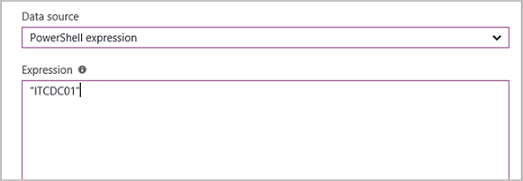
6.	Select **ResourceGroupName**. Use **PowerShell expression** for the **Data source** and type in the name of the resource group surrounded with double quotes.  Click **OK**.<br> 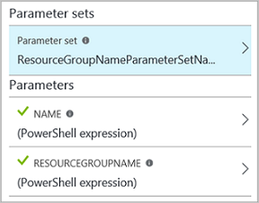
8.	Click Test pane so that we can test the runbook.
9.	Click **Start** to start the test.  Once it completes, check that the virtual machine was started.

Your runbook should look like the following at this point: <br>

## Step 8 - Add additional input parameters to the runbook

Our runbook currently starts the virtual machine in the resource group that we specified in the **Start-AzureRmVM** cmdlet, but our runbook would be more useful if we could specify both when the runbook is started.  We will now add input parameters to the runbook to provide that functionality.

1. Open the graphical editor by clicking **Edit** on the **MyFirstRunbook** pane.
2. Click **Input and output** and then **Add input** to open the Runbook Input Parameter pane.<br> 
3. Specify *VMName* for the **Name**.  Keep *string* for the **Type**, but change **Mandatory** to *Yes*.  Click **OK**.
4. Create a second mandatory input parameter called *ResourceGroupName* and then click **OK** to close the **Input and Output** pane.<br> 
5. Select the **Start-AzureRmVM** activity and then click **Parameters**.
6. Change the **Data source** for **Name** to **Runbook input** and then select **VMName**.<br>
7. Change the **Data source** for **ResourceGroupName** to **Runbook input** and then select **ResourceGroupName**.<br> 
8. Save the runbook and open the Test pane.  Note that you can now provide values for the two input variables that will be used in the test.
9. Close the Test pane.
10.	Click **Publish** to publish the new version of the runbook.
11.	Stop the virtual machine that you started in the previous step.
12.	Click **Start** to start the runbook.  Type in the **VMName** and **ResourceGroupName** for the virtual machine that you're going to start.<br> 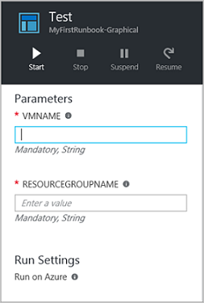
13.	When the runbook completes, check that the virtual machine was started.

## Step 9 - Create a conditional link

We will now modify the runbook so that it will only attempt to start the virtual machine if it is not already started.  We'll do this by adding a **Get-AzureRmVM** cmdlet to the runbook that will get the instance level status of the virtual machine. We'll then add a PowerShell Workflow code module called **Get Status** with a snippet of PowerShell code to determine if the virtual machine state is running or stopped.  A conditional link from the **Get Status** module will only run **Start-AzureRmVM** if the current running state is stopped.  Finally, we will output a message to inform you if the VM was successfully started or not using the PowerShell Write-Output cmdlet.

1. Open **MyFirstRunbook** in the graphical editor.
2. Remove the link between **Specify Subscription Id** and **Start-AzureRmVM** by clicking on it and then pressing the *Delete* key.
3. In the Library control, type **Get-AzureRm** in the search textbox.
4. Add **Get-AzureRmVM** to the canvas.
5. Select **Get-AzureRmVM** and then **Parameter Set** to view the sets for **Get-AzureRmVM**.  Select the **GetVirtualMachineInResourceGroupNameParamSet** parameter set.  Note that **ResourceGroupName** and **Name** have exclamation points next them.  This indicates that they are required parameters.  Also note both expect string values.
6. Under **Data source** for **Name**, select **Runbook input** and then select **VMName**.  Click **OK**.
7. Under **Data source** for **ResourceGroupName**, select **Runbook input** and then select **ResourceGroupName**.  Click **OK**.
8. Under **Data source** for **Status**, select **Constant value** and then click on **True**.  Click **OK**.  
9. Create a link from **Specify Subscription Id** to **Get-AzureRmVM**.
10. In the library control, expand **Runbook Control** and add **Code** to the canvas.  
11. Create a link from **Get-AzureRmVM** to **Code**.  
12. Click **Code** and in the Configuration pane, change label to **Get Status**.
13. Select **Code** parameter, and the **Code Editor** blade appears.  
14. In the code editor, paste the following snippet of code:

     ```
     $StatusesJson = $ActivityOutput['Get-AzureRmVM'].StatusesText 
     $Statuses = ConvertFrom-Json $StatusesJson 
     $StatusOut ="" 
     foreach ($Status in $Statuses){ 
     if($Status.Code -eq "Powerstate/running"){$StatusOut = "running"} 
     elseif ($Status.Code -eq "Powerstate/deallocated") {$StatusOut = "stopped"} 
     } 
     $StatusOut 
     ```

15. Create a link from **Get Status** to **Start-AzureRmVM**.<br>   
16. Select the link and in the Configuration pane, change **Apply condition** to **Yes**.   Note the link turns to a dashed line indicating that the target activity will only be run if the condition resolves to true.  
17. For the **Condition expression**, type *$ActivityOutput['Get Status'] -eq "Stopped"*.  **Start-AzureRmVM** will now only run if the virtual machine is stopped.
18.	In the Library control, expand **Cmdlets** and then **Microsoft.PowerShell.Utility**.
19.	Add **Write-Output** to the canvas twice.<br> 
20. On the first **Write-Output** control, click **Parameters** and change the **Label** value to *Notify VM Started*.
21. For **InputObject**, change **Data source** to **PowerShell expression** and type in the expression *"$VMName successfully started."*.
22. On the second **Write-Output** control, click **Parameters** and change the **Label** value to *Notify VM Start Failed*
23. For **InputObject**, change **Data source** to **PowerShell expression** and type in the expression *"$VMName could not start."*.
24. Create a link from **Start-AzureRmVM** to **Notify VM Started** and **Notify VM Start Failed**.
25. Select the link to **Notify VM Started** and change **Apply condition** to **True**.
26. For the **Condition expression**, type *$ActivityOutput['Start-AzureRmVM'].IsSuccessStatusCode -eq $true*.  This Write-Output control will now only run if the virtual machine is successfully started.
27. Select the link to **Notify VM Start Failed** and change **Apply condition** to **True**.
28. For the **Condition expression**, type *$ActivityOutput['Start-AzureRmVM'].IsSuccessStatusCode -ne $true*.  This Write-Output control will now only run if the virtual machine is not successfully started.
29.	Save the runbook and open the Test pane.
30.	Start the runbook with the virtual machine stopped, and it should start.

## Next steps

-	To learn more about Graphical Authoring, see [Graphical authoring in Azure Automation](automation-graphical-authoring-intro.md)
-	To get started with PowerShell runbooks, see [My first PowerShell runbook](automation-first-runbook-textual-powershell.md)
-	To get started with PowerShell workflow runbooks, see [My first PowerShell workflow runbook](automation-first-runbook-textual.md)
