<properties
	pageTitle="My first graphical runbook in Azure Automation"
	description="Tutorial that walks you through the creation, testing, and publishing of a simple graphical runbook.  Several concepts are covered such as authenticating to Azure resources, input parameters, and conditional links."
	services="automation"
	documentationCenter=""
	authors="bwren"
	manager="stevenka"
	editor=""/>

<tags
	ms.service="automation"
	ms.workload="tbd"
	ms.tgt_pltfrm="na"
	ms.devlang="na"
	ms.topic="get-started-article" 
	ms.date="09/17/2015"
	ms.author="bwren"/>

# My first graphical runbook

> [AZURE.SELECTOR]
- [Graphical](automation-first-runbook-graphical.md)
- [PowerShell Workflow](automation-first-runbook-textual.md)

This tutorial walks you through the creation of a [graphical runbook](automation-runbook-types.md#graphical-runbooks) in Azure Automation.  We'll start with a simple runbook that we'll test and publish while we explain how to track the status of the runbook job.  Then we'll modify the runbook to actually manage Azure resources, in this case starting an Azure virtual machine.  We'll then make the runbook more robust by adding runbook parameters and a conditional link.  

## Prerequisites

To complete this tutorial, you will need the following.

- Azure subscription. If you don't have one yet, you can [activate your MSDN subscriber benefits](http://azure.microsoft.com/pricing/member-offers/msdn-benefits-details/) or <a href="/pricing/free-trial/" target="_blank">[sign up for a free trial](http://azure.microsoft.com/pricing/free-trial/).
- [Automation account](automation-configuring.md) to hold the runbook.
- An Azure virtual machine.  We will stop and start this machine so it should not be production.
- [Azure Active Directory user and Automation Credential asset](automation-configuring.md) to authenticate to Azure resources.  This user must have permission to start and stop the virtual machine.

## Step 1 - Create new runbook

We'll start by creating a simple runbook that outputs the text *Hello World*.

1. In the Azure Preview Portal, open your Automation account.  
The Automation account page gives you a quick view of the resources in this account.  You should already have some Assets.  Most of those are the modules that are automatically included in a new Automation account.  You should also have the Credential asset that's mentioned in the [prerequisites](#prerequisites).
2. Click on the **Runbooks** tile to open the list of runbooks. 

2. Create a new runbook by clicking on the **Add a runbook** button and then **Create a new runbook**.
3. Give the runbook the name *MyFirstRunbook-Graphical*.
4. In this case, we're going to create a [graphical runbook](automation-graphical-authoring-intro.md) so select **Graphical** for **Runbook type**. 
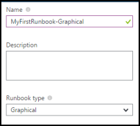
5. Click **Create** to create the runbook and open the graphical editor.

## Step 2 - Add activities to the runbook

The Library control on the left side of the editor allows you to select activities add to your runbook.  We're going to add a **Write-Output** cmdlet to output our text from the runbook.

1.   In the Library control, expand the **Cmdlets** node and then **Microsoft.PowerShell.Utility**. 
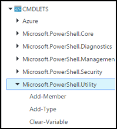
2.   Scroll down to the bottom of the list.  Right click **Write-Output** and click **Add to canvas**.
4.   Click on the  **Write-Output** activity on the canvas.  This opens the Configuration control which allows you to configure the activity.
5.   The **Label** defaults to the name of the cmdlet, but we can change it to something more friendly. Change it to *Write Hello World to output*.
6.   Click **Parameters** to provide values for the cmdlet's parameters.  
Some cmdlets have multiple parameter sets, and you need to select which you will use.  In this case, **Write-Output** has only one parameter set, so you don't need to select one.  
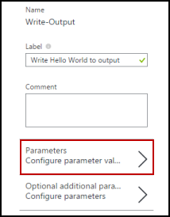
7.   Select the **InputObject** parameter.  This is the parameter where we will specify the text to send to the output stream.
9.   In the **Data source** dropdown, select **PowerShell expression**.
The **Data source** dropdown provides different sources that you use to populate a parameter value.  You can use output from such sources such as another activity, an Automation asset, or a PowerShell expression.  In this case, we just want to output the text *Hello World*.  We can use a PowerShell expression and specify a string.
10.   In the **Expression** box, type *"Hello World"* and then click **OK** twice to return to the canvas. 

11.   Save the runbook by clicking **Save**. 
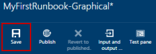

## Step 3 - Test the runbook

Before we publish the runbook to make it available in production, we want to test it to make sure that it works properly.  When you test a runbook, you run its **Draft** version and view its output interactively.  
 
2. Click **Test pane** to open the Test pane. 
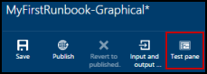
2. Click **Start** to start the test.  This should be the only enabled option.
3. A [runbook job](automation-runbook-execution) is created and its status displayed in the pane.  
The job status will start as *Queued* indicating that it is waiting for a runbook worker in the cloud to come available.  It will then move to *Starting*  when a worker claims the job, and then *Running* when the runbook actually starts running.  
4. When the runbook job completes, its output is displayed.  In our case, we should see *Hello World*. 
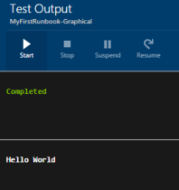
5. Close the Test pane to return to the canvas.

## Step 4 - Publish and start the runbook

The runbook that we just created is still in Draft mode. We need to publish it before we can run it in production.  When you publish a runbook, you overwrite the existing Published version with the Draft version.  In our case, we don't have a Published version yet because we just created the runbook. 

1. Click **Publish** to publish the runbook and then **Yes** when prompted. 
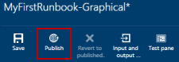
2. If you scroll left to view the runbook in the **Runbooks** pane now, it will show an **Authoring Status** of **Published**.
3. Scroll back to the right to view the pane for **MyFirstRunbook**.  
The options across the top allow us to start the runbook, schedule it to start at some time in the future, or create a [webhook](automation-webhooks.md) so it can be started through an HTTP call. 
4. We just want to start the runbook so click **Start** and then **Yes** when prompted. 
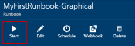
5. A job pane is opened for the runbook job that we just created.  We can close this pane, but in this case we'll leave it open so we can watch the job's progress.
6.  The job status is shown in **Job Summary** and matches the statuses that we saw when we tested the runbook. 

7.  Once the runbook status shows *Completed*, click **Output**.  The **Output** pane is opened, and we can see our *Hello World*. 
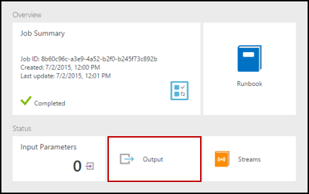  
8.  Close the Output pane.
9.  Click **Streams** to open the Streams pane for the runbook job.  We should only see *Hello World* in the output stream, but this can show other streams for a runbook job such as Verbose and Error if the runbook writes to them. 
 
9. Close the Streams pane and the Job pane to return to the MyFirstRunbook pane.
9.  Click **Jobs** to open the Jobs pane for this runbook.  This lists all of the jobs created by this runbook.  We should only see one job listed since we only ran the job once. 
 
9. You can click on this job to open the same Job pane that we viewed when we started the runbook.  This allows you to go back in time and view the details of any job that was created for a particular runbook.

## Step 5 - Add authentication to manage Azure resources

We've tested and published our runbook, but so far it doesn't do anything useful.  We want to have it manage Azure resources.  It won't be able to do that though unless we have it authenticate using the credentials that are referred to in the [prerequisites](#prerequisites).  We do that with the **Set-AzureAccount** cmdlet.

1.  Open the graphical editor by clicking **Edit** on the MyFirstRunbook pane. 
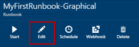 
2.  We don't need the **Write Hello World to output** anymore, so right click it and select **Delete**.
8.  In the Library control, expand **Cmdlets** and then **Azure**. 
9.  Add **Add-AzureAccount** to the canvas. 
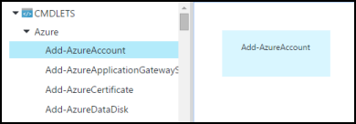 
12.  Select **Add-AzureAccount** and then click **Parameters** in the Configuration pane.
13.  **Add-AzureAccount** has multiple parameter sets, so we need to select one before we can provide parameter values.  Click **Parameter Set** and then select  the **User** parameter set.
14.  Once you select the parameter set, the parameters are displayed in the Activity Parameter Configuration pane.  Click **Credential**. 
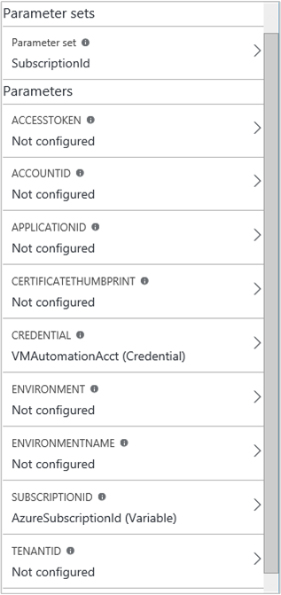
15.  We want this cmdlet to use a credential asset in our Automation account so select **Credential asset** for the **Data source**.
16.  Select the credential asset that has access to start and stop a virtual machine in your Azure environment. 
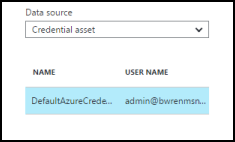
17.  Click **OK** twice to return to the canvas.

## Step 6 - Add activity to start a virtual machine

We'll now add a **Start-AzureVM** activity to start a virtual machine.  You can pick any virtual machine in your Azure subscription, and for now we'll be hardcoding that name into the cmdlet.  

1. Expand **Cmdlets** and then **Azure**.
2. Add **Start-AzureVM** to the canvas and then click and drag it underneath **Add-AzureAccount**.
11.  Hover over **Add-AzureAccount** until a circle appears on the bottom of the shape.  Click the circle and drag the arrow to **Start-AzureVM**.  
The arrow that you just created is a *link*.  The runbook will start with **Add-AzureAccount** and then run **Start-AzureVM**. 
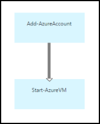
5. Select **Start-AzureVM**.  Click **Parameters** and then **Parameter Set** to view the sets for **Start-AzureVM**.  Select  the **ByName** parameter set. 
Note that **Name** and **ServiceName** have exclamation points next them.  This indicates that they are required parameters.
7. Select **Name**.  Use **Constant value** for the **Data source** and type in the name of the virtual machine to start.  Click **OK**.
8. Select **ServiceName**.  Use **Constant value** for the **Data source** and type in the name of the virtual machine to start.  Click **OK**. 
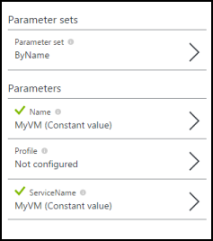
9. Click Test pane so that we can test the runbook.
10. Click **Start** to start the test.  Once it completes, check that the virtual machine was started.

## Step 7 - Add an input parameter to the runbook

Our runbook currently starts the virtual machine that we specified in the **Start-AzureVM** cmdlet, but our runbook would be more useful if we could specify the virtual machine when the runbook is started.  We will now add an input parameter to the runbook to provide that functionality.

1. Open the graphical editor by clicking **Edit** on the **MyFirstRunbook** pane.
2. Click **Input and output** and then **Add input** to open the Runbook Input Parameter pane. 
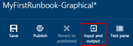
4. Specify *VMName* for the **Name**.  Keep *string* for the **Type**, but change **Mandatory** to *Yes*.  Click **OK**.
5. Create a second mandatory input parameter called *VMServiceName* and then click **OK** to close the **Input and Output** pane. 
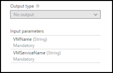 
6. Select the **Start-AzureVM** activity and then click **Parameters**.
7. Change the **Data source** for **Name** to **Runbook input** and then select **VMName**. 
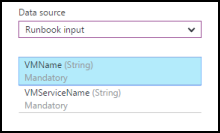 
8. Change the **Data source** for **ServiceName** to **Runbook input** and then select **VMServiceName**. 
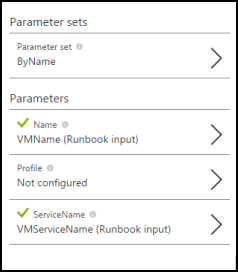 
9. Save the runbook and open the Test pane.  Note that you can now provide values for the two input variables that will be used in the test. 
11.  Close the Test pane.
12.  Click **Publish** to publish the new version of the runbook.
13.  Stop the virtual machine that you started in the previous step.
13.  Click **Start** to start the runbook.  Type in the **VMName** and **VMServiceName** for the virtual machine that you're going to start. 
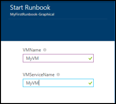 
14.  When the runbook completes, check that the virtual machine was started.

## Step 8 - Create a conditional link

We will now modify the runbook so that it will only attempt to start the runbook if it is not already started.  We'll do this by adding a **Get-AzureVM** cmdlet to the runbook that will include the current state of the virtual machine.  We'll then add a conditional link that will only run **Start-AzureVM** if the current running state is stopped.  If the runbook isn't stopped, then output a message.

1. Open **MyFirstRunbook** in the graphical editor.
2. Remove the link between **Add-AzureAccount** and **Start-AzureVM** by clicking on it and then pressing the *Delete* key.
3. In the Library control, expand **Cmdlets** and then **Azure**.
4. Add **Get-AzureVM** to the canvas.
5. Create a link from **Add-AzureAccount** to **Get-AzureVM**.  Create another link from **Get-AzureVM** to **Start-AzureVM**. 
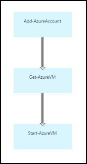   
6.  Select **Get-AzureVM** and click **Parameters**.  Select the parameter set *GetVMByServiceAndVMName*.
7.  For **Name**, set the **Date source** to **Runbook input** and then select **VMName**.   
7.  For **ServiceName**, set the **Date source** to **Runbook input** and then select **VMServiceName**.  
8.  Select the link between **Get-AzureVM** and **Start-AzureVM**.
9.  In the Configuration pane, change **Apply condition** to **True**.  Note that the link turns to a dashed line indicating that the target activity will only be run if the condition resolves to true.
10.  For the **Condition expression**, type *$ActivityOutput['Get-AzureVM'].PowerState -eq "Stopped"*.  **Start-AzureVM** will now only run if the virtual machine is stopped. 
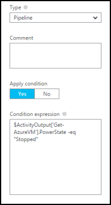 
11.  In the Library control, expand **Cmdlets** and then **Microsoft.PowerShell.Utility**.
12.  Add **Write-Output** to the canvas.
13.  Create a link from **Get-AzureVM** to **Write-Output**.
14.  Select the link and change **Apply condition** to **True**.
14.  For the **Condition expression**, type *$ActivityOutput['Get-AzureVM'].PowerState -ne "Stopped"*.  **Write-Output** will now only run if the virtual machine is not stopped. 
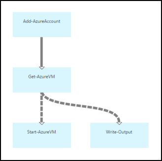 
15.  Select **Write-Output** and click **Parameters**.
16.  For **InputObject**, change **Data source** to **PowerShell expression** and type in the expression *"$VMName.Name already started."*.
17.  Save the runbook and open the Test pane.
18.  Start the runbook with the virtual machine stopped, and it should start.
19.  Start the runbook with the virtual machine started, and you should get output that it is already started.
 

## Related articles

- [Graphical authoring in Azure Automation](automation-graphical-authoring-intro.md)
- [My first PowerShell Workflow runbook](automation-first-runbook-textual.md)

 