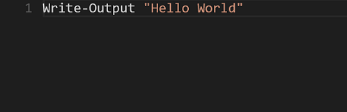
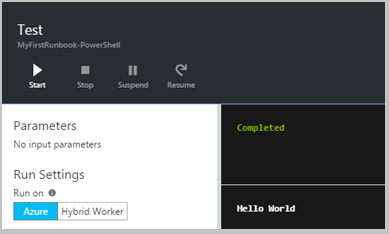
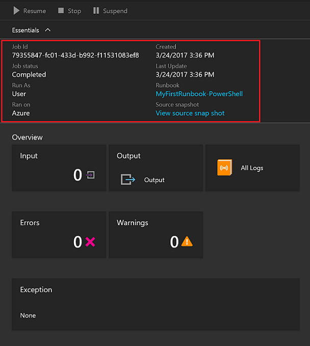
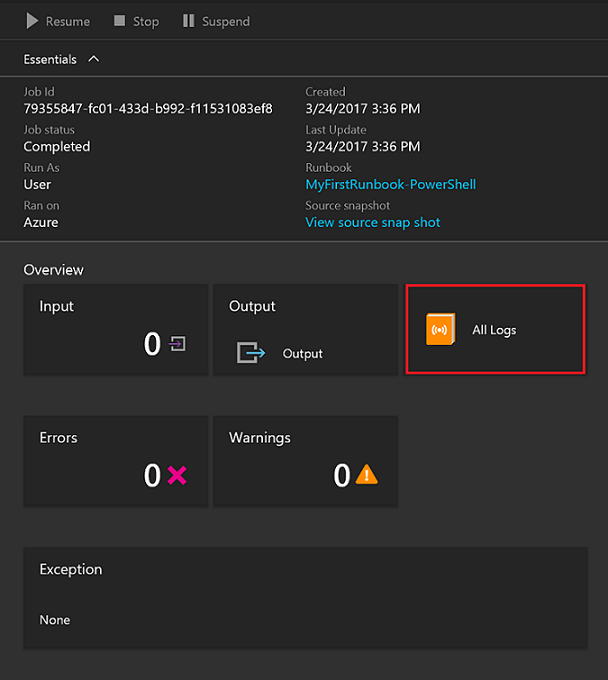
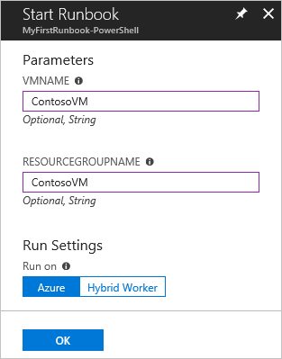

# My first PowerShell runbook

> [!div class="op_single_selector"]
> * [Graphical](automation-first-runbook-graphical.md)
> * [PowerShell](automation-first-runbook-textual-powershell.md)
> * [PowerShell Workflow](automation-first-runbook-textual.md)
> * [Python](automation-first-runbook-textual-python2.md)

This tutorial walks you through the creation of a [PowerShell runbook](automation-runbook-types.md#powershell-runbooks) in Azure Automation. You start with a simple runbook that you test and publish while you learn how to track the status of the runbook job. Then you modify the runbook to actually manage Azure resources, in this case starting an Azure virtual machine. Lastly, you make the runbook more robust by adding runbook parameters.

## Prerequisites

To complete this tutorial, you need the following prerequisites:

* Azure subscription. If you don't have one yet, you can [activate your MSDN subscriber benefits](https://azure.microsoft.com/pricing/member-offers/msdn-benefits-details/) or sign up for a [free account](https://azure.microsoft.com/free/?WT.mc_id=A261C142F).
* [Automation account](automation-quickstart-create-account.md) to hold the runbook and authenticate to Azure resources. This account must have permission to start and stop the virtual machine.
* An Azure virtual machine. You stop and start this machine so it shouldn't be a production VM.
* You may need to [update your Azure modules](automation-update-azure-modules.md) based on the cmdlets you use.

## Create new runbook

You start by creating a simple runbook that outputs the text *Hello World*.

1. In the Azure portal, open your Automation account.
2. Click **Runbooks** under **Process Automation** to open the list of runbooks.
3. Create a new runbook by clicking the **+ Add a runbook** button and then **Create a new runbook**.
4. Give the runbook the name *MyFirstRunbook-PowerShell*.
5. In this case, you're going to create a [PowerShell runbook](automation-runbook-types.md#powershell-runbooks) so select **Powershell** for **Runbook type**.
6. Click **Create** to create the runbook and open the textual editor.

## Add code to the runbook

You can either type code directly into the runbook, or you can select cmdlets, runbooks, and assets from the Library control and have them added to the runbook with any related parameters. For this walkthrough, you type directly in the runbook.

1. Your runbook is currently empty, type *Write-Output "Hello World."* in the body of the script.

     

2. Save the runbook by clicking **Save**.

## <a name="step-3---test-the-runbook"> </a> Test the runbook

Before you publish the runbook to make it available in production, you want to test it to make sure that it works properly. When you test a runbook, you run its **Draft** version and view its output interactively.

1. Click **Test pane** to open the Test pane.
2. Click **Start** to start the test. This should be the only enabled option.
3. A [runbook job](automation-runbook-execution.md) is created and its status displayed.

   The job status starts as *Queued* indicating that it's waiting for a runbook worker in the cloud to come available. It moves to *Starting* when a worker claims the job, and then *Running* when the runbook actually starts running.  

4. When the runbook job completes, its output is displayed. In your case, you should see *Hello World*.

     

5. Close the Test pane to return to the canvas.

## Publish and start the runbook

The runbook that you created is still in Draft mode. It must be published before you can run it in production.  When you publish a runbook, you overwrite the existing Published version with the Draft version. In your case, you don't have a Published version yet because you just created the runbook.

1. Click **Publish** to publish the runbook and then **Yes** when prompted.
1. If you scroll left to view the runbook in the **Runbooks** pane now, it shows an **Authoring Status** of **Published**.
1. Scroll back to the right to view the pane for **MyFirstRunbook-PowerShell**.  
   The options across the top allow us to start the runbook, view the runbook, schedule it to start at some time in the future, or create a [webhook](automation-webhooks.md) so it can be started through an HTTP call.
1. You want to start the runbook, so click **Start** and then click **Ok** when the Start Runbook page opens.
1. A job page is opened for the runbook job that you created. You can close this pane, but in this case you leave it open so you can watch the job's progress.
1. The job status is shown in **Job Summary** and matches the statuses that you saw when you tested the runbook.

   

1. Once the runbook status shows *Completed*, under **Overview** click **Output**. The Output pane is opened, and you can see your *Hello World*.

   

1. Close the Output page.
1. Click **All Logs** to open the Streams pane for the runbook job. You should only see *Hello World* in the output stream, but this output can show other streams for a runbook job such as Verbose and Error if the runbook writes to them.

   

1. Close the Streams page and the Job page to return to the MyFirstRunbook-PowerShell page.
1. Under **Details**, click **Jobs** to open the Jobs pane for this runbook. This page lists all of the jobs created by this runbook. You should only see one job listed since you only ran the job once.

     

1. You can click this job to open the same Job pane that you viewed when you started the runbook. This action allows you to go back in time and view the details of any job that was created for a particular runbook.

## Add authentication to manage Azure resources

You've tested and published your runbook, but so far it doesn't do anything useful. You want to have it manage Azure resources. It is not able to do that though unless You have it authenticate using a Run As connection that is automatically created when you create your automation account. You use the Run As connection with the **Connect-AzureRmAccount** cmdlet. If you are managing resources across multiple subscriptions, you need to use the **-AzureRmContext** parameter along with [Get-AzureRmContext](/powershell/module/azurerm.profile/get-azurermcontext).

   ```powershell
   # Ensures you do not inherit an AzureRMContext in your runbook
   Disable-AzureRmContextAutosave –Scope Process
   
   $connection = Get-AutomationConnection -Name AzureRunAsConnection
   Connect-AzureRmAccount -ServicePrincipal -Tenant $connection.TenantID `
-ApplicationID $connection.ApplicationID -CertificateThumbprint $connection.CertificateThumbprint

   $AzureContext = Select-AzureRmSubscription -SubscriptionId $connection.SubscriptionID

   Get-AzureRmVM -ResourceGroupName myResourceGroup -AzureRmContext $AzureContext
   ```

1. Open the textual editor by clicking **Edit** on the MyFirstRunbook-PowerShell page.
1. You don't need the **Write-Output** line anymore, so go ahead and delete it.
1. Type or copy and paste the following code that handles the authentication with your Automation Run As account:

   ```powershell
   # Ensures you do not inherit an AzureRMContext in your runbook
   Disable-AzureRmContextAutosave –Scope Process

   $connection = Get-AutomationConnection -Name AzureRunAsConnection
   Connect-AzureRmAccount -ServicePrincipal -Tenant $connection.TenantID `
   -ApplicationId $connection.ApplicationID -CertificateThumbprint $connection.CertificateThumbprint
   ```

   > [!IMPORTANT]
   > **Add-AzureRmAccount** and **Login-AzureRmAccount** are now  aliases for **Connect-AzureRMAccount**. If the **Connect-AzureRMAccount** cmdlet does not exist, you can use **Add-AzureRmAccount** or **Login-AzureRmAccount**, or you can update your modules in your Automation Account to the latest versions.

1. Click **Test pane** so that you can test the runbook.
1. Click **Start** to start the test. Once it completes, you should receive output similar to the following, displaying basic information from your account. This output confirms that the Run As Account is valid.

   

## Add code to start a virtual machine

Now that your runbook is authenticating to your Azure subscription, you can manage resources. You add a command to start a virtual machine. You can pick any virtual machine in your Azure subscription, and for now you hardcode that name in the runbook.

1. After *Connect-AzureRmAccount*, type *Start-AzureRmVM -Name 'VMName' -ResourceGroupName 'NameofResourceGroup'* providing the name and Resource Group name of the virtual machine to start.  

   ```powershell
   # Ensures you do not inherit an AzureRMContext in your runbook
   Disable-AzureRmContextAutosave –Scope Process

   $connection = Get-AutomationConnection -Name AzureRunAsConnection
   Connect-AzureRmAccount -ServicePrincipal -Tenant $connection.TenantID `
   -ApplicationID $connection.ApplicationID -CertificateThumbprint $connection.CertificateThumbprint
   Start-AzureRmVM -Name 'VMName' -ResourceGroupName 'ResourceGroupName'
   ```

1. Save the runbook and then click **Test pane** so that you can test it.
1. Click **Start** to start the test. Once it completes, check that the virtual machine was started.

## Add an input parameter

Your runbook currently starts the virtual machine that you hardcoded in the runbook, but it would be more useful if you specify the virtual machine when the runbook is started. You add input parameters to the runbook to provide that functionality.

1. Add parameters for *VMName* and *ResourceGroupName* to the runbook and use these variables with the **Start-AzureRmVM** cmdlet as in the following example.

   ```powershell
   Param(
    [string]$VMName,
    [string]$ResourceGroupName
   )
   # Ensures you do not inherit an AzureRMContext in your runbook
   Disable-AzureRmContextAutosave –Scope Process

   $connection = Get-AutomationConnection -Name AzureRunAsConnection
   Connect-AzureRmAccount -ServicePrincipal -Tenant $connection.TenantID `
   -ApplicationID $connection.ApplicationID -CertificateThumbprint $connection.CertificateThumbprint
   Start-AzureRmVM -Name $VMName -ResourceGroupName $ResourceGroupName
   ```

1. Save the runbook and open the Test pane. You can now provide values for the two input variables that are used in the test.
1. Close the Test pane.
1. Click **Publish** to publish the new version of the runbook.
1. Stop the virtual machine that you started in the previous step.
1. Click **OK** to start the runbook. Type in the **VMName** and **ResourceGroupName** for the virtual machine that you're going to start.<br><br> <br>  
1. When the runbook completes, check that the virtual machine was started.

## Differences from PowerShell Workflow

PowerShell runbooks have the same lifecycle, capabilities, and management as PowerShell Workflow runbooks but there are some differences and limitations:

1. PowerShell runbooks run fast compared to PowerShell Workflow runbooks as they don’t have compilation step.
2. PowerShell Workflow runbooks support checkpoints, using checkpoints, PowerShell Workflow runbooks can resume from any point in the runbook. PowerShell runbooks can only resume from the beginning.
3. PowerShell Workflow runbooks support parallel and serial execution. PowerShell runbooks can only execute commands serially.
4. In a PowerShell Workflow runbook, an activity, a command, or a script block can have its own runspace. In a PowerShell runbook, everything in a script runs in a single runspace. There are also some [syntactic differences](https://technet.microsoft.com/magazine/dn151046.aspx) between a native PowerShell runbook and a PowerShell Workflow runbook.

## Next steps

* To get started with Graphical runbooks, see [My first graphical runbook](automation-first-runbook-graphical.md)
* To get started with PowerShell workflow runbooks, see [My first PowerShell workflow runbook](automation-first-runbook-textual.md)
* To know more about runbook types, their advantages and limitations, see [Azure Automation runbook types](automation-runbook-types.md)
* For more information on PowerShell script support feature, see [Native PowerShell script support in Azure Automation](https://azure.microsoft.com/blog/announcing-powershell-script-support-azure-automation-2/)
