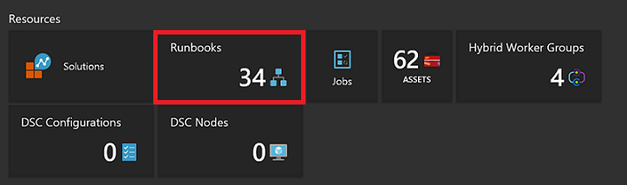

# My first Python runbook

> [!div class="op_single_selector"]
> * [Graphical](automation-first-runbook-graphical.md)
> * [PowerShell](automation-first-runbook-textual-powershell.md)
> * [PowerShell Workflow](automation-first-runbook-textual.md)
> * [Python](automation-first-runbook-python2.md)
> 
>

This tutorial walks you through the creation of a [Python runbook](automation-runbook-types.md#python-runbooks) in Azure Automation. We start with a simple runbook that we test and publish while we explain how to track the status of the runbook job. Then we modify the runbook to actually manage Azure resources, in this case starting an Azure virtual machine. Lastly, we make the runbook more robust by adding runbook parameters.

## Prerequisites

To complete this tutorial, you need the following:

* Azure subscription. If you don't have one yet, you can [activate your MSDN subscriber benefits](https://azure.microsoft.com/pricing/member-offers/msdn-benefits-details/) or <a href="/pricing/free-account/" target="_blank">[sign up for a free account](https://azure.microsoft.com/free/).
* [Automation account](automation-sec-configure-azure-runas-account.md) to hold the runbook and authenticate to Azure resources.  This account must have permission to start and stop the virtual machine.
* An Azure virtual machine. We stop and start this machine so it should not be a production VM.

## Create a new runbook

We start by creating a simple runbook that outputs the text *Hello World*.

1. In the Azure portal, open your Automation account. 
   The Automation account page gives you a quick view of the resources in this account. You should already have some assets. Most of those are the modules that are automatically included in a new Automation account. You should also have the Credential asset that's mentioned in the [prerequisites](#prerequisites).
1. Click the **Runbooks** tile to open the list of runbooks.
   
1. Create a new runbook by clicking the **Add a runbook** button and then **Create a new runbook**.
1. Give the runbook the name *MyFirstRunbook-Python*.
1. In this case, we're going to create a [Python runbook](automation-runbook-types.md#powershell-runbooks) so select **Python 2** for **Runbook type**.
1. Click **Create** to create the runbook and open the textual editor.

## Add code to the runbook

Now we add a simple command to print the text "Hello World":

```python
#!/usr/bin/env python2
print("Hello World!")
```

Click **Save** to save the runbook.

## Test the runbook

Before we publish the runbook to make it available in production, we want to test it to make sure that it works properly. When you test a runbook, you run its **Draft** version and view its output interactively.

1. Click **Test pane** to open the Test pane.
   
1. Click **Start** to start the test. This should be the only enabled option.
1. A [runbook job](automation-runbook-execution.md) is created and its status displayed.
   The job status starts as *Queued* indicating that it is waiting for a runbook worker in the cloud to come available. It will then move to *Starting* when a worker claims the job, and then *Running* when the runbook actually starts running.
1. When the runbook job completes, its output is displayed. In our case, we should see *Hello World*.
1. Close the Test pane to return to the canvas.

## Publish and start the runbook

The runbook that we created is still in draft mode. We need to publish it before we can run it in production.
When you publish a runbook, you overwrite the existing published version with the Draft version.
In our case, we don't have a published version yet because we just created the runbook.

1. Click **Publish** to publish the runbook and then **Yes** when prompted.
   
1. If you scroll left to view the runbook in the **Runbooks** pane now, it will show an **Authoring Status** of **Published**.
1. Scroll back to the right to view the pane for **MyFirstRunbook-PowerShell**.
   The options across the top allow us to start the runbook, view the runbook, schedule it to start at some time in the future, or create a [webhook](automation-webhooks.md) so it can be started through an HTTP call.
1. We want to start the runbook, so click **Start** and then click **Ok** when the Start Runbook blade opens.
1. A job pane is opened for the runbook job that we created. We can close this pane, but in this case we leave it open so we can watch the job's progress.
1. The job status is shown in **Job Summary** and matches the statuses that we saw when we tested the runbook.
1. Once the runbook status shows *Completed*, click **Output**. The Output pane is opened, and we can see our *Hello World*.
1. Close the Output pane.
1. Click **All Logs** to open the Streams pane for the runbook job. We should only see *Hello World* in the output stream, but this can show other streams for a runbook job such as Verbose and Error if the runbook writes to them.
1. Close the Streams pane and the Job pane to return to the MyFirstRunbook-PowerShell pane.
1. Click **Jobs** to open the Jobs pane for this runbook. This lists all of the jobs created by this runbook. We should only see one job listed since we only ran the job once.
1. You can click this job to open the same Job pane that we viewed when we started the runbook. This allows you to go back in time and view the details of any job that was created for a particular runbook.

