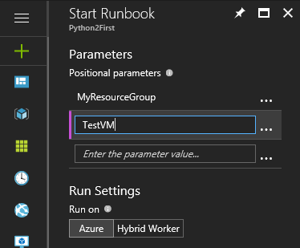

# My first Python runbook

> [!div class="op_single_selector"]
> - [Graphical](automation-first-runbook-graphical.md)
> - [PowerShell](automation-first-runbook-textual-powershell.md)
> - [PowerShell Workflow](automation-first-runbook-textual.md)
> - [Python](automation-first-runbook-textual-python2.md)

This tutorial walks you through the creation of a [Python runbook](automation-runbook-types.md#python-runbooks) in Azure Automation. You start with a simple runbook that you test and publish. Then you modify the runbook to actually manage Azure resources, in this case starting an Azure virtual machine. Lastly, you make the runbook more robust by adding runbook parameters.

## Prerequisites

To complete this tutorial, you need the following:

- Azure subscription. If you don't have one yet, you can [activate your MSDN subscriber benefits](https://azure.microsoft.com/pricing/member-offers/msdn-benefits-details/) or sign up for a [free account](https://azure.microsoft.com/free/?WT.mc_id=A261C142F).
- [Automation account](automation-offering-get-started.md) to hold the runbook and authenticate to Azure resources. This account must have permission to start and stop the virtual machine.
- An Azure virtual machine. You stop and start this machine so it should not be a production VM.

## Create a new runbook

You start by creating a simple runbook that outputs the text *Hello World*.

1. In the Azure portal, open your Automation account.

    The Automation account page gives you a quick view of the resources in this account. You should already have some assets. Most of those assets are the modules that are automatically included in a new Automation account. You should also have the Credential asset that's mentioned in the [prerequisites](#prerequisites).<br>

1. Select **Runbooks** under **PROCESS MANAGEMENT** to open the list of runbooks.
1. Select **+ Add a runbook** to create a new runbook.
1. Give the runbook the name *MyFirstRunbook-Python*.
1. In this case, you're going to create a [Python runbook](automation-runbook-types.md#python-runbooks) so select **Python 2** for **Runbook type**.
1. Click **Create** to create the runbook and open the textual editor.

## Add code to the runbook

Now you add a simple command to print the text "Hello World":

```python
print("Hello World!")
```

Click **Save** to save the runbook.

## Test the runbook

Before you publish the runbook to make it available in production, you want to test it to make sure that it works properly. When you test a runbook, you run its **Draft** version and view its output interactively.

1. Click **Test pane** to open the Test pane.
1. Click **Start** to start the test. This should be the only enabled option.
1. A [runbook job](automation-runbook-execution.md) is created and its status displayed.
   The job status starts as *Queued* indicating that it is waiting for a runbook worker in the cloud to come available. It moves to *Starting* when a worker claims the job, and then *Running* when the runbook actually starts running.
1. When the runbook job completes, its output is displayed. In this case, you should see *Hello World*.
1. Close the Test pane to return to the canvas.

## Publish and start the runbook

The runbook that you created is still in draft mode. You need to publish it before you can run it in production.
When you publish a runbook, you overwrite the existing published version with the Draft version.
In this case, you don't have a published version yet because you just created the runbook.

1. Click **Publish** to publish the runbook and then **Yes** when prompted.
1. If you scroll left to view the runbook in the **Runbooks** pane now, it shows an **Authoring Status** of **Published**.
1. Scroll back to the right to view the pane for **MyFirstRunbook-Python**.
   The options across the top allow us to start the runbook, view the runbook, schedule it to start at some time in the future, or create a [webhook](automation-webhooks.md) so it can be started through an HTTP call.
1. You want to start the runbook, so click **Start** and then click **Ok** when the Start Runbook blade opens.
1. A job pane is opened for the runbook job that you created. You can close this pane, but in this case you leave it open so you can watch the job's progress.
1. The job status is shown in **Job Summary** and matches the statuses that you saw when you tested the runbook.
1. Once the runbook status shows *Completed*, click **Output**. The Output pane is opened, and you can see your *Hello World*.
1. Close the Output pane.
1. Click **All Logs** to open the Streams pane for the runbook job. You should only see *Hello World* in the output stream, but this can show other streams for a runbook job such as Verbose and Error if the runbook writes to them.
1. Close the Streams pane and the Job pane to return to the MyFirstRunbook-Python pane.
1. Click **Jobs** to open the Jobs pane for this runbook. This lists all of the jobs created by this runbook. You should only see one job listed since you only ran the job once.
1. You can click this job to open the same Job pane that you viewed when you started the runbook. This allows you to go back in time and view the details of any job that was created for a particular runbook.

## Add authentication to manage Azure resources

You've tested and published your runbook, but so far it doesn't do anything useful. You want to have it manage Azure resources.
To manage Azure resources, the script has to authenticate using the credentials from your Automation Account. To help you, you can use the [Azure Automation utility package](https://github.com/azureautomation/azure_automation_utility) to make it easier to authenticate and interact with Azure resources.

> [!NOTE]
> The Automation account must have been created with the service principal feature for there to be a Run As Certificate.
> If your automation account was not created with the service principal, you can authenticate by using the method described at
> [Authenticate with the Azure Management Libraries for Python](https://docs.microsoft.com/python/azure/python-sdk-azure-authenticate).

1. Open the textual editor by clicking **Edit** on the MyFirstRunbook-Python pane.

2. Add the following code to authenticate to Azure:

   ```python
   import os
   from azure.mgmt.compute import ComputeManagementClient
   import azure.mgmt.resource
   import automationassets

   def get_automation_runas_credential(runas_connection):
       from OpenSSL import crypto
       import binascii
       from msrestazure import azure_active_directory
       import adal

       # Get the Azure Automation RunAs service principal certificate
       cert = automationassets.get_automation_certificate("AzureRunAsCertificate")
       pks12_cert = crypto.load_pkcs12(cert)
       pem_pkey = crypto.dump_privatekey(crypto.FILETYPE_PEM,pks12_cert.get_privatekey())

       # Get run as connection information for the Azure Automation service principal
       application_id = runas_connection["ApplicationId"]
       thumbprint = runas_connection["CertificateThumbprint"]
       tenant_id = runas_connection["TenantId"]

       # Authenticate with service principal certificate
       resource ="https://management.core.windows.net/"
       authority_url = ("https://login.microsoftonline.com/"+tenant_id)
       context = adal.AuthenticationContext(authority_url)
       return azure_active_directory.AdalAuthentication(
       lambda: context.acquire_token_with_client_certificate(
               resource,
               application_id,
               pem_pkey,
               thumbprint)
       )

   # Authenticate to Azure using the Azure Automation RunAs service principal
   runas_connection = automationassets.get_automation_connection("AzureRunAsConnection")
   azure_credential = get_automation_runas_credential(runas_connection)
   ```

## Add code to create Python Compute client and start the VM

To work with Azure VMs, create an instance of the
[Azure Compute client for Python](https://docs.microsoft.com/python/api/azure.mgmt.compute.computemanagementclient?view=azure-python).

Use the Compute client to start the VM. Add the following code to the runbook:

```python
# Initialize the compute management client with the RunAs credential and specify the subscription to work against.
compute_client = ComputeManagementClient(
azure_credential,
  str(runas_connection["SubscriptionId"])
)


print('\nStart VM')
async_vm_start = compute_client.virtual_machines.start("MyResourceGroup", "TestVM")
async_vm_start.wait()
```

Where _MyResourceGroup_ is the name of the resource group that contains the VM, and _TestVM_ is the name of the VM you want to start.

Test and run the runbook again to see that it starts the VM.

## Use input parameters

The runbook currently uses hard-coded values for the names of the Resource Group and the VM.
Now let's add code that gets these values from input parameters.

You use the `sys.argv` variable to get the parameter values.
Add the following code to the runbook immediately after the other `import` statements:

```python
import sys

resource_group_name = str(sys.argv[1])
vm_name = str(sys.argv[2])
```

This imports the `sys` module, and creates two variables to hold the Resource Group and VM names.
Notice that the element of the argument list, `sys.argv[0]`, is the name of the script, and is not input by the user.

Now you can modify the last two lines of the runbook to use the input parameter values instead of using hard-coded values:

```python
async_vm_start = compute_client.virtual_machines.start(resource_group_name, vm_name)
async_vm_start.wait()
```

When you start a Python runbook (either on the **Test** page or as a published runbook),
you can enter the values for parameters in the **Start Runbook** page under **Parameters**.

After you start entering a value in the first box, a second will appear, and so on,
so that you can enter as many parameter values as necessary.

The values are available to the script as the `sys.argv` array as in the code you just added.

Enter the name of your resource group as the value for the first parameter,
and the name of the VM to start as the value of the second parameter.



Click **OK** to start the runbook. The runbook runs and starts the VM that you specified.

## Next steps

- To get started with PowerShell runbooks, see [My first PowerShell runbook](automation-first-runbook-textual-powershell.md)
- To get started with Graphical runbooks, see [My first graphical runbook](automation-first-runbook-graphical.md)
- To get started with PowerShell workflow runbooks, see [My first PowerShell workflow runbook](automation-first-runbook-textual.md)
- To know more about runbook types, their advantages and limitations, see [Azure Automation runbook types](automation-runbook-types.md)
- To learn about developing for Azure with Python, see [Azure for Python developers](https://docs.microsoft.com/python/azure/?view=azure-python)
- To view sample Python 2 runbooks, see the [Azure Automation GitHub](https://github.com/azureautomation/runbooks/tree/master/Utility/Python)