<properties
    pageTitle="My first PowerShell Workflow runbook in Azure Automation | Microsoft Azure"
    description="Tutorial that walks you through the creation, testing, and publishing of a simple text runbook using PowerShell Workflow."
    services="automation"
    documentationCenter=""
    authors="mgoedtel"
    manager="jwhit"
    editor=""
	keywords="powershell workflow, powershell workflow examples, workflow powershell"/>
<tags
    ms.service="automation"
    ms.workload="tbd"
    ms.tgt_pltfrm="na"
    ms.devlang="na"
    ms.topic="get-started-article"
    ms.date="06/02/2016"
    ms.author="magoedte;bwren"/>

# My first PowerShell Workflow runbook

> [AZURE.SELECTOR] - [Graphical](automation-first-runbook-graphical.md) - [PowerShell](automation-first-runbook-textual-PowerShell.md) - [PowerShell Workflow](automation-first-runbook-textual.md)

This tutorial walks you through the creation of a [PowerShell Workflow runbook](automation-runbook-types.md#powerShell-workflow-runbooks) in Azure Automation. We'll start with a simple runbook that we'll test and publish while we explain how to track the status of the runbook job. Then we'll modify the runbook to actually manage Azure resources, in this case starting an Azure virtual machine. We'll then make the runbook more robust by adding runbook parameters.

## Prerequisites

To complete this tutorial, you will need the following.

-	Azure subscription. If you don't have one yet, you can [activate your MSDN subscriber benefits](https://azure.microsoft.com/pricing/member-offers/msdn-benefits-details/) or <a href="/pricing/free-account/" target="_blank">[sign up for a free account](https://azure.microsoft.com/free/).
-	[Automation account](automation-security-overview.md) to hold the runbook and authenticate to Azure resources.  This account must have permission to start and stop the virtual machine.
-	An Azure virtual machine. We will stop and start this machine so it should not be production.

## Step 1 - Create new runbook

We'll start by creating a simple runbook that outputs the text *Hello World*.

1.	In the Azure Portal, open your Automation account.  
	The Automation account page gives you a quick view of the resources in this account. You should already have some Assets. Most of those are the modules that are automatically included in a new Automation account. You should also have the Credential asset that's mentioned in the [prerequisites](#prerequisites).
2.	Click on the **Runbooks** tile to open the list of runbooks.<br> 
3.	Create a new runbook by clicking on the **Add a runbook** button and then **Create a new runbook**.
4.	Give the runbook the name *MyFirstRunbook-Workflow*.
5.	In this case, we're going to create a [PowerShell Workflow runbook](automation-runbook-types.md#powerShell-workflow-runbooks) so select **Powershell Workflow** for **Runbook type**.<br> 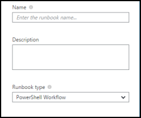
6.	Click **Create** to create the runbook and open the textual editor.

## Step 2 - Add code to the runbook

You can either type code directly into the runbook, or you can select cmdlets, runbooks, and assets from the Library control and have them added to the runbook with any related parameters. For this walkthrough, we'll type directly into the runbook.

1.	Our runbook is currently empty with only the required *workflow* keyword, the name of our runbook, and the braces that will encase the entire workflow. 

    ```
    Workflow MyFirstRunbook-Workflow
    {
    }
    ```

2.	Type *Write-Output "Hello World."* between the braces. 
   
    ```
    Workflow MyFirstRunbook-Workflow
    {
      Write-Output "Hello World"
    }
    ```

3.	Save the runbook by clicking **Save**.<br> 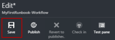

## Step 3 - Test the runbook

Before we publish the runbook to make it available in production, we want to test it to make sure that it works properly. When you test a runbook, you run its **Draft** version and view its output interactively.

1.	Click **Test pane** to open the Test pane.<br> 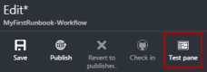
2.	Click **Start** to start the test. This should be the only enabled option.
3.	A [runbook job](automation-runbook-execution.md) is created and its status displayed.  
	The job status will start as *Queued* indicating that it is waiting for a runbook worker in the cloud to come available. It will then move to *Starting* when a worker claims the job, and then *Running* when the runbook actually starts running.  
4.	When the runbook job completes, its output is displayed. In our case, we should see *Hello World*.<br> 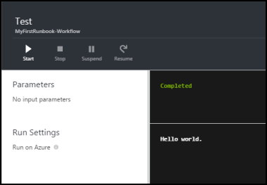
5.	Close the Test pane to return to the canvas.

## Step 4 - Publish and start the runbook

The runbook that we just created is still in Draft mode. We need to publish it before we can run it in production. When you publish a runbook, you overwrite the existing Published version with the Draft version. In our case, we don't have a Published version yet because we just created the runbook.

1.	Click **Publish** to publish the runbook and then **Yes** when prompted.<br> 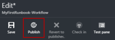
2.	If you scroll left to view the runbook in the **Runbooks** pane now, it will show an **Authoring Status** of **Published**.
3.	Scroll back to the right to view the pane for **MyFirstRunbook-Workflow**.  
	The options across the top allow us to start the runbook, schedule it to start at some time in the future, or create a [webhook](automation-webhooks.md) so it can be started through an HTTP call.
4.	We just want to start the runbook so click **Start** and then **Yes** when prompted.<br> 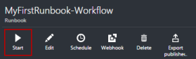
5.	A job pane is opened for the runbook job that we just created. We can close this pane, but in this case we'll leave it open so we can watch the job's progress.
6.	The job status is shown in **Job Summary** and matches the statuses that we saw when we tested the runbook.<br> 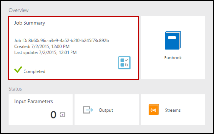
7.	Once the runbook status shows *Completed*, click **Output**. The Output pane is opened, and we can see our *Hello World*.<br>   
8.	Close the Output pane.
9.	Click **Streams** to open the Streams pane for the runbook job. We should only see *Hello World* in the output stream, but this can show other streams for a runbook job such as Verbose and Error if the runbook writes to them.<br> 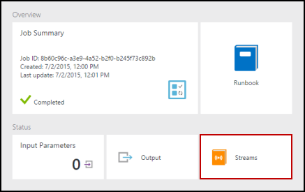
10.	Close the Streams pane and the Job pane to return to the MyFirstRunbook-Workflow pane.
11.	Click **Jobs** to open the Jobs pane for this runbook. This lists all of the jobs created by this runbook. We should only see one job listed since we only ran the job once.<br> 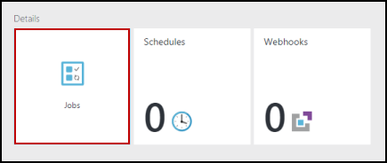
12.	You can click on this job to open the same Job pane that we viewed when we started the runbook. This allows you to go back in time and view the details of any job that was created for a particular runbook.

## Step 5 - Add authentication to manage Azure resources

We've tested and published our runbook, but so far it doesn't do anything useful. We want to have it manage Azure resources. It won't be able to do that though unless we have it authenticate using the credentials that are referred to in the [prerequisites](#prerequisites). We do that with the **Add-AzureRmAccount** cmdlet.

1.	Open the textual editor by clicking **Edit** on the MyFirstRunbook-Workflow pane.<br> 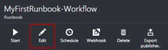
2.	We don't need the **Write-Output** line anymore, so go ahead and delete it.
3.	Position the cursor on a blank line between the braces.
4.	Type or copy and paste the following code that will handle the authentication with your Automation Run As account:

    ```
    $Conn = Get-AutomationConnection -Name AzureRunAsConnection
    Add-AzureRmAccount -ServicePrincipal -Tenant $Conn.TenantID -ApplicationId $Conn.ApplicationID -CertificateThumbprint $Conn.CertificateThumbprint
    ```

5.	Click **Test pane** so that we can test the runbook.
6.	Click **Start** to start the test. Once it completes, you should receive output displaying basic information from your account. This confirms that the credential is valid. <br> 

## Step 6 - Add code to start a virtual machine

Now that our runbook is authenticating to our Azure subscription, we can manage resources. We'll add a command to start a virtual machine. You can pick any virtual machine in your Azure subscription, and for now we'll be hardcoding that name into the cmdlet.

1.	After *Add-AzureRmAccount*, type *Start-AzureRmVM -Name 'VMName' -ResourceGroupName 'NameofResourceGroup'* providing the name and Resource Group name of the virtual machine to start.  

    ```
    workflow MyFirstRunbook-Workflow
    {
     $Conn = Get-AutomationConnection -Name AzureRunAsConnection 
     Add-AzureRmAccount -ServicePrincipal -Tenant $Conn.TenantID -ApplicationId $Conn.ApplicationID -CertificateThumbprint $Conn.CertificateThumbprint
 
     Start-AzureRmVM -Name 'VMName' -ResourceGroupName 'ResourceGroupName'
    }
    ```

2.	Save the runbook and then click **Test pane** so that we can test it.
3.	Click **Start** to start the test. Once it completes, check that the virtual machine was started.

## Step 7 - Add an input parameter to the runbook

Our runbook currently starts the virtual machine that we hardcoded in the runbook, but it would be more useful if we could specify the virtual machine when the runbook is started. We will now add input parameters to the runbook to provide that functionality.

1.	Add parameters for *VMName* and *ResourceGroupName* to the runbook and use these variables with the **Start-AzureRmVM** cmdlet as in the example below. 

    ```
    workflow MyFirstRunbook-Workflow
    {
       Param(
        [string]$VMName,
        [string]$ResourceGroupName
       )  
     $Conn = Get-AutomationConnection -Name AzureRunAsConnection 
     Add-AzureRmAccount -ServicePrincipal -Tenant $Conn.TenantID -ApplicationId $Conn.ApplicationID -CertificateThumbprint $Conn.CertificateThumbprint
     Start-AzureRmVM -Name $VMName -ResourceGroupName $ResourceGroupName
    }
    ```

2.	Save the runbook and open the Test pane. Note that you can now provide values for the two input variables that will be used in the test.
3.	Close the Test pane.
4.	Click **Publish** to publish the new version of the runbook.
5.	Stop the virtual machine that you started in the previous step.
6.	Click **Start** to start the runbook. Type in the **VMName** and **ResourceGroupName** for the virtual machine that you're going to start.<br> 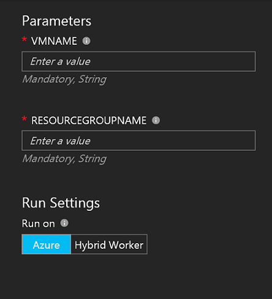

7.	When the runbook completes, check that the virtual machine was started.

## Next steps

-  To get started with Graphical runbooks, see [My first graphical runbook](automation-first-runbook-graphical.md)
-  To get started with PowerShell runbooks, see [My first PowerShell runbook](automation-first-runbook-textual-powershell.md)
-  To learn more about runbook types, their advantages and limitations, see [Azure Automation runbook types](automation-runbook-types.md)
-  For more information on PowerShell script support feature, see [Native PowerShell script support in Azure Automation](https://azure.microsoft.com/blog/announcing-powershell-script-support-azure-automation-2/)
