# Author graphical runbooks in Azure Automation

All runbooks in Azure Automation are Windows PowerShell workflows. Graphical runbooks and graphical PowerShell Workflow runbooks generate PowerShell code that the Automation workers run but that you cannot view or modify. You can convert a graphical runbook to a graphical PowerShell Workflow runbook, and vice versa. However, you can't convert these runbooks to a textual runbook. Additionally, the Automation graphical editor can't import a textual runbook.

Graphical authoring allows you to create runbooks for Azure Automation without the complexities of the underlying Windows PowerShell or PowerShell Workflow code. You can add activities to the canvas from a library of cmdlets and runbooks, link them together, and configure them to form a workflow. If you have ever worked with System Center Orchestrator or Service Management Automation (SMA), graphical authoring should look familiar. This article provides an introduction to the concepts you need to get started creating a graphical runbook.

## Overview of graphical editor

You can open the graphical editor in the Azure portal by creating or editing a graphical runbook.

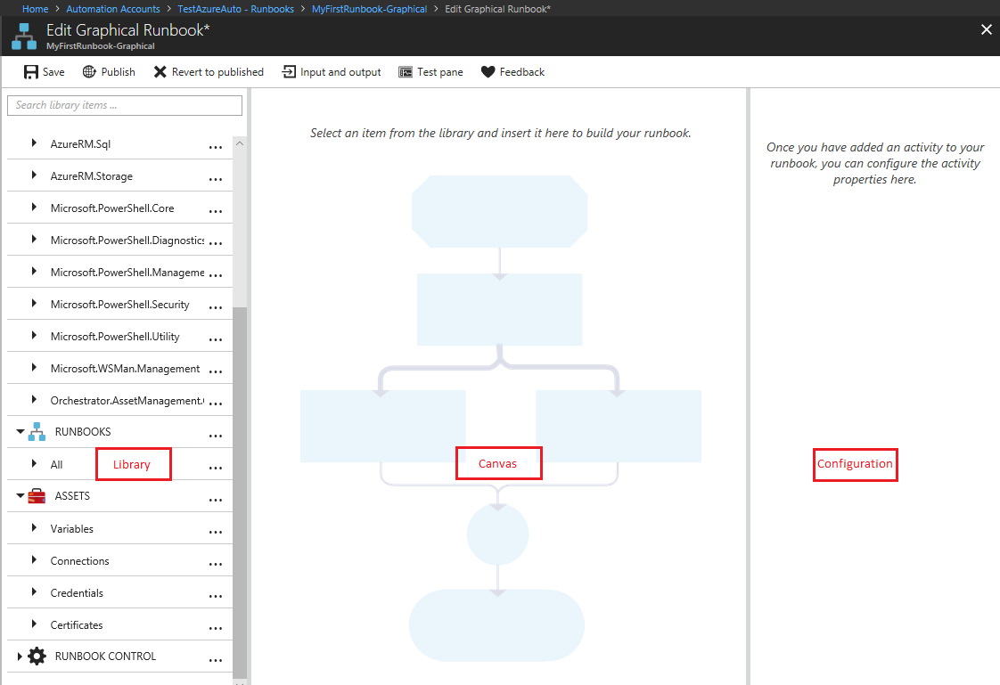

The following sections describe the controls in the graphical editor.

### Canvas control

The Canvas control allows you to design your runbook. You can add activities from the nodes in the Library control to the runbook and connect them with links to define runbook logic. At the bottom of the canvas, there are controls that allow you to zoom in and out.

### Library control

The Library control allows you to select [activities](#use-activities) to add to your runbook. You add them to the canvas, where you can connect them to other activities. The Library control includes the sections defined in the following table.

| Section | Description |
|:--- |:--- |
| Cmdlets |All the cmdlets that can be used in your runbook. Cmdlets are organized by module. All the modules that you have installed in your Automation account are available. |
| Runbooks |The runbooks in your Automation account. You can add these runbooks to the canvas to be used as child runbooks. Only runbooks of the same core type as the runbook being edited are shown. For graphical runbooks, only PowerShell-based runbooks are shown. For graphical PowerShell Workflow runbooks, only PowerShell Workflow-based runbooks are shown. |
| Assets |The [automation assets](/previous-versions/azure/dn939988(v=azure.100)) in your Automation account that you can use in your runbook. Adding an asset to a runbook adds a workflow activity that gets the selected asset. In the case of variable assets, you can select whether to add an activity to get the variable or set the variable. |
| Runbook Control |Control activities that can be used in your current runbook. A Junction activity takes multiple inputs and waits until all have completed before continuing the workflow. A Code activity runs one or more lines of PowerShell or PowerShell Workflow code, depending on the graphical runbook type. You can use this activity for custom code or for functionality that is difficult to achieve with other activities. |

### Configuration control

The Configuration control enables you to provide details for an object that is selected on the canvas. The properties available in this control depend on the type of object selected. When you choose an option in the Configuration control, it opens additional blades to provide more information.

### Test control

The Test control is not displayed when the graphical editor is first started. It is opened when you interactively test a graphical runbook.

## Use activities

Activities are the building blocks of a runbook. An activity can be a PowerShell cmdlet, a child runbook, or a workflow. You can add an activity to the runbook by right-clicking it in the Library control and selecting **Add to canvas**. You can then click and drag the activity to place it anywhere on the canvas that you like. The location of the activity on the canvas does not affect the operation of the runbook. You can lay out your runbook any way you find most suitable to visualize its operation.

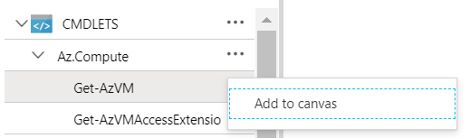

Select an activity on the canvas to configure its properties and parameters in the Configuration blade. You can change the label of the activity to a name that you find descriptive. The runbook still runs the original cmdlet. You are simply changing the display name that the graphical editor uses. Note that the label must be unique within the runbook.

### Parameter sets

A parameter set defines the mandatory and optional parameters that accept values for a particular cmdlet. All cmdlets have at least one parameter set, and some have several sets. If a cmdlet has multiple parameter sets, you must select the one to use before you can configure parameters. You can change the parameter set used by an activity by selecting **Parameter Set** and choosing another set. In this case, any parameter values that you have already configured are lost.

In the following example, the [Get-AzVM](https://docs.microsoft.com/powershell/module/az.compute/get-azvm?view=azps-3.5.0) cmdlet has three parameter sets. The example uses one set called **ListVirtualMachineInResourceGroupParamSet**, with a single optional parameter, for returning all virtual machines in a resource group. The example also uses the **GetVirtualMachineInResourceGroupParamSet** parameter set for specifying the virtual machine to return. This set has two mandatory parameters and one optional parameter.


#### Parameter values

When you specify a value for a parameter, you select a data source to determine how the value is specified. The data sources that are available for a particular parameter depend on the valid values for that parameter. For example, Null is not an available option for a parameter that does not allow null values.

| Data Source | Description |
|:--- |:--- |
| Constant Value |Type in a value for the parameter. This data source is only available for the following data types: Int32, Int64, String, Boolean, DateTime, Switch. |
| Activity Output |Use output from an activity that precedes the current activity in the workflow. All valid activities are listed. For the parameter value, use just the activity that produces the output. If the activity outputs an object with multiple properties, you can type in the name of a specific property after selecting the activity. |
| Runbook Input |Select a runbook input as an input for the activity parameter. |
| Variable Asset |Select an Automation variable as input. |
| Credential Asset |Select an Automation credential as input. |
| Certificate Asset |Select an Automation certificate as input. |
| Connection Asset |Select an Automation connection as input. |
| PowerShell Expression |Specify a simple [PowerShell expression](#work-with-powershell-expressions). The expression is evaluated before the activity and the result is used for the parameter value. You can use variables to refer to the output of an activity or a runbook input parameter. |
| Not Configured |Clear any value that was previously configured. |

#### Optional additional parameters

All cmdlets have the option to provide additional parameters. These are PowerShell-common parameters or other custom parameters. The graphical editor presents a text box where you can provide parameters using PowerShell syntax. For example, to use the `Verbose` common parameter, you should specify `-Verbose:$True`.

### Retry activity

Retry functionality for an activity allows it to be run multiple times until a particular condition is met, much like a loop. You can use this feature for activities that should run multiple times, are error prone, might need more than one attempt for success, or test the output information of the activity for valid data.

When you enable retry for an activity, you can set a delay and a condition. The delay is the time (measured in seconds or minutes) that the runbook waits before it runs the activity again. If you don't specify a delay, the activity runs again immediately after it completes.

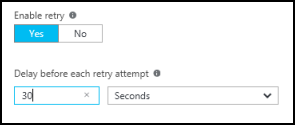

The retry condition is a PowerShell expression that is evaluated after each time that the activity runs. If the expression resolves to True, the activity runs again. If the expression resolves to False, the activity does not run again and the runbook moves on to the next activity.

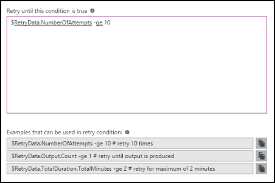

The retry condition can use a variable named `RetryData` that provides access to information about the activity retries. This variable has the properties in the following table:

| Property | Description |
|:--- |:--- |
| `NumberOfAttempts` |Number of times that the activity has been run. |
| `Output` |Output from the last run of the activity. |
| `TotalDuration` |Timed elapsed since the activity was started the first time. |
| `StartedAt` |Time (in UTC format) when the activity was first started. |

The following are examples of activity retry conditions.

```powershell-interactive
# Run the activity exactly 10 times.
$RetryData.NumberOfAttempts -ge 10
```

```powershell-interactive
# Run the activity repeatedly until it produces any output.
$RetryData.Output.Count -ge 1
```

```powershell-interactive
# Run the activity repeatedly until 2 minutes has elapsed.
$RetryData.TotalDuration.TotalMinutes -ge 2
```

After you configure a retry condition for an activity, the activity includes two visual cues to remind you. One is presented in the activity and the other is shown when you review the configuration of the activity.

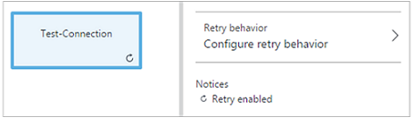

### Workflow Script control

A workflow Script control is a special activity that accepts PowerShell or PowerShell Workflow script, depending on the type of graphical runbook being authored. This control provides functionality that might not be available by other means. It cannot accept parameters, but it can use variables for activity output and runbook input parameters. Any output of the activity is added to the databus. An exception is output with no outgoing link, in which case the output is added to the output of the runbook.

For example, the following code performs date calculations using a runbook input variable named `NumberOfDays`. It then sends a calculated DateTime value as output to be used by subsequent activities in the runbook.

```powershell-interactive
$DateTimeNow = (Get-Date).ToUniversalTime()
$DateTimeStart = ($DateTimeNow).AddDays(-$NumberOfDays)}
$DateTimeStart
```

## Use links for workflow

A link in a graphical runbook connects two activities. It is displayed on the canvas as an arrow pointing from the source activity to the destination activity. The activities run in the direction of the arrow with the destination activity starting after the source activity completes.

### Create a link

You can create a link between two activities by selecting the source activity and clicking the circle at the bottom of the shape. Drag the arrow to the destination activity and release.

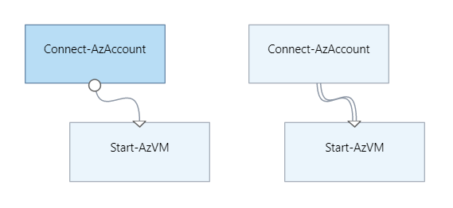

Select the link to configure its properties in the Configuration blade. Properties include the link type, which is described in the following table.

| Link Type | Description |
|:--- |:--- |
| Pipeline |The destination activity runs once for each object output from the source activity. The destination activity does not run if the source activity results in no output. Output from the source activity is available as an object. |
| Sequence |The destination activity runs only once when it receives output from the source activity. Output from the source activity is available as an array of objects. |

### Start runbook activity

A graphical runbook starts with any activities that do not have an incoming link. There is often only one activity that acts as the starting activity for the runbook. If multiple activities do not have an incoming link, the runbook starts by running them in parallel. It follows the links to run other activities as each completes.

### Specify link conditions

When you specify a condition on a link, the destination activity runs only if the condition resolves to True. You typically use an `ActivityOutput` variable in a condition to retrieve the output from the source activity.

For a pipeline link, you must specify a condition for a single object. The runbook evaluates the condition for each object output by the source activity. It then runs the destination activity for each object that satisfies the condition. For example, with a source activity of `Get-AzVM`, you can use the following syntax for a conditional pipeline link to retrieve only virtual machines in the resource group named Group1.

```powershell-interactive
$ActivityOutput['Get Azure VMs'].Name -match "Group1"
```

For a sequence link, the runbook only evaluates the condition once, since a single array containing all objects from the source activity is returned. Because of this, the runbook can't use a sequence link for filtering, like it can with a pipeline link. The sequence link can simply determine whether or not the next activity is run.

For example, take the following set of activities in our **Start VM** runbook:

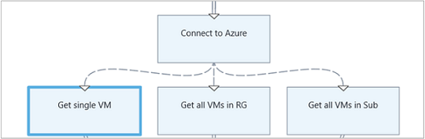

The runbook uses three different sequence links that verify values of the input parameters `VMName` and `ResourceGroupName` to determine the appropriate action to take. Possible actions are start a single VM, start all VMs in the resource group, or start all VMs in a subscription. For the sequence link between `Connect to Azure` and `Get single VM`, here is the condition logic:

```powershell-interactive
<#
Both VMName and ResourceGroupName runbook input parameters have values
#>
(
(($VMName -ne $null) -and ($VMName.Length -gt 0))
) -and (
(($ResourceGroupName -ne $null) -and ($ResourceGroupName.Length -gt 0))
)
```

When you use a conditional link, the data available from the source activity to other activities in that branch is filtered by the condition. If an activity is the source to multiple links, the data available to activities in each branch depends on the condition in the link connecting to that branch.

For example, the `Start-AzVM` activity in the runbook below starts all virtual machines. It has two conditional links. The first conditional link uses the expression `$ActivityOutput['Start-AzVM'].IsSuccessStatusCode -eq $true` to filter if the `Start-AzVM` activity completes successfully. The second conditional link uses the expression `$ActivityOutput['Start-AzVM'].IsSuccessStatusCode -ne $true` to filter if the `Start-AzVm` activity fails to start the virtual machine.

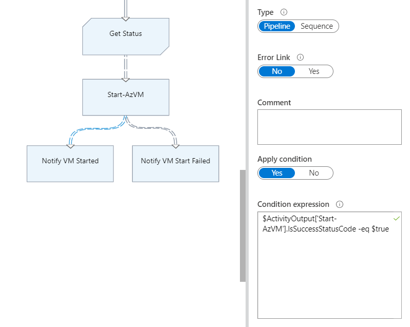

Any activity that follows the first link and uses the activity output from `Get-AzureVM` only retrieves the virtual machines that were started at the time when `Get-AzureVM` was run. Any activity that follows the second link only gets the virtual machines that were stopped at the time when `Get-AzureVM` was run. Any activity following the third link gets all virtual machines regardless of their running state.

### Use junctions

A junction is a special activity that waits until all incoming branches have completed. This allows the runbook to run multiple activities in parallel and ensure that all have completed before moving on.

While a junction can have an unlimited number of incoming links, only one of those links can be a pipeline. The number of incoming sequence links is not constrained. You can create the junction with multiple incoming pipeline links and save the runbook, but it will fail when it is run.

The example below is part of a runbook that starts a set of virtual machines while simultaneously downloading patches to be applied to those machines. It uses a junction to ensure that both processes are completed before the runbook continues.

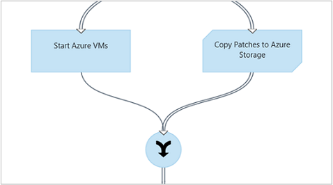

### Work with cycles

A cycle is formed when a destination activity links back to its source activity or to another activity that eventually links back to its source. Graphical authoring does not currently support cycles. If your runbook has a cycle, it saves properly but receives an error when it runs.

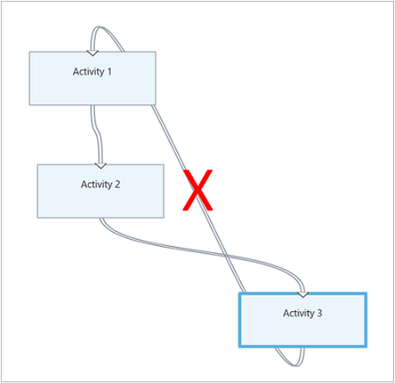

### Share data between activities

Any data that an activity outputs with an outgoing link is written to the databus for the runbook. Any activity in the runbook can use data on the databus to populate parameter values or include in script code. An activity can access the output of any previous activity in the workflow.

How the data is written to the databus depends on the type of link on the activity. For a pipeline link, the data is output as multiple objects. For a sequence link, the data is output as an array. If there is only one value, it is output as a single-element array.

Your runbook has two ways to access data on the databus: 
* Use an activity output data source.
* Use a PowerShell expression data source.

The first mechanism uses an activity output data source to populate a parameter of another activity. If the output is an object, the runbook can specify a single property.

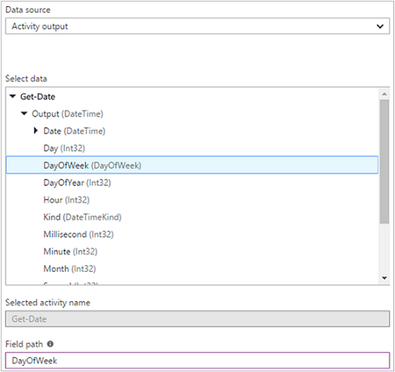

The second data access mechanism retrieves the output of an activity in a PowerShell expression data source or a workflow script activity with an `ActivityOutput` variable, using the syntax shown below. If the output is an object, your runbook can specify a single property.

```powershell-interactive
$ActivityOutput['Activity Label']
$ActivityOutput['Activity Label'].PropertyName
```

### Use checkpoints

You can set [checkpoints](automation-powershell-workflow.md#use-checkpoints-in-a-workflow) in a graphical PowerShell Workflow runbook by selecting **Checkpoint runbook** on any activity. This causes a checkpoint to be set after the activity runs.

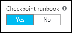

Checkpoints are only enabled in graphical PowerShell Workflow runbooks, and are not available in graphical runbooks. If the runbook uses Azure cmdlets, it should follow any checkpointed activity with a `Connect-AzAccount` activity. The connect operation is used in case the runbook is suspended and must restart from this checkpoint on a different worker.

## Handle runbook input

A runbook requires input either from a user starting the runbook through the Azure portal or from another runbook, if the current one is used as a child. For example, for a runbook that creates a virtual machine, the user might need to provide such information as the name of the virtual machine and other properties each time the runbook starts.

The runbook accepts input by defining one or more input parameters. The user provides values for these parameters each time the runbook starts. When the user starts the runbook using the Azure portal, the user is prompted to provide values for each input parameter supported by the runbook.

When authoring your runbook, you can access its input parameters by clicking **Input and output** on the runbook toolbar. This opens the Input and Output control where you can edit an existing input parameter or create a new one by clicking **Add input**.

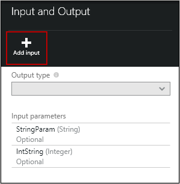

Each input parameter is defined by the properties in the following table:

| Property | Description |
|:--- |:--- |
| Name | Required. The name of the parameter. The name must be unique within the runbook. It must start with a letter and can contain only letters, numbers, and underscores. The name cannot contain a space. |
| Description |Optional. Description of the purpose for the input parameter. |
| Type | Optional. Data type expected for the parameter value. The Azure portal provides an appropriate control for the data type for each parameter when prompting for input. Supported parameter types are String, Int32, Int64, Decimal, Boolean, DateTime, and Object. If a data type is not selected, it defaults to String.|
| Mandatory | Optional. Setting that specifies if a value must be provided for the parameter. If you choose `yes`, a value must be provided when the runbook is started. If you choose `no`, a value is not required when the runbook is started, and a default value can be used. The runbook cannot start if you do not provide a value for each mandatory parameter that does not have a default value defined. |
| Default Value | Optional. The value used for a parameter if one is not passed in when the runbook is started. To set a default value, choose `Custom`. Select `None` if you don't want to provide any default value. |

## Handle runbook output

Graphical authoring saves data created by any activity that does not have an outgoing link to the [output of the runbook](https://docs.microsoft.com/azure/automation/automation-runbook-output-and-messages). The output is saved with the runbook job and is available to a parent runbook when the runbook is used as a child.

## Work with PowerShell expressions

One of the advantages of graphical authoring is that it allows you to build a runbook with minimal knowledge of PowerShell. Currently, though, you do need to know a bit of PowerShell for populating certain [parameter values](#use-activities) and for setting [link conditions](#use-links-for-workflow). This section provides a quick introduction to PowerShell expressions. Full details of PowerShell are available at [Scripting with Windows PowerShell](https://docs.microsoft.com/powershell/scripting/overview).

### Use a PowerShell expression as a data source

You can use a PowerShell expression as a data source to populate the value of an [activity parameter](#use-activities) with the results of PowerShell code. The expression can be a single line of code that performs a simple function or multiple lines that perform some complex logic. Any output from a command that is not assigned to a variable is output to the parameter value.

For example, the following command outputs the current date.

```powershell-interactive
Get-Date
```

The next code snippet builds a string from the current date and assigns it to a variable. The code sends the contents of the variable to the output.

```powershell-interactive
$string = "The current date is " + (Get-Date)
$string
```

The following commands evaluate the current date and return a string indicating whether the current day is a weekend or a weekday.

```powershell-interactive
$date = Get-Date
if (($date.DayOfWeek = "Saturday") -or ($date.DayOfWeek = "Sunday")) { "Weekend" }
else { "Weekday" }
```

### Use activity output

To use the output from a previous activity in your runbook, use the `ActivityOutput` variable with the following syntax.

```powershell-interactive
$ActivityOutput['Activity Label'].PropertyName
```

For example, you can have an activity with a property that requires the name of a virtual machine. In this case, your runbook can use the following expression.

```powershell-interactive
$ActivityOutput['Get-AzureVM'].Name
```

If the property requires the virtual machine object instead of just a name, the runbook returns the entire object using the following syntax.

```powershell-interactive
$ActivityOutput['Get-AzureVM']
```

The runbook can use the output of an activity in a more complex expression, such as the following. This expression concatenates text to the virtual machine name.

```powershell-interactive
"The computer name is " + $ActivityOutput['Get-AzureVM'].Name
```

### Compare values

Use [comparison operators](https://technet.microsoft.com/library/hh847759.aspx) to compare values or determine if a value matches a specified pattern. A comparison returns a value of either True or False.

For example, the following condition determines if the virtual machine from an activity named `Get-AzureVM` is currently stopped.

```powershell-interactive
$ActivityOutput["Get-AzureVM"].PowerState –eq "Stopped"
```

The following condition determines if the same virtual machine is in any state other than stopped.

```powershell-interactive
$ActivityOutput["Get-AzureVM"].PowerState –ne "Stopped"
```

You can join multiple conditions in your runbook using a [logical operator](https://technet.microsoft.com/library/hh847789.aspx), such as `-and` or `-or`. For example, the following condition checks to see if the virtual machine in the previous example is in a state of Stopped or Stopping.

```powershell-interactive
($ActivityOutput["Get-AzureVM"].PowerState –eq "Stopped") -or ($ActivityOutput["Get-AzureVM"].PowerState –eq "Stopping")
```

### Use hashtables

[Hashtables](https://technet.microsoft.com/library/hh847780.aspx) are name-value pairs that are useful for returning a set of values. You might also see a hashtable referred to as a dictionary. Properties for certain activities expect a hashtable instead of a simple value.

Create a hashtable using the following syntax. It can contain any number of entries, but each is defined by a name and value.

```powershell-interactive
@{ <name> = <value>; [<name> = <value> ] ...}
```

For example, the following expression creates a hashtable to be used as the data source for an activity parameter that expects a hashtable of values for an internet search.

```powershell-interactive
$query = "Azure Automation"
$count = 10
$h = @{'q'=$query; 'lr'='lang_ja';  'count'=$Count}
$h
```

The following example uses output from an activity called `Get Twitter Connection` to populate a hashtable.

```powershell-interactive
@{'ApiKey'=$ActivityOutput['Get Twitter Connection'].ConsumerAPIKey;
    'ApiSecret'=$ActivityOutput['Get Twitter Connection'].ConsumerAPISecret;
    'AccessToken'=$ActivityOutput['Get Twitter Connection'].AccessToken;
    'AccessTokenSecret'=$ActivityOutput['Get Twitter Connection'].AccessTokenSecret}
```

## Authenticate to Azure resources

Runbooks in Azure Automation that manage Azure resources require authentication to Azure. The [Run As account](automation-create-runas-account.md), also referred to as a service principal, is the default mechanism that an Automation runbook uses to access Azure Resource Manager resources in your subscription. You can add this functionality to a graphical runbook by adding the `AzureRunAsConnection` connection asset, which uses the PowerShell [Get-AutomationConnection](https://technet.microsoft.com/library/dn919922%28v=sc.16%29.aspx) cmdlet, to the canvas. You can also add the [Connect-AzAccount](/powershell/module/az.accounts/connect-azaccount) cmdlet. This scenario is illustrated in the following example.

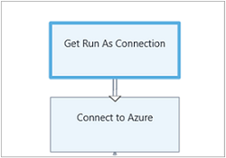

The `Get Run As Connection` activity, or `Get-AutomationConnection`, is configured with a constant value data source named `AzureRunAsConnection`.

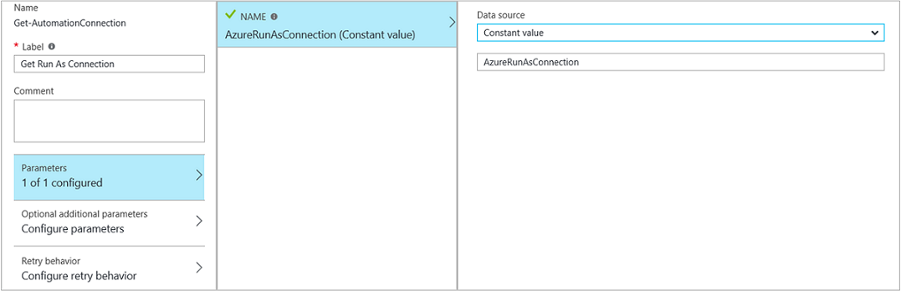

The next activity, `Connect-AzAccount`, adds the authenticated Run As account for use in the runbook.

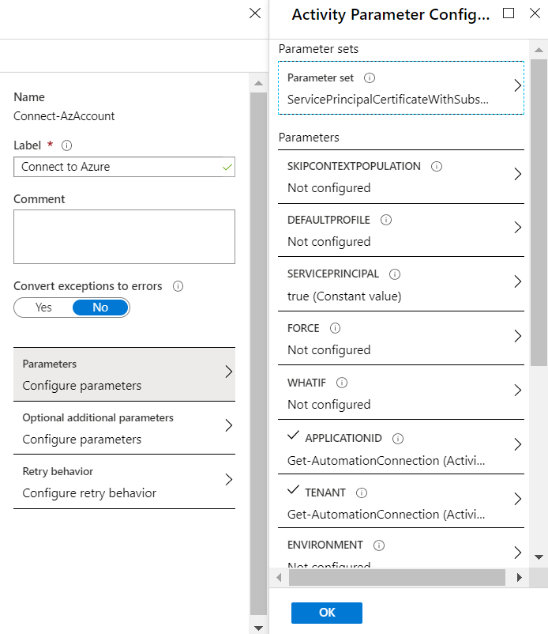

>[!NOTE]
>For PowerShell runbooks, `Add-AzAccount` and `Add-AzureRMAccount` are aliases for `Connect-AzAccount`. Note that these aliases are not available for your graphical runbooks. A graphical runbook can only use `Connect-AzAccount` itself.

For the parameter fields **APPLICATIONID**, **CERTIFICATETHUMBPRINT**, and **TENANTID**, specify the name of the property for the field path, since the activity outputs an object with multiple properties. Otherwise, when the runbook executes, it fails while attempting to authenticate. This is what you need at a minimum to authenticate your runbook with the Run As account.

Some subscribers create an Automation account using an [Azure AD user account](automation-create-aduser-account.md) to manage Azure classic deployment or for Azure Resource Manager resources. To maintain backward compatibility for these subscribers, the authentication mechanism to use in your runbook is the `Add-AzureAccount` cmdlet with a [credential asset](automation-credentials.md). The asset represents an Active Directory user with access to the Azure account.

You can enable this functionality for your graphical runbook by adding a credential asset to the canvas, followed by an `Add-AzureAccount` activity that uses the credential asset for its input. See the following example.

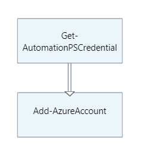

The runbook must authenticate at its start and after each checkpoint. Thus you must use an `Add-AzureAccount` activity after any `Checkpoint-Workflow` activity. You do not need to use an additional credential activity.

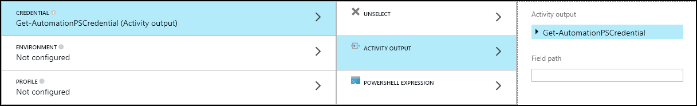

## Export a graphical runbook

You can only export the published version of a graphical runbook. If the runbook has not yet been published, the **Export** button is disabled. When you click the **Export** button, the runbook downloads to your local computer. The name of the file matches the name of the runbook with a **.graphrunbook** extension.

## Import a graphical runbook

You can import a graphical or graphical PowerShell Workflow runbook file by selecting the **Import** option when adding a runbook. When you select the file to import, you can keep the same name or provide a new one. The **Runbook Type** field displays the type of runbook after it assesses the file selected. If you attempt to select a different type that is not correct, the graphical editor presents a message noting that there are potential conflicts and there might be syntax errors during conversion.

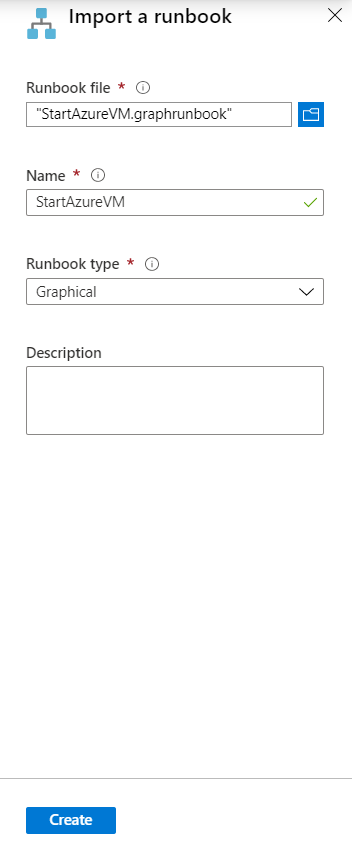

## Test a graphical runbook

Each graphical runbook in Azure Automation has a Draft version and a Published version. You can run only the Published version, while you can only edit the Draft version. The Published version is unaffected by any changes to the Draft version. When the Draft version is ready for use, you publish it, which overwrites the current Published version with your Draft version.

You can test the Draft version of a runbook in the Azure portal while leaving the Published version unchanged. Alternatively, you can test a new runbook before it has been published so that you can verify that the runbook works correctly before any version replacements. Testing of a runbook executes the Draft version and ensures that any actions that it performs are completed. No job history is created, but the Test Output pane displays the output.

Open the Test control for your graphical runbook by opening the runbook for edit and then clicking **Test pane**. The Test control prompts for input parameters, and you can start the runbook by clicking **Start**.

## Publish a graphical runbook

Publish a graphical runbook by opening the runbook for editing and then clicking **Publish**. Possible statuses for the runbook are:

* New -- the runbook has not been published yet. 
* Published -- the runbook has been published.
* In edit -- the runbook has been edited after it has been published, and the Draft and Published versions are different.

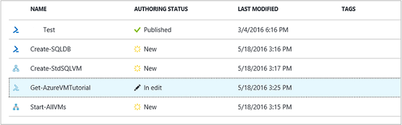

You have the option to revert to the Published version of a runbook. This operation throws away any changes made since the runbook was last published. It replaces the Draft version of the runbook with the Published version.

## Next steps

* To get started with graphical runbooks, see [Tutorial: Create a graphical runbook](learn/automation-tutorial-runbook-graphical.md).
* To know more about runbook types and their advantages and limitations, see [Azure Automation runbook types](automation-runbook-types.md).
* To understand how to authenticate using the Automation Run As account, see [Run As account](automation-security-overview.md#run-as-account).
* For a PowerShell cmdlet reference, see [Az.Automation](https://docs.microsoft.com/powershell/module/az.automation/?view=azps-3.7.0#automation).
