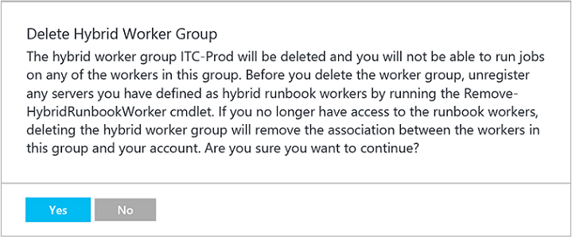

# Automate resources in your datacenter or cloud by using Hybrid Runbook Worker

Runbooks in Azure Automation might not have access to resources in other clouds or in your on-premises environment because they run on the Azure cloud platform. You can use the Hybrid Runbook Worker feature of Azure Automation to run runbooks directly on the computer that's hosting the role and against resources in the environment to manage those local resources. Runbooks are stored and managed in Azure Automation and then delivered to one or more assigned computers.

The following image illustrates this functionality:


Each Hybrid Runbook Worker is a member of a Hybrid Runbook Worker group that you specify when you install the agent. A group can include a single agent, but you can install multiple agents in a group for high availability. Each machine can host one Hybrid Worker reporting to one Automation Account.

When you start a runbook on a Hybrid Runbook Worker, you specify the group that it runs on. Each worker in the group polls Azure Automation to see if any jobs are available. If a job is available, the first worker to get the job takes it. The processing time of the jobs queue depends on the Hybrid worker hardware profile and load. You can't specify a particular worker. Hybrid Runbook Workers don't share many of the limits that Azure sandboxes have. They don't have the same limits on disk space, memory, or network sockets. Hybrid Runbook Workers are only limited by the resources on the Hybrid Runbook Worker itself. In addition, Hybrid Runbook Workers do not share the 180 minute [fair share](automation-runbook-execution.md#fair-share) time limit that Azure sandboxes do. To learn more about the service limits for Azure sandboxes and Hybrid Runbook Workers, see the job [limits](../azure-resource-manager/management/azure-subscription-service-limits.md#automation-limits) page.

## Install a Hybrid Runbook Worker

The process to install a Hybrid Runbook Worker depends on the OS. The following table contains links to the methods that you can use for the installation.

To install and configure a Windows Hybrid Runbook Worker, you can use two methods. The recommended method is using an Automation runbook to completely automate the process of configuring a Windows computer. The second method is following a step-by-step procedure to manually install and configure the role. For Linux machines, you run a Python script to install the agent on the machine.

|OS  |Deployment types  |
|---------|---------|
|Windows     | [PowerShell](automation-windows-hrw-install.md#automated-deployment)<br>[Manual](automation-windows-hrw-install.md#manual-deployment)        |
|Linux     | [Python](automation-linux-hrw-install.md#installing-a-linux-hybrid-runbook-worker)        |

> [!NOTE]
> To manage the configuration of your servers that support the Hybrid Runbook Worker role with Desired State Configuration (DSC), you need to add them as DSC nodes. For more information about onboarding them for management with DSC, see [Onboarding machines for management by Azure Automation DSC](automation-dsc-onboarding.md).
>
>If you enable the [Update Management solution](automation-update-management.md), any computer that's connected to your Azure Log Analytics workspace is automatically configured as a Hybrid Runbook Worker to support runbooks included in this solution. However, the computer is not registered with any Hybrid Worker groups already defined in your Automation account. The computer can be added to a Hybrid Runbook Worker group in your Automation account to support Automation runbooks as long as you're using the same account for both the solution and the Hybrid Runbook Worker group membership. This functionality has been added to version 7.2.12024.0 of Hybrid Runbook Worker.

Review the [information for planning your network](#network-planning) before you begin deploying a Hybrid Runbook Worker. After you successfully deploy the worker, review [Run runbooks on a Hybrid Runbook Worker](automation-hrw-run-runbooks.md) to learn how to configure your runbooks to automate processes in your on-premises datacenter or other cloud environment.

The computer can be added to a Hybrid Runbook Worker group in your Automation account to support Automation runbooks as long as you're using the same account for both the solution and the Hybrid Runbook Worker group membership. This functionality has been added to version 7.2.12024.0 of the Hybrid Runbook Worker.

## Remove a Hybrid Runbook Worker

You can remove one or more Hybrid Runbook Workers from a group, or you can remove the group, depending on your requirements. To remove a Hybrid Runbook Worker from an on-premises computer, use the following steps:

1. In the Azure portal, go to your Automation account.
2. Under **Account Settings**, select **Keys** and note the values for **URL** and **Primary Access Key**. You need this information for the next step.

### Windows

Open a PowerShell session in Administrator mode and run the following command. Use the **-Verbose** switch for a detailed log of the removal process.

```powershell-interactive
Remove-HybridRunbookWorker -url <URL> -key <PrimaryAccessKey>
```

To remove stale machines from your Hybrid Worker group, use the optional `machineName` parameter.

```powershell-interactive
Remove-HybridRunbookWorker -url <URL> -key <PrimaryAccessKey> -machineName <ComputerName>
```

### Linux

You can use the command `ls /var/opt/microsoft/omsagent` on the Hybrid Runbook Worker to get the workspaceid. There is a folder in the directory in which the name of the folder is the workspace Id.

```bash
sudo python onboarding.py --deregister --endpoint="<URL>" --key="<PrimaryAccessKey>" --groupname="Example" --workspaceid="<workspaceId>"
```

> [!NOTE]
> This code does not remove the Microsoft Monitoring Agent from the computer, only the functionality and configuration of the Hybrid Runbook Worker role.

## Remove a Hybrid Worker group

To remove a group, you first need to remove the Hybrid Runbook Worker from every computer that is a member of the group by using the procedure shown earlier. Then, use the following steps to remove the group:

1. Open the Automation account in the Azure portal.
2. Under **Process Automation**, select **Hybrid worker groups**. Select the group that you want to delete. The properties page for that group appears.

   

3. On the properties page for the selected group, select **Delete**. A message asks you to confirm this action. Select **Yes** if you're sure that you want to continue.

   

   This process can take several seconds to finish. You can track its progress under **Notifications** from the menu.

## <a name="network-planning"></a>Configure your network

### Hybrid Worker role

For the Hybrid Runbook Worker to connect to and register with Azure Automation, it must have access to the port number and the URLs that are described in this section. This access is on top to the [ports and URLs required for Microsoft Monitoring Agent](../azure-monitor/platform/agent-windows.md) to connect to Azure Monitor logs.

[!INCLUDE [azure-monitor-log-analytics-rebrand](../../includes/azure-monitor-log-analytics-rebrand.md)]

If you use a proxy server for communication between the agent and the Azure Automation service, ensure that the appropriate resources are accessible. The timeout for requests from the Hybrid Runbook Worker and the Automation services is 30 seconds. After 3 attempts the request will fail. If you use a firewall to restrict access to the internet, you must configure your firewall to permit access. If you use the Log Analytics gateway as a proxy, ensure it is configured for hybrid workers. For instructions on how to do this, see [Configure the Log Analytics gateway for Automation Hybrid Workers](https://docs.microsoft.com/azure/log-analytics/log-analytics-oms-gateway).

The following port and URLs are required for the Hybrid Runbook Worker role to communicate with Automation:

* Port: Only TCP 443 is required for outbound internet access.
* Global URL: *.azure-automation.net
* Global URL of US Gov Virginia: *.azure-automation.us
* Agent service: https://\<workspaceId\>.agentsvc.azure-automation.net

It is recommended to use the addresses listed when defining exceptions. For IP addresses you can download the [Microsoft Azure Datacenter IP Ranges](https://www.microsoft.com/en-us/download/details.aspx?id=56519). This file is updated weekly, and has the currently deployed ranges and any upcoming changes to the IP ranges.

If you have an Automation account that's defined for a specific region, you can restrict communication to that regional datacenter. The following table provides the DNS record for each region:

| **Region** | **DNS record** |
| --- | --- |
| West Central US | wcus-jobruntimedata-prod-su1.azure-automation.net</br>wcus-agentservice-prod-1.azure-automation.net |
| South Central US |scus-jobruntimedata-prod-su1.azure-automation.net</br>scus-agentservice-prod-1.azure-automation.net |
| East US 2 |eus2-jobruntimedata-prod-su1.azure-automation.net</br>eus2-agentservice-prod-1.azure-automation.net |
| West US 2 |wus2-jobruntimedata-prod-su1.azure-automation.net</br>wus2-agentservice-prod-1.azure-automation.net |
| Canada Central |cc-jobruntimedata-prod-su1.azure-automation.net</br>cc-agentservice-prod-1.azure-automation.net |
| West Europe |we-jobruntimedata-prod-su1.azure-automation.net</br>we-agentservice-prod-1.azure-automation.net |
| North Europe |ne-jobruntimedata-prod-su1.azure-automation.net</br>ne-agentservice-prod-1.azure-automation.net |
| South East Asia |sea-jobruntimedata-prod-su1.azure-automation.net</br>sea-agentservice-prod-1.azure-automation.net|
| Central India |cid-jobruntimedata-prod-su1.azure-automation.net</br>cid-agentservice-prod-1.azure-automation.net |
| Japan East |jpe-jobruntimedata-prod-su1.azure-automation.net</br>jpe-agentservice-prod-1.azure-automation.net |
| Australia Central |ac-jobruntimedata-prod-su1.azure-automation.net</br>ac-agentservice-prod-1.azure-automation.net |
| Australia East |ae-jobruntimedata-prod-su1.azure-automation.net</br>ae-agentservice-prod-1.azure-automation.net |
| Australia South East |ase-jobruntimedata-prod-su1.azure-automation.net</br>ase-agentservice-prod-1.azure-automation.net |
| UK South | uks-jobruntimedata-prod-su1.azure-automation.net</br>uks-agentservice-prod-1.azure-automation.net |
| US Gov Virginia | usge-jobruntimedata-prod-su1.azure-automation.us<br>usge-agentservice-prod-1.azure-automation.us |

For a list of region IP addresses instead of region names, download the [Azure Datacenter IP address](https://www.microsoft.com/download/details.aspx?id=41653) XML file from the Microsoft Download Center.

> [!NOTE]
> The Azure Datacenter IP address XML file lists the IP address ranges that are used in the Microsoft Azure datacenters. The file includes compute, SQL, and storage ranges.
>
>An updated file is posted weekly. The file reflects the currently deployed ranges and any upcoming changes to the IP ranges. New ranges that appear in the file aren't used in the datacenters for at least one week.
>
> It's a good idea to download the new XML file every week. Then, update your site to correctly identify services running in Azure. Azure ExpressRoute users should note that this file is used to update the Border Gateway Protocol (BGP) advertisement of Azure space in the first week of each month.

### Update Management

On top of the standard addresses and ports that the Hybrid Runbook Worker requires, the following addresses are required specifically for Update Management. Communication to these addresses is done over port 443.

|Azure Public  |Azure Government  |
|---------|---------|
|*.ods.opinsights.azure.com     |*.ods.opinsights.azure.us         |
|*.oms.opinsights.azure.com     | *.oms.opinsights.azure.us        |
|*.blob.core.windows.net|*.blob.core.usgovcloudapi.net|

## Next steps

* To learn how to configure your runbooks to automate processes in your on-premises datacenter or other cloud environment, see [Run runbooks on a Hybrid Runbook Worker](automation-hrw-run-runbooks.md).
* To learn how to troubleshoot your Hybrid Runbook Workers, see [Troubleshooting Hybrid Runbook Workers](troubleshoot/hybrid-runbook-worker.md#general)

