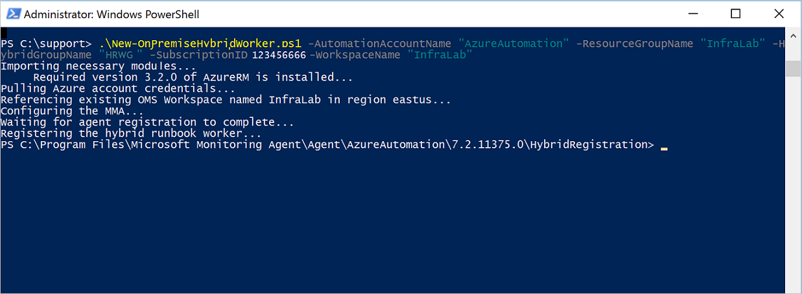

# Automate resources in your data center with Hybrid Runbook Worker
Runbooks in Azure Automation cannot access resources in your local data center since they run in the Azure cloud.  The Hybrid Runbook Worker feature of Azure Automation allows you to run runbooks on machines located in your data center to manage local resources. The runbooks are stored and managed in Azure Automation and then delivered to one or more on-premises machines.  

This functionality is illustrated in the following image:   

You can designate one or more computers in your data center to act as a Hybrid Runbook Worker and run runbooks from Azure Automation.  Each worker requires the Microsoft Management Agent with a connection to Microsoft Operations Management Suite and the Azure Automation runbook environment.  Operations Management Suite is only used to install and maintain the management agent and to monitor the functionality of the worker.  The delivery of runbooks and the instruction to run them are performed by Azure Automation.

There are no inbound firewall requirements to support Hybrid Runbook Workers. The agent on the local computer initiates all communication with Azure Automation in the cloud. When a runbook is started, Azure Automation creates an instruction that is retrieved by agent. The agent then pulls down the runbook and any parameters before running it.  It also retrieves [assets](http://msdn.microsoft.com/library/dn939988.aspx) that are used by the runbook from Azure Automation.

> [!NOTE]
> To manage the configuration of your servers supporting the Hybrid Runbook Worker role with Desired State Configuration (DSC), you need to add them as DSC nodes.  For more information about onboarding them for management with DSC, see [Onboarding machines for management by Azure Automation DSC](automation-dsc-onboarding.md).           
> 
>If you enable the [Update Management solution](../operations-management-suite/oms-solution-update-management.md), any Windows computer connected to your OMS workspace is  automatically configured as a Hybrid Runbook Worker to support runbooks included in this solution.  However, it is not registered with any Hybrid Worker groups already defined in your Automation account.  The computer can be added to a Hybrid Runbook Worker group in your Automation account to support Automation runbooks as long as you are using the same account for both the solution and Hybrid Runbook Worker group membership.  This functionality has been added to version 7.2.12024.0 of the Hybrid Runbook Worker.  

## Hybrid Runbook Worker groups
Each Hybrid Runbook Worker is a member of a Hybrid Runbook Worker group that you specify when you install the agent.  A group can include a single agent, but you can install multiple agents in a group for high availability.

When you start a runbook on a Hybrid Runbook Worker, you specify the group that it runs on.  The members of the group determine which worker services the request.  You cannot specify a particular worker.

## Hybrid Runbook Worker requirements
You designate at least one on-premises computer to run hybrid runbook jobs.  This computer must have the following:

* Windows Server 2012 or later
* Windows PowerShell 4.0 or later.  We recommend installing Windows PowerShell 5.0 on the computer for increased reliability. You can download the latest version from the [Microsoft Download Center](https://www.microsoft.com/download/details.aspx?id=50395)
* Minimum of 2 cores and 4 GB of RAM

Consider the following recommendations for hybrid workers:

* Designate multiple hybrid workers in each group for high availability.  
* Hybrid workers can coexist with Service Management Automation or System Center Orchestrator runbook servers.
* Consider using a computer physically located in or near the region of your Automation account since the job data is sent back to Azure Automation when a job completes.

### Configure proxy and firewall settings
For the on-premise Hybrid Runbook Worker to connect to and register with the Microsoft Operations Management Suite (OMS) service, it must have access to the port number and the URLs described below.  This is in addition to the [ports and URLs required for the Microsoft Monitoring Agent](../log-analytics/log-analytics-windows-agents.md#network) to connect to OMS. If you use a proxy server for communication between the agent and the OMS service, you need to ensure that the appropriate resources are accessible. If you use a firewall to restrict access to the Internet, you need to configure your firewall to permit access.

The information below list the port and URLs that are required for the Hybrid Runbook Worker to communicate with Automation.

* Port:  Only TCP 443 is required for outbound Internet access
* Global URL:  *.azure-automation.net

If you have an Automation account defined for a specific region and you want to restrict communication with that regional datacenter, the following table provides the DNS record for each region.

| **Region** | **DNS Record** |
| --- | --- |
| South Central US |scus-jobruntimedata-prod-su1.azure-automation.net |
| East US 2 |eus2-jobruntimedata-prod-su1.azure-automation.net |
| West Central US | wcus-jobruntimedata-prod-su1.azure-automation.net |
| West Europe |we-jobruntimedata-prod-su1.azure-automation.net |
| North Europe |ne-jobruntimedata-prod-su1.azure-automation.net |
| Canada Central |cc-jobruntimedata-prod-su1.azure-automation.net |
| South East Asia |sea-jobruntimedata-prod-su1.azure-automation.net |
| Central India |cid-jobruntimedata-prod-su1.azure-automation.net |
| Japan East |jpe-jobruntimedata-prod-su1.azure-automation.net |
| Australia South East |ase-jobruntimedata-prod-su1.azure-automation.net |
| UK South | uks-jobruntimedata-prod-su1.azure-automation.net |
| US Gov Virginia | usge-jobruntimedata-prod-su1.azure-automation.us |

For a list of IP addresses instead of names, download and review the [Azure Datacenter IP address](https://www.microsoft.com/download/details.aspx?id=41653) xml file from the Microsoft Download Center. 

> [!NOTE]
> This file contains the IP address ranges (including Compute, SQL and Storage ranges) used in the Microsoft Azure Datacenters. An updated file is posted weekly which reflects the currently deployed ranges and any upcoming changes to the IP ranges. New ranges appearing in the file will not be used in the datacenters for at least one week. Please download the new xml file every week and perform the necessary changes on your site to correctly identify services running in Azure. Express Route users may note this file used to update the BGP advertisement of Azure space in the first week of each month. 
> 

## Installing Hybrid Runbook Worker

To install and configure a Hybrid Runbook Worker, there are two methods available.  The recommended method is using an Automation runbook to completely automate the process required to configure a Windows computer.  The second method is following a step-by-step procedure to manually install and configure the role.  

### Automated deployment

Perform the following steps to automate the installation and configuration of the Hybrid Worker role.  

1. Download the *New-OnPremiseHybridWorker.ps1* script from the [PowerShell Gallery](https://www.powershellgallery.com/packages/New-OnPremiseHybridWorker/1.0/DisplayScript) directly from the computer running the Hybrid Runbook Worker role or from another computer in your environment and copy it to the worker.  

    The *New-OnPremiseHybridWorker.ps1* script requires the following parameters during execution:

  * *AutomationAccountName* (mandatory) - the name of your Automation account.  
  * *ResourceGroupName* (mandatory) - the name of the resource group associated with your Automation account.  
  * *HybridGroupName* (mandatory) - the name of a Hybrid Runbook Worker group that you specify as a target for the runbooks supporting this scenario. 
  *  *SubscriptionID* (mandatory) - the Azure Subscription Id that your Automation account is in.
  *  *WorkspaceName* (optional) - the OMS workspace name.  If you do not have an OMS workspace, the script creates and configures one.  

     > [!NOTE]
     > Currently the only Automation regions supported for integration with OMS are - **Australia Southeast**, **East US 2**, **Southeast Asia**, and **West Europe**.  If your Automation account is not in one of those regions, the script creates an OMS workspace but it warns you that it cannot link them together.
     > 
2. On your computer, start **Windows PowerShell** from the **Start** screen in Administrator mode.  
3. From the PowerShell command-line shell, navigate to the folder, which contains the script you downloaded and execute it changing the values for parameters *-AutomationAccountName*, *-ResourceGroupName*, *-HybridGroupName*, *-SubscriptionId*, and *-WorkspaceName*.

     > [!NOTE] 
     > You are prompted to authenticate with Azure after you execute the script.  You **must** sign in with an account that is a member of the Subscription Admins role and co-administrator of the subscription.  
     >  
    
        .\New-OnPremiseHybridWorker.ps1 -AutomationAccountName <NameofAutomationAccount> `
        -ResourceGroupName <NameofOResourceGroup> -HybridGroupName <NameofHRWGroup> `
        -SubscriptionId <AzureSubscriptionId> -WorkspaceName <NameOfOMSWorkspace>

4. You are prompted to agree to install **NuGet** and you are prompted to authenticate with your Azure credentials.   

5. After the script is complete, the Hybrid Worker Groups blade will show the new group and number of members or if an existing group, the number of members is incremented.  You can select the group from the list on the **Hybrid Worker Groups** blade and select the **Hybrid Workers** tile.  On the **Hybrid Workers** blade, you see each member of the group listed.  

### Manual deployment 
Perform the first two steps once for your Automation environment and then repeat the remaining steps for each worker computer.

#### 1. Create Operations Management Suite workspace
If you do not already have an Operations Management Suite workspace, then create one using instructions at [Manage your workspace](../log-analytics/log-analytics-manage-access.md). You can use an existing workspace if you already have one.

#### 2. Add Automation solution to Operations Management Suite workspace
Solutions add functionality to Operations Management Suite.  The Automation solution adds functionality for Azure Automation including support for Hybrid Runbook Worker.  When you add the solution to your workspace, it automatically pushes down worker components to the agent computer that you will install in the next step.

Follow the instructions at [To add a solution using the Solutions Gallery](../log-analytics/log-analytics-add-solutions.md) to add the **Automation** solution to your Operations Management Suite workspace.

#### 3. Install the Microsoft Monitoring Agent
The Microsoft Monitoring Agent connects computers to Operations Management Suite.  When you install the agent on your on-premises computer and connect it to your workspace, it will automatically download the components required for Hybrid Runbook Worker.

Follow the instructions at [Connect Windows computers to Log Analytics](../log-analytics/log-analytics-windows-agents.md) to install the agent on the on-premises computer.  You can repeat this process for multiple computers to add multiple workers to your environment.

When the agent has successfully connected to Operations Management Suite, it will be listed on the **Connected Sources** tab of the Operations Management Suite **Settings** pane.  You can verify that the agent has correctly downloaded the Automation solution when it has a folder called **AzureAutomationFiles** in C:\Program Files\Microsoft Monitoring Agent\Agent.  To confirm the version of the Hybrid Runbook Worker, you can navigate to C:\Program Files\Microsoft Monitoring Agent\Agent\AzureAutomation\ and note the \\*version* subfolder.   

#### 4. Install the runbook environment and connect to Azure Automation
When you add an agent to Operations Management Suite, the Automation solution pushes down the **HybridRegistration** PowerShell module, which contains the **Add-HybridRunbookWorker** cmdlet.  You use this cmdlet to install the runbook environment on the computer and register it with Azure Automation.

Open a PowerShell session in Administrator mode and run the following commands to import the module.

    cd "C:\Program Files\Microsoft Monitoring Agent\Agent\AzureAutomation\<version>\HybridRegistration"
    Import-Module HybridRegistration.psd1

Then run the **Add-HybridRunbookWorker** cmdlet using the following syntax:

    Add-HybridRunbookWorker –Name <String> -EndPoint <Url> -Token <String>

You can get the information required for this cmdlet from the **Manage Keys** blade in the Azure portal.  Open this blade by selecting the **Keys** option from the **Settings** blade in your Automation account.

* **Name** is the name of the Hybrid Runbook Worker Group. If this group already exists in the automation account, then the current computer is added to it.  If it does not already exist, then it is added.
* **EndPoint** is the **URL** field in the **Manage Keys** blade.
* **Token** is the **Primary Access Key** in the **Manage Keys** blade.  

Use the **-Verbose** switch with **Add-HybridRunbookWorker** to receive detailed information about the installation.

#### 5. Install PowerShell modules
Runbooks can use any of the activities and cmdlets defined in the modules installed in your Azure Automation environment.  These modules are not automatically deployed to on-premises computers though, so you must install them manually.  The exception is the Azure module, which is installed by default providing access to cmdlets for all Azure services and activities for Azure Automation.

Since the primary purpose of the Hybrid Runbook Worker feature is to manage local resources, you most likely need to install the modules that support these resources.  You can refer to [Installing Modules](http://msdn.microsoft.com/library/dd878350.aspx) for information on installing Windows PowerShell modules.  Modules that are installed must be in a location referenced by PSModulePath environment variable so that they are automatically imported by the Hybrid worker.  For further information, see [Modifying the PSModulePath Installation Path](https://msdn.microsoft.com/library/dd878326%28v=vs.85%29.aspx). 

## Removing Hybrid Runbook Worker 
You can remove one or more Hybrid Runbook Workers from a group or you can remove the group, depending on your requirements.  To remove a Hybrid Runbook Worker from an on-premises computer, perform the following steps.

1. In the Azure portal, navigate to your Automation account.  
2. From the **Settings** blade, select **Keys** and note the values for field **URL** and **Primary Access Key**.  You need this information for the next step.
3. Open a PowerShell session in Administrator mode and run the following command - `Remove-HybridRunbookWorker -url <URL> -key <PrimaryAccessKey>`.  Use the **-Verbose** switch for a detailed log of the removal process.

> [!NOTE]
> This does not remove the Microsoft Monitoring Agent from the computer, only the functionality and configuration of the Hybrid Runbook Worker role.  

## Remove Hybrid Worker groups
To remove a group, you first need to remove the Hybrid Runbook Worker from every computer that is a member of the group using the procedure shown earlier, and then you perform the following steps to remove the group.  

1. Open the Automation account in the Azure portal.
2. Select the **Hybrid Worker Groups** tile and in the **Hybrid Worker Groups** blade, select the group you wish to delete.  After selecting the specific group, the **Hybrid worker group** properties blade is displayed.     
3. On the properties blade for the selected group, click **Delete**.  A message appears asking you to confirm this action, select **Yes** if you are sure you want to proceed.    This process can take several seconds to complete and you can track its progress under **Notifications** from the menu.  

## Starting runbooks on Hybrid Runbook Worker
[Starting a Runbook in Azure Automation](automation-starting-a-runbook.md) describes different methods for starting a runbook.  Hybrid Runbook Worker adds a **RunOn** option where you can specify the name of a Hybrid Runbook Worker Group.  If a group is specified, then the runbook is retrieved and run by of the workers in that group.  If this option is not specified, then it is run in Azure Automation as normal.

When you start a runbook in the Azure portal, you are presented with a **Run on** option where you can select **Azure** or **Hybrid Worker**.  If you select **Hybrid Worker**, then you can select the group from a dropdown.

Use the **RunOn** parameter.  You can use the following command to start a runbook named Test-Runbook on a Hybrid Runbook Worker Group named MyHybridGroup using Windows PowerShell.

    Start-AzureRmAutomationRunbook –AutomationAccountName "MyAutomationAccount" –Name "Test-Runbook" -RunOn "MyHybridGroup"

> [!NOTE]
> The **RunOn** parameter was added to the **Start-AzureAutomationRunbook** cmdlet in version 0.9.1 of Microsoft Azure PowerShell.  You should [download the latest version](https://azure.microsoft.com/downloads/) if you have an earlier one installed.  You only need to install this version on a workstation where you are starting the runbook from Windows PowerShell.  You do not need to install it on the worker computer unless you intend to start runbooks from that computer.  You cannot currently start a runbook on a Hybrid Runbook Worker from another runbook since this would require the latest version of Azure Powershell to be installed in your Automation account.  The latest version is automatically updated in Azure Automation and automatically pushed down to the workers soon.
>
>

## Runbook permissions
Runbooks running on a Hybrid Runbook Worker cannot use the same method that is typically used for runbooks authenticating to Azure resources, since they are accessing resources outside of Azure.  The runbook can either provide its own authentication to local resources, or you can specify a RunAs account to provide a user context for all runbooks.

### Runbook authentication
By default, runbooks will run in the context of the local System account on the on-premises computer, so they must provide their own authentication to resources that they will access.  

You can use [Credential](http://msdn.microsoft.com/library/dn940015.aspx) and [Certificate](http://msdn.microsoft.com/library/dn940013.aspx) assets in your runbook with cmdlets that allow you to specify credentials so you can authenticate to different resources.  The following example shows a portion of a runbook that restarts a computer.  It retrieves credentials from a credential asset and the name of the computer from a variable asset and then uses these values with the Restart-Computer cmdlet.

    $Cred = Get-AzureRmAutomationCredential -ResourceGroupName "ResourceGroup01" -Name "MyCredential"
    $Computer = Get-AzureRmAutomationVariable -ResourceGroupName "ResourceGroup01" -Name  "ComputerName"

    Restart-Computer -ComputerName $Computer -Credential $Cred

You can also leverage [InlineScript](automation-powershell-workflow.md#inlinescript), which  allows you to run blocks of code on another computer with credentials specified by the [PSCredential common parameter](http://technet.microsoft.com/library/jj129719.aspx).

### RunAs account
Instead of having runbooks provide their own authentication to local resources, you can specify a **RunAs** account for a Hybrid worker group.  You specify a [credential asset](automation-credentials.md) that has access to local resources, and all runbooks run under these credentials when running on a Hybrid Runbook Worker in the group.  

The user name for the credential must be in one of the following formats:

* domain\username
* username@domain
* username (for accounts local to the on-premises computer)

Use the following procedure to specify a RunAs account for a Hybrid worker group:

1. Create a [credential asset](automation-credentials.md) with access to local resources.
2. Open the Automation account in the Azure portal.
3. Select the **Hybrid Worker Groups** tile, and then select the group.
4. Select **All settings** and then **Hybrid worker group settings**.
5. Change **Run As** from **Default** to **Custom**.
6. Select the credential and click **Save**.

### Automation Run As account
As part of your automated build process for deploying resources in Azure, you may require interrogating on-premise systems to support a task or set of steps in your deployment sequence.  To support authentication against Azure using the Run As account, you need to install the Run As account certificate.  

The following PowerShell runbook, *Export-RunAsCertificateToHybridWorker*, exports the Run As certificate from your Azure Automation account and downloads and imports it into the local machine certificate store on a Hybrid worker connected to the same account.  Once that step is completed, it verifies the worker can successfully authenticate to Azure using the Run As account.

    <#PSScriptInfo
    .VERSION 1.0
    .GUID 3a796b9a-623d-499d-86c8-c249f10a6986
    .AUTHOR Azure Automation Team
    .COMPANYNAME Microsoft
    .COPYRIGHT 
    .TAGS Azure Automation 
    .LICENSEURI 
    .PROJECTURI 
    .ICONURI 
    .EXTERNALMODULEDEPENDENCIES 
    .REQUIREDSCRIPTS 
    .EXTERNALSCRIPTDEPENDENCIES 
    .RELEASENOTES
    #>

    <#  
    .SYNOPSIS  
    Exports the Run As certificate from an Azure Automation account to a hybrid worker in that account. 
  
    .DESCRIPTION  
    This runbook exports the Run As certificate from an Azure Automation account to a hybrid worker in that account.
    Run this runbook in the hybrid worker where you want the certificate installed.
    This allows the use of the AzureRunAsConnection to authenticate to Azure and manage Azure resources from runbooks running in the hybrid worker.

    .EXAMPLE
    .\Export-RunAsCertificateToHybridWorker

    .NOTES
    AUTHOR: Azure Automation Team 
    LASTEDIT: 2016.10.13
    #>

    [OutputType([string])] 

    # Set the password used for this certificate
    $Password = "YourStrongPasswordForTheCert"

    # Stop on errors
    $ErrorActionPreference = 'stop'

    # Get the management certificate that will be used to make calls into Azure Service Management resources
    $RunAsCert = Get-AutomationCertificate -Name "AzureRunAsCertificate"
       
    # location to store temporary certificate in the Automation service host
    $CertPath = Join-Path $env:temp  "AzureRunAsCertificate.pfx"
   
    # Save the certificate
    $Cert = $RunAsCert.Export("pfx",$Password)
    Set-Content -Value $Cert -Path $CertPath -Force -Encoding Byte | Write-Verbose 

    Write-Output ("Importing certificate into $env:computername local machine root store from " + $CertPath)
    $SecurePassword = ConvertTo-SecureString $Password -AsPlainText -Force
    Import-PfxCertificate -FilePath $CertPath -CertStoreLocation Cert:\LocalMachine\My -Password $SecurePassword -Exportable | Write-Verbose

    # Test that authentication to Azure Resource Manager is working
    $RunAsConnection = Get-AutomationConnection -Name "AzureRunAsConnection" 
    
    Add-AzureRmAccount `
      -ServicePrincipal `
      -TenantId $RunAsConnection.TenantId `
      -ApplicationId $RunAsConnection.ApplicationId `
      -CertificateThumbprint $RunAsConnection.CertificateThumbprint | Write-Verbose

    Set-AzureRmContext -SubscriptionId $RunAsConnection.SubscriptionID | Write-Verbose

    # List automation accounts to confirm Azure Resource Manager calls are working
    Get-AzureRmAutomationAccount | Select AutomationAccountName

Save the *Export-RunAsCertificateToHybridWorker* runbook to your computer with a `.ps1` extension.  Import it into your Automation account and edit the runbook, changing the value of the variable `$Password` with your own password.  Publish and then run the runbook targeting the Hybrid Worker group that run and authenticate runbooks using the Run As account.  The job stream reports the attempt to import the certificate into the local machine store, and follows with multiple lines depending on how many Automation accounts are defined in your subscription and if authentication is successful.  

## Creating runbooks for Hybrid Runbook Worker
There is no difference in the structure of runbooks that run in Azure Automation and those that run on a Hybrid Runbook Worker. Runbooks that you use with each most likely differ significantly though since runbooks for Hybrid Runbook Worker typically manage local resources in your data center, while runbooks in Azure Automation typically manage resources in the Azure cloud.

You can edit a runbook for Hybrid Runbook Worker in Azure Automation, but you may have difficulties if you try to test the runbook in the editor.  The PowerShell modules that access the local resources may not be installed in your Azure Automation environment in which case, the test would fail.  If you do install the required modules, then the runbook will run, but it will not be able to access local resources for a complete test.

## Troubleshooting runbooks on Hybrid Runbook Worker
[Runbook output and messages](automation-runbook-output-and-messages.md) are sent to Azure Automation from hybrid workers just like runbook jobs run in the cloud.  You can also enable the Verbose and Progress streams the same way you would for other runbooks.  

Logs are stored locally on each hybrid worker at C:\ProgramData\Microsoft\System Center\Orchestrator\7.2\SMA\Sandboxes.

If your runbooks are not completing successfully and the job summary shows a status of **Suspended**, please review the troubleshooting article [Hybrid Runbook Worker: A runbook job terminates with a status of Suspended](automation-troubleshooting-hrw-runbook-terminates-suspended.md).   

## Relationship to Service Management Automation
[Service Management Automation (SMA)](https://technet.microsoft.com/library/dn469260.aspx) allows you to run the same runbooks that are supported by Azure Automation in your local data center. SMA is generally deployed together with Windows Azure Pack, as Windows Azure Pack contains a graphical interface for SMA management. Unlike Azure Automation, SMA requires a local installation that includes web servers to host the API, a database to contain runbooks and SMA configuration, and Runbook Workers to execute runbook jobs. Azure Automation provides these services in the cloud and only requires you to maintain the Hybrid Runbook Workers in your local environment.

If you are an existing SMA user, you can move your runbooks to Azure Automation to be used with Hybrid Runbook Worker with no changes, assuming that they perform their own authentication to resources as described in [Creating runbooks for Hybrid Runbook Worker](#creating-runbooks-for-hybrid-runbook-worker).  Runbooks in SMA run in the context of the service account on the worker server which may provide that authentication for the runbooks.

You can use the following criteria to determine whether Azure Automation with Hybrid Runbook Worker or Service Management Automation is more appropriate for your requirements.

* SMA requires a local installation of its underlying components that are connected to Windows Azure Pack if a graphical management interface is required. More local resources are needed with higher maintenance costs than Azure Automation, which only needs an agent installed on local runbook workers. The agents are managed by Operations Management Suite, further decreasing your maintenance costs.
* Azure Automation stores its runbooks in the cloud and delivers them to on-premises Hybrid Runbook Workers. If your security policy does not allow this behavior, then you should use SMA.
* SMA is included with System Center; and therefore, requires a System Center 2012 R2 license. Azure Automation is based on a tiered subscription model.
* Azure Automation has advanced features such as graphical runbooks that are not available in SMA.

## Next steps
* To learn more about the different methods that can be used to start a runbook, see [Starting a Runbook in Azure Automation](automation-starting-a-runbook.md).  
* To understand the different procedures for working with PowerShell and PowerShell Workflow runbooks in Azure Automation using the textual editor, see [Editing a Runbook in Azure Automation](automation-edit-textual-runbook.md)
