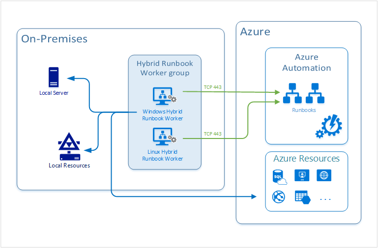

# Hybrid Runbook Worker overview

Runbooks in Azure Automation might not have access to resources in other clouds or in your on-premises environment because they run on the Azure cloud platform. You can use the Hybrid Runbook Worker feature of Azure Automation to run runbooks directly on the machine that's hosting the role and against resources in the environment to manage those local resources. Runbooks are stored and managed in Azure Automation and then delivered to one or more assigned machines.

## Runbook Worker types

There are two types of Runbook Workers - system and user. The following table describes the difference between them.

|Type | Description |
|-----|-------------|
|**System** |Supports a set of hidden runbooks used by the Update Management feature that are designed to install user-specified updates on Windows and Linux machines.<br> This type of Hybrid Runbook Worker is not a member of a Hybrid Runbook Worker group, and therefore doesn't run runbooks that target a Runbook Worker group. |
|**User** |Supports user-defined runbooks intended to run directly on the Windows and Linux machine that are members of one or more Runbook Worker groups. |

A Hybrid Runbook Worker can run on either the Windows or the Linux operating system, and this role relies on the [Log Analytics agent](../azure-monitor/agents/log-analytics-agent.md) reporting to an Azure Monitor [Log Analytics workspace](../azure-monitor/logs/design-logs-deployment.md). The workspace is not only to monitor the machine for the supported operating system, but also to download the components required to install the Hybrid Runbook Worker.

When Azure Automation [Update Management](./update-management/overview.md) is enabled, any machine connected to your Log Analytics workspace is automatically configured as a system Hybrid Runbook Worker. To configure it as a user Windows Hybrid Runbook Worker, see [Deploy a Windows Hybrid Runbook Worker](automation-windows-hrw-install.md) and for Linux, see [Deploy a Linux Hybrid Runbook Worker](automation-linux-hrw-install.md).

## How does it work?



Each user Hybrid Runbook Worker is a member of a Hybrid Runbook Worker group that you specify when you install the worker. A group can include a single worker, but you can include multiple workers in a group for high availability. Each machine can host one Hybrid Runbook Worker reporting to one Automation account; you cannot register the hybrid worker across multiple Automation accounts. A hybrid worker can only listen for jobs from a single Automation account. For machines hosting the system Hybrid Runbook worker managed by Update Management, they can be added to a Hybrid Runbook Worker group. But you must use the same Automation account for both Update Management and the Hybrid Runbook Worker group membership.

When you start a runbook on a user Hybrid Runbook Worker, you specify the group that it runs on. Each worker in the group polls Azure Automation to see if any jobs are available. If a job is available, the first worker to get the job takes it. The processing time of the jobs queue depends on the hybrid worker hardware profile and load. You can't specify a particular worker. Hybrid worker works on a polling mechanism (every 30 secs) and follows an order of first-come, first-serve. Depending on when a job was pushed, whichever hybrid worker pings the Automation service picks up the job. A single hybrid worker can generally pick up four jobs per ping (that is, every 30 seconds). If your rate of pushing jobs is higher than four per 30 seconds, then there is a high possibility another hybrid worker in the Hybrid Runbook Worker group picked up the job.

A Hybrid Runbook Worker doesn't have many of the [Azure sandbox](automation-runbook-execution.md#runbook-execution-environment) resource [limits](../azure-resource-manager/management/azure-subscription-service-limits.md#automation-limits) on disk space, memory, or network sockets. The limits on a hybrid worker are only related to the worker's own resources, and they aren't constrained by the [fair share](automation-runbook-execution.md#fair-share) time limit that Azure sandboxes have.

To control the distribution of runbooks on Hybrid Runbook Workers and when or how the jobs are triggered, you can register the hybrid worker against different Hybrid Runbook Worker groups within your Automation account. Target the jobs against the specific group or groups in order to support your execution arrangement.

## Hybrid Runbook Worker installation

The process to install a user Hybrid Runbook Worker depends on the operating system. The table below defines the deployment types.

|Operating System  |Deployment Types  |
|---------|---------|
|Windows     | [Automated](automation-windows-hrw-install.md#automated-deployment)<br>[Manual](automation-windows-hrw-install.md#manual-deployment)        |
|Linux     | [Manual](automation-linux-hrw-install.md#install-a-linux-hybrid-runbook-worker)        |

The recommended installation method for a Windows machine is to use an Azure Automation runbook to completely automate the process of configuring it. If that isn't feasible, you can follow a step-by-step procedure to manually install and configure the role. For Linux machines, you run a Python script to install the agent on the machine.

## <a name="network-planning"></a>Network planning

Check [Azure Automation Network Configuration](automation-network-configuration.md#network-planning-for-hybrid-runbook-worker) for detailed information on the ports, URLs, and other networking details required for the Hybrid Runbook Worker.

### Proxy server use

If you use a proxy server for communication between Azure Automation and machines running the Log Analytics agent, ensure that the appropriate resources are accessible. The timeout for requests from the Hybrid Runbook Worker and Automation services is 30 seconds. After three attempts, a request fails.

### Firewall use

If you use a firewall to restrict access to the Internet, you must configure the firewall to permit access. If using the Log Analytics gateway as a proxy, ensure that it is configured for Hybrid Runbook Workers. See [Configure the Log Analytics gateway for Automation Hybrid Runbook Workers](../azure-monitor/agents/gateway.md).

### Service tags

Azure Automation supports Azure virtual network service tags, starting with the service tag [GuestAndHybridManagement](../virtual-network/service-tags-overview.md). You can use service tags to define network access controls on [network security groups](../virtual-network/network-security-groups-overview.md#security-rules) or [Azure Firewall](../firewall/service-tags.md). Service tags can be used in place of specific IP addresses when you create security rules. By specifying the service tag name **GuestAndHybridManagement**  in the appropriate source or destination field of a rule, you can allow or deny the traffic for the Automation service. This service tag does not support allowing more granular control by restricting IP ranges to a specific region.

The service tag for the Azure Automation service only provides IPs used for the following scenarios:

* Trigger webhooks from within your virtual network
* Allow Hybrid Runbook Workers or State Configuration agents on your VNet to communicate with the Automation service

>[!NOTE]
>The service tag **GuestAndHybridManagement** currently doesn't support runbook job execution in an Azure sandbox, only directly on a Hybrid Runbook Worker.

## Support for Impact Level 5 (IL5)

Azure Automation Hybrid Runbook Worker can be used in Azure Government to support Impact Level 5 workloads in either of the following two configurations:

* [Isolated virtual machine](../azure-government/documentation-government-impact-level-5.md#isolated-virtual-machines). When deployed, they consume the entire physical host for that machine providing the necessary level of isolation required to support IL5 workloads.

* [Azure Dedicated Hosts](../azure-government/documentation-government-impact-level-5.md#azure-dedicated-host), which provides physical servers that are able to host one or more virtual machines, dedicated to one Azure subscription.

>[!NOTE]
>Compute isolation through the Hybrid Runbook Worker role is available for Azure Commercial and US Government clouds.

### Update Management addresses for Hybrid Runbook Worker

In addition to the standard addresses and ports required for the Hybrid Runbook Worker, Update Management has other network configuration requirements described under the [network planning](./update-management/overview.md#ports) section.

## Azure Automation State Configuration on a Hybrid Runbook Worker

You can run [Azure Automation State Configuration](automation-dsc-overview.md) on a Hybrid Runbook Worker. To manage the configuration of servers that support the Hybrid Runbook Worker, you must add the servers as DSC nodes. See [Enable machines for management by Azure Automation State Configuration](automation-dsc-onboarding.md).

## Runbook Worker limits

The maximum number of Hybrid Worker groups per Automation Account is 4000, and is applicable for both system & user hybrid workers. If you have more than 4,000 machines to manage, we recommend creating another Automation account.

## Runbooks on a Hybrid Runbook Worker

You might have runbooks that manage resources on the local machine or run against resources in the local environment where a user Hybrid Runbook Worker is deployed. In this case, you can choose to run your runbooks on the hybrid worker instead of in an Automation account. Runbooks run on a Hybrid Runbook Worker are identical in structure to those that you run in the Automation account. See [Run runbooks on a Hybrid Runbook Worker](automation-hrw-run-runbooks.md).

### Hybrid Runbook Worker jobs

Hybrid Runbook Worker jobs run under the local **System** account on Windows or the [nxautomation account](automation-runbook-execution.md#log-analytics-agent-for-linux) on Linux. Azure Automation handles jobs on Hybrid Runbook Workers differently from jobs run in Azure sandboxes. See [Runbook execution environment](automation-runbook-execution.md#runbook-execution-environment).

If the Hybrid Runbook Worker host machine reboots, any running runbook job restarts from the beginning, or from the last checkpoint for PowerShell Workflow runbooks. After a runbook job is restarted more than three times, it is suspended.

### Runbook permissions for a Hybrid Runbook Worker

Since they access non-Azure resources, runbooks running on a user Hybrid Runbook Worker can't use the authentication mechanism typically used by runbooks authenticating to Azure resources. A runbook either provides its own authentication to local resources, or configures authentication using [managed identities for Azure resources](../active-directory/managed-identities-azure-resources/tutorial-windows-vm-access-arm.md#grant-your-vm-access-to-a-resource-group-in-resource-manager). You can also specify a Run As account to provide a user context for all runbooks.

## View system Hybrid Runbook Workers

After the Update Management feature is enabled on Windows or Linux machines, you can inventory the list of system Hybrid Runbook Workers group in the Azure portal. You can view up to 2,000 workers in the portal by selecting the tab **System hybrid workers group** from the option **Hybrid workers group** from the left-hand pane for the selected Automation account.

:::image type="content" source="./media/automation-hybrid-runbook-worker/system-hybrid-workers-page.png" alt-text="Automation account system hybrid worker groups page" border="false" lightbox="./media/automation-hybrid-runbook-worker/system-hybrid-workers-page.png":::

If you have more than 2,000 hybrid workers, to get a list of all of them, you can run the following PowerShell script:

```powershell
"Get-AzSubscription -SubscriptionName "<subscriptionName>" | Set-AzContext
$workersList = (Get-AzAutomationHybridWorkerGroup -ResourceGroupName "<resourceGroupName>" -AutomationAccountName "<automationAccountName>").Runbookworker
$workersList | export-csv -Path "<Path>\output.csv" -NoClobber -NoTypeInformation"
```

## Next steps

* To learn how to configure your runbooks to automate processes in your on-premises datacenter or other cloud environment, see [Run runbooks on a Hybrid Runbook Worker](automation-hrw-run-runbooks.md).

* To learn how to troubleshoot your Hybrid Runbook Workers, see [Troubleshoot Hybrid Runbook Worker issues](troubleshoot/hybrid-runbook-worker.md#general).
