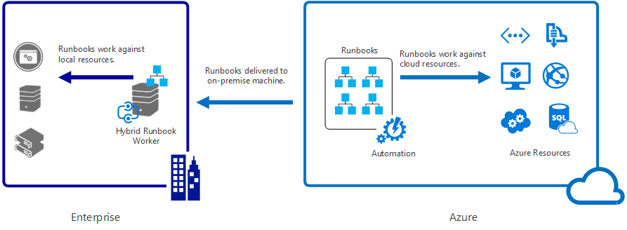
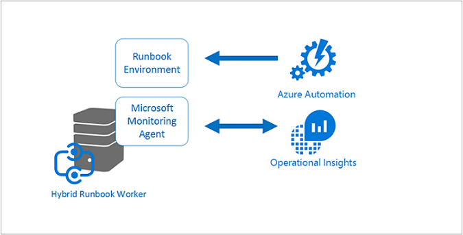
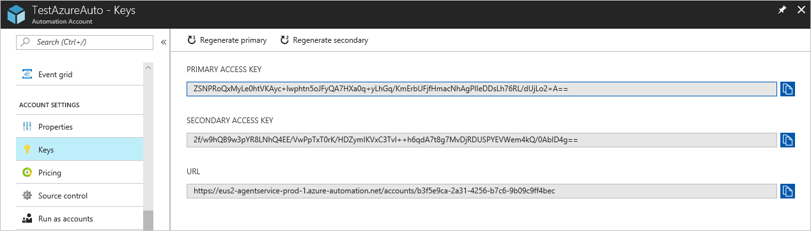

<properties
   pageTitle="Azure Automation Hybrid Runbook Workers | Microsoft Azure"
   description="This article provides information on installing and using Hybrid Runbook Worker which is a feature of Azure Automation that allows you to run runbooks on machines in your local data center."
   services="automation"
   documentationCenter=""
   authors="mgoedtel"
   manager="jwhit"
   editor="tysonn" />
<tags
   ms.service="automation"
   ms.devlang="na"
   ms.topic="article"
   ms.tgt_pltfrm="na"
   ms.workload="infrastructure-services"
   ms.date="08/10/2016"
   ms.author="bwren" />

# Azure Automation Hybrid Runbook Workers

Runbooks in Azure Automation cannot access resources in your local data center since they run in the Azure cloud.  The Hybrid Runbook Worker feature of Azure Automation allows you to run runbooks on machines located in your data center in order to manage local resources. The runbooks are stored and managed in Azure Automation and then delivered to one or more on-premises machines.  

This functionality is illustrated in the following image.   

You can designate one or more computers in your data center to act as a Hybrid Runbook Worker and run runbooks from Azure Automation.  Each worker requires the Microsoft Management Agent with a connection to Microsoft Operations Management Suite and the Azure Automation runbook environment.  Operations Management Suite is only used to install and maintain the management agent and to monitor the functionality of the worker.  The delivery of runbooks and the instruction to run them are performed by Azure Automation.

>[AZURE.NOTE] Operational Insights is in the process of being integrated into Operations Management Suite, and you may see either name used in the portal and in documentation.

There are no inbound firewall requirements to support Hybrid Runbook Workers. The agent on the local computer initiates all communication with Azure Automation in the cloud. When a runbook is started, Azure Automation creates an instruction that is retrieved by agent. The agent then pulls down the runbook and any parameters before running it.  It will also retrieve any [assets](http://msdn.microsoft.com/library/dn939988.aspx) that are used by the runbook from Azure Automation.

>[AZURE.NOTE] Hybrid Runbook Workers do not currently support [DSC Configurations](automation-dsc-overview.md).

## Hybrid Runbook Worker groups

Each Hybrid Runbook Worker is a member of a Hybrid Runbook Worker group that you specify when you install the agent.  A group can include a single agent, but you can install multiple agents in a group for high availability.

When you start a runbook on a Hybrid Runbook Worker, you specify the group that it will run on.  The members of the group will determine which worker will service the request.  You cannot specify a particular worker.

## Hybrid Runbook Worker requirements

You must designate at least one on-premises computer to run hybrid runbook jobs.  This computer must have the following:

- Windows Server 2012 or later
- Windows PowerShell 4.0 or later
- Minimum of two cores and 4 GB of RAM

Consider the following recommendations for hybrid workers: 

- Designate multiple hybrid workers in each group for high availability.  
- Hybrid workers can coexist with Service Management Automation or System Center Orchestrator runbook servers.
- Consider using a machine physically located in or near the region of your Automation account since the job data is sent back to Azure Automation when a job completes.

>[AZURE.NOTE] Hybrid Runbook Worker version 7.2.11136.0 currently support communicating through a proxy server only with PowerShell scripts.  Support for PowerShell Workflow scripts will be available in a future release.  

### Configure proxy and firewall settings

For the on-premise Hybrid Runbook Worker to connect to and register with the OMS service, it must have access to the port number and the URLs described below. If you use a proxy server for communication between the agent and the OMS service, you’ll need to ensure that the appropriate resources are accessible. If you use a firewall to restrict access to the Internet, you need to configure your firewall to permit access. 

The information below list the port and URLs that are required for the Hybrid Runbook Worker to communicate with Automation.

- Port:  Only TCP 443 is required for outbound Internet access
- Global URL:  *.azure-automation.net

If you have an Automation account defined for a specific region and you want to restrict communication with that regional datacenter, the following table provides the DNS record for each region.

|**Region**|**DNS Record**|
|--------------|--------------|
|North Central US|ncus-jobruntimedata-prod-su1.azure-automation.net|
|South Central US|scus-jobruntimedata-prod-su1.azure-automation.net|
|East US 2|eus2-jobruntimedata-prod-su1.azure-automation.net|
|West Europe|we-jobruntimedata-prod-su1.azure-automation.net|
|North Europe|ne-jobruntimedata-prod-su1.azure-automation.net|
|Central Canada|cc-jobruntimedata-prod-su1.azure-automation.net|
|South East Asia|sea-jobruntimedata-prod-su1.azure-automation.net|
|Central India|cid-jobruntimedata-prod-su1.azure-automation.net|
|Japan East|jpe-jobruntimedata-prod-su1.azure-automation.net|
|Australia South East|se-jobruntimedata-prod-su1.azure-automation.net|

## Installing Hybrid Runbook Worker

The procedure below describes how to install and configure Hybrid Runbook Worker.  Perform the first two steps once for your Automation environment and then repeat the remaining steps for each worker computer.

### 1. Create Operations Management Suite workspace

If you do not already have an Operations Management Suite workspace, then create one using instructions at  [Set up your workspace](https://technet.microsoft.com/library/mt484119.aspx). You can use an existing workspace if you already have one.

### 2. Add Automation solution to Operations Management Suite workspace

Solutions add functionality to Operations Management Suite.  The Automation solution adds functionality for Azure Automation including support for Hybrid Runbook Worker.  When you add the solution to your workspace, it will automatically push down worker components to the agent computer that you will install in the next step.

Follow the instructions at [To add a solution using the Solutions Gallery](../log-analytics/log-analytics-add-solutions.md) to add the **Automation** solution to your Operations Management Suite workspace.

### 3. Install the Microsoft Monitoring Agent

The Microsoft Monitoring Agent connects computers to Operations Management Suite.  When you install the agent on your on-premises machine and connect it to your workspace, it will automatically download the components required for Hybrid Runbook Worker.

Follow the instructions at [Connect Windows computers to Log Analytics](../log-analytics/log-analytics-windows-agents.md) to install the agent on the on-premises machine.  You can repeat this process for multiple computers to add multiple workers to your environment.

When the agent has successfully connected to Operations Management Suite, it will be listed on the **Connected Sources** tab of the Operations Management Suite **Settings** pane.  You can verify that the agent has correctly downloaded the Automation solution when it has a folder called **AzureAutomationFiles** in C:\Program Files\Microsoft Monitoring Agent\Agent.  To confirm the version of the Hybrid Runbook Worker, you can navigate to C:\Program Files\Microsoft Monitoring Agent\Agent\AzureAutomation\ and note the \\*version* sub-folder.   

### 4. Install the runbook environment and connect to Azure Automation

When you add an agent to Operations Management Suite, the Automation solution pushes down the **HybridRegistration** PowerShell module which contains the **Add-HybridRunbookWorker** cmdlet.  You use this cmdlet to install the runbook environment on the computer and register it with Azure Automation.

Open a PowerShell session in Administrator mode and run the following commands to import the module.

	cd "C:\Program Files\Microsoft Monitoring Agent\Agent\AzureAutomation\<version>\HybridRegistration"
	Import-Module HybridRegistration.psd1

Then run the **Add-HybridRunbookWorker** cmdlet using the following syntax:

	Add-HybridRunbookWorker –Name <String> -EndPoint <Url> -Token <String>

You can get the information required for this cmdlet from the  **Manage Keys** blade in the Azure portal.  Open this blade by clicking the key icon on the Elements panel for the automation account.

- **Name** is the name of the Hybrid Runbook Worker Group. If this group already exists in the automation account, then the current computer is added to it.  If it does not already exist, then it is added.
- **EndPoint** is the **URL** field in the **Manage Keys** blade.
- **Token** is the **Primary Access Key** in the **Manage Keys** blade.  

Use the **-Verbose** switch with **Add-HybridRunbookWorker** to receive detailed information about the installation.

### 5. Install PowerShell modules

Runbooks can use any of the activities and cmdlets defined in the modules installed in your Azure Automation environment.  These modules are not automatically deployed to on-premises machines though, so you must install them manually.  The exception is the Azure module which is installed by default providing access to cmdlets for all Azure services and activities for Azure Automation.

Since the primary purpose of the Hybrid Runbook Worker feature is to manage local resources, you will most likely need to install the modules that support these resources.  You can refer to  [Installing Modules](http://msdn.microsoft.com/library/dd878350.aspx) for information on installing Windows PowerShell modules.

## Removing Hybrid Runbook Worker

You can remove Hybrid Runbook Worker from an on-premises machine with by running **Remove-HybridRunbookWorker** cmdlet on that machine.  Use the **-Verbose** switch for a detailed log of the removal process.  

## Starting runbooks on Hybrid Runbook Worker

[Starting a Runbook in Azure Automation](automation-starting-a-runbook.md) describes different methods for starting a runbook.  Hybrid Runbook Worker adds a **RunOn** option where you can specify the name of a Hybrid Runbook Worker Group.  If a group is specified, then the runbook is retrieved and run by of the workers in that group.  If this option is not specified, then it is run in Azure Automation as normal.

When you start a runbook in the Azure portal, you will be presented with a **Run on** option where you can select **Azure** or **Hybrid Worker**.  If you select **Hybrid Worker**, then you can select the group from a dropdown.

Use the **RunOn** parameter  You could use the following command to start a runbook named Test-Runbook on a Hybrid Runbook Worker Group named MyHybridGroup using Windows PowerShell.

	Start-AzureRmAutomationRunbook –AutomationAccountName "MyAutomationAccount" –Name "Test-Runbook" -RunOn "MyHybridGroup"

>[AZURE.NOTE] The **RunOn** parameter was added to the **Start-AzureAutomationRunbook** cmdlet in version 0.9.1 of Microsoft Azure PowerShell.  You should [download the latest version](https://azure.microsoft.com/downloads/) if you have an earlier one installed.  You only need to install this version on a workstation where you will be starting the runbook from Windows PowerShell.  You do not need to install it on the worker computer unless you intend to start runbooks from that computer.  You cannot currently start a runbook on a Hybrid Runbook Worker from another runbook since this would require the latest version of Azure Powershell to be installed in your Automation account.  The latest version will be automatically updated in Azure Automation and automatically pushed down to the workers soon.

## Runbook permissions

Runbooks running on a Hybrid Runbook Worker cannot use the same [method that is typically used for runbooks authenticating to Azure resources](automation-configuring.md#configuring-authentication-to-azure-resources) since they will be accessing resources outside of Azure.  The runbook can either provide its own authentication to local resources, or you can specify a RunAs account to provide a user context for all runbooks.

### Runbook authentication

By default, runbooks will run in the context of the local System account on the on-premises machine, so they must provide their own authentication to resources that they will access.  

You can use [Credential](http://msdn.microsoft.com/library/dn940015.aspx) and [Certificate](http://msdn.microsoft.com/library/dn940013.aspx) assets in your runbook with cmdlets that allow you to specify credentials so you can authenticate to different resources.  The following example shows a portion of a runbook that restarts a computer.  It retrieves credentials from a credential asset and the name of the computer from a variable asset and then uses these values with the Restart-Computer cmdlet.

	$Cred = Get-AzureRmAutomationCredential -ResourceGroupName "ResourceGroup01" -Name "MyCredential"
	$Computer = Get-AzureRmAutomationVariable -ResourceGroupName "ResourceGroup01" -Name  "ComputerName"

	Restart-Computer -ComputerName $Computer -Credential $Cred

You can also leverage [InlineScript](automation-powershell-workflow.md#inline-script) which will allow you to run blocks of code on another computer with credentials specified by the [PSCredential common parameter](http://technet.microsoft.com/library/jj129719.aspx).

### RunAs account

Instead of having runbooks provide their own authentication to local resources, you can specify a **RunAs** account for a Hybrid worker group.  You specify a [credential asset](automation-credentials.md) that has access to local resources, and all runbooks will run under these credentials when running on a Hybrid Runbook Worker in the group.  

The user name for the credential must be in one of the following formats:

- domain\username 
- username@domain
- username (for accounts local to the on-premises machine)

Use the following procedure to specify a RunAs account for a Hybrid worker group:

1. Create a [credential asset](automation-credentials.md) with access to local resources.
2. Open the Automation account in the Azure portal.
2. Select the **Hybrid Worker Groups** tile, and then select the group.
3. Select **All settings** and then **Hybrid worker group settings**.
4. Change **Run As** from **Default** to **Custom**.
5. Select the credential and click **Save**.

## Creating runbooks for Hybrid Runbook Worker

There is no difference in the structure of runbooks that run in Azure Automation and those that run on a Hybrid Runbook Worker. Runbooks that you use with each will most likely differ significantly though since runbooks for Hybrid Runbook Worker will typically manage local resources in your data center while runbooks in Azure Automation typically manage resources in the Azure cloud. 

You can edit a runbook for Hybrid Runbook Worker in Azure Automation, but you may have difficulties if you try to test the runbook in the editor.  The PowerShell modules that access the local resources may not be installed in your Azure Automation environment in which case, the test would fail.  If you do install the required modules, then the runbook will run, but it will not be able to access local resources for a complete test.

## Troubleshooting runbooks on Hybrid Runbook Worker

[Runbook output and messages](automation-runbook-output-and-messages.md) are sent to Azure Automation from hybrid workers just like runbook jobs run in the cloud.  You can also enable the Verbose and Progress streams the same way you would for other runbooks.  

Logs are stored locally on each hybrid worker at C:\ProgramData\Microsoft\System Center\Orchestrator\7.2\SMA\Sandboxes.

If your runbooks are not completeing succesfully and the job summary shows a status of **Suspended**, please review the troubleshooting article [Hybrid Runbook Worker: A runbook job terminates with a status of Suspended](automation-troubleshooting-hrw-runbook-terminates-suspended.md).   

## Relationship to Service Management Automation

[Service Management Automation (SMA)](https://technet.microsoft.com/library/dn469260.aspx) is a component of Windows Azure Pack (WAP) that allows you to run the same runbooks that are supported by Azure Automation in your local data center.  Unlike Azure Automation, SMA requires a local installation that includes the Windows Azure Pack Management Portal and a database to hold runbooks and SMA configuration. Azure Automation provides these services in the cloud and only requires you to maintain the Hybrid Runbook Workers in your local environment.

If you are an existing SMA user, you can move your runbooks to Azure Automation to be used with Hybrid Runbook Worker with no changes, assuming that they perform their own authentication to resources as described in [Creating runbooks for Hybrid Runbook Worker](#creating-runbooks-for-hybrid-runbook-worker).  Runbooks in SMA run in the context of the service account on the worker server which may provide that authentication for the runbooks.

You can use the following criteria to determine whether Azure Automation with Hybrid Runbook Worker or Service Management Automation is more appropriate for your requirements.

- SMA requires a local installation of Windows Azure Pack that has more local resources and higher maintenance costs than Azure Automation which only needs an agent installed on local runbook workers.  The agents are managed by Operations Management Suite furthering decreasing their maintenance costs.
- Azure Automation stores its runbooks in the cloud and delivers them to on-premises Hybrid Runbooks Workers.  If your security policy does not allow this behavior then you should use SMA.
- Windows Azure Pack is a free download while Azure Automation may incur subscription charges.
- Azure Automation with Hybrid Runbook Worker allow you to manage runbooks for cloud resources and local resources in one location as opposed to separately managing both Azure Automation and SMA.
- Azure Automation has advanced features such including graphical authoring that are not available in SMA.

## Next steps

- To learn more about the different methods that can be used to start a runbook, see [Starting a Runbook in Azure Automation](automation-starting-a-runbook.md)
- To understand the different procedures for working with PowerShell and PowerShell Workflow runbooks in Azure Automation using the textual editor, see [Editing a Runbook in Azure Automation](automation-edit-textual-runbook.md)

 
