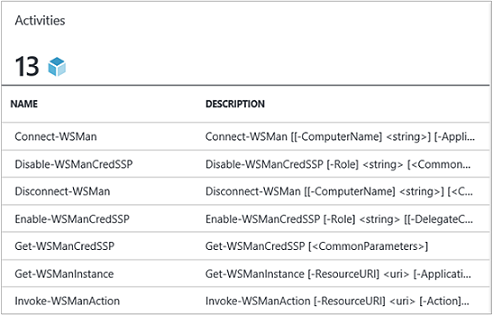
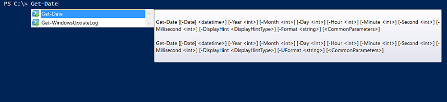

# Azure Automation Integration Modules

PowerShell is the fundamental technology behind Azure Automation. Since Azure Automation is built on PowerShell, PowerShell modules are key to the extensibility of Azure Automation. In this article, you'll learn the specifics of Azure Automation's use of PowerShell modules, referred to as Integration Modules. You'll also learn recommended practices for creating your own PowerShell modules to make sure they work as Integration Modules within Azure Automation. 

## What is a PowerShell Module?

A PowerShell module is a group of PowerShell cmdlets like **Get-Date** or **Copy-Item**, that can be used from:

* The PowerShell console
* scripts
* workflows
* runbooks
* DSC resources

All of the functionality of PowerShell is exposed through cmdlets and DSC resources. Every cmdlet and DSC resource is backed by a PowerShell module, many of which ship with PowerShell itself. For example, the **Get-Date** cmdlet is part of the `Microsoft.PowerShell.Utility` PowerShell module, and **Copy-Item** cmdlet is part of the `Microsoft.PowerShell.Management` PowerShell module and the Package DSC resource is part of the PSDesiredStateConfiguration PowerShell module. Both of these modules ship with PowerShell. Many PowerShell modules don't ship as part of PowerShell. These modules  are distributed with first or third-party products or on places like the PowerShell Gallery. The modules are useful because they make complex tasks simpler through encapsulated functionality.  You can learn more about [PowerShell modules on MSDN](https://msdn.microsoft.com/library/dd878324%28v=vs.85%29.aspx). 

## What is an Azure Automation Integration Module?

An Integration Module isn't different from a PowerShell module. It's simply a PowerShell module that optionally contains one additional file - a metadata file specifying an Azure Automation connection type to be used with the module's cmdlets in runbooks. PowerShell modules can be imported into Azure Automation to make their cmdlets available for use within runbooks and their DSC resources available for use within DSC configurations. Behind the scenes, Azure Automation stores these modules, and at runbook job and DSC compilation job execution time, loads them into the Azure Automation sandboxes where runbooks execute and DSC configurations compile. Any DSC resources in modules are also automatically placed on the Automation DSC pull server. They can be pulled by machines when they apply DSC configurations.  

We ship a number of Azure PowerShell modules out of the box in Azure Automation. But you can import PowerShell modules for whatever system, service, or tool you want to integrate with.

> [!NOTE]
> Certain modules are shipped as **global modules** in the Automation service. These global modules are available to you when you create an automation account, and we update them sometimes, which automatically pushes them out to your automation account. If you don't want them to be auto-updated, you can always import the same module yourself, and that takes precedence over the global module version of that module that we ship in the service.

The format in which you import an Integration Module package is a compressed file with the same name as the module and a .zip extension. It contains the Windows PowerShell module and any supporting files, including a manifest file (.psd1) if the module has one.

If the module should contain an Azure Automation connection type, it must also contain a file with the name `<ModuleName>-Automation.json` that specifies the connection type properties. This is a json file, which is placed within the module folder of your compressed .zip file. This file contains the fields of a **connection** that is required to connect to the system or service the module represents. This configuration ends up creating a connection type in Azure Automation. Using this file you can set the field names, types, and whether the fields should be encrypted and / or optional, for the connection type of the module. The following example is a template in the json file format:

```json
{ 
   "ConnectionFields": [
   {
      "IsEncrypted":  false,
      "IsOptional":  false,
      "Name":  "ComputerName",
      "TypeName":  "System.String"
   },
   {
      "IsEncrypted":  false,
      "IsOptional":  true,
      "Name":  "Username",
      "TypeName":  "System.String"
   },
   {
      "IsEncrypted":  true,
      "IsOptional":  false,
      "Name":  "Password",
   "TypeName":  "System.String"
   }],
   "ConnectionTypeName":  "DataProtectionManager",
   "IntegrationModuleName":  "DataProtectionManager"
}
```

If you have deployed Service Management Automation and created Integration Modules packages for your automation runbooks, this template should look familiar to you.

## Authoring Best Practices

Even though Integration Modules are PowerShell modules, there's still a number of things we recommend you consider when you author a PowerShell module for use in Azure Automation. Some recommendations are useful to make your modules work well in PowerShell Workflow.

1. Include a synopsis, description, and help URI for every cmdlet in the module. In PowerShell, you can define certain help information for cmdlets to allow the user to receive help on using them with the **Get-Help** cmdlet. For example, here's how you can define a synopsis and help URI for a PowerShell module written in a .psm1 file. 
   
    ```powershell
    <#
        .SYNOPSIS
         Gets all outgoing phone numbers for this Twilio account 
    #>
    function Get-TwilioPhoneNumbers {
    [CmdletBinding(DefaultParameterSetName='SpecifyConnectionFields', `
    HelpUri='https://www.twilio.com/docs/api/rest/outgoing-caller-ids')]
    param(
       [Parameter(ParameterSetName='SpecifyConnectionFields', Mandatory=$true)]
       [ValidateNotNullOrEmpty()]
       [string]
       $AccountSid,
   
       [Parameter(ParameterSetName='SpecifyConnectionFields', Mandatory=$true)]
       [ValidateNotNullOrEmpty()]
       [string]
       $AuthToken,
   
       [Parameter(ParameterSetName='UseConnectionObject', Mandatory=$true)]
       [ValidateNotNullOrEmpty()]
       [Hashtable]
       $Connection
    )
   
    $cred = CreateTwilioCredential -Connection $Connection -AccountSid $AccountSid -AuthToken $AuthToken
   
    $uri = "$TWILIO_BASE_URL/Accounts/" + $cred.UserName + "/IncomingPhoneNumbers"
   
    $response = Invoke-RestMethod -Method Get -Uri $uri -Credential $cred
   
    $response.TwilioResponse.IncomingPhoneNumbers.IncomingPhoneNumber
    }
    ```

   Providing this info shows this help using the **Get-Help** cmdlet in the PowerShell console. This information is also exposed within Azure Automation.  For example, when inserting activities during runbook authoring. Clicking 'View detailed help' will open the help URI in another tab of the web browser you're using to access Azure Automation.

   

2. If the module runs against a remote system:

   1. It should contain an Integration Module metadata file that defines the information needed to connect to that remote system, meaning the connection type.
   2. Each cmdlet in the module should be able to take in a connection object (an instance of that connection type) as a parameter.  

    Cmdlets in the module become easier to use in Azure Automation if you allow passing an object with the fields of the connection type as a parameter to the cmdlet. This allows users to map parameters of the connection asset to the cmdlet's corresponding parameters each time they call a cmdlet.

    Based on the runbook example above, it uses a Twilio connection asset called CorpTwilio to access Twilio and return all the phone numbers in the account.  Notice how it's mapping the fields of the connection to the parameters of the cmdlet?

    ```powershell
    workflow Get-CorpTwilioPhones
    {
      $CorpTwilio = Get-AutomationConnection -Name 'CorpTwilio'

      Get-TwilioPhoneNumbers 
        -AccountSid $CorpTwilio.AccountSid  
        -AuthToken $CorptTwilio.AuthToken
    }
    ```
  
    An easier and better way to approach this behavior is directly passing the connection object to the cmdlet -

    ```powershell
    workflow Get-CorpTwilioPhones
    {
      $CorpTwilio = Get-AutomationConnection -Name 'CorpTwilio'

      Get-TwilioPhoneNumbers -Connection $CorpTwilio
    }
    ```

    You can enable behavior like the preceding example for your cmdlets by allowing them to accept a connection object directly as a parameter, instead of just connection fields for parameters. Usually you want a parameter set for each, so that a user not using Azure Automation can call your cmdlets without constructing a hashtable to act as the connection object. The parameter set **SpecifyConnectionFields**, is used to pass the connection field properties one by one. **UseConnectionObject** lets you pass the connection straight through. As you can see, the Send-TwilioSMS cmdlet in the [Twilio PowerShell module](https://gallery.technet.microsoft.com/scriptcenter/Twilio-PowerShell-Module-8a8bfef8) allows passing either way:

    ```powershell
    function Send-TwilioSMS {
      [CmdletBinding(DefaultParameterSetName='SpecifyConnectionFields', `
      HelpUri='https://www.twilio.com/docs/api/rest/sending-sms')]
      param(
         [Parameter(ParameterSetName='SpecifyConnectionFields', Mandatory=$true)]
         [ValidateNotNullOrEmpty()]
         [string]
         $AccountSid,
   
         [Parameter(ParameterSetName='SpecifyConnectionFields', Mandatory=$true)]
         [ValidateNotNullOrEmpty()]
         [string]
         $AuthToken,
   
         [Parameter(ParameterSetName='UseConnectionObject', Mandatory=$true)]
         [ValidateNotNullOrEmpty()]
         [Hashtable]
         $Connection
   
       )
    }
    ```

3. Define output type for all cmdlets in the module. Defining an output type for a cmdlet allows design-time IntelliSense to help you determine the output properties of the cmdlet, for use during authoring. It's especially helpful during Automation runbook graphical authoring, where design time knowledge is key to an easy user experience with your module.

   

   This behavior is similar to the "type ahead" functionality of a cmdlet's output in PowerShell ISE without having to run it.

   

4. Cmdlets in the module shouldn't take complex object types for parameters. PowerShell Workflow is different from PowerShell in that it stores complex types in deserialized form. Primitive types stay as primitives, but complex types convert to their deserialized versions, which are essentially property bags. For example, if you used the **Get-Process** cmdlet in a runbook (or a PowerShell Workflow for that matter), it would return an object of type [Deserialized.System.Diagnostic.Process], not the expected [System.Diagnostic.Process] type. This type has all the same properties as the non-deserialized type, but none of the methods. And if you try to pass this value as a parameter to a cmdlet, where the cmdlet expects a [System.Diagnostic.Process] value for this parameter, you receive the following error: *Cannot process argument transformation on parameter 'process'. Error: "Cannot convert the "System.Diagnostics.Process (CcmExec)" value of type  "Deserialized.System.Diagnostics.Process" to type "System.Diagnostics.Process".*   This is because there's a type mismatch between the expected [System.Diagnostic.Process] type and the given [Deserialized.System.Diagnostic.Process] type. The way around this issue is to ensure the cmdlets of your module don't take complex types for parameters. Here is the wrong way to do it.

    ```powershell
    function Get-ProcessDescription {
      param (
            [System.Diagnostic.Process] $process
      )
      $process.Description
    }
    ```

    The correct way is to take in a primitive that is used internally by the cmdlet to grab the complex object and use it. Since cmdlets execute in the context of PowerShell, not PowerShell Workflow, inside the cmdlet $process becomes the correct [System.Diagnostic.Process] type.  

    ```powershell
    function Get-ProcessDescription {
      param (
            [String] $processName
      )
      $process = Get-Process -Name $processName
   
      $process.Description
    }
    ```

   Connection assets in runbooks are hashtables, which are a complex type, and yet these hashtables seem to be able to be passed into cmdlets for their 'Connection parameter perfectly, with no cast exception. Technically, some PowerShell types are able to cast properly from their serialized form to their deserialized form, and hence can be passed into cmdlets for parameters accepting the non-deserialized type. Hashtable is one of these. It's possible for a module author's defined types to be implemented in a way that they can correctly deserialize as well, but there are some trade-offs to consider. The type needs to have a default constructor, have all of its properties public, and have a PSTypeConverter. However, for already-defined types that the module author does not own, there is no way to 'fix' them, hence the recommendation to avoid complex types for parameters all together. Runbook Authoring tip: If your cmdlets need to take a complex type parameter, the workaround in PowerShell Workflows, is to wrap the cmdlet that generates the complex type and the cmdlet that consumes the complex type in the same InlineScript activity. Since InlineScript executes its contents as PowerShell rather than PowerShell Workflow, the cmdlet generating the complex type would produce that correct type, not the deserialized complex type.

5. Make all cmdlets in the module stateless. PowerShell Workflow runs every cmdlet called in the workflow in a different session. This means any cmdlets that depend on session state created / modified by other cmdlets in the same module won't work in PowerShell Workflow runbooks.  Here is an example of what not to do.
   
    ```powershell
    $globalNum = 0
    function Set-GlobalNum {
       param(
           [int] $num
       )
   
       $globalNum = $num
    }
    function Get-GlobalNumTimesTwo {
       $output = $globalNum * 2
   
       $output
    }
    ```

6. The module should be fully contained in an Xcopy-able package. Azure Automation modules are distributd to the Automation sandboxes when runbooks need to execute. The modules need to work independently of the host they're running on. You should be able to Zip up and move a module package and have it function as normal when imported into another host's PowerShell environment. In order for that to happen, the module shouldn't depend on any files outside the module folder. This folder is the folder that gets zipped up when the module is imported into Azure Automation. The module should also not depend on any unique registry settings on a host, such as those settings set when a product is installed. If this best practice isn't followed, the module won't be usable in Azure Automation.  

7. If referencing [Azure Powershell Az modules](/powershell/azure/new-azureps-module-az?view=azps-1.1.0) in your module, ensure you aren't also referencing `AzureRM`. The `Az` module can't be used in conjunction with the `AzureRM` modules. `Az` is supported in runbooks but aren't imported by default. To learn about the `Az` modules and considerations to take into account, see [Az module support in Azure Automation](az-modules.md).

## Next steps

* To get started with PowerShell workflow runbooks, see [My first PowerShell workflow runbook](automation-first-runbook-textual.md)
* To learn more about creating PowerShell Modules, see [Writing a Windows PowerShell Module](https://msdn.microsoft.com/library/dd878310%28v=vs.85%29.aspx)
