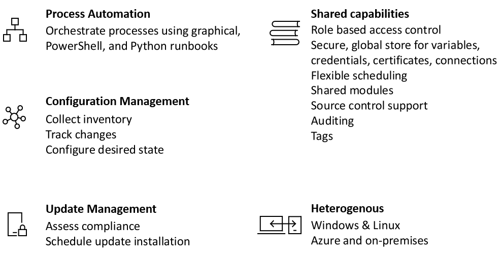

# An introduction to Azure Automation

Azure Automation delivers a cloud-based automation and configuration service that provides consistent management across your Azure and non-Azure environments. It consists of process automation, update management, and configuration features. Azure Automation provides complete control during deployment, operations, and decommissioning of workloads and resources.
This article provides a brief overview of Azure Automation and answers some common questions. For more information about the different capabilities, visit the links throughout this overview.

## Azure Automation capabilities

### Process automation

Azure Automation provides you the ability to automate frequent, time-consuming, and error-prone cloud management tasks. This automation helps you focus on work that adds business value. By reducing errors and boosting efficiency, it also helps to lower your operational costs. You can integrate Azure services and other public systems that are required in deploying, configuring, and managing your end to end processes. The service allows you to [author runbooks](automation-runbook-types.md) graphically, in PowerShell, or Python. By using a hybrid Runbook worker, you can unify management by orchestrating across on-premises environments. [Webhooks](automation-webhooks.md) provide a way to fulfill requests and ensure continuous delivery and operations by triggering automation from ITSM, DevOps, and monitoring systems.

### Configuration management

Azure Automation [desired state configuration](automation-dsc-overview.md) is a cloud-based solution for PowerShell DSC that provides services required for enterprise environments. Manage your DSC resources in Azure Automation and apply configurations to virtual or physical machines from a DSC Pull Server in the Azure cloud. It provides rich reports that inform you of important events such as when nodes have deviated from their assigned configuration. You can monitor and automatically update machine configuration across physical and virtual machines, Windows or Linux, in the cloud or on-premises.

You can get inventory about in-guest resources for visibility into installed applications and other configuration items. A rich reporting and search capabilities are available to quickly find detailed information to help understand what is configured within the operating system. You can track changes across services, daemons, software, registry, and files to quickly identify what might be causing issues. Additionally, DSC can help you diagnose and alert when unwanted changes occur in your environment.

### Update management

Update Windows and Linux systems across hybrid environments with Azure Automation. You get visibility of update compliance across Azure, on-premises, and other clouds. You can create schedule deployments to orchestrate the installation of updates within a defined maintenance window. If an update should not be installed on a machine, you can exclude those updates from a deployment.

### Shared resources

Azure Automation consists of a set of shared resources that make it easier to automate and configure your environments at scale.

* **[Schedules](automation-schedules.md)** - Used in the service to trigger automation on predefined times.
* **[Modules](automation-integration-modules.md)** -  Modules are used to manage Azure and other systems. Import into the Automation Account for Microsoft, third party, community, or custom defined cmdlets and DSC resources.
* **[Modules gallery](automation-runbook-gallery.md)** - Native integration to the PowerShell Gallery to view runbooks and import them into the Automation Account.
* **[Python 2 packages](python-packages.md)** - Add Python 2 packages to your automation account to use in your Python runbooks.
* **[Credentials](automation-credentials.md)** - Securely store sensitive information that can be used by runbooks and configurations at runtime.
* **[Connections](automation-connections.md)** - Store a name / value pairs of information that contains common information when connecting to systems in connection resources. Connections are defined by the module author for use at runtime in runbooks and configurations.
* **[Certificates](automation-certificates.md)** - Store and make available at runtime so they can be used for authentication and securing deployed resources.
* **[Variables](automation-variables.md)** - Provide a way to hold content that can be used across runbooks and configurations. You can change values without having to modify any of the runbooks and configurations that reference them.

### Source control integration

Azure Automation has the ability to [integrate with source control](source-control-integration.md) which promotes configuration as code where runbooks or configurations can be checked into a source control system.

### Role based access control

Azure Automation supports Role Based Access Control to control access to the Automation Account and its resources, to learn more about configuration RBAC on your Automation Account,runbooks, and jobs, see [Role-based access control for Azure Automation](automation-role-based-access-control.md).

### Windows and Linux

Azure Automation is designed to work across your hybrid cloud environment and also for Windows & Linux. It delivers a consistent way to automate and configure workloads deployed and the operating system they are running on.

### Community gallery

Browse the [Automation gallery](automation-runbook-gallery.md) for runbooks and modules to quickly get started integrating and authoring your processes from PowerShell gallery and Microsoft Script Center.

## Common scenarios for Automation

Azure Automation manages across the lifecycle of your infrastructure and applications. Transfer knowledge into the system on how the organization delivers and maintains workloads. Author in common languages like PowerShell, desired state configuration, Python, and graphical runbooks. Get a complete inventory of deployed resources for targeting, reporting, and compliance. Identify changes that can cause misconfiguration and improve operational compliance.

* **Build / Deploy resources** - Deploy VMs across a hybrid environment using Runbooks and Azure Resource Manager templates. Integrate into development tools like Jenkins and Azure DevOps.
* **Configure VMs** - Assess and configure Windows and Linux machines with the desired configuration for the infrastructure and application.
* **Monitor** - Identify changes on machines that are causing issues and remediate or escalate to management systems.
* **Protect** - Quarantine VM if security alert is raised. Set in-guest requirements.
* **Govern** - Set up role-based access control for teams. Recover unused resources.

## Pricing for Automation

You can review the price for Azure Automation on the [pricing](https://azure.microsoft.com/pricing/details/automation/) page.

## Next steps

> [!div class="nextstepaction"]
> [Create an automation account](automation-quickstart-create-account.md)

