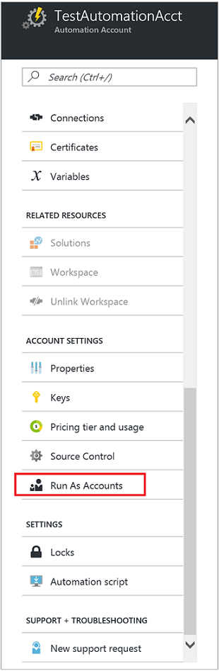
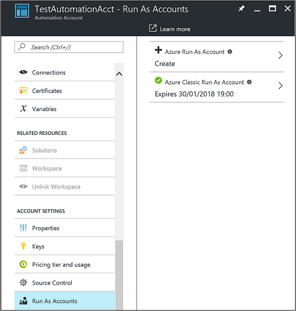

# Manage Azure Automation account
At some point before your Automation account expires, you will need to renew the certificate. If you believe that the Run As account has been compromised, you can delete and re-create it. This section discusses how to perform these operations.

## Self-signed certificate renewal
The self-signed certificate that you created for the Run As account expires one year from the date of creation. You can renew it at any time before it expires. When you renew it, the current valid certificate is retained to ensure that any runbooks that are queued up or actively running, and that authenticate with the Run As account, are not negatively affected. The certificate remains valid until its expiration date.

> [!NOTE]
> If you have configured your Automation Run As account to use a certificate issued by your enterprise certificate authority and you use this option, the enterprise certificate will be replaced by a self-signed certificate.

To renew the certificate, do the following:

1. In the Azure portal, open the Automation account.

2. On the **Automation Account** blade, in the **Account properties** pane, under **Account Settings**, select **Run As Accounts**.

    
3. On the **Run As Accounts** properties blade, select either the Run As account or the Classic Run As account that you want to renew the certificate for.

4. On the **Properties** blade for the selected account, click **Renew certificate**.

    

5. While the certificate is being renewed, you can track the progress under **Notifications** from the menu.

## Delete a Run As or Classic Run As account
This section describes how to delete and re-create a Run As or Classic Run As account. When you perform this action, the Automation account is retained. After you delete a Run As or Classic Run As account, you can re-create it in the Azure portal.

1. In the Azure portal, open the Automation account.

2. On the **Automation account** blade, in the account properties pane, select **Run As Accounts**.

3. On the **Run As Accounts** properties blade, select either the Run As account or Classic Run As account that you want to delete. Then, on the **Properties** blade for the selected account, click **Delete**.

 

4. While the account is being deleted, you can track the progress under **Notifications** from the menu.

5. After the account has been deleted, you can re-create it on the **Run As Accounts** properties blade by selecting the create option **Azure Run As Account**.

 

## Misconfiguration
Some configuration items necessary for the Run As or Classic Run As account to function properly might have been deleted or created improperly during initial setup. The items include:

* Certificate asset
* Connection asset
* Run As account has been removed from the contributor role
* Service principal or application in Azure AD

In the preceding and other instances of misconfiguration, the Automation account detects the changes and displays a status of *Incomplete* on the **Run As Accounts** properties blade for the account.

When you select the Run As account, the account **Properties** pane displays the following error message:

.

You can quickly resolve these Run As account issues by deleting and re-creating the account.

## Next steps
* For more information about Service Principals, refer to [Application Objects and Service Principal Objects](../active-directory/active-directory-application-objects.md).
* For more information about Role-based Access Control in Azure Automation, refer to [Role-based access control in Azure Automation](automation-role-based-access-control.md).
* For more information about certificates and Azure services, refer to [Certificates overview for Azure Cloud Services](../cloud-services/cloud-services-certs-create.md).