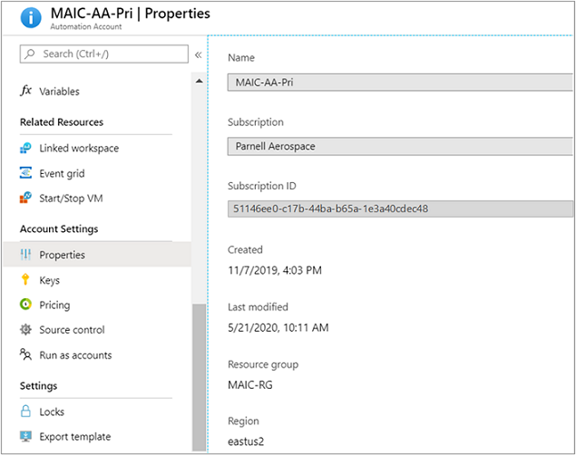
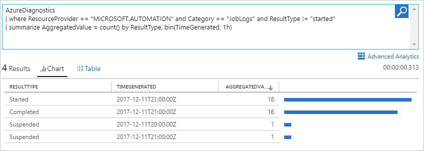
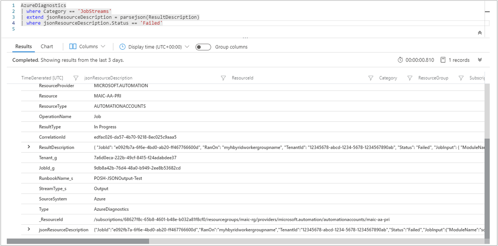

# Forward Azure Automation job data to Azure Monitor logs

Azure Automation can send runbook job status and job streams to your Log Analytics workspace. This process does not involve workspace linking and is completely independent. Job logs and job streams are visible in the Azure portal, or with PowerShell, for individual jobs and this allows you to perform simple investigations. Now with Azure Monitor logs you can:

* Get insight into the status of your Automation jobs.
* Trigger an email or alert based on your runbook job status (for example, failed or suspended).
* Write advanced queries across your job streams.
* Correlate jobs across Automation accounts.
* Use custom views and search queries to visualize your runbook results, runbook job status, and other related key indicators or metrics.

## Prerequisites

To start sending your Automation logs to Azure Monitor logs, you need:

* The latest release of [Azure PowerShell](/powershell/azure/).

* A Log Analytics workspace and it's resource ID. For more information, see [Get started with Azure Monitor logs](../azure-monitor/overview.md).

* The resource ID of your Azure Automation account.

## How to find resource IDs

1. Use the following command to find the resource ID for your Azure Automation account:

    ```powershell-interactive
    # Find the ResourceId for the Automation account
    Get-AzResource -ResourceType "Microsoft.Automation/automationAccounts"
    ```

2. Copy the value for **ResourceID**.

3. Use the following command to find the resource ID of your Log Analytics workspace:

    ```powershell-interactive
    # Find the ResourceId for the Log Analytics workspace
    Get-AzResource -ResourceType "Microsoft.OperationalInsights/workspaces"
    ```

4. Copy the value for **ResourceID**.

To return results from a specific resource group, include the `-ResourceGroupName` parameter. For more information, see [Get-AzResource](/powershell/module/az.resources/get-azresource).

If you have more than one Automation account or workspace in the output of the preceding commands, you can find the name and other related properties that are part of the full resource ID of your Automation account by performing the following:

1. Sign in to the [Azure portal](https://portal.azure.com).
1. In the Azure portal, select your Automation account from the **Automation Accounts** page.
1. On the page of the selected Automation account, under **Account Settings**, select **Properties**.
1. In the **Properties** page, note the details shown below.

    .

## Configure diagnostic settings

Automation diagnostic settings supports forwarding the following platform logs and metric data:

* JobLogs
* JobStreams
* DSCNodeStatus
* Metrics - Total Jobs, Total Update Deployment Machine Runs, Total Update Deployment Runs

To start sending your Automation logs to Azure Monitor logs, review [create diagnostic settings](../azure-monitor/essentials/diagnostic-settings.md) to understand the feature and methods available to configure diagnostic settings to send platform logs.

## Azure Monitor log records

Azure Automation diagnostics create two types of records in Azure Monitor logs, tagged as `AzureDiagnostics`. The tables in the next sections are examples of records that Azure Automation generates and the data types that appear in log search results.

### Job logs

| Property | Description |
| --- | --- |
| TimeGenerated |Date and time when the runbook job executed. |
| RunbookName_s |The name of the runbook. |
| Caller_s |The caller that initiated the operation. Possible values are either an email address or system for scheduled jobs. |
| Tenant_g | GUID that identifies the tenant for the caller. |
| JobId_g |GUID that identifies the runbook job. |
| ResultType |The status of the runbook job. Possible values are:<br>- New<br>- Created<br>- Started<br>- Stopped<br>- Suspended<br>- Failed<br>- Completed |
| Category | Classification of the type of data. For Automation, the value is JobLogs. |
| OperationName | The type of operation performed in Azure. For Automation, the value is Job. |
| Resource | The name of the Automation account |
| SourceSystem | System that Azure Monitor logs use to collect the data. The value is always Azure for Azure diagnostics. |
| ResultDescription |The runbook job result state. Possible values are:<br>- Job is started<br>- Job Failed<br>- Job Completed |
| CorrelationId |The correlation GUID of the runbook job. |
| ResourceId |The Azure Automation account resource ID of the runbook. |
| SubscriptionId | The Azure subscription GUID for the Automation account. |
| ResourceGroup | The name of the resource group for the Automation account. |
| ResourceProvider | The resource provider. The value is MICROSOFT.AUTOMATION. |
| ResourceType | The resource type. The value is AUTOMATIONACCOUNTS. |

### Job streams
| Property | Description |
| --- | --- |
| TimeGenerated |Date and time when the runbook job executed. |
| RunbookName_s |The name of the runbook. |
| Caller_s |The caller that initiated the operation. Possible values are either an email address or system for scheduled jobs. |
| StreamType_s |The type of job stream. Possible values are:<br>-Progress<br>- Output<br>- Warning<br>- Error<br>- Debug<br>- Verbose |
| Tenant_g | GUID that identifies the tenant for the caller. |
| JobId_g |GUID that identifies the runbook job. |
| ResultType |The status of the runbook job. Possible values are:<br>- In Progress |
| Category | Classification of the type of data. For Automation, the value is JobStreams. |
| OperationName | Type of operation performed in Azure. For Automation, the value is Job. |
| Resource | The name of the Automation account. |
| SourceSystem | System that Azure Monitor logs use to collect the data. The value is always Azure for Azure diagnostics. |
| ResultDescription |Description that includes the output stream from the runbook. |
| CorrelationId |The correlation GUID of the runbook job. |
| ResourceId |The Azure Automation account resource ID of the runbook. |
| SubscriptionId | The Azure subscription GUID for the Automation account. |
| ResourceGroup | The name of the resource group for the Automation account. |
| ResourceProvider | The resource provider. The value is MICROSOFT.AUTOMATION. |
| ResourceType | The resource type. The value is AUTOMATIONACCOUNTS. |

## View Automation logs in Azure Monitor logs

Now that you started sending your Automation job streams and logs to Azure Monitor logs, let's see what you can do with these logs inside Azure Monitor logs.

To see the logs, run the following query:
`AzureDiagnostics | where ResourceProvider == "MICROSOFT.AUTOMATION"`

### Send an email when a runbook job fails or suspends

The following steps show how to set up alerts in Azure Monitor to notify you when something goes wrong with a runbook job.

To create an alert rule, start by creating a log search for the runbook job records that should invoke the alert. Click the **Alert** button to create and configure the alert rule.

1. From the Log Analytics workspace Overview page, click **View logs**.

2. Create a log search query for your alert by typing the following search into the query field: `AzureDiagnostics | where ResourceProvider == "MICROSOFT.AUTOMATION" and Category == "JobLogs" and (ResultType == "Failed" or ResultType == "Suspended")`<br><br>You can also group by the runbook name by using: `AzureDiagnostics | where ResourceProvider == "MICROSOFT.AUTOMATION" and Category == "JobLogs" and (ResultType == "Failed" or ResultType == "Suspended") | summarize AggregatedValue = count() by RunbookName_s`

   If you set up logs from more than one Automation account or subscription to your workspace, you can group your alerts by subscription and Automation account. Automation account name can be found in the `Resource` field in the search of `JobLogs`.

3. To open the **Create rule** screen, click **New Alert Rule** at the top of the page. For more information on the options to configure the alert, see [Log alerts in Azure](../azure-monitor/alerts/alerts-unified-log.md).

### Find all jobs that have completed with errors

In addition to alerting on failures, you can find when a runbook job has a non-terminating error. In these cases, PowerShell produces an error stream, but the non-terminating errors don't cause your job to suspend or fail.

1. In your Log Analytics workspace, click **Logs**.

2. In the query field, type `AzureDiagnostics | where ResourceProvider == "MICROSOFT.AUTOMATION" and Category == "JobStreams" and StreamType_s == "Error" | summarize AggregatedValue = count() by JobId_g`.

3. Click the **Search** button.

### View job streams for a job

When you're debugging a job, you might also want to look into the job streams. The following query shows all the streams for a single job with GUID `2ebd22ea-e05e-4eb9-9d76-d73cbd4356e0`:

```kusto
AzureDiagnostics
| where ResourceProvider == "MICROSOFT.AUTOMATION" and Category == "JobStreams" and JobId_g == "2ebd22ea-e05e-4eb9-9d76-d73cbd4356e0"
| sort by TimeGenerated asc
| project ResultDescription
```

### View historical job status

Finally, you might want to visualize your job history over time. You can use this query to search for the status of your jobs over time.

```kusto
AzureDiagnostics
| where ResourceProvider == "MICROSOFT.AUTOMATION" and Category == "JobLogs" and ResultType != "started"
| summarize AggregatedValue = count() by ResultType, bin(TimeGenerated, 1h)
```



### Filter job status output converted into a JSON object

Recently we changed the behavior of how the Automation log data is written to the `AzureDiagnostics` table in the Log Analytics service, where it no longer breaks down the JSON properties into separate fields. If you configured your runbook to format objects in the output stream in JSON format as separate columns, it is necessary to reconfigure your queries to parse that field to a JSON object in order to access those properties. This is accomplished using [parsejson](/azure/data-explorer/kusto/query/samples?pivots=#parsejson) to access a specific JSON element in a known path.

For example, a runbook formats the *ResultDescription* property in the output stream in JSON format with multiple fields. To search for the status of your jobs that are in a failed state as specified in a field called **Status**, use this example query to search the *ResultDescription* with a status of **Failed**:

```kusto
AzureDiagnostics
| where Category == 'JobStreams'
| extend jsonResourceDescription = parse_json(ResultDescription)
| where jsonResourceDescription.Status == 'Failed'
```



## Next steps

* To learn how to construct search queries and review the Automation job logs with Azure Monitor logs, see [Log searches in Azure Monitor logs](../azure-monitor/logs/log-query-overview.md).
* To understand creation and retrieval of output and error messages from runbooks, see [Monitor runbook output](automation-runbook-output-and-messages.md).
* To learn more about runbook execution, how to monitor runbook jobs, and other technical details, see [Runbook execution in Azure Automation](automation-runbook-execution.md).
* To learn more about Azure Monitor logs and data collection sources, see [Collecting Azure storage data in Azure Monitor logs overview](../azure-monitor/essentials/resource-logs.md#send-to-log-analytics-workspace).
* For help troubleshooting Log Analytics, see [Troubleshooting why Log Analytics is no longer collecting data](../azure-monitor/logs/manage-cost-storage.md#troubleshooting-why-log-analytics-is-no-longer-collecting-data).
