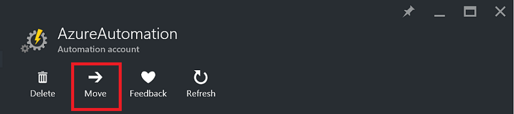
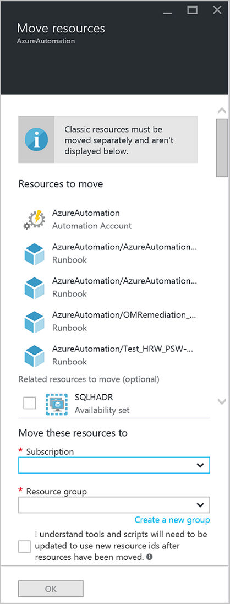

<properties
   pageTitle="Migrate Automation Account and Resources | Microsoft Azure"
   description="This article describes how to move an Automation Account in Azure Automation and associated resources from one subscription to another."
   services="automation"
   documentationCenter=""
   authors="MGoedtel"
   manager="jwhit"
   editor="tysonn" />
<tags
   ms.service="automation"
   ms.devlang="na"
   ms.topic="article"
   ms.tgt_pltfrm="na"
   ms.workload="infrastructure-services"
   ms.date="07/07/2016"
   ms.author="magoedte" />

# Migrate Automation Account and resources

For Automation accounts and its associated resources (i.e. assets, runbooks, modules, etc.) that you have created in the Azure portal and want to migrate from one resource group to another or from one subscription to another, you can accomplish this easily with the [move resources](../resource-group-move-resources.md) feature available in the Azure portal. However, before proceeding with this action, you should first review the following [checklist before moving resources](../resource-group-move-resources.md#Checklist-before-moving-resources) and additionally, the list below specific to Automation.   

1.  The destination subscription/resource group must be in same region as the source.  Meaning, Automation accounts cannot be moved across regions.
2.  When moving resources (e.g. runbooks, jobs, etc.), both the source group and the target group are locked for the duration of the operation. Write and delete operations are blocked on the groups until the move completes.  
3.  Any runbooks or variables which reference a resource or subscription ID from the existing subscription will need to be updated after migration is completed.   


>[AZURE.NOTE] This feature does not support moving Classic automation resources.

## To move the Automation Account using the portal

1. From your Automation account, click **Move** at the top of the blade.<br> <br> 
2. On the **Move resources** blade, note that it presents resources related to both your Automation account and your resource group(s).  Select the **subscription** and **resource group** from the drop-down lists, or select the option **create a new resource group** and enter a new resource group name in the field provided.  
3. Review and select the checkbox to acknowledge you *understand tools and scripts will need to be updated to use new resource IDs after resources have been moved* and then click **OK**.<br> <br>   

This action will take several minutes to complete.  In **Notifications**, you will be presented with a status of each action that takes place - validation, migration, and then finally when it is completed.     

## To move the Automation Account using PowerShell

To move existing Automation resources to another resource group or subscription, use the  **Get-AzureRmResource** cmdlet to get the specific Automation account and then **Move-AzureRmResource** cmdlet to perform the move.

The first example shows how to move an Automation account to a new resource group.

   ```
    $resource = Get-AzureRmResource -ResourceName "TestAutomationAccount" -ResourceGroupName "ResourceGroup01"
    Move-AzureRmResource -ResourceId $resource.ResourceId -DestinationResourceGroupName "NewResourceGroup"
   ``` 

After you execute the above code example, you will be prompted to verify you want to perform this action.  Once you click **Yes** and allow the script to proceed, you will not receive any notifications while it's performing the migration.  

To move to a new subscription, include a value for the *DestinationSubscriptionId* parameter.

   ```
    $resource = Get-AzureRmResource -ResourceName "TestAutomationAccount" -ResourceGroupName "ResourceGroup01"
    Move-AzureRmResource -ResourceId $resource.ResourceId -DestinationResourceGroupName "NewResourceGroup" -DestinationSubscriptionId "SubscriptionId"
   ``` 

As with the previous example, you will be prompted to confirm the move.  

## Next steps

- For more information about moving resources to new resource group or subscription, see [Move  resources to new resource group or subscription](../resource-group-move-resources.md)
- For more information about Role-based Access Control in Azure Automation, refer to [Role-based access control in Azure Automation](../automation/automation-role-based-access-control.md).
- To learn about PowerShell cmdlets for managing your subscription, see [Using Azure PowerShell with Resource Manager](../powershell-azure-resource-manager.md)
- To learn about portal features for managing your subscription, see [Using the Azure Portal to manage resources](../azure-portal/resource-group-portal.md). 
